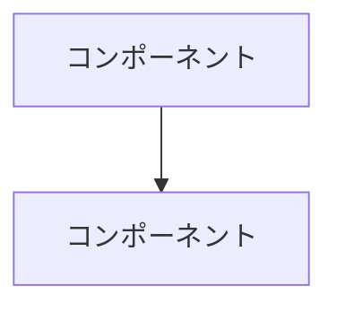

# 章執筆スキル

このスキルは、章仕様書に基づいて高品質な原稿を執筆するためのガイドです。

## 前提条件

### 必須ドキュメント
1. `docs/chapter-specs/chNN-spec.md`（該当章の仕様書）
2. `docs/writing-guidelines.md`（執筆ガイドライン）
3. `docs/glossary.md`（用語集）

### 推奨
4. 前の章の原稿（`manuscript/chNN-1/chNN-1.md`）
5. `docs/book-architecture.md`（章間の依存関係）

## 出力先

```
manuscript/chNN/chNN.md       # 本文
manuscript/chNN/figures/      # 図表ソース
```

## 執筆プロセス

### 図表ファーストの原則

**必ず図表を先に設計し、本文は図の解説として書く。**

1. chapter-specの図表リストを確認
2. 各図表をMermaid記法またはテキスト図で設計
3. 図表を`figures/`に配置
4. 本文で図表を参照しながら解説を書く

### 節の構成パターン

各節は以下の構造を基本とする:

```
## N.X [節タイトル]

[導入: 1-2段落。この節で何を学ぶか、なぜ重要か]

[図表の提示]

[概念の説明: 図表を参照しながら核心を解説]

[具体例: OCI上での例やユースケース]

[まとめ/次の節への橋渡し: 1段落]
```

### Mermaid図の記法



- ノード名は日本語でOK
- 矢印にはラベルを付ける
- 色分けは使わない（印刷を考慮）

### コード例のルール

- 概念理解に必要な最小限のコードのみ
- 完全な実装は載せない
- 疑似コード風でもOK
- 必ずコメントを付ける

```python
# OCI GenAI Serviceでのチャット補完（疑似コード）
response = generative_ai_client.chat(
    model_id="cohere.command-r-plus",
    messages=[{"role": "user", "content": prompt}],
    tools=tool_definitions,  # Function Callingのツール定義
)
```

### 章の導入の書き方

- 前章の最後のトピックを軽く振り返る（1-2文）
- この章で扱うテーマを提示
- 読了後にわかるようになることを示す
- 長すぎないこと（半ページ以内）

### 章の結びの書き方

- この章で学んだことの要約（箇条書きではなく散文で）
- 次章のテーマへの自然な橋渡し
- 「次の章では〜を見ていく」のような明示的な接続

### 理解度チェック問題の書き方

章末に配置。形式:

```markdown
## 理解度チェック

**Q1**: [問題文]

<details>
<summary>解答</summary>

[解答と解説]

</details>
```

## セルフチェックリスト

執筆完了後、以下を確認:

- [ ] 各節に最低1つの図表があるか
- [ ] 図表番号が「図X.Y」形式で正しいか
- [ ] 図表にキャプションが付いているか
- [ ] 本文中で図表が参照されているか
- [ ] 用語がglossary.mdと一致しているか
- [ ] 常体（である調）で統一されているか
- [ ] 技術用語の初出表記（日本語（英語）形式）が守られているか
- [ ] 章の導入で前章とのつながりがあるか
- [ ] 章の結びで次章への橋渡しがあるか
- [ ] 理解度チェック問題が3〜5問含まれているか
