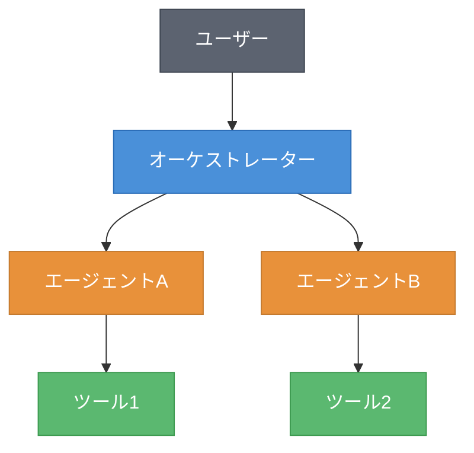
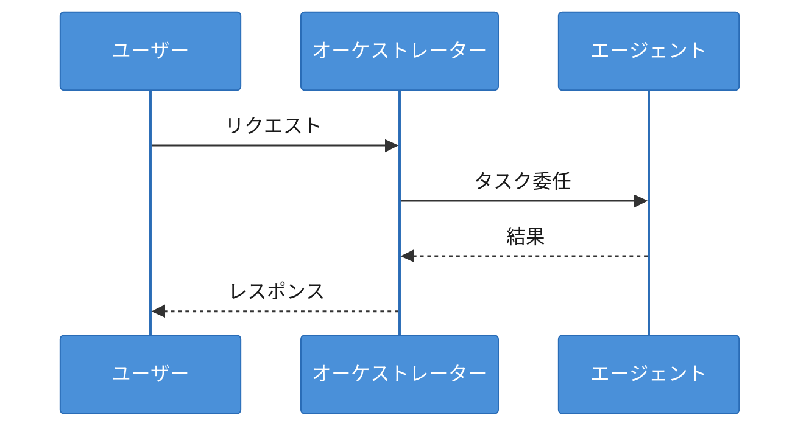
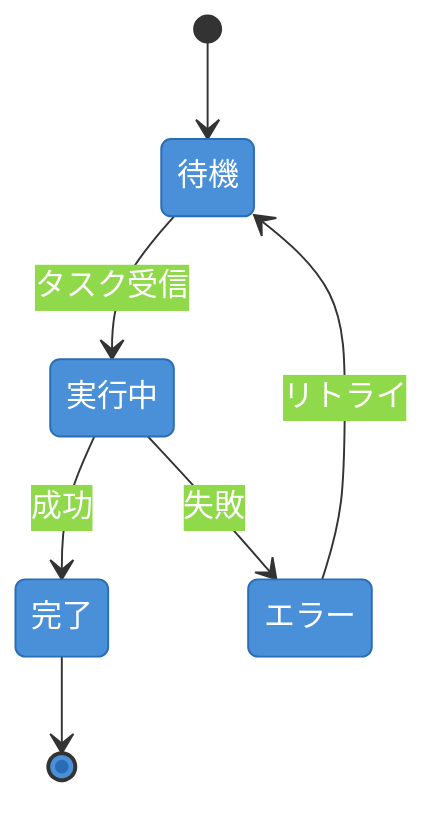

# 図表設計スキル

## Mermaid配色ルール（グレー背景対応）

本書のMermaid図はグレー背景上でレンダリングされる。デフォルトの配色は視認性が低いため、**全てのMermaid図に以下のテーマ設定を適用すること。**

### 共通テーマ定義

全てのMermaid図の先頭に以下を挿入する:

```mermaid
%%{init: {'theme': 'base', 'themeVariables': {'primaryColor': '#4A90D9', 'primaryTextColor': '#FFFFFF', 'primaryBorderColor': '#2A6CB6', 'secondaryColor': '#E8913A', 'secondaryTextColor': '#FFFFFF', 'secondaryBorderColor': '#C47A2F', 'tertiaryColor': '#5BB870', 'tertiaryTextColor': '#FFFFFF', 'tertiaryBorderColor': '#3D9A50', 'lineColor': '#333333', 'textColor': '#1A1A1A', 'background': 'transparent'}}}%%
```

### ノードの色分け（役割別）

| 役割 | 色 | 用途 |
|------|-----|------|
| メイン要素 | 青 `#4A90D9` | オーケストレーター、メインサービス |
| サブ要素 | オレンジ `#E8913A` | 個別エージェント、ワーカー |
| 外部/ツール | 緑 `#5BB870` | ツール、外部サービス、DB |
| ユーザー/入出力 | 濃灰 `#5C6370` 白文字 | ユーザー、リクエスト/レスポンス |

### graph図での適用例



### シーケンス図での適用例

シーケンス図はthemeVariablesで配色を制御する（classDef不可）:



### 状態遷移図での適用例



## 図表の種類と使い分け

### アーキテクチャ図（Mermaid graph）
- システム構成、エージェント間の関係を示す
- ノード数は10個以内を推奨
- **必ず上記のclassDef配色を適用する**

### シーケンス図（Mermaid sequence）
- エージェント間の通信フローを示す
- **必ず上記のthemeVariables配色を適用する**

### フロー図（Mermaid flowchart）
- 処理の流れ、判断分岐を示す

### 比較表（Markdown table）
- パターンの比較、サービスの比較等

### 状態遷移図（Mermaid stateDiagram）
- エージェントの状態遷移、タスクのライフサイクル

## 設計原則

1. **1つの図で1つのメッセージ**: 複数の概念を1つの図に詰め込まない
2. **グレー背景で視認性確保**: 必ず上記の配色ルールを適用する
3. **モノクロ判別可能**: 色だけに依存せず、形状やラベルでも区別できるようにする
4. **日本語ラベル**: ノード名、ラベルは日本語
5. **キャプション必須**: 図の直下に「図X.Y: タイトル」を配置
