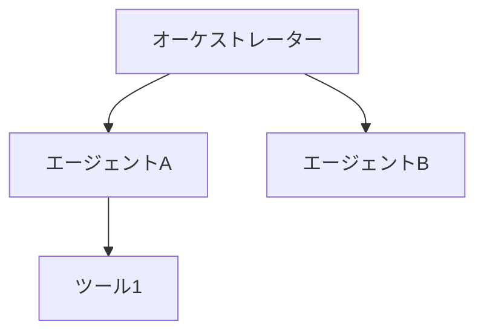
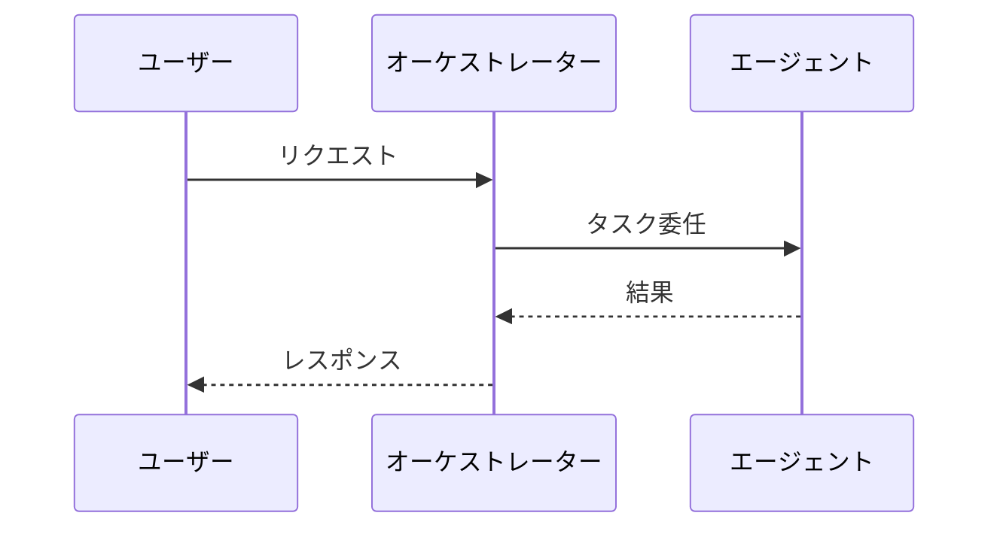

# 図表設計スキル

## 図表の種類と使い分け

### アーキテクチャ図（Mermaid graph）
- システム構成、エージェント間の関係を示す
- ノード数は10個以内を推奨

### シーケンス図（Mermaid sequence）
- エージェント間の通信フローを示す

### フロー図（Mermaid flowchart）
- 処理の流れ、判断分岐を示す

### 比較表（Markdown table）
- パターンの比較、サービスの比較等

### 状態遷移図（Mermaid stateDiagram）
- エージェントの状態遷移、タスクのライフサイクル

## 設計原則

1. **1つの図で1つのメッセージ**: 複数の概念を1つの図に詰め込まない
2. **印刷を考慮**: 色に依存しない（モノクロで判別可能にする）
3. **日本語ラベル**: ノード名、ラベルは日本語
4. **キャプション必須**: 図の直下に「図X.Y: タイトル」を配置
