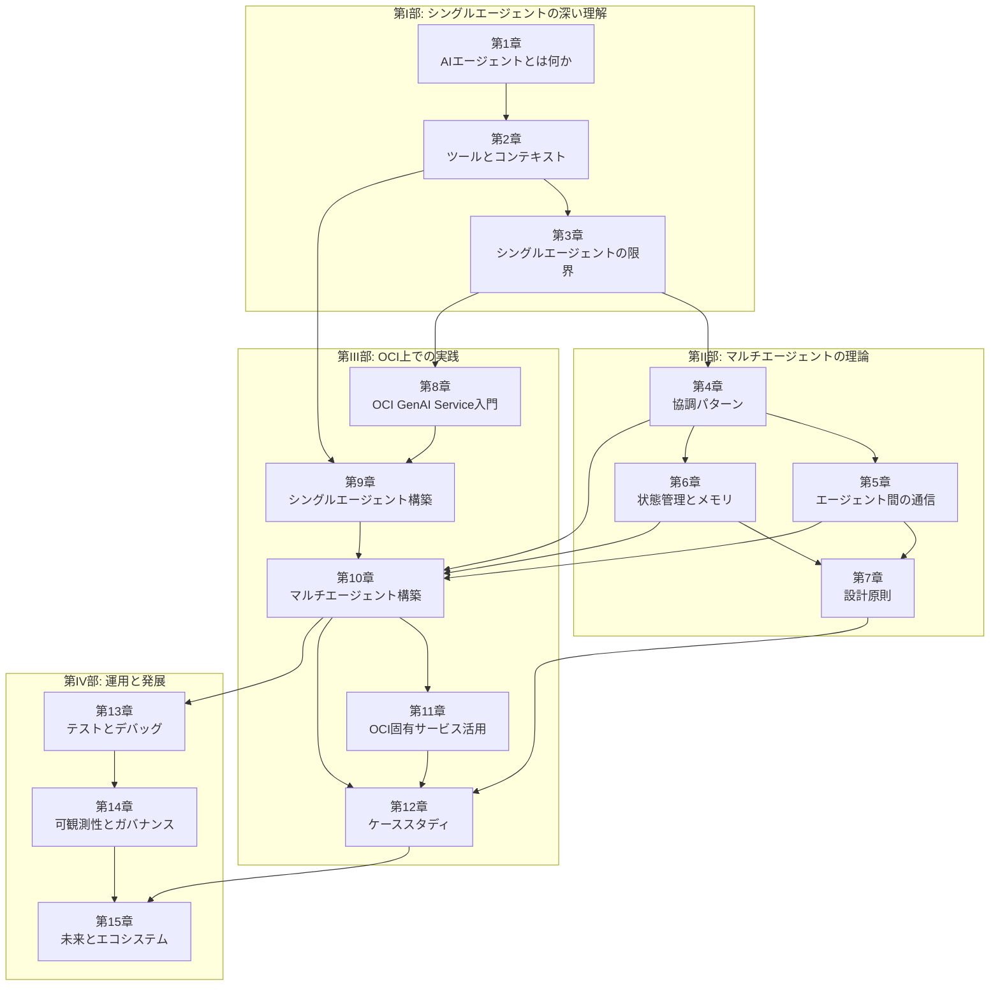
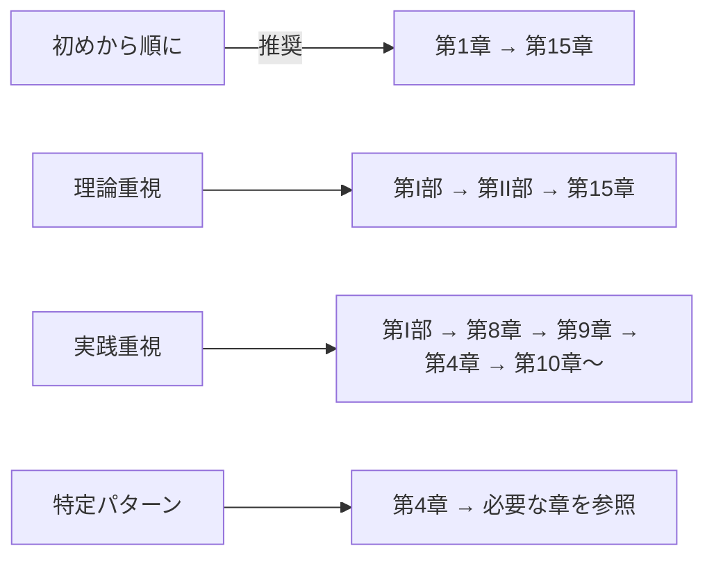

# 書籍構成・章間依存関係 (Book Architecture)

## 全体構造

本書は4部15章＋付録で構成される。第I部から第IV部へ段階的に知識を積み上げる構造をとる。

## 章間依存関係

### 依存関係表

| 章 | 直接の前提章 | 内容の関係 |
|----|------------|-----------|
| 第1章 | なし | 起点 |
| 第2章 | 第1章 | エージェントの構成要素のうちツールとコンテキストを深掘り |
| 第3章 | 第2章 | シングルエージェントの全体像を踏まえて限界を議論 |
| 第4章 | 第3章 | 限界の解決策としてマルチエージェントのパターンを提示 |
| 第5章 | 第4章 | 協調パターンを実現するための通信手段を解説 |
| 第6章 | 第4章 | 協調パターンにおける状態の共有・管理を解説 |
| 第7章 | 第5章, 第6章 | 通信・状態管理を踏まえた設計原則の総括 |
| 第8章 | 第3章 | OCI GenAI Serviceの基盤知識（理論と独立） |
| 第9章 | 第2章, 第8章 | ツール・MCPの知識 + OCI GenAI Serviceでシングルエージェント構築 |
| 第10章 | 第4章, 第5章, 第6章, 第9章 | 理論（パターン・通信・状態）+ 実装基盤でマルチ構築 |
| 第11章 | 第10章 | マルチエージェント基盤にOCI固有サービスを統合 |
| 第12章 | 第7章, 第10章, 第11章 | 設計原則 + 実装知識をケーススタディで統合 |
| 第13章 | 第10章 | マルチエージェントシステムのテスト手法 |
| 第14章 | 第13章 | テストの次のステップとして運用時の可観測性 |
| 第15章 | 第12章, 第14章 | 実践と運用を踏まえた将来展望 |

### 読み進め方のガイド

## 部ごとの役割

### 第I部（第1〜3章）: 基盤と動機
読者がすでに持っているエージェントの知識を整理・深化させ、「なぜマルチが必要か」を腹落ちさせる。第3章の限界認識が第II部・第III部への動機となる。

### 第II部（第4〜7章）: 理論フレームワーク
マルチエージェントの設計に必要な理論的基盤を提供する。第4章（協調パターン）が核心であり、第5〜7章はそれを支える通信・状態・設計原則の柱。

### 第III部（第8〜12章）: OCI実装
第II部の理論をOCI上で具体化する。第8〜9章で基盤を作り、第10章で本格的なマルチエージェントを構築、第12章で統合的なケーススタディを行う。

### 第IV部（第13〜15章）: 運用と展望
構築したシステムを本番環境で運用するための知識と、今後の技術動向を提供する。
