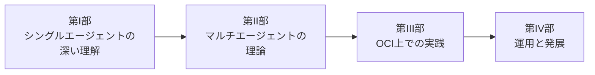
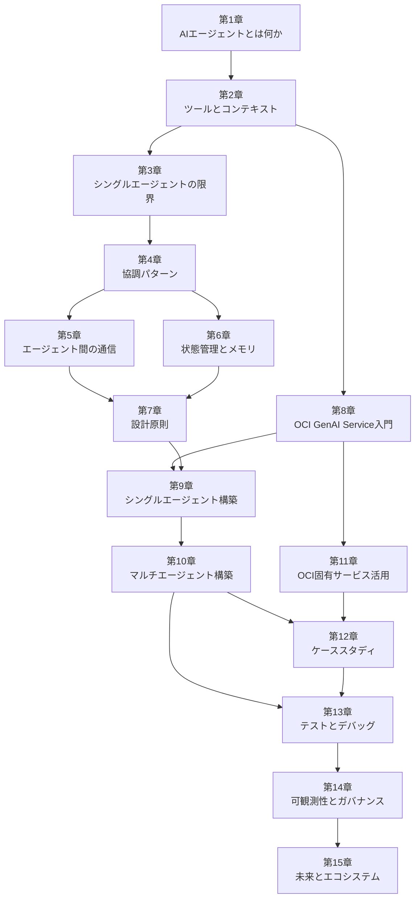

# 書籍構成・依存関係 (Book Architecture)

## 4部構成の概要

## 章間の依存関係

## 依存関係の詳細

### 第I部: シングルエージェントの深い理解（第1〜3章）

| 章 | 直接依存する章 | 提供する知識 |
|----|-------------|------------|
| 第1章 | なし | エージェントの定義、構成要素、ReActパターン |
| 第2章 | 第1章 | Function Calling、MCP、コンテキスト管理 |
| 第3章 | 第2章 | シングルエージェントの限界、マルチへの動機 |

### 第II部: マルチエージェントの理論（第4〜7章）

| 章 | 直接依存する章 | 提供する知識 |
|----|-------------|------------|
| 第4章 | 第3章 | 6つの協調パターン、パターン選定ガイド |
| 第5章 | 第4章 | MCP/A2Aプロトコル、メッセージ設計、同期/非同期 |
| 第6章 | 第4章 | 状態の種類、共有メモリ、永続化戦略 |
| 第7章 | 第5章, 第6章 | 設計原則、粒度設計、Human-in-the-Loop |

### 第III部: OCI上での実践（第8〜12章）

| 章 | 直接依存する章 | 提供する知識 |
|----|-------------|------------|
| 第8章 | 第2章 | OCI GenAI Serviceの利用方法、モデル選択 |
| 第9章 | 第7章, 第8章 | OCI上のシングルエージェント実装 |
| 第10章 | 第9章 | OCI上のマルチエージェント構築 |
| 第11章 | 第8章 | OCI固有サービスのエージェント活用 |
| 第12章 | 第10章, 第11章 | OKEクラスタ自動構築の統合ケーススタディ |

### 第IV部: 運用と発展（第13〜15章）

| 章 | 直接依存する章 | 提供する知識 |
|----|-------------|------------|
| 第13章 | 第10章, 第12章 | テスト戦略、デバッグ手法 |
| 第14章 | 第13章 | 可観測性、コスト管理、ガバナンス |
| 第15章 | 第14章 | 標準化動向、フレームワークの進化、展望 |

## 読者の読み方ガイド

### 推奨の読み方
1. **通読**: 第1章から第15章まで順番に読む（推奨）
2. **理論重視**: 第I部 → 第II部 → 第15章（実装は後回し）
3. **実践重視**: 第I部（速読）→ 第4章 → 第8章〜第12章（理論は必要に応じて参照）

### 各部の独立性
- **第I部**: 単独で読める（シングルエージェントの復習として）
- **第II部**: 第I部の知識が前提（特に第3章の限界認識）
- **第III部**: 第I部 + 第II部の知識が前提（特にOCI固有の知識は第8章から）
- **第IV部**: 第III部の実践経験が前提
