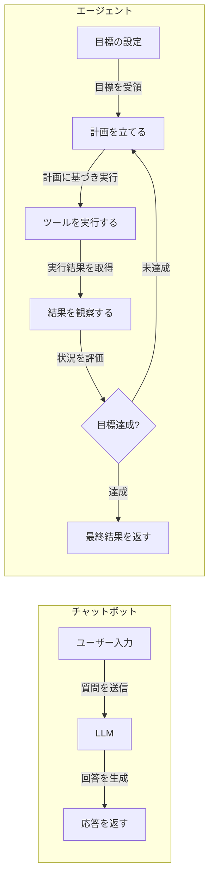
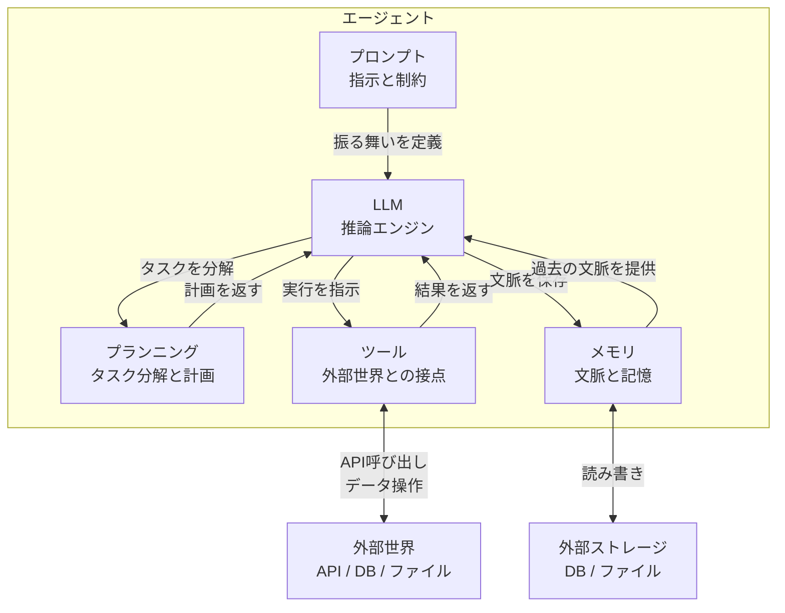
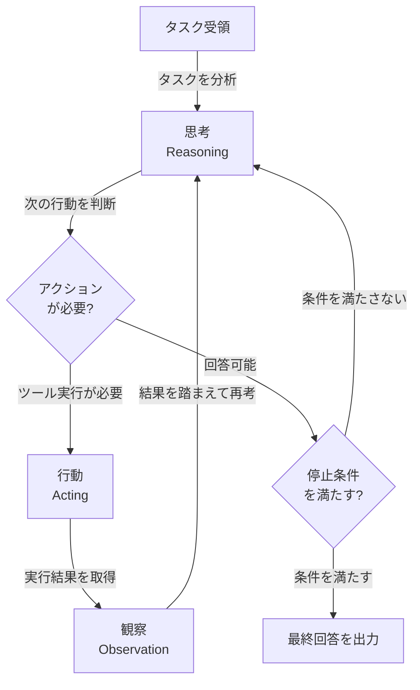
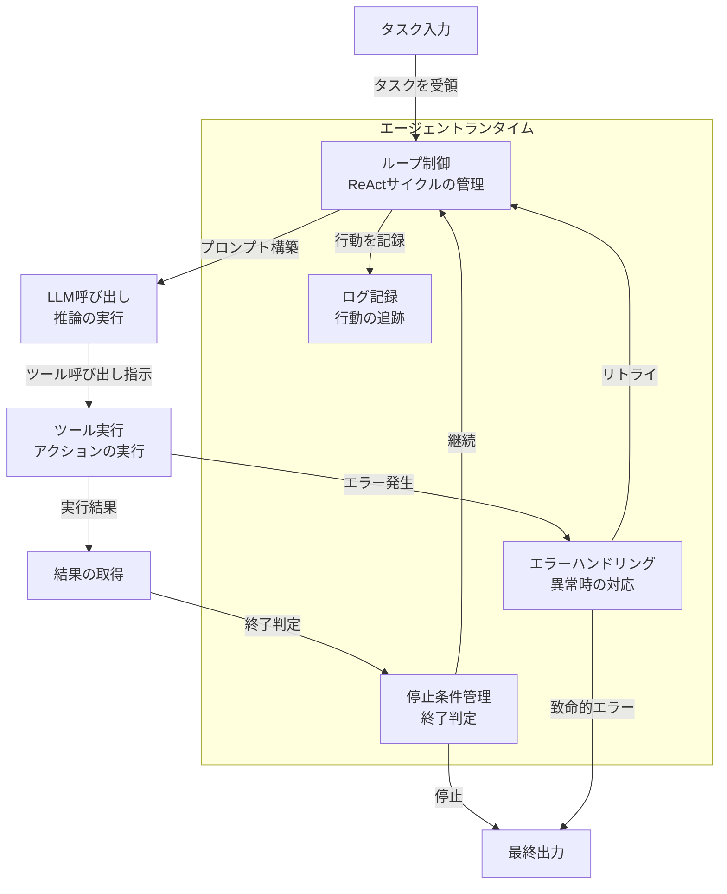

# 第1章 AIエージェントとは何か ― 改めて定義する

エージェント（Agent）という言葉を聞かない日はなくなった。2024年から2025年にかけて、LLM（大規模言語モデル）を活用した「AIエージェント」は急速に注目を集めている。しかし、この言葉が指す範囲は曖昧である。チャットボットをエージェントと呼ぶ者もいれば、自律的にコードを書くシステムをエージェントと呼ぶ者もいる。

本章では「エージェントとは何か」を正確に定義する。構成要素を分解し、動作パターンを理解し、エージェントを安全に動かすランタイムの役割を整理する。本章を読み終えた時点で、エージェントという概念を構造的に説明できるようになることが目標である。

---

## 1.1 エージェントの定義 ― チャットボットとの違い、自律性の意味

エージェントとチャットボットは何が違うのか。この問いに答えることが、エージェントを理解する第一歩である。

図1.1に、チャットボットとエージェントの処理フローの違いを示す。

図1.1: チャットボットとエージェントの処理フローの比較

### チャットボットの動作

チャットボットは「入力に対して応答を返す」システムである。ユーザーが質問すると、LLMが回答を生成する。1回のやり取りで処理が完結する。

たとえば、チャットボットに「OCIとは何ですか」と尋ねると、LLMが知識に基づいてOCIの説明を生成し、返答する。この処理は一方通行であり、追加の情報収集や外部システムへの問い合わせは行わない。チャットボットの価値は「知識に基づいた的確な応答」にある。

### エージェントの動作

一方、エージェントは「目標を達成する」システムである。目標を受け取ると、計画を立て、ツールを使い、結果を観察する。目標に到達するまでこのループを繰り返す。

たとえば、エージェントに「OCI上に開発用のコンピュートインスタンスを作成して」と依頼したとする。エージェントは以下のように動作する。

1. 「インスタンスを作成するには、VCN、サブネット、イメージの情報が必要だ」と計画を立てる
2. OCI SDKを使ってVCN一覧を取得する
3. 結果を確認し、適切なサブネットを選択する
4. コンピュートインスタンスの作成APIを呼び出す
5. 作成結果を確認し、成功したことを報告する

チャットボットであれば「以下のコマンドで作成できます」とコードを返すだけである。エージェントは実際にAPIを呼び出し、インスタンスを作成する。ここに本質的な違いがある。

### エージェントの三つの特徴

エージェントを特徴づける要素は三つある。

**自律性（Autonomy）**: エージェントは与えられた目標に対して、次に何をすべきかを自分で判断する。人間が逐一指示する必要がない。先の例では、エージェントは「VCN情報が必要だ」と自ら判断してAPIを呼び出した。人間が「まずVCNを調べて」と指示したわけではない。

**ツール使用（Tool Use）**: エージェントはLLMの推論だけでなく、外部のツールを使って外部世界に作用する。API呼び出し、データベース操作、ファイル操作など、LLM単体ではできない操作を実行する。ツールを持たないLLMは「考える」ことしかできないが、ツールを持つエージェントは「行動する」ことができる。

**計画能力（Planning）**: エージェントは複雑なタスクをサブタスクに分解し、実行順序を決定する。単一のプロンプトで解けない問題を段階的に解決する。「インスタンスを作成する」という目標を「VCN確認→サブネット選択→インスタンス作成→結果確認」という手順に分解したのがこの能力である。

### エージェントの境界はスペクトラムである

注意すべき点がある。エージェントとチャットボットの境界は二値的ではない。実際にはスペクトラム（連続的な分布）として捉えるのが適切である。

たとえば、RAG（Retrieval-Augmented Generation）を使って外部知識を検索するチャットボットを考える。このシステムはツール使用の要素を部分的に持つ。しかし、自律的な判断や目標志向のループは持たない。これを「エージェント」と呼ぶかどうかは判断が分かれる。

本書では、三つの特徴（自律性、ツール使用、計画能力）を高いレベルで備えるシステムをエージェントと呼ぶ。重要なのはラベルではなく、システムが持つ能力を正確に理解することである。

チャットボットは「応答する」存在であり、エージェントは「目標を達成する」存在である。この違いを明確に認識することが、以降の議論の土台となる。

---

## 1.2 エージェントの構成要素 ― LLM / プロンプト / ツール / メモリ / プランニング

エージェントは単一のブラックボックスではない。分解可能な五つの構成要素から成る。図1.2にその関係を示す。

図1.2: エージェントの構成要素と相互関係

五つの要素を順に整理する。

### LLM（推論エンジン）

エージェントの中核であるが、エージェントそのものではない。LLMは与えられたコンテキストに基づいて推論を行い、次のアクションを決定する。状況を分析し、どのツールをどのような引数で呼び出すかを判断する。

LLMを「頭脳」に例えることが多い。ただし、頭脳だけでは何も実行できない。「OCIのインスタンスを作成して」と指示しても、LLM単体ではAPIを呼び出すことも、レスポンスを受け取ることもできない。LLMはあくまで「考える」部品であり、「行動する」ためにはツールが必要である。

### プロンプト（指示と制約）

エージェントの振る舞いを定義する指示文である。役割、制約、出力形式などを規定する。

単なるチャットボットのプロンプトとは異なり、エージェントのプロンプトには以下の要素が含まれる。

- **役割の定義**: 「あなたはOCIインフラ管理の専門家である」
- **行動の制約**: 「本番環境のリソースは削除しない」
- **ツールの使い方**: 「リソース作成前に必ず既存リソースを確認する」
- **出力形式**: 「実行結果はJSON形式で返す」

プロンプトの質がエージェントの性能を大きく左右する。同じLLMとツールを使っても、プロンプトの設計次第でエージェントの信頼性は大きく変わる。

### ツール（外部世界との接点）

エージェントが外部世界と相互作用するためのインターフェースである。API呼び出し、データベース操作、ファイル読み書きなど、LLM単体ではできない操作を実現する。

ツールの具体例を挙げる。

- **クラウドAPI**: OCI SDKを使ったリソースの作成・取得・削除
- **データベース操作**: SQLの実行、データの検索・挿入
- **ファイル操作**: 設定ファイルの読み書き、ログの出力
- **外部サービス呼び出し**: Slack通知、メール送信

エージェントの「手」に相当する。手がなければ、どれだけ優れた頭脳を持っていても外部世界に影響を与えることはできない。ツールの種類と数がエージェントの行動範囲を決定する。

### メモリ（文脈と記憶）

エージェントが過去のやり取りや処理結果を保持する仕組みである。メモリには二つの種類がある。

**短期記憶**: コンテキストウィンドウ（Context Window）内に保持される直近の会話履歴や処理結果である。LLMに直接渡されるため即座に参照できるが、コンテキストウィンドウの容量には上限がある。現在の主要なLLMでは数万から数十万トークンが上限である。

**長期記憶**: 外部ストレージ（データベース、ファイル）に保存される情報である。コンテキストウィンドウの制約を超えて大量の情報を保持できる。必要に応じて検索し、コンテキストに組み込む。RAG（Retrieval-Augmented Generation）は長期記憶を実現する代表的な手法である。

エージェントの「記憶」に相当する。記憶がなければ、エージェントは毎回白紙の状態から作業を始めることになる。過去に何をしたか、どのような結果が得られたかを覚えていることが、複雑なタスクを遂行する上で不可欠である。

### プランニング（タスク分解と計画）

複雑なタスクをサブタスクに分解し、実行計画を立てる能力である。LLMの推論能力を使って「何を、どの順番で行うか」を決定する。

たとえば「OCI上にWebアプリケーション環境を構築して」という目標に対して、プランニングは以下のような分解を行う。

1. ネットワーク環境（VCN、サブネット）の作成
2. コンピュートインスタンスの作成
3. ロードバランサの設定
4. セキュリティリストの設定

各サブタスクの依存関係を把握し、適切な実行順序を決める。ネットワーク環境がなければインスタンスは作成できないため、順序が重要である。

### 構成要素の協調

ここで重要なのは、五つの要素が独立ではなく協調して動作する点である。一つの具体的なシナリオで見てみる。

「OCIの月額コストが予算を超えていないか確認して」というタスクを考える。

1. **プロンプト**が「コスト管理の専門家」としての役割を定義する
2. **プランニング**が「コスト情報の取得→予算との比較→レポート作成」という計画を立てる
3. **LLM**が「まずコスト管理APIを呼ぶべきだ」と推論する
4. **ツール**がOCI Cost Management APIを呼び出し、結果を取得する
5. **メモリ**が取得した結果を保持し、次のステップで参照可能にする
6. **LLM**がメモリ内のコスト情報と予算を比較し、レポートを生成する

LLMはエージェントの構成要素の一つにすぎない。五つの要素が揃って初めてエージェントとして機能する。

---

## 1.3 ReActパターン ― 推論とアクションのループ

エージェントの動作を一つのパターンとして抽象化したものがReActパターン（ReAct Pattern）である。ReActとはReasoning（推論）とActing（行動）を組み合わせた名称で、2022年にYaoらによって提案された。このパターンは、エージェントの基本動作モデルとして広く採用されている。

図1.3にReActループのフローを示す。

図1.3: ReActループのフロー

### 三つのステップ

ReActループは三つのステップで構成される。

**思考（Reasoning）**: LLMが現在の状況を分析し、次に何をすべきかを推論する。このステップでは「目標は何か」「現在の状態はどうか」「次に何をすべきか」を考える。思考はLLMのテキスト生成として実行されるため、推論の過程を文字列として出力できる。この可視性がReActパターンの特徴の一つである。

**行動（Acting）**: 思考の結果に基づいてツールを実行する。API呼び出し、データベース問い合わせ、ファイル操作など、具体的なアクションを行う。行動は必ず思考の後に実行される。「考えてから動く」という順序がReActの本質である。

**観察（Observation）**: ツールの実行結果を受け取り、次の思考のインプットとする。成功したのか、失敗したのか、期待どおりの結果だったのかを確認する。観察の結果がメモリに追加され、次の思考サイクルで参照される。

### 具体例: OCIのインスタンス一覧取得

具体例で考える。「OCIのコンピュートインスタンスの一覧を取得し、停止中のものがあれば報告せよ」というタスクを受けたエージェントの動作を追う。

**サイクル1**:
- **思考**: 「インスタンスの一覧を取得するには、OCI SDKのlist_instances APIを呼ぶ必要がある。コンパートメントIDが必要だ。まずテナンシーの情報から対象コンパートメントを特定する」
- **行動**: list_compartments APIを呼び出す
- **観察**: 「5件のコンパートメントが返された。対象は"production"コンパートメントだ」

**サイクル2**:
- **思考**: 「productionコンパートメントのIDが判明した。このIDを使ってインスタンス一覧を取得する」
- **行動**: list_instances APIをproductionコンパートメントIDで呼び出す
- **観察**: 「四つのインスタンスが返された。うち一つのステータスがSTOPPEDである」

**サイクル3**:
- **思考**: 「停止中のインスタンスが一つ見つかった。タスクの要件はここまでで満たされている。結果を整理して報告する」
- **行動**: なし（回答を生成）
- **停止**: 最終回答として、インスタンス一覧と停止中のインスタンスの情報を出力する

この例では三つのサイクルでタスクが完了した。各サイクルで思考→行動→観察を繰り返し、少しずつ目標に近づいていく。

### もう一つの例: 複雑なタスクでのReAct

より複雑な例も見てみる。「開発環境のコンピュートインスタンスのOSイメージが古い場合、最新のイメージで再作成せよ」というタスクを考える。

このタスクでは、エージェントは以下のサイクルを経る。

1. **思考→行動→観察**: インスタンスの現在のイメージ情報を取得する
2. **思考→行動→観察**: 利用可能な最新イメージの一覧を取得する
3. **思考**: 二つの情報を比較し、更新が必要か判断する
4. **条件分岐**: 更新が不要であればここで停止する
5. **思考→行動→観察**: 更新が必要な場合、現在のインスタンスの設定を記録する
6. **思考→行動→観察**: 既存のインスタンスを終了する
7. **思考→行動→観察**: 最新イメージで新しいインスタンスを作成する
8. **思考→行動→観察**: 新しいインスタンスの状態を確認する
9. **停止**: 結果を報告する

タスクの複雑さに応じてサイクル数が増加する。単純なタスクは数サイクルで完了し、複雑なタスクは十数サイクルを要する場合もある。

### 停止条件の重要性

ReActループにおいて最も重要な設計要素の一つが停止条件（Stopping Condition）である。停止条件がなければ、エージェントは無限にループし続ける。

主な停止条件には以下のものがある。

**目標達成**: タスクが完了したとLLMが判断した場合に停止する。先のインスタンス一覧取得の例では、三つ目のサイクルでLLMが「要件を満たした」と判断して停止した。

**最大ステップ数**: 事前に設定したループ回数の上限に達した場合に停止する。たとえば「最大20サイクル」と設定しておけば、目標達成の判断ができない場合でも停止する。無限ループの防止策として不可欠である。

**エラー**: 回復不能なエラーが発生した場合に停止する。認証エラーやリソース不足など、リトライしても解決しない問題に対する安全弁である。

**タイムアウト**: 事前に設定した時間を超過した場合に停止する。ネットワーク遅延やAPIの応答遅延によってループが長時間化することを防ぐ。

停止条件の設計は、エージェントの信頼性を左右する。停止条件が緩すぎると暴走のリスクがあり、厳しすぎると複雑なタスクを完了できない。この責務を担うのが、次節で解説するエージェントランタイム（Agent Runtime）である。

---

## 1.4 エージェントランタイムの役割 ― ループ制御、エラーハンドリング、停止条件

ReActループを「誰が回しているか」。その答えがエージェントランタイムである。ランタイムはエージェントの実行基盤であり、ループを安全に制御する「安全装置」の役割を持つ。

図1.4にエージェントランタイムのアーキテクチャを示す。

図1.4: エージェントランタイムのアーキテクチャ

ランタイムの責務は主に三つである。

### ループ制御

ReActサイクル（思考→行動→観察）を繰り返し実行する。各ステップの入出力を管理し、LLMへのプロンプト構築とツール実行の橋渡しを行う。

ループ制御の具体的な処理を整理する。

1. LLMに対してプロンプト（システムプロンプト＋会話履歴＋ツール定義）を送信する
2. LLMの応答を解析し、ツール呼び出しが含まれているかを判定する
3. ツール呼び出しがあれば、指定されたツールを実行する
4. ツールの実行結果を会話履歴に追加する
5. 停止条件を確認する
6. 停止条件を満たさなければ、1に戻る

ランタイムがなければ、LLMとツールは独立した部品のまま協調できない。ランタイムは両者をつなぐ接着剤の役割を持つ。

### エラーハンドリング

ツール実行時のエラーを捕捉し、適切に対処する。エラーの種類に応じた対処方針を事前に定義しておくことが重要である。

エラーの種類と対処方針の例を挙げる。

**一時的なエラー（リトライ可能）**:
- API呼び出しのタイムアウト → 一定時間待ってリトライ
- レート制限（429エラー）→ バックオフして再試行
- ネットワーク一時断 → 接続を再確立してリトライ

**永続的なエラー（リトライ不可）**:
- 認証エラー（401/403）→ ループを停止し、原因を報告
- リソース不足 → ループを停止し、必要なリソースを報告
- 不正なリクエスト（400）→ LLMにエラー内容を伝え、修正を促す

三つ目の「不正なリクエスト」は興味深いケースである。LLMが生成したツールの引数が不正な場合、エラーをLLMにフィードバックすることで自己修正を促せる。これはエラーハンドリングとReActループの思考ステップが連携する例である。

### 停止条件管理

ループの終了を判定する。前節で挙げた停止条件（目標達成、最大ステップ数、エラー、タイムアウト）を管理し、条件を満たした時点でループを終了させる。

停止条件管理は複数の条件を組み合わせて設計する。典型的な設定例を示す。

- 目標達成: LLMが「タスク完了」と判断した場合に停止
- 最大ステップ数: 30サイクルに到達した場合に停止
- タイムアウト: 処理開始から10分経過した場合に停止
- エラー上限: 連続して5回エラーが発生した場合に停止

これらの条件は論理和（OR）で評価される。いずれか一つでも満たされればループは停止する。停止条件管理はエージェントの暴走を防ぐ最後の砦である。

### ランタイム設計の重要性

エージェントランタイムの設計は、エージェントの信頼性と安全性を決定する。LLMやツールの性能がどれだけ高くても、ランタイムが不十分であれば、エージェントは予測不能な動作をする。

ランタイムが不十分な場合に起きうる問題を挙げる。

- **無限ループ**: 停止条件がないため、エージェントがタスクを完了できずにリソースを消費し続ける
- **サイレント障害**: エラーを捕捉できず、不完全な結果を正常として返す
- **リソース枯渇**: API呼び出しの制御ができず、レート制限に到達する

エージェントを構築する際は、LLMの選択やプロンプトの設計と同等に、ランタイムの設計に注意を払う必要がある。ランタイムは表に出にくい存在であるが、エージェントの信頼性を支える基盤である。

---

## 1.5 エージェントフレームワークの全体像 ― LangChain, CrewAI, AutoGen, LlamaIndex等の位置づけ

ここまで見てきたエージェントの構成要素とランタイムを、パッケージとして提供するのがエージェントフレームワーク（Agent Framework）である。フレームワークを使うことで、構成要素を一から実装する必要がなくなる。主要なフレームワークを表1.1に整理する。

| フレームワーク | 設計思想 | 特徴 | 得意領域 |
|:---|:---|:---|:---|
| LangChain / LangGraph | チェーンとグラフによるワークフロー構築 | ツール連携が豊富。LangGraphで状態を持つグラフベースのフロー制御が可能 | 汎用的なエージェント構築 |
| CrewAI | 役割ベースのマルチエージェント | エージェントに「役割」を与え、チームとして協調させる | マルチエージェントの協調 |
| AutoGen | 会話ベースのマルチエージェント | エージェント間の会話を通じてタスクを遂行。人間も会話に参加可能 | 対話型のマルチエージェント |
| LlamaIndex | データ接続とRAG | 外部データソースとLLMの接続に特化。エージェント機能も提供 | データ駆動のエージェント |

表1.1: 主要エージェントフレームワーク比較

### フレームワークごとの設計思想

これらのフレームワークは、1.2節で整理した五つの構成要素と1.4節で解説したランタイムを、それぞれ異なるアプローチで提供している。

**LangChain / LangGraph**: 処理の「チェーン」（連鎖）を基本単位とする。ツール連携のエコシステムが充実しており、多様な外部サービスとの接続が容易である。LangGraphは状態を持つグラフベースのフロー制御を提供し、複雑なワークフローの実装に適している。

**CrewAI**: マルチエージェントの「役割分担」を前面に出している。各エージェントに「リサーチャー」「ライター」「レビュアー」のような役割を与え、チームとして協調させる。マルチエージェントの概念に最も近い設計思想を持つ。

**AutoGen**: エージェント間の「会話」を基本単位とする。エージェント同士がメッセージを交換しながらタスクを遂行する。人間もエージェントの一つとして会話に参加できるため、Human-in-the-Loopの実装が自然に行える。

**LlamaIndex**: 外部データとLLMの接続に特化している。大量のドキュメントやデータベースをエージェントの知識ベースとして活用する場面で強みを発揮する。RAGの実装において最も成熟したエコシステムを持つ。

### フレームワークに依存しない概念理解

本書では特定のフレームワークに依存しない。フレームワークは急速に進化しており、2025年時点の比較が1年後に有効とは限らない。

重要なのは、フレームワークが提供する機能の背後にある概念を理解することである。構成要素、ReActパターン、ランタイムの責務。これらの概念を理解していれば、どのフレームワークを使っても、あるいはフレームワークを使わず自前で構築しても、適切な設計判断ができる。

本書ではここまで見てきたような単一のエージェントをシングルエージェント（Single Agent）と呼ぶ。第I部ではシングルエージェントの仕組みを深く理解し、第II部以降でその限界と、複数のエージェントが協調するマルチエージェントシステム（Multi-Agent System）へと議論を進めていく。

---

## まとめ

本章では、エージェントとは何かを構造的に定義した。

エージェントはチャットボットとは本質的に異なる。チャットボットが「応答する」存在であるのに対し、エージェントは「目標を達成する」存在である。自律性、ツール使用、計画能力の三つの特徴がエージェントを特徴づける。

エージェントは五つの構成要素（LLM、プロンプト、ツール、メモリ、プランニング）から成る。LLMは推論エンジンであり、エージェントそのものではない。五つの要素が協調して初めてエージェントとして機能する。

ReActパターン（思考→行動→観察のループ）がエージェントの基本動作モデルである。このループを安全に制御するのがエージェントランタイムの役割であり、ループ制御、エラーハンドリング、停止条件管理の三つの責務を担う。

エージェントの構成要素を概観した。次章では、その中核をなす二つの要素に焦点を当てる。エージェントの「手」であるツールと、エージェントの「記憶」であるメモリ、そしてメモリを効果的に扱うためのコンテキスト管理である。

---

## 理解度チェック

**Q1**: エージェントとチャットボットの本質的な違いを三つ挙げよ。

解答

1. **自律性**: エージェントは次に何をすべきかを自分で判断する。チャットボットは入力に対して応答するだけである。
2. **ツール使用**: エージェントは外部ツール（API、データベース等）を使って外部世界に作用する。チャットボットはテキスト応答に留まる。
3. **計画能力**: エージェントは複雑なタスクをサブタスクに分解し、段階的に解決する。チャットボットは1回のやり取りで処理が完結する。

**Q2**: エージェントの五つの構成要素を列挙し、それぞれの役割を一文で説明せよ。

解答

1. **LLM（推論エンジン）**: 与えられたコンテキストに基づいて推論を行い、次のアクションを決定する。
2. **プロンプト（指示と制約）**: エージェントの役割、制約、出力形式などの振る舞いを定義する。
3. **ツール（外部世界との接点）**: API呼び出しやデータベース操作など、外部世界との相互作用を実現する。
4. **メモリ（文脈と記憶）**: 過去のやり取りや処理結果を短期記憶・長期記憶として保持する。
5. **プランニング（タスク分解と計画）**: 複雑なタスクをサブタスクに分解し、実行順序を決定する。

**Q3**: ReActパターンのループが停止する条件にはどのようなものがあるか。

解答

1. **目標達成**: タスクが完了したとLLMが判断した場合
2. **最大ステップ数**: 事前に設定したループ回数の上限に達した場合
3. **エラー**: 回復不能なエラーが発生した場合
4. **タイムアウト**: 事前に設定した時間を超過した場合

これらの停止条件はエージェントランタイムによって管理される。停止条件がなければ、エージェントは無限にループし続ける。

**Q4**: あるシステムが「エージェント」と呼べるかどうかを判断する基準を述べよ。

解答

以下の三つの基準を満たすシステムをエージェントと呼ぶことができる。

1. **自律的な判断**: 人間の逐一の指示なしに、次に何をすべきかを自分で決定できるか
2. **外部世界への作用**: テキスト応答だけでなく、ツールを使って外部世界に変更を加えられるか
3. **目標志向のループ**: 単発の応答ではなく、目標達成に向けて推論と行動を繰り返すか

これらの基準は二値（満たす/満たさない）ではなく、スペクトラムとして捉えるのが現実的である。たとえば、RAGを使って外部知識を検索するチャットボットは、ツール使用の要素を部分的に持つが、目標志向のループは持たない。

