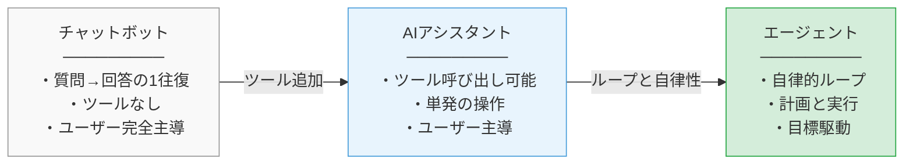
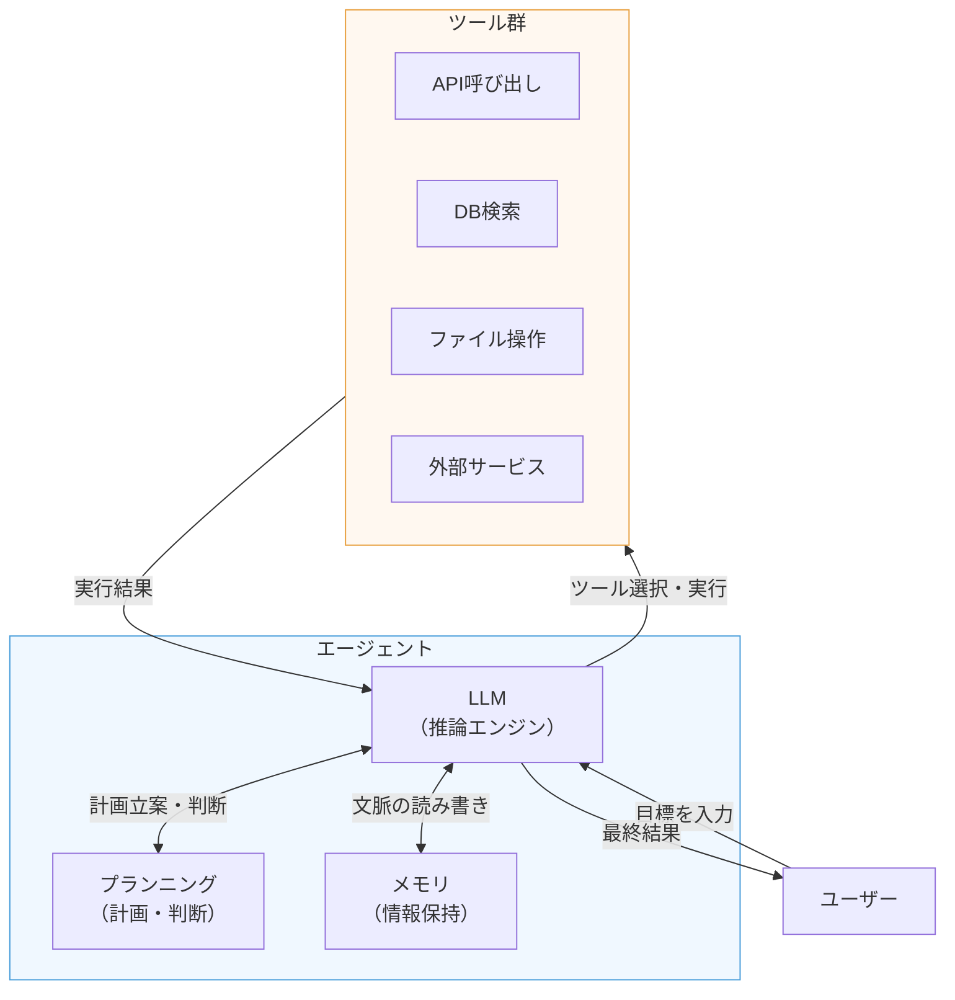
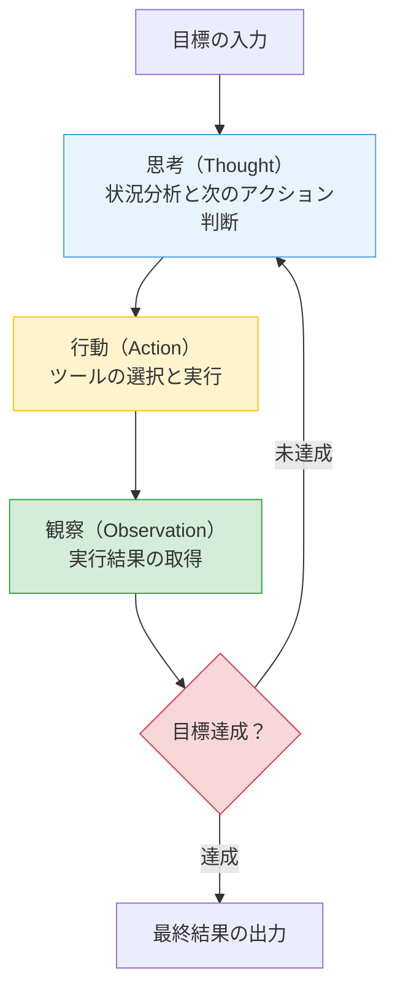

# 第1章 AIエージェントとは何か ― 改めて定義する

「AIエージェント」という言葉は、2024年から2025年にかけて急速に普及した。しかし、その定義は文脈によって大きく異なる。単純なチャットボットをエージェントと呼ぶ場合もあれば、複数のツールを駆使して自律的にタスクを遂行するシステムを指す場合もある。本章では、エージェントの定義を明確にし、その構成要素、基本動作パターン、実行環境、そして主要なフレームワークの全体像を体系的に整理する。これが本書全体の土台となる。

---

## 1.1 エージェントの定義

### チャットボット、アシスタント、エージェント

LLMを活用したシステムは、その自律性の度合いに応じて大きく三つに分類できる。

一つ目は**チャットボット**（Chatbot）である。チャットボットは、ユーザーの入力に対してLLMが応答を生成するシステムである。処理の流れは「質問→回答」の1往復で完結し、外部のシステムやデータベースにアクセスする能力を持たない。ユーザーが新たな入力を与えない限り、チャットボットは何も行動しない。典型例としては、FAQ応答システムや、LLMのAPIをそのまま公開したチャットインターフェースが該当する。

二つ目は**AIアシスタント**（AI Assistant）である。アシスタントは、チャットボットの能力に加えて、外部ツールへのアクセス手段を持つ。カレンダーの参照、データベースへの問い合わせ、Web検索など、特定のツールを呼び出して情報を取得し、その結果をもとに応答を生成する。ただし、処理の流れは基本的にユーザー主導である。ユーザーの指示に従ってツールを呼び出し、結果を返す。アシスタントが自発的に複数のステップを計画し、自律的に実行することはない。

三つ目が本書の主題である**エージェント**（Agent）である。エージェントは、目標を与えられると、その達成に向けて自律的に計画を立て、ツールを呼び出し、結果を観察し、次のアクションを判断するという一連のループを繰り返す。ユーザーが逐一指示を出す必要はない。エージェントの本質は、この「目標に向けた自律的な行動の連鎖」にある。

本書では、エージェントを次のように定義する。

> **エージェントとは、LLMを推論エンジンとし、ツール呼び出しとプランニング能力を持ち、目標達成に向けて自律的にアクションのループを実行するソフトウェアエンティティである。**

この定義における重要なポイントは三つある。第一に、LLMは「推論エンジン」として機能する。LLM自体がエージェントなのではなく、LLMはエージェントの頭脳として判断と推論を担う部品である。第二に、ツール呼び出しが必須要件である。外部世界に作用する手段を持たなければ、それはエージェントではなくチャットボットである。第三に、ループによる自律的な実行が不可欠である。1回のツール呼び出しで終わるのではなく、結果を踏まえて次のアクションを判断し続ける能力がエージェントの核心である。

### 自律性のスペクトラム

チャットボット、アシスタント、エージェントの区分は、明確な境界線で分かれるものではない。自律性はスペクトラム（Spectrum）であり、連続的なグラデーションとして捉えるべきである。図1.1に自律性のスペクトラムを示す。

**図1.1: 自律性のスペクトラム ― チャットボットからエージェントへの連続体**

左端に位置するチャットボットは自律性がほぼゼロであり、右端のエージェントは高い自律性を持つ。実際のシステムは、このスペクトラム上のどこかに位置する。たとえば、ツール呼び出しは可能だが1回で処理が完結するシステムはアシスタント寄りである。一方、複数のツールを組み合わせて数ステップにわたる処理を自律的に実行するシステムはエージェント寄りである。

自律性を左右する要因は主に三つである。第一に、利用可能なツールの数と種類である。ツールが豊富であるほど、エージェントが取れるアクションの幅が広がる。第二に、ループの深さである。何ステップにわたって自律的に処理を続けられるかが自律性の度合いを決定する。第三に、判断の委任範囲である。人間の承認なしにどこまでのアクションを実行できるかが、実運用における自律性を規定する。

---

## 1.2 構成要素

エージェントは、四つの基本要素で構成される。LLM（推論エンジン）、ツール（外部世界との接点）、プランニング（計画と判断）、メモリ（情報の保持）である。図1.2にこれらの関係を示す。

**図1.2: エージェントの構成要素 ― 四つの要素とその関係**

### LLM（推論エンジン）

LLM（Large Language Model、大規模言語モデル）は、エージェントの中核を担う推論エンジンである。ユーザーの目標を理解し、現在の状況を分析し、次に取るべきアクションを判断する。LLMの能力がエージェント全体の性能の上限を決定する。

ただし、LLMはあくまでエージェントの一部品である。LLM単体では、外部のシステムに作用することも、過去のやり取りを永続的に記憶することもできない。LLMが「推論エンジン」であるという位置づけを正確に理解することが重要である。エンジンは自動車の動力源であるが、エンジンだけでは自動車として機能しないのと同じである。

LLMに求められる能力は主に三つある。第一に、自然言語による指示の理解と、構造化された出力（ツール呼び出しのためのJSON等）の生成能力である。第二に、複数の選択肢から適切なツールを選択する判断能力である。第三に、タスクを分解し、実行順序を組み立てる計画能力である。2025年時点で利用可能なモデル ― Cohere Command R+、Meta Llama、OpenAI GPTシリーズ、Anthropic Claudeシリーズなど ― は、いずれもこれらの能力を一定水準で備えている。

### ツール（外部世界との接点）

ツール（Tool）は、エージェントが外部世界に作用するための手段である。API呼び出し、データベース検索、ファイルの読み書き、外部サービスの操作など、LLM単体ではできない操作を可能にする。ツールがなければ、エージェントは「考えるだけで何もできない」状態に留まる。

ツールの実体は関数である。エージェントのLLMは、利用可能なツールの一覧（名前、説明、引数の仕様）を参照し、状況に応じて適切なツールを選択し、引数を指定して呼び出す。この仕組みをファンクションコーリング（Function Calling）と呼ぶ。ファンクションコーリングの詳細は第2章で扱う。

ツール設計において重要なのは、「ツールの説明」の品質である。LLMはツールの説明文をもとに、どのツールをいつ使うべきかを判断する。説明が曖昧であれば、LLMは誤ったツールを選択する。説明が具体的であれば、適切な選択と正確な引数指定が可能になる。ツールの説明は、エージェントの性能を直接左右する設計要素である。

### プランニング（計画と判断）

プランニング（Planning）は、与えられた目標をサブタスクに分解し、実行順序を決定する能力である。プランニングは独立したモジュールとして実装される場合もあるが、多くのエージェントではLLMの推論能力そのものとして実現される。

プランニングには二つの側面がある。一つは**タスク分解**（Task Decomposition）である。「OKEクラスタを構築する」という目標を、「VCNの作成」「サブネットの設定」「クラスタの作成」「ノードプールの追加」といったサブタスクに分解する能力である。もう一つは**実行順序の決定**である。サブタスク間の依存関係を把握し、正しい順序で実行する判断である。VCNが存在しなければサブネットは作成できない、という依存関係を理解した上で実行順序を組み立てる。

プランニングの質は、エージェントの効率と正確性に直結する。粗い計画では不必要な試行錯誤が発生し、過度に詳細な計画では柔軟性が失われる。適切な粒度の計画を立てる能力が、優れたエージェントの条件である。

### メモリ（情報の保持）

メモリ（Memory）は、エージェントが過去の情報を保持し、文脈を維持するための仕組みである。メモリは大きく二つに分類される。

**短期記憶**（Short-term Memory）は、現在のタスク実行中に保持される情報である。会話履歴、ツールの実行結果、中間的な推論結果などが該当する。短期記憶は主にLLMのコンテキストウィンドウ（Context Window）内に保持される。コンテキストウィンドウとは、LLMが一度に処理できるテキスト量の上限である。

**長期記憶**（Long-term Memory）は、タスクの実行をまたいで永続化される情報である。過去に実行したタスクの履歴、学習した知識、ユーザーの設定などが該当する。長期記憶は、外部のデータベースやベクトルストアに保存され、必要に応じて検索・参照される。

メモリの管理は、エージェントの設計における重要な課題である。短期記憶はコンテキストウィンドウの制約を受けるため、不要な情報を適切に破棄しなければ、処理に必要な情報が入りきらなくなる。長期記憶は検索の精度が問われ、関連性の低い情報を取得してしまうと判断の質が低下する。メモリの詳細な設計については第2章および第6章で扱う。

---

## 1.3 ReActパターン

### 思考、行動、観察のループ

エージェントの基本動作パターンとして広く採用されているのが、ReAct（Reasoning + Acting）パターンである。ReActは、2022年にYaoらによって提案されたフレームワークであり、LLMが「推論」と「行動」を交互に繰り返すことで、複雑なタスクを遂行する手法である。

ReActパターンでは、エージェントは三つのステップを繰り返す。

**思考（Thought）**: LLMが現在の状況を分析し、次に何をすべきかを推論する。「ユーザーはOKEクラスタの状態を知りたがっている。まずOCI APIでクラスタの情報を取得する必要がある」といった推論が該当する。

**行動（Action）**: 思考の結果に基づいて、具体的なツールを呼び出す。「get_cluster_info(cluster_id="ocid1.cluster.oc1...")」のように、ツール名と引数を指定して実行する。

**観察（Observation）**: ツールの実行結果を受け取り、次の判断材料とする。「クラスタのステータスはACTIVE、ノード数は3」といった情報が観察結果として返される。

この三つのステップが1サイクルとなり、目標が達成されるまで繰り返される。図1.3にReActループのフロー図を示す。

**図1.3: ReActループのフロー図 ― 思考・行動・観察のサイクル**

### ReActパターンの具体例

ReActパターンの動作を具体的に追ってみる。「OCI上のコンピュートインスタンスの一覧を取得し、停止中のインスタンスがあれば起動せよ」という目標を与えられたエージェントの動作は、以下のようになる。

**サイクル1**:
- 思考: まずコンピュートインスタンスの一覧を取得する必要がある
- 行動: `list_instances(compartment_id="...")` を呼び出す
- 観察: 3つのインスタンスが返される。instance-1はRUNNING、instance-2はSTOPPED、instance-3はRUNNING

**サイクル2**:
- 思考: instance-2がSTOPPED状態である。目標に従い、これを起動する
- 行動: `start_instance(instance_id="ocid1.instance...instance-2")` を呼び出す
- 観察: instance-2の起動リクエストが受け付けられた。ステータスがSTARTINGに変わった

**サイクル3**:
- 思考: 停止中のインスタンスはinstance-2のみであり、起動リクエストは完了した。目標は達成された
- 行動: なし（最終結果を出力する）

このように、エージェントは1サイクルごとに状況を再評価し、次のアクションを判断する。事前に全てのステップを固定するのではなく、観察結果に応じて柔軟に次の行動を決定する点がReActパターンの強みである。

### ループの終了条件

ReActループの終了条件の設計は、エージェントの信頼性において極めて重要である。終了条件には主に二つある。

第一は**目標達成**による終了である。エージェントが目標の達成を判断し、最終結果を出力してループを終了する。この判断はLLMが行うため、目標の定義が曖昧だと終了判断も曖昧になる。

第二は**最大ステップ数**の制限による終了である。無限ループを防止するために、ランタイムが最大ステップ数を設定する。LLMが目標達成の判断を誤り、ループから抜け出せない場合の安全装置として機能する。

この二つの終了条件を適切に設定することが、安全で実用的なエージェントの前提条件である。

---

## 1.4 エージェントランタイムの役割

### ランタイムとは

エージェントランタイム（Agent Runtime）とは、ReActループの実行環境を提供し、エージェントの動作全体を制御する基盤である。LLMがエージェントの「頭脳」であるならば、ランタイムは「体」に相当する。ランタイムがなければ、LLMは推論するだけで実際のアクションを実行できない。

ランタイムの責務は大きく四つに分かれる。

### ループ制御

ランタイムの最も基本的な責務は、ReActループの実行制御である。具体的には、以下のサイクルを繰り返す。

1. LLMにプロンプト（目標、会話履歴、ツール一覧）を送信する
2. LLMの応答を解析し、ツール呼び出しの指示を抽出する
3. 指定されたツールを実行し、結果を取得する
4. ツールの実行結果をLLMへの次回入力に追加する
5. ループの継続・終了を判定する

このサイクルの管理が、ランタイムの根幹である。ランタイムはLLMとツールの仲介者として、両者の間のデータ変換と受け渡しを担う。

### ツール呼び出しの仲介

LLMが出力するツール呼び出しの指示は、通常JSON形式で表現される。ランタイムはこのJSONを解析し、対応するツール関数を特定し、引数を渡して実行する。ツールの実行結果は、再びLLMが理解できる形式に変換されて、次のサイクルの入力に組み込まれる。

この仲介処理において、ランタイムは引数のバリデーション（型チェック、必須項目の確認）も担う。LLMが不正な引数を指定した場合、ランタイムがエラーを検出し、LLMにフィードバックする。これにより、エージェントは自己修正の機会を得る。

### エラーハンドリング

ツール実行中のエラーは、エージェントの運用において避けられない。APIの一時的な障害、タイムアウト、権限不足、リソースの競合など、さまざまなエラーが発生する。ランタイムはこれらのエラーを捕捉し、適切に処理する責務を持つ。

エラーハンドリングの戦略は複数ある。一つはリトライである。一時的な障害であれば、一定時間後に再実行することで回復する。もう一つはLLMへのフィードバックである。エラー内容をLLMに伝えることで、LLMが代替手段を検討する。たとえば、あるAPIがエラーを返した場合、LLMは別のアプローチを試みることができる。最後はエスカレーションである。回復不能なエラーの場合、人間のオペレーターに通知して介入を求める。

### 停止条件の管理

1.3節で述べた終了条件の実装は、ランタイムの責務である。具体的には以下の停止条件を管理する。

- **最大ステップ数**: 事前に設定したステップ数に達した場合、強制的にループを終了する
- **タイムアウト**: 全体の実行時間が上限に達した場合に終了する
- **コスト制限**: LLMのAPI呼び出しにかかるトークン消費量が上限に達した場合に終了する
- **LLMの終了判断**: LLMがツール呼び出しではなく最終応答を返した場合に終了する

これらの停止条件を組み合わせることで、暴走を防止しつつ、目標達成まで十分な実行時間を確保するバランスを実現する。停止条件の設定は、エージェントの信頼性とコスト効率を両立させるための重要な設計判断である。

ランタイムの設計品質は、エージェント全体の信頼性を左右する。LLMの推論能力がどれほど優れていても、ランタイムが不安定であれば、エージェントは実用に耐えない。エージェント開発においては、LLMの選択と同等以上にランタイムの設計に注意を払う必要がある。

---

## 1.5 エージェントフレームワークの全体像

### フレームワークの役割

エージェントフレームワーク（Agent Framework）とは、1.2節で述べた構成要素（LLM、ツール、プランニング、メモリ）と、1.4節で述べたランタイムの実装をパッケージとして提供するソフトウェアライブラリである。フレームワークを使うことで、エージェントの基盤部分を自前で実装する必要がなくなり、アプリケーション固有のロジック（ツールの定義、プロンプトの設計等）に集中できる。

2025年時点で、エージェントフレームワークは多数存在し、それぞれ異なる設計思想と特徴を持つ。本書は特定のフレームワークに依存しない立場を取る。フレームワークは急速に進化しており、特定のフレームワークの詳細な使い方を解説しても、短期間で陳腐化する可能性がある。本書が重視するのは、フレームワークに依存しない概念と設計原則の理解である。

以下、主要なフレームワークの特徴を概観する。

### 主要フレームワークの概観

**LangGraph**は、LangChainプロジェクトの一部として開発されたフレームワークである。エージェントの処理フローを有向グラフ（Directed Graph）として定義する点が特徴である。ノードが処理ステップ、エッジが遷移条件を表現し、状態管理とフロー制御を宣言的に記述できる。マルチエージェントの協調パターンもグラフ構造として表現可能である。

**CrewAI**は、マルチエージェントの協調に特化したフレームワークである。エージェントに「役割」を設定し、タスクを定義し、複数のエージェントが「クルー」として協力してタスクを遂行する。直列パイプラインやオーケストレーターといった協調パターンを宣言的に構築できる。マルチエージェントを前提とした設計であり、シングルエージェントからマルチエージェントへの移行が容易である。

**AutoGen**は、Microsoftが開発したフレームワークである。エージェント間のメッセージパッシングを中心とした設計であり、複数のエージェントが会話形式で協調する。GroupChatパターンなど、エージェント間の対話を通じた問題解決を重視している。

**OpenAI Agents SDK**は、OpenAIが2025年に公開したフレームワークである。シンプルなAPIでエージェントを構築でき、ハンドオフ（Handoff）と呼ばれるエージェント間の制御移譲の仕組みを提供する。ガードレール（Guardrail）による安全性制御機能も備えている。

**ADK（Agent Development Kit）**は、Googleが2025年に公開したフレームワークである。Googleのエコシステム（Gemini、Vertex AI等）との統合を前提とし、マルチエージェントの構築を支援する。A2Aプロトコルへの対応も進めている。

### フレームワーク比較

表1.1に、主要フレームワークの比較を示す。

**表1.1: 主要エージェントフレームワーク比較表**

| フレームワーク | 開発元 | 設計思想 | マルチエージェント対応 | 状態管理 |
|-------------|--------|---------|-------------------|---------|
| LangGraph | LangChain | グラフベースのフロー定義 | グラフ構造で表現 | 組み込み（State） |
| CrewAI | CrewAI, Inc. | 役割ベースの協調 | ネイティブ対応 | タスク結果の受け渡し |
| AutoGen | Microsoft | メッセージパッシング | 会話ベースの協調 | メッセージ履歴 |
| OpenAI Agents SDK | OpenAI | シンプルなAPI設計 | ハンドオフによる委譲 | コンテキスト変数 |
| ADK | Google | Googleエコシステム統合 | 階層的エージェント構成 | セッション管理 |

各フレームワークは、1.2節で述べた構成要素のうち、特にランタイム（ループ制御、ツール仲介、エラーハンドリング）の実装を提供する。加えて、マルチエージェントの協調パターン（第4章で詳述）をどのように表現するかという点で、フレームワークごとの設計思想の違いが顕著に表れる。

### フレームワーク選択の指針

フレームワークの選択は、プロジェクトの要件に応じて判断すべきである。以下の観点が選択の基準となる。

**マルチエージェントの複雑さ**: 単純な直列パイプラインであれば、軽量なフレームワークで十分である。複雑な協調パターン（動的なオーケストレーション、条件分岐を含むフロー等）が必要であれば、LangGraphのようなグラフベースのフレームワークが適している。

**LLMプロバイダーとの統合**: 利用するLLMサービスとの親和性は重要な選択基準である。OCI Generative AI Serviceを利用する場合、特定フレームワークへのロックインを避け、LLMのAPI呼び出し部分を抽象化した設計が望ましい。

**学習コストと成熟度**: フレームワークのドキュメントの充実度、コミュニティの活発さ、バージョンの安定性も実務上の重要な判断基準である。

本書では、第III部（第8章以降）でOCI Generative AI Serviceを用いた実践的な構築を行う。その際、特定フレームワークに過度に依存せず、エージェントの構成要素とパターンを理解した上で、適切なフレームワークを選択・活用する姿勢を一貫して維持する。

---

## 理解度チェック

**Q1.** エージェントとチャットボットの決定的な違いを二つ挙げ、それぞれ説明せよ。

**Q2.** エージェントの四つの構成要素を挙げ、それぞれの役割を簡潔に述べよ。

**Q3.** ReActパターンにおける「思考」「行動」「観察」の各ステップの役割を説明せよ。

**Q4.** エージェントランタイムが担う責務を三つ挙げよ。

**Q5.** エージェントフレームワークが提供する機能と、フレームワークに依存しない設計の利点を述べよ。

---

エージェントの定義と構造を理解した。次章では、エージェントが外部世界と接する「ツール」と、情報を保持する「コンテキスト」をより深く掘り下げる。
