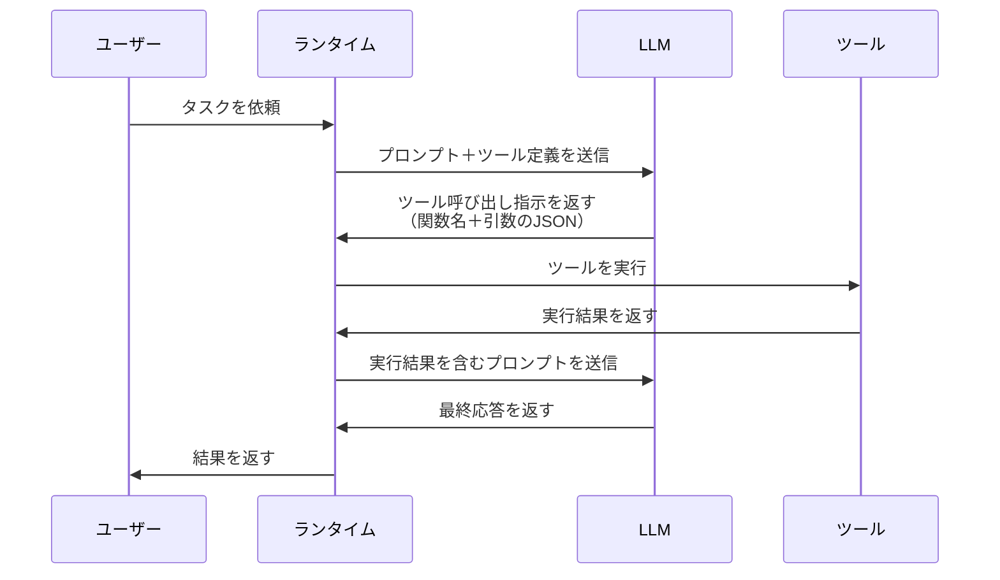
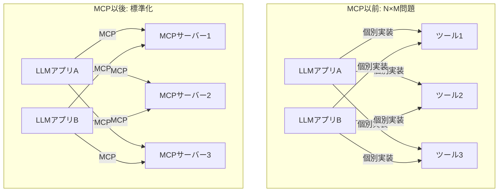
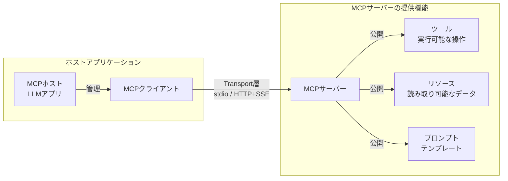
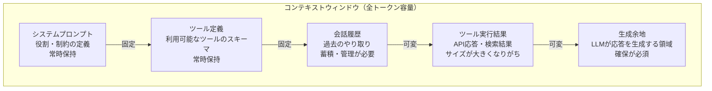
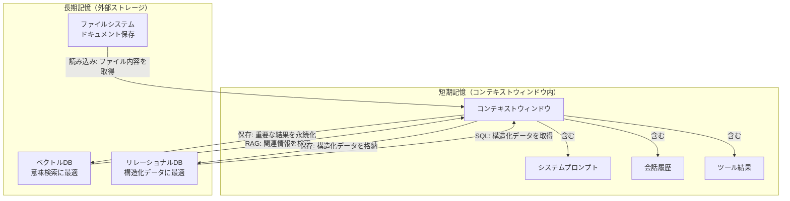

# 第2章 ツールとコンテキスト ― エージェントの「手」と「記憶」

前章では、エージェントの全体像を構造的に定義した。五つの構成要素（LLM、プロンプト、ツール、メモリ、プランニング）が協調してエージェントを形成する。

本章では、その中核をなす二つの要素に焦点を当てる。エージェントの「手」であるツールと、エージェントの「記憶」であるメモリ、特にメモリを支えるコンテキスト管理である。ツールがなければエージェントは外部世界に作用できない。コンテキストが適切に管理されなければ、エージェントは的確な判断ができない。この二つがエージェントの実行能力を決定する。

前半（2.1〜2.4）でツール側の仕組みを、後半（2.5〜2.7）でコンテキスト側の設計を学ぶ。

---

## 2.1 Function Callingの仕組み ― LLMがツールを選択するメカニズム

第1章で、エージェントは「ツールを使って外部世界に作用する」と説明した。では、LLMはどのようにしてツールを選び、使うのか。そのメカニズムがFunction Calling（ファンクションコーリング）である。

ここで最初に明確にすべき点がある。LLMは「ツールを実行する」わけではない。LLMが行うのは「どのツールを、どのような引数で呼び出すべきか」という指示の生成である。実際のツール実行は、エージェントランタイムが担う。

図2.1にFunction Callingのシーケンスを示す。



図2.1: Function Callingのシーケンス

### Function Callingの処理フロー

このシーケンスを順に解説する。

**ステップ1: ツール定義の送信**。ランタイムはLLMにプロンプトを送る際、利用可能なツールの定義を併せて渡す。ツール定義にはツール名、説明文、パラメータのスキーマが含まれる。LLMはこの定義を読んで、どのようなツールが使えるかを把握する。

**ステップ2: ツール呼び出し指示の生成**。LLMはユーザーのタスクとツール定義を照合し、適切なツールと引数を選択する。出力は構造化されたJSON形式である。たとえば「OCIのインスタンス一覧を取得して」という依頼に対して、LLMは以下のような指示を生成する。

```json
{
  "function": "list_instances",
  "arguments": {
    "compartment_id": "ocid1.compartment.oc1..example"
  }
}
```

**ステップ3: ツールの実行**。ランタイムがLLMの指示に従い、実際のツール（API呼び出し等）を実行する。LLM自身はネットワーク通信もAPI呼び出しも行わない。

**ステップ4: 結果のフィードバック**。ツールの実行結果をLLMに返す。LLMは結果を読み、タスクが完了したかを判断する。完了していなければ、次のツール呼び出し指示を生成する。

### LLMは「ツールを実行しない」

この点を改めて強調する。LLMの役割は「どのツールを使うか」の判断と「引数の生成」である。LLMはテキストを生成するモデルであり、HTTP通信やファイル操作を直接行う機能を持たない。

この分離には重要な意味がある。ツールの実行をランタイム側に委ねることで、以下の制御が可能になる。

- **権限管理**: ランタイムがツール実行の許可/拒否を制御できる
- **ログ記録**: すべてのツール呼び出しを記録できる
- **安全性**: 危険な操作をブロックできる

Function Callingは、LLMの推論能力とツールの実行能力を安全に橋渡しする仕組みである。

---

## 2.2 ツール定義のベストプラクティス ― スキーマ設計、説明文の書き方

Function Callingの精度は、ツール定義の品質に直結する。ツール定義が曖昧であれば、LLMは誤ったツールを選択したり、不正な引数を生成したりする。

表2.1に、ツール定義の良い例と悪い例を示す。

| 要素 | 悪い例 | 良い例 | 改善のポイント |
|:---|:---|:---|:---|
| ツール名 | `do_something` | `list_compute_instances` | 動詞＋名詞で操作対象を明示する |
| ツール名 | `get_data` | `get_compartment_cost_summary` | 何のデータかを具体的に示す |
| 説明文 | `データを取得する` | `指定されたコンパートメント内のコンピュートインスタンスの一覧を取得する。停止中・実行中を含む全ステータスのインスタンスが返される` | LLMが「いつこのツールを使うべきか」を判断できる情報を含める |
| パラメータ | `id: string` | `compartment_id: string（必須）- OCIコンパートメントのOCID。形式: ocid1.compartment.oc1..` | 型、必須/任意、形式、具体例を含める |

表2.1: ツール定義の良い例と悪い例

### ツール名の設計

ツール名は動詞＋名詞の組み合わせで、操作内容と対象を明確にする。LLMはツール名を最初の手がかりとしてツール選択を行うため、名前の明確さが選択精度に影響する。

良い命名パターンを示す。

- `list_compute_instances`: インスタンスの一覧取得
- `create_vcn`: VCNの作成
- `delete_security_rule`: セキュリティルールの削除
- `get_cost_summary`: コストサマリーの取得

避けるべきパターンは以下のとおりである。

- `handle_request`: 何を処理するか不明
- `process`: 動詞だけで対象がない
- `util_function_1`: 番号による命名は意味を持たない

### 説明文の設計

説明文は人間向けのドキュメントではなく、LLMへの指示として書く。LLMが「このツールをいつ使うべきか」を判断するための情報を含める。

効果的な説明文に含めるべき要素を整理する。

- **何をするか**: ツールの具体的な動作
- **いつ使うか**: このツールが適切な場面の説明
- **何が返るか**: 出力の内容と形式
- **制約条件**: 使用上の注意点や前提条件

たとえば、以下のような説明文が望ましい。

> 指定されたコンパートメント内のコンピュートインスタンスの一覧を取得する。ステータス（RUNNING, STOPPED等）でフィルタ可能。ページネーションに対応しており、limit/pageパラメータで取得件数を制御できる。結果はインスタンスのOCID、表示名、ステータス、シェイプを含むリストで返される。

### パラメータスキーマの設計

パラメータスキーマはJSON Schema形式で定義する。以下の点に注意する。

- **型の明示**: `string`、`integer`、`boolean`等を正確に指定する
- **必須/任意の区別**: `required`配列で必須パラメータを明示する
- **説明と例**: 各パラメータに`description`と具体的な値の例を付ける
- **enum制約**: 取りうる値が限定される場合は`enum`で列挙する

パラメータ定義が詳細であるほど、LLMは正確な引数を生成できる。逆にパラメータ定義が不十分だと、LLMは型の誤りや不正な値を生成するリスクが高まる。

---

## 2.3 MCPの役割 ― ツール提供の標準化、なぜMCPが生まれたか

Function Callingによって、LLMはツールを使えるようになった。しかし、ここに新たな課題がある。ツールを提供する側（サーバー）と利用する側（LLMアプリケーション）の間に、統一的なインターフェースがない。

### N×M問題

MCP（Model Context Protocol）以前の状態を考える。LLMアプリケーションがM種類のツールサービスと連携する場合、M種類のカスタム連携コードが必要になる。さらに、LLMプロバイダがN種類あれば、最悪の場合N×M種類の連携実装が必要になる。これがN×M問題である。

図2.2にMCP以前と以後の状況を対比して示す。



図2.2: MCP以前と以後のツール連携の比較

### MCPとは何か

MCPはAnthropic社が2024年末に公開した標準プロトコルである。LLMアプリケーションと外部ツール/リソースの間の通信を標準化する。

MCPの役割を一言で表すと「LLMとツールの間のUSB-C」である。USB-Cが充電器とデバイスの接続を標準化したように、MCPはLLMアプリケーションとツール提供サービスの接続を標準化する。

### MCPがもたらす利点

MCPの導入により、以下の利点が得られる。

**再利用性**: 一度MCPサーバーとして実装したツールは、MCPに対応する任意のLLMアプリケーションから利用できる。OCI SDK操作をMCPサーバーにすれば、Claude、ChatGPT、その他のMCP対応アプリケーションから同じツールを使える。

**相互運用性**: 異なるプロバイダが提供するMCPサーバーを組み合わせて使える。データベース操作のMCPサーバーとファイル操作のMCPサーバーを同時に接続し、エージェントに両方のツールを使わせることが可能である。

**エコシステム**: MCPサーバーの公開・共有が可能になる。コミュニティが開発したMCPサーバーを導入するだけで、エージェントに新しいツールを追加できる。

**関心の分離**: ツール提供側はMCPサーバーの実装に集中し、LLMアプリケーション側はMCPクライアントの実装に集中できる。両者はMCPプロトコルを通じて疎結合に連携する。

---

## 2.4 MCPのアーキテクチャ ― Transport層、プロトコル、ライフサイクル

MCPの技術的な構造を見ていく。MCPはクライアント-サーバーモデルを採用しており、三つの層で構成される。

図2.3にMCPのアーキテクチャを示す。



図2.3: MCPアーキテクチャ

### 三つの構成要素

**MCPホスト**: LLMアプリケーション本体である。MCPクライアントを管理し、ユーザーとの対話を担当する。Claude Desktop、IDE拡張、カスタムアプリケーションなどが該当する。

**MCPクライアント**: MCPサーバーとの通信を担当するコンポーネントである。ホストアプリケーションの内部に組み込まれ、MCPプロトコルに従ってサーバーと通信する。一つのホストが複数のクライアントを持ち、それぞれが異なるMCPサーバーと接続する。

**MCPサーバー**: ツール、リソース、プロンプトを提供するプロセスである。MCPサーバーは三種類の機能を公開できる。

- **ツール（Tools）**: LLMが呼び出せる実行可能な操作。Function Callingの対象となる。OCI APIの呼び出し、データベース操作などが該当する
- **リソース（Resources）**: LLMが読み取れるデータソース。ファイルの内容、データベースのテーブル情報などが該当する
- **プロンプト（Prompts）**: 再利用可能なプロンプトテンプレート。定型的な指示をMCPサーバー側で定義し、クライアントが利用できる

### Transport層

MCPはTransport層を抽象化しており、二つの選択肢を提供する。

**stdio（標準入出力）**: MCPサーバーをローカルプロセスとして起動し、標準入出力を通じて通信する。ローカル環境での開発やCLIツールとの連携に適している。セットアップが簡単で、デバッグが容易である。

**HTTP+SSE（Streamable HTTP）**: MCPサーバーをHTTPサーバーとして起動し、HTTPリクエストとServer-Sent Events（SSE）を通じて通信する。リモートサーバーとの連携やクラウド環境でのデプロイに適している。

Transport層の選択はデプロイ方式を決定する。ローカル開発にはstdio、本番環境やリモート連携にはHTTP+SSEが一般的な選択である。

### サーバーのライフサイクル

MCPサーバーとの通信は以下のライフサイクルで進行する。

1. **初期化（Initialize）**: クライアントがサーバーに接続し、プロトコルバージョンと能力を交換する
2. **能力の確認**: サーバーが提供するツール、リソース、プロンプトの一覧を取得する
3. **通常運用**: ツールの呼び出し、リソースの読み取り、プロンプトの取得を行う
4. **終了（Shutdown）**: 接続を終了し、リソースを解放する

このライフサイクル管理により、MCPサーバーの状態を適切に制御できる。初期化時に能力を交換することで、クライアントはサーバーが何を提供するかを事前に把握できる。

---

## 2.5 コンテキストウィンドウの管理 ― 限られた記憶でどう戦うか

ここからはエージェントの「記憶」側に焦点を移す。第1章でコンテキストウィンドウに触れたが、ここではその管理戦略を深く掘り下げる。

コンテキストウィンドウとは、LLMが一度に処理できるトークンの最大数である。これはエージェントの「作業記憶」に相当する。人間が一度に頭の中に保持できる情報量に限界があるように、LLMにも一度に処理できる情報量の上限がある。

図2.4にコンテキストウィンドウの構成を示す。



図2.4: コンテキストウィンドウの構成

### 各領域の特徴

コンテキストウィンドウは大きく五つの領域で構成される。

**システムプロンプト**: エージェントの役割、制約、行動指針を定義する。常に先頭に配置され、タスクを通じて変化しない。サイズは固定的だが、詳細な指示を含む場合は数千トークンに達することもある。

**ツール定義**: 利用可能なツールのスキーマ（名前、説明文、パラメータ）である。ツール数が増えるとこの領域も拡大する。10個のツールで数千トークン、50個のツールで1万トークン以上を消費する場合もある。

**会話履歴**: 過去のやり取り（ユーザーの発言、LLMの応答、ツール呼び出し）の記録である。ReActループが進むにつれて蓄積され、コンテキストウィンドウを圧迫する主要因の一つである。

**ツール実行結果**: API応答やデータベース検索結果など、ツールから返されたデータである。JSON形式のAPI応答は数千トークンに達することがあり、最もサイズが予測しにくい領域である。

**生成余地**: LLMが応答を生成するために必要な領域である。この領域が不足すると、LLMは応答を途中で打ち切らざるを得なくなる。

### コンテキストウィンドウは有限リソースである

重要な認識がある。コンテキストウィンドウは有限リソースであり、設計対象である。

現在の主要LLMのコンテキストウィンドウは数万から数十万トークン程度である。大きな数字に見えるが、エージェントの実行においては制約として機能する。以下のような状況を考える。

- システムプロンプト: 2,000トークン
- ツール定義（20個）: 5,000トークン
- 会話履歴（10サイクル分）: 15,000トークン
- ツール実行結果（累積）: 30,000トークン
- 生成余地: 4,000トークン

合計で56,000トークンを消費する。ReActループが進むにつれて会話履歴とツール実行結果が蓄積され、コンテキストウィンドウは圧迫されていく。

コンテキストウィンドウの枯渇は、エージェントの「記憶喪失」を意味する。会話履歴を削除すれば過去の文脈を失い、ツール定義を省略すれば使えるツールが減る。この制約への対処が、次節以降のテーマである。

---

## 2.6 短期記憶と長期記憶 ― 会話履歴、RAG、外部ストレージの使い分け

コンテキストウィンドウだけではエージェントの記憶は限界がある。この問題に対処するため、エージェントの記憶を二つに分類する。

図2.5に短期記憶と長期記憶のアーキテクチャを示す。



図2.5: 短期記憶と長期記憶のアーキテクチャ

### 短期記憶

短期記憶はコンテキストウィンドウ内に保持される情報である。LLMに直接渡されるため即座に参照できる。

短期記憶の特徴を整理する。

- **即時アクセス**: LLMが推論時に直接参照できる
- **容量制限**: コンテキストウィンドウのサイズに制約される
- **揮発性**: セッション終了やコンテキストの圧縮で失われる
- **高コスト**: トークン数に応じてAPI利用料が発生する

短期記憶の管理では「何を保持し、何を捨てるか」の判断が常に求められる。すべてを保持すればコンテキストウィンドウが枯渇し、捨てすぎれば文脈を失う。

### 長期記憶

長期記憶は外部ストレージに保存される情報である。コンテキストウィンドウの制約を超えて大量の情報を保持できる。

主な保存先と特徴を示す。

**ベクトルDB**: テキストをベクトル（数値の配列）に変換して保存する。意味的に類似した情報を高速に検索できる。過去の会話履歴や大量のドキュメントから関連情報を取得する場面に適している。

**リレーショナルDB**: 構造化されたデータを保存する。エージェントの実行履歴、タスクの状態管理、設定情報など、スキーマが明確なデータに適している。SQLで柔軟に問い合わせできる。

**ファイルシステム**: ドキュメント、設定ファイル、ログなどを保存する。最もシンプルだが、検索機能は限定的である。

### RAGの位置づけ

RAG（Retrieval-Augmented Generation）は、長期記憶と短期記憶を橋渡しする仕組みである。「検索転送」と表現できる。

RAGの処理フローは以下のとおりである。

1. ユーザーの質問やエージェントの思考から検索クエリを生成する
2. 長期記憶（ベクトルDB等）から関連する情報を検索する
3. 検索結果をコンテキストウィンドウに追加する
4. LLMが検索結果を含むコンテキストに基づいて推論する

RAGの本質は「必要な情報を、必要な時に、長期記憶から短期記憶に転送する」ことにある。コンテキストウィンドウの容量制限を間接的に克服する手法である。

### 使い分けの指針

短期記憶と長期記憶の使い分けは、情報の特性に応じて判断する。

- **現在のタスクに直接必要な情報** → 短期記憶（コンテキストウィンドウ）に保持する
- **過去のセッションで得た知識** → 長期記憶に保存し、必要時にRAGで検索する
- **参照頻度の低い大量データ** → 長期記憶に保存する
- **エージェントの実行状態** → 長期記憶に永続化し、障害時の復旧に備える

記憶の設計は、エージェントの知識範囲と応答品質を決定する。短期記憶だけに頼ると「忘れやすいエージェント」になり、長期記憶を適切に活用すれば「経験から学ぶエージェント」に近づく。

---

## 2.7 コンテキストエンジニアリング ― 何を入れ、何を捨てるかの設計

ツールと記憶の仕組みを理解した上で、最後にこれらを統合する技法を学ぶ。コンテキストエンジニアリング（Context Engineering）とは、LLMに渡すコンテキスト全体を戦略的に設計する技法である。

### 「全部入れる」は最悪の戦略

まず、避けるべきアンチパターンを確認する。「関連しそうな情報をすべてコンテキストに詰め込む」という戦略は、直感に反して最悪の結果をもたらす。

その理由は三つある。

**トークンの浪費**: コンテキストウィンドウの容量を無駄に消費し、本当に必要な情報を入れる余地がなくなる。

**注意力の分散**: LLMの「注意力」は有限である。大量の情報の中から関連部分を見つけ出す精度は、情報量の増加とともに低下する。これはLLMの注意機構（Attention Mechanism）の特性に起因する。

**コスト増大**: トークン数に比例してAPI利用料が増加する。不要な情報のために余分なコストを支払うことになる。

### コンテキスト管理の戦略

表2.2に、情報の種類ごとの管理戦略を整理する。

| 情報の種類 | 常時保持 | 要約して保持 | 必要時に読み込み | 破棄 |
|:---|:---|:---|:---|:---|
| システムプロンプト | ○ | — | — | — |
| ツール定義 | △（使用頻度の高いもの） | — | ○（使用頻度の低いもの） | — |
| 直近の会話（数ターン） | ○ | — | — | — |
| 古い会話履歴 | — | ○ | — | △ |
| ツール実行結果（直近） | ○ | — | — | — |
| ツール実行結果（過去） | — | ○ | — | △ |
| 外部知識（RAG） | — | — | ○ | — |

表2.2: コンテキスト管理の戦略マトリクス（○=推奨、△=条件付き、—=非該当）

### 各戦略の詳細

**常時保持**: タスクの遂行に常に必要な情報を保持する。システムプロンプトと直近の会話がこれに該当する。容量を圧迫するため、保持する情報は最小限に絞る。

**要約して保持**: 古い会話履歴や過去のツール実行結果を、LLMに要約させてから保持する。たとえば、10ターンの会話履歴を数文の要約に圧縮すれば、トークン消費を大幅に削減しつつ文脈を維持できる。

**必要時に読み込み**: 通常はコンテキストに含めず、必要になった時点で読み込む。使用頻度の低いツール定義やRAGで検索する外部知識がこれに該当する。ツール定義の動的な読み込みは、MCPの仕組みと相性が良い。

**破棄**: 不要になった情報を削除する。タスクの進行に伴い不要になった古い会話履歴や、既に処理済みのツール実行結果が対象である。破棄は不可逆であるため、本当に不要かの判断が重要である。

### コンテキストエンジニアリングの実践

コンテキストエンジニアリングで意識すべき原則をまとめる。

**必要最小限の原則**: コンテキストには「今の推論に必要な情報」だけを含める。「あると便利かもしれない」情報は含めない。

**鮮度の原則**: 古い情報より新しい情報を優先する。直近の会話は詳細に、古い会話は要約で保持する。

**構造化の原則**: 情報を構造化してLLMが解釈しやすい形にする。雑多な情報の羅列より、セクション分けされた情報の方がLLMの理解精度は高い。

**評価の原則**: コンテキストの設計は仮説であり、実際の性能で検証する。ツール定義の説明文を変えるだけで正答率が大きく変わることは珍しくない。

コンテキストエンジニアリングは、エージェントの性能を決定的に左右する技法である。同じLLM、同じツールを使っても、コンテキスト設計の巧拙でエージェントの信頼性は大きく変わる。

---

## まとめ

本章では、エージェントの「手」と「記憶」を深く掘り下げた。

前半では、ツール側の仕組みを学んだ。Function Callingは、LLMが「ツール呼び出しの指示を生成」し、ランタイムが「ツールを実行」する分離モデルである。ツール定義の品質がFunction Callingの精度を決定する。MCPはツール提供を標準化するプロトコルであり、再利用性と相互運用性を実現する。

後半では、コンテキスト側の設計を学んだ。コンテキストウィンドウは有限リソースであり、戦略的な管理が必要である。記憶は短期（コンテキストウィンドウ内）と長期（外部ストレージ）に分かれ、RAGが両者を橋渡しする。コンテキストエンジニアリングは「何を入れ、何を捨てるか」を設計する技法であり、エージェントの性能を決定的に左右する。

ここまで第I部の二つの章を通じて、シングルエージェントの仕組みを深く理解してきた。エージェントの定義、構成要素、ツール、コンテキスト。しかし、一つのエージェントで全てを処理しようとすると、そこには構造的な限界がある。次章では、シングルエージェントの限界を正面から検討する。

---

## 理解度チェック

**Q1**: Function CallingにおけるLLMの役割を説明せよ。LLMは実際にツールを実行するか。

<details>
<summary>解答</summary>

LLMの役割は「どのツールを、どのような引数で呼び出すべきか」という指示を生成することである。LLMは実際にはツールを実行しない。ツールの実行はエージェントランタイムが担う。

LLMはテキストを生成するモデルであり、HTTP通信やファイル操作を直接行う機能を持たない。LLMが生成するのは、ツール名と引数を含む構造化されたJSON出力である。この分離により、権限管理、ログ記録、安全性の確保が可能になる。

</details>

**Q2**: MCPのTransport層にはどのような選択肢があり、それぞれどのような場面に適するか。

<details>
<summary>解答</summary>

MCPのTransport層には二つの選択肢がある。

1. **stdio（標準入出力）**: MCPサーバーをローカルプロセスとして起動し、標準入出力を通じて通信する。ローカル環境での開発やCLIツールとの連携に適している。セットアップが簡単でデバッグが容易である。

2. **HTTP+SSE（Streamable HTTP）**: MCPサーバーをHTTPサーバーとして起動し、HTTPリクエストとServer-Sent Events（SSE）を通じて通信する。リモートサーバーとの連携やクラウド環境でのデプロイに適している。

一般的に、ローカル開発にはstdio、本番環境やリモート連携にはHTTP+SSEが選択される。

</details>

**Q3**: コンテキストウィンドウが不足した場合の対処法を三つ挙げよ。

<details>
<summary>解答</summary>

1. **会話履歴の要約**: 古い会話履歴をLLMに要約させ、圧縮した形で保持する。トークン消費を大幅に削減しつつ、文脈の維持が可能である。

2. **不要な情報の破棄**: 既に処理済みのツール実行結果や、現在のタスクに無関係な古い会話履歴を削除する。

3. **必要時の動的読み込み**: 使用頻度の低いツール定義や外部知識を常時保持せず、必要になった時点でRAG等を通じて読み込む。

</details>

**Q4**: あるエージェントが過去100回分の会話履歴を全てコンテキストに含めている。この設計の問題点と改善策を述べよ。

<details>
<summary>解答</summary>

**問題点**:
1. **コンテキストウィンドウの枯渇**: 100回分の会話履歴は大量のトークンを消費し、新しい情報やツール定義を入れる余地がなくなる。
2. **注意力の分散**: 大量の情報の中からLLMが関連部分を見つける精度が低下し、推論の質が劣化する。
3. **コスト増大**: 不要なトークンにもAPI利用料が発生する。

**改善策**:
1. 直近の数ターンのみ会話履歴として保持する。
2. 古い会話はLLMに要約させ、要約のみを保持する。
3. 過去の会話を長期記憶（ベクトルDB等）に保存し、必要時にRAGで検索する。

</details>

**Q5**: MCPとFunction Callingの関係を説明せよ。

<details>
<summary>解答</summary>

Function CallingとMCPは異なるレイヤーの仕組みであり、相互に補完する関係にある。

**Function Calling**は、LLMが「どのツールを使うか」を判断し、呼び出し指示を生成するメカニズムである。LLMとツールの間の「判断と指示」を担う。

**MCP**は、ツールの提供と接続を標準化するプロトコルである。MCPサーバーが公開するツールは、Function Callingのツール定義としてLLMに渡される。MCPは「ツールの提供方法」を標準化する。

つまり、MCPでツールを提供し、Function Callingでそのツールを呼び出すという関係である。MCPがなくてもFunction Callingは使えるが、MCPがあることでツールの再利用性と相互運用性が大幅に向上する。

</details>
