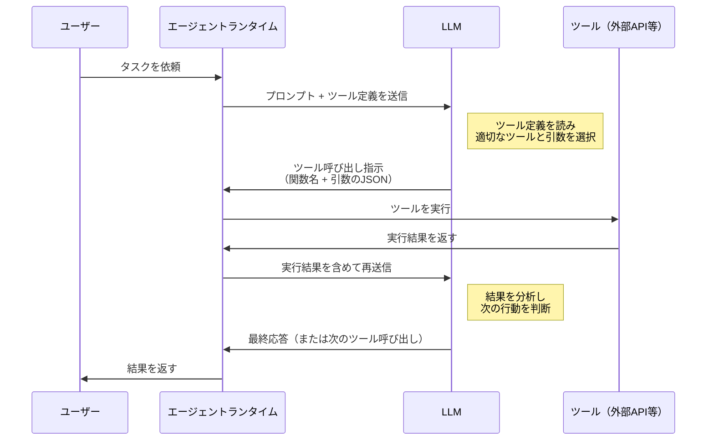
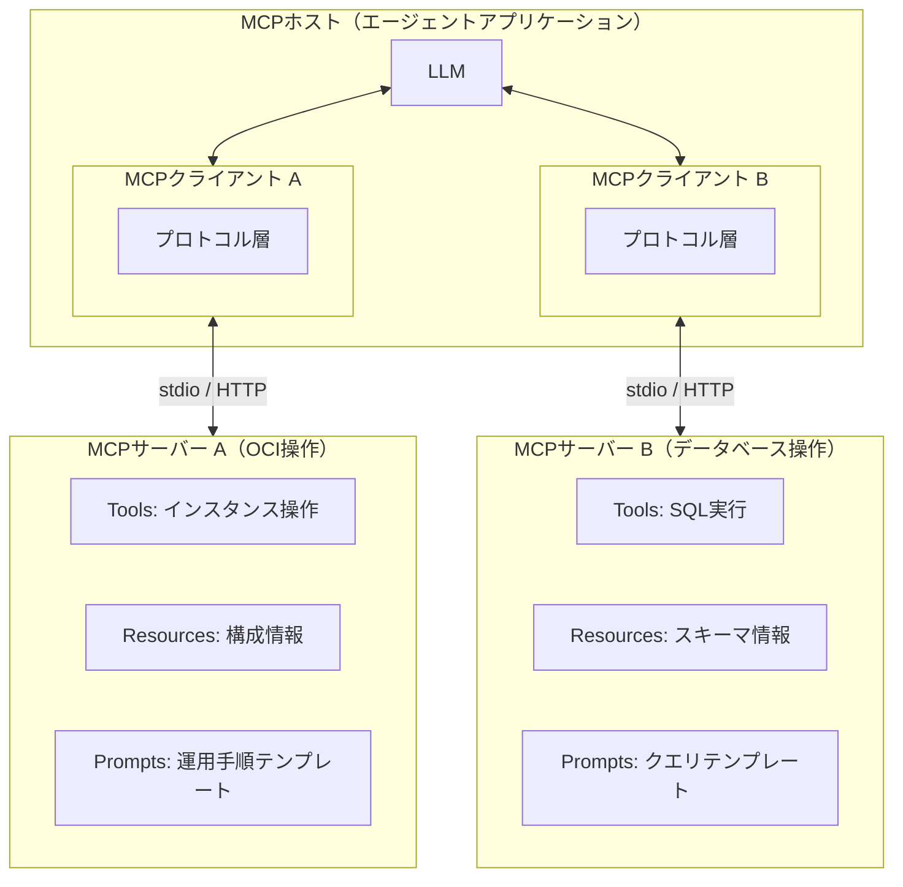

# 第2章 ツールとコンテキスト ― エージェントの「手」と「記憶」

前章では、エージェントの全体像を構造的に定義した。四つの構成要素（LLM、ツール、プランニング、メモリ）が協調してエージェントを形成し、ReActパターンによって思考と行動を繰り返す。

本章では、その中核をなす二つの要素に焦点を当てる。エージェントの「手」であるツールと、エージェントの「記憶」であるコンテキストである。ツールがなければエージェントは外部世界に作用できない。コンテキストが適切に管理されなければ、エージェントは的確な判断ができない。この二つがエージェントの実行能力を決定する。

前半（2.1〜2.4）ではツール側の仕組みを扱う。LLMがツールを選択するメカニズムであるFunction Calling、ツール定義の設計方法、そしてツール提供を標準化するMCP（Model Context Protocol）を解説する。後半（2.5〜2.7）ではコンテキスト側の設計を扱う。コンテキストウィンドウの制約、短期記憶と長期記憶の使い分け、そしてコンテキストエンジニアリングの技法を整理する。

---

## 2.1 Function Callingの仕組み

第1章で、エージェントは「ツールを使って外部世界に作用する」と述べた。では、LLMはどのようにしてツールを選び、使うのか。そのメカニズムがFunction Calling（ファンクションコーリング）である。

最初に明確にすべき点がある。LLMは「ツールを実行する」わけではない。LLMが行うのは「どのツールを、どのような引数で呼び出すべきか」という**指示の生成**である。実際のツール実行は、第1章で解説したエージェントランタイムが担う。この役割分担を正確に理解することが、Function Callingの本質を捉える鍵である。

図2.1にFunction Callingのシーケンスを示す。

図2.1: Function Callingのシーケンス

### Function Callingの処理フロー

このシーケンスを順に解説する。

**ステップ1: ツール定義の送信**。ランタイムはLLMにプロンプトを送る際、利用可能なツールの定義を併せて渡す。ツール定義にはツール名、説明文、パラメータのスキーマが含まれる。LLMはこの定義を読んで、どのようなツールが使えるかを把握する。ここで重要なのは、ツール定義がLLMのコンテキストの一部として消費される点である。10個のツールを定義すれば10個分の定義テキストがコンテキストウィンドウを占有する。この点は2.5節で改めて扱う。

**ステップ2: ツール呼び出し指示の生成**。LLMはユーザーのタスクとツール定義を照合し、適切なツールと引数を選択する。出力は構造化されたJSON形式である。たとえば「OCIのインスタンス一覧を取得して」という依頼に対して、LLMは`list_instances`という関数名と`compartment_id`という引数を指定したJSONを生成する。LLMが行うのはここまでである。

**ステップ3: ツールの実行**。ランタイムがLLMの指示を解析し、指定された関数を実際に呼び出す。OCI SDKのAPIを叩く、データベースにクエリを発行する、ファイルを読み書きする。これらはすべてランタイム側の処理である。LLMはAPIのエンドポイントに直接アクセスするわけではない。

**ステップ4: 結果のフィードバック**。ツールの実行結果がランタイムを通じてLLMに返される。LLMはこの結果を分析し、タスクが完了したかどうかを判断する。未完了であれば、次のツール呼び出し指示を生成する。これが第1章で解説したReActパターンの「行動」ステップの具体的な実装である。

### ReActパターンとの関係

第1章で定義したReActパターンは「思考→行動→観察」のループであった。Function Callingは、このうち「行動」ステップを具体化するメカニズムである。

- **思考（Reasoning）**: LLMがタスクを分析し、次に呼ぶべきツールを決定する
- **行動（Acting）**: Function Callingによってツール呼び出し指示を生成し、ランタイムが実行する
- **観察（Observation）**: ツールの実行結果がLLMにフィードバックされる

Function Callingがなかった時代、LLMの「行動」は自然言語のテキスト出力に限定されていた。Function Callingの登場により、LLMは構造化された形式で外部世界への作用を指示できるようになった。これがエージェントの実現を可能にした技術的基盤である。

### 並列Function Calling

2023年以降、主要なLLMプロバイダーは並列Function Calling（Parallel Function Calling）をサポートするようになった。一度のLLM応答で複数のツール呼び出し指示を同時に返す機能である。

たとえば「OCIの東京リージョンと大阪リージョンのインスタンス一覧をそれぞれ取得して」という依頼を考える。並列Function Callingでは、LLMは二つのツール呼び出し指示を同時に生成する。ランタイムはこれらを並行して実行し、両方の結果が揃った時点でLLMにフィードバックする。逐次実行に比べてレイテンシが大幅に削減される。

ただし、並列Function Callingには制約もある。並列に実行できるのは、相互に依存しないツール呼び出しに限られる。「VCNを作成してから、そのVCN内にサブネットを作成する」のように依存関係がある場合は、逐次実行が必要である。ランタイムはこの依存関係を考慮した実行制御を行う必要がある。

---

## 2.2 ツール定義のベストプラクティス

Function Callingにおいて、LLMがツールを正しく選択し、適切な引数を渡せるかどうかは、ツール定義の品質に大きく依存する。ツール定義はLLMにとっての「取扱説明書」である。説明書が曖昧であれば、LLMは誤ったツールを選び、不適切な引数を渡す。

### ツール名の設計

ツール名はLLMが最初に目にする情報であり、ツールの機能を端的に伝える必要がある。

**命名の原則**: 動詞＋対象名の形式が望ましい。`list_instances`、`create_vcn`、`get_compartment_details`のように、何をするツールかが名前だけで推測できるようにする。`process_data`や`handle_request`のような曖昧な名前は避ける。LLMが名前だけでツールの用途を判断できることが理想である。

**一貫性**: 同じ操作には同じ動詞を使う。リソース取得にあるツールでは`get`、別のツールでは`fetch`、さらに別のツールでは`retrieve`を使う、といった不統一はLLMの判断を混乱させる。CRUDの操作であれば`create`、`get`、`update`、`delete`で統一するのが明快である。

### 説明文の書き方

説明文はツール名よりも詳細な情報をLLMに提供する。ツール名だけでは判断が難しいケースで、LLMが正しいツールを選ぶための手がかりとなる。

**良い説明文の要素**:

1. **目的**: このツールが何をするか（「指定されたコンパートメント内のコンピュートインスタンス一覧を返す」）
2. **戻り値**: 何が返ってくるか（「インスタンスのOCID、名前、状態、シェイプの一覧をJSON配列で返す」）
3. **制約**: 使用上の注意点（「最大1000件まで取得可能。ページネーションが必要な場合はpageトークンを使用する」）
4. **使用場面**: どのような場合に使うべきか（「インスタンスの状態確認やリソース棚卸しに使用する」）

曖昧な説明文は誤判断の原因となる。「インスタンスに関する操作を行う」のような説明では、一覧取得なのか作成なのか削除なのかが不明である。LLMに対して人間が読むドキュメントと同じ明瞭さを提供する必要がある。

### パラメータスキーマの設計

パラメータスキーマは、ツールに渡す引数の型、制約、デフォルト値を定義する。JSON Schemaの形式で記述するのが一般的である。

**型の厳密な指定**: 文字列型(`string`)、数値型(`integer`, `number`)、真偽値型(`boolean`)を正確に指定する。型が曖昧だとLLMが不適切な値を渡す可能性がある。

**制約の明記**: 許容値の範囲(`enum`、`minimum`、`maximum`)、必須かどうか(`required`)、デフォルト値(`default`)を明記する。たとえばリージョン指定のパラメータには`enum: ["ap-tokyo-1", "ap-osaka-1", "us-ashburn-1"]`のように許容値を列挙する。LLMは列挙されていない値を生成しなくなる。

**説明の付与**: 各パラメータにも`description`フィールドで説明を付ける。`compartment_id`であれば「対象コンパートメントのOCID」と記載する。パラメータ名だけで意味が自明な場合でも、説明を省略しないことが望ましい。

### ツールの粒度設計

一つのツールが担う責務の範囲、すなわちツールの粒度は設計上の重要な判断である。

**細粒度すぎる場合の問題**: `get_vcn_id`、`get_subnet_id`、`get_security_list_id`のように極端に細かく分割すると、ツール数が膨大になる。ツール定義がコンテキストウィンドウを圧迫し、LLMの選択精度も低下する。

**粗粒度すぎる場合の問題**: `manage_all_network_resources`のように一つのツールに多数の機能を詰め込むと、パラメータが複雑になりLLMが正しく使えなくなる。

**適切な粒度**: 「一つのツールが一つの責務を持つ」が基本原則である。「VCNを作成する」「サブネットを一覧取得する」「セキュリティルールを更新する」のように、明確な単位で分割する。ツール数の目安として、一つのエージェントに与えるツールは10〜20個程度が実用的な上限とされている。これを超えると、LLMの選択精度が低下する傾向がある。

ツール数の増加によるLLMの判断精度低下は、シングルエージェントの限界に直結する。この問題は第3章で「専門性のジレンマ」として改めて分析する。

---

## 2.3 MCPの役割

Function Callingはツールを呼び出す仕組みを提供する。しかし、ツールをどのように定義し、提供し、管理するかという問題は別に存在する。MCP（Model Context Protocol）は、この「ツール提供」を標準化するために2024年にAnthropic社が提案したオープンなプロトコルである。

### MCPが解決する課題

MCPが登場する以前、ツールの提供方法はLLMプロバイダーやフレームワークごとに異なっていた。同じ「OCIのインスタンス一覧を取得する」というツールであっても、LangChainで使うための定義とCrewAIで使うための定義は異なる形式で書く必要があった。ツール開発者は利用先のフレームワークごとに個別の対応を求められた。

この状況はWebの黎明期に似ている。各ブラウザが独自のHTML解釈を行い、開発者がブラウザごとにWebサイトを個別に最適化していた時代である。標準規格の策定によってこの混乱が収束したように、MCPはツール提供の標準規格として機能する。

MCPが解決する課題を三つにまとめる。

**M×N問題の解消**: M個のエージェント（ホスト）とN個のツール提供元（サーバー）がある場合、MCPなしではM×N個の個別接続を実装する必要がある。MCPにより、エージェント側はMCPクライアントを一つ実装すれば全てのMCPサーバーに接続でき、ツール提供側はMCPサーバーを一つ実装すれば全てのエージェントから利用される。接続数はM+Nとなる。

**ツール提供者とエージェント開発者の分離**: MCPサーバーの開発者は、自分のツールがどのエージェントから利用されるかを知る必要がない。エージェント開発者は、MCPサーバーの内部実装を知る必要がない。標準化されたインターフェースにより、両者は独立に開発を進められる。

**動的なツール発見**: エージェントは実行時にMCPサーバーからツールの一覧と定義を取得できる。あらかじめツール定義をハードコードする必要がない。新しいツールがMCPサーバーに追加されれば、エージェントは次回の接続時にそれを発見して利用可能になる。

### MCPとFunction Callingの関係

MCPとFunction Callingは異なるレイヤーで動作する。Function CallingはLLMとランタイム間のツール呼び出しメカニズムである。MCPはランタイムとツール提供元の間のツール接続プロトコルである。

両者の関係を整理する。エージェントランタイムはMCPクライアントを通じてMCPサーバーからツール定義を取得する。取得したツール定義をFunction Callingの形式に変換し、LLMに渡す。LLMがツール呼び出し指示を返すと、ランタイムはMCPクライアントを通じてMCPサーバー上のツールを実行する。MCPはFunction Callingの「上流」に位置する。Function Callingが「ツールの使い方」を、MCPが「ツールの提供の仕方」を定めている。

### MCPとA2Aの違い

ツール接続のプロトコルとして、MCPの他にA2A（Agent-to-Agent Protocol）がある。両者は異なる目的を持つ。MCPは「エージェントがツールやデータソースに接続する」ためのプロトコルである。A2Aは「エージェント同士が通信する」ためのプロトコルである。MCPでの接続先はツールサーバーであり、A2Aでの接続先は別のエージェントである。A2Aについては第5章で詳しく扱う。

---

## 2.4 MCPのアーキテクチャ

MCPの技術的なアーキテクチャを掘り下げる。MCPはホスト（Host）、クライアント（Client）、サーバー（Server）の3層構造で設計されている。

図2.2にMCPアーキテクチャの全体像を示す。

図2.2: MCPアーキテクチャ（ホスト・クライアント・サーバーの3層構造）

### MCPホスト

MCPホスト（MCP Host）は、エージェントアプリケーション全体を指す。Claude Desktop、IDE（統合開発環境）のAIアシスタント、独自に開発したエージェントアプリケーションなどがMCPホストに該当する。MCPホストはLLMとの対話を管理し、一つ以上のMCPクライアントを内包する。

MCPホストの主な責務は以下のとおりである。

- LLMとの通信管理（プロンプト送信、応答受信）
- MCPクライアントの生成と管理
- 複数のMCPサーバーから取得した情報の統合
- セキュリティポリシーの適用（どのツールの実行を許可するか）

### MCPクライアント

MCPクライアント（MCP Client）は、MCPサーバーとの通信を担うコンポーネントである。MCPホスト内に一つ以上存在し、それぞれが一つのMCPサーバーと1対1の接続を維持する。

MCPクライアントとMCPサーバーの関係は1対1である点が重要である。一つのMCPクライアントが複数のMCPサーバーに接続することはない。複数のMCPサーバーに接続する場合は、MCPホストが複数のMCPクライアントを生成する。図2.2では、MCPクライアントAがMCPサーバーA（OCI操作）に、MCPクライアントBがMCPサーバーB（データベース操作）に、それぞれ接続している。

### MCPサーバー

MCPサーバー（MCP Server）は、ツール・リソース・プロンプトをMCPクライアントに提供するコンポーネントである。MCPサーバーは三つのプリミティブ（Primitive）を公開する。

**Tools（ツール）**: LLMが呼び出し可能な関数である。Function Callingで実行される操作に対応する。「インスタンスを作成する」「SQL文を実行する」のような、外部世界への作用を持つ操作が該当する。三つのプリミティブの中で最も頻繁に使われるものである。

**Resources（リソース）**: LLMが参照可能なデータソースである。ファイルの内容、データベースのスキーマ情報、設定ファイルの値などが該当する。Toolsとの違いは、Resourcesは「読み取り」に特化している点にある。外部世界を変更する副作用を持たない。

**Prompts（プロンプト）**: 再利用可能なプロンプトテンプレートである。特定のタスクに最適化されたプロンプトをMCPサーバー側で定義し、MCPクライアントに提供する。「OCI運用チェックの手順」「障害対応の定型フロー」のようなテンプレートが該当する。

### Transport層

MCPの通信には二つの方式がある。

**stdio（標準入出力）**: MCPサーバーをローカルプロセスとして起動し、標準入出力を通じて通信する。ローカル環境でのツール提供に適している。起動が高速で、ネットワーク設定が不要である。開発時やローカルツールの提供に多く用いられる。

**Streamable HTTP**: HTTP/HTTPSベースの通信方式である。リモート環境のMCPサーバーとの通信に適している。サーバーからクライアントへのリアルタイム通知にはServer-Sent Events（SSE）を使用する。ネットワーク越しのツール提供、クラウド上のMCPサーバーとの接続に用いられる。エンタープライズ環境では、OCI上にMCPサーバーをデプロイし、Streamable HTTPで接続する構成が考えられる。

### MCPのエコシステム

MCPはオープンな仕様として公開されており、2024年の発表以降、多数のMCPサーバーが開発・公開されている。ファイルシステム操作、データベース接続、クラウドサービス操作、外部SaaS連携など、多様なドメインのMCPサーバーが利用可能である。

エージェント開発者にとって、MCPのエコシステムは大きなメリットをもたらす。ツールを一から実装する代わりに、既存のMCPサーバーを接続するだけでエージェントの能力を拡張できる。OCI操作のためのMCPサーバーを開発すれば、それを利用するあらゆるエージェントアプリケーションからOCIの操作が可能になる。

---

## 2.5 コンテキストウィンドウの管理

ここからはエージェントの「記憶」に焦点を移す。LLMには一度に処理できるトークン数の上限がある。これをコンテキストウィンドウ（Context Window）と呼ぶ。2025年時点で主要なLLMのコンテキストウィンドウは、数万トークンから100万トークン超まで幅がある。一見すると十分に見えるが、エージェントの文脈では、この上限が深刻な制約として表れる。

### コンテキストウィンドウの消費構造

エージェントが動作する際、コンテキストウィンドウは以下の四つの要素で消費される。

**システムプロンプト**: エージェントの役割定義、行動制約、出力形式の指定などである。一般的に数百から数千トークンを占める。タスクの開始から終了まで常に存在し、削除できない。

**ツール定義**: 2.1節で述べたとおり、利用可能なツールの定義がコンテキストの一部として送信される。ツール1個あたり数百トークンを消費するため、20個のツールがあれば数千トークンが常に占有される。ツール数に比例してこの領域は増大する。

**会話履歴**: ReActループの各サイクルで蓄積される思考、ツール呼び出し指示、ツール実行結果の記録である。サイクルが進むほど会話履歴は増加する。10サイクルの処理であれば、10回分の思考と行動と観察がすべて蓄積される。

**ツール実行結果**: ツールから返される応答データである。APIレスポンスのJSON、データベースクエリの結果セットなど、一回の実行結果が数千トークンに達することも珍しくない。OCI APIからインスタンス一覧を取得すると、各インスタンスの詳細情報が含まれるため、返されるJSONは大量のトークンを消費する。

この四つの要素が重なると、数十サイクルのReActループでコンテキストウィンドウが枯渇する事態が発生する。コンテキストウィンドウが満杯になると、LLMはそれ以上の入力を受け付けられず、エージェントは動作を停止する。あるいは、古い情報が切り捨てられ、重要な文脈を失ったまま処理を続行するケースもある。これが「コンテキスト爆発」と呼ばれる問題であり、第3章で改めて分析する。

### コンテキスト管理の戦略

コンテキストウィンドウの制約に対処するための戦略を、情報の重要度と鮮度の二軸で整理する。図2.3にその戦略マトリクスを示す。

| | **鮮度: 高**（直近の情報） | **鮮度: 低**（過去の情報） |
|:---|:---|:---|
| **重要度: 高** | **常時保持**: システムプロンプト、現在のタスク定義、直近のツール実行結果。コンテキストに常に含める | **選択的参照**: 過去の重要な判断履歴、蓄積されたエラーパターン。必要時に外部ストレージから取得する |
| **重要度: 低** | **要約保持**: 直近の会話の詳細部分。要約してトークン数を圧縮した上で保持する | **外部退避**: 古い会話ログ、過去のツール実行結果の詳細。外部ストレージに保存し、コンテキストからは除外する |

図2.3: コンテキスト管理の戦略マトリクス（情報の重要度 vs 鮮度）

この戦略マトリクスが示す基本方針は、「すべてをコンテキストに入れるのではなく、重要度と鮮度に基づいて取捨選択する」ことである。具体的な管理手法を以下に整理する。

**要約（Summarization）**: 長い会話履歴をLLM自身に要約させ、トークン数を削減する手法である。10サイクル分の詳細なやり取りを「VCNを作成し、サブネットを二つ構成した。セキュリティリストの設定が残っている」のように圧縮する。詳細は失われるが、文脈の連続性は維持できる。

**スライディングウィンドウ（Sliding Window）**: 直近のN件の会話のみをコンテキストに含め、古い会話を切り捨てる手法である。実装は単純だが、切り捨てられた情報の中に重要な文脈が含まれるリスクがある。

**選択的取得（Selective Retrieval）**: 過去の情報を外部ストレージに保存しておき、必要に応じて検索・取得してコンテキストに組み込む手法である。2.6節で述べるRAGの仕組みがこれに該当する。コンテキストの利用効率が高いが、検索精度と遅延のトレードオフがある。

これらの手法は排他的ではなく、組み合わせて使用する。たとえば、直近5サイクルはスライディングウィンドウで保持し、それ以前の情報は要約して保持し、詳細データは外部ストレージに退避するという設計が考えられる。

---

## 2.6 短期記憶と長期記憶

エージェントの記憶を二つの層に分けて理解する。短期記憶（Short-term Memory）と長期記憶（Long-term Memory）である。人間の記憶が作業記憶と長期記憶に分かれるように、エージェントの記憶も同様の階層構造を持つ。

### 短期記憶

短期記憶は、コンテキストウィンドウ内に保持される情報である。現在のタスクに直接関わる情報がここに格納される。

短期記憶の特徴を整理する。

**即時アクセス**: コンテキストウィンドウ内にあるため、LLMが直接参照できる。外部ストレージへの問い合わせが不要であり、レイテンシが発生しない。

**揮発性**: エージェントの実行が終了すると、短期記憶は消失する。次回の実行時には白紙の状態から始まる。ただし、会話履歴を外部に保存しておけば、次回起動時に再読み込みすることは可能である。

**容量制限**: コンテキストウィンドウの上限がそのまま短期記憶の容量制限となる。2.5節で述べたように、システムプロンプトやツール定義がこの容量を圧迫するため、純粋に会話履歴に使える容量はさらに限られる。

短期記憶に含まれる典型的な情報を挙げる。

- 現在のタスクの目標と制約
- 直近のReActサイクルの思考・行動・観察
- 直前のツール実行結果
- ユーザーとの直近の対話内容

### 長期記憶

長期記憶は、コンテキストウィンドウの外部に永続化される情報である。エージェントの実行をまたいで保持される。

長期記憶の特徴を整理する。

**永続性**: 外部ストレージ（データベース、ファイルシステム、オブジェクトストレージ）に保存されるため、エージェントの実行終了後も保持される。前回の実行結果や過去の判断履歴を次回以降に活用できる。

**大容量**: コンテキストウィンドウの制約を受けない。数百万件のドキュメント、過去の全実行履歴など、大量の情報を格納できる。

**検索コスト**: 長期記憶の情報を利用するには、検索して必要な情報を取り出し、コンテキストに組み込む手順が必要である。この検索にはレイテンシが発生し、検索精度が100%でないという課題もある。

### RAGによる長期記憶の実現

長期記憶を実現する代表的な手法がRAG（Retrieval-Augmented Generation）である。RAGは「検索拡張生成」と訳され、以下の手順で動作する。

1. **前処理（インデクシング）**: 文書群をベクトル化し、ベクトルデータベース（Vector Database）に格納する。OCI環境ではOracle DatabaseのAI Vector Searchや、Autonomous DatabaseのVector Search機能が利用できる。
2. **検索（Retrieval）**: ユーザーのクエリや現在のタスクの文脈をベクトル化し、類似度の高い文書をベクトルデータベースから取得する。
3. **生成（Generation）**: 取得した文書をコンテキストに追加し、LLMに渡す。LLMは元のクエリと取得した文書の両方を参照して応答を生成する。

エージェントの文脈では、RAGは以下のような用途で活用される。

- **ナレッジベース**: OCIのドキュメント、社内手順書、過去の障害対応記録をベクトル化しておき、エージェントがタスク遂行時に参照する
- **実行履歴**: 過去のエージェント実行のログ（何をどのような順番で実行し、どのような結果を得たか）を保存し、類似タスクの遂行に活用する
- **設定情報**: 環境固有の設定値、命名規則、ポリシー情報を格納し、エージェントの判断基準として参照させる

### その他の長期記憶の実装方式

RAG以外にも、長期記憶を実現する方式がある。

**キーバリューストア**: キーと値のペアで情報を保存する。ユーザーの好み設定、過去のタスク結果のサマリーなど、構造化された情報の保存に適している。検索はキーの完全一致で行うため、ベクトル検索に比べて高速かつ確実である。

**リレーショナルデータベース**: SQLで問い合わせ可能な形で情報を保存する。タスクの実行履歴、リソースの状態変更記録など、構造化データの蓄積と複雑なクエリに適している。OCI環境ではAutonomous Databaseが利用できる。

**ファイルシステム / オブジェクトストレージ**: 非構造化データ（ログファイル、設定ファイル、レポート）の保存に適している。OCI Object Storageを利用すれば、大量のファイルを低コストで永続化できる。

### 短期記憶と長期記憶の使い分け

両者は対立するものではなく、相補的な関係にある。短期記憶は「今この瞬間の作業台」であり、長期記憶は「いつでも参照できる書棚」である。

使い分けの基本原則は次のとおりである。

- 現在のタスクに直接必要な情報は短期記憶に置く
- タスクをまたいで再利用する情報は長期記憶に保存する
- 長期記憶から必要な情報を取得して短期記憶に読み込む操作が、両者を橋渡しする

この記憶の階層設計は、マルチエージェントシステムにおいてさらに重要になる。複数のエージェントが記憶を共有するのか、それとも個別に管理するのか。この問題は第6章で状態管理とメモリアーキテクチャとして深く掘り下げる。

---

## 2.7 コンテキストエンジニアリング

ここまでコンテキストウィンドウの制約と、短期・長期記憶の構造を見てきた。本節では、これらの知識を統合する実践的な技法であるコンテキストエンジニアリング（Context Engineering）を解説する。

### プロンプトエンジニアリングとの違い

プロンプトエンジニアリング（Prompt Engineering）は、LLMに渡すプロンプト（指示文）の文面を工夫する技法である。指示の書き方、Few-Shotの例示、Chain of Thoughtの誘導など、プロンプトの内容と表現に焦点を当てる。

コンテキストエンジニアリングは、プロンプトを含むコンテキスト全体の設計を対象とする。コンテキストとは、LLMに送信される入力全体を指す。具体的には以下の構成要素を含む。

- **システムプロンプト**: エージェントの役割と制約の定義
- **ツール定義**: 利用可能なツールのスキーマと説明
- **会話履歴**: 過去の思考・行動・観察の記録
- **外部から取得した情報**: RAGで検索した文書、APIから取得したデータ
- **ユーザーの入力**: 現在のタスクの指示

プロンプトエンジニアリングが「何を書くか」に注力するのに対し、コンテキストエンジニアリングは「何を入れ、何を捨てるか」「どの順番で配置するか」「いつ更新するか」を設計する。コンテキストウィンドウという有限の資源をいかに効率的に使うかの設計であり、プロンプトエンジニアリングの上位概念として位置づけられる。

### 「何を入れるか」の設計

コンテキストに含めるべき情報の選定基準を四つ挙げる。

**タスク関連性**: 現在のタスクの遂行に直接必要な情報を優先する。「OCIのVCNを作成する」というタスクであれば、VCN関連のツール定義と過去のVCN作成履歴は関連性が高い。データベース操作のツール定義は関連性が低い。

**判断材料としての有用性**: LLMの判断精度を高める情報を含める。過去の類似タスクでの成功・失敗パターン、環境固有の制約条件（「このコンパートメントでは特定のシェイプのみ利用可能」）などが該当する。

**最新性**: 同じ情報の複数バージョンがある場合は最新のものを優先する。古い設定情報に基づいた判断は誤りにつながる。

**確実性**: 検証済みの情報を優先する。信頼性の低い情報はLLMの判断を誤らせる原因となる。

### 「何を捨てるか」の設計

コンテキストウィンドウの容量は有限であるため、何かを入れれば何かを捨てなければならない。捨てるべき情報の判断基準を挙げる。

**冗長な情報**: 同じ内容の繰り返しはトークンの浪費である。過去のReActサイクルで同じツールを複数回呼んだ場合、すべての結果を保持する必要はない。最新の結果と、判断に影響した結果のみを残す。

**解像度の過剰な情報**: ツールの実行結果がJSONの巨大なオブジェクトである場合、LLMの判断に必要なフィールドだけを抽出して残す。OCIのインスタンス詳細APIは数十のフィールドを返すが、エージェントの判断に必要なのはOCID、名前、状態、シェイプ程度であることが多い。

**時間経過で陳腐化した情報**: 5サイクル前に取得したリソースの状態は、現在の状態と異なっている可能性がある。古い情報を保持し続けると、LLMが古い情報に基づいて誤った判断を下すリスクがある。

### 「いつ更新するか」の設計

コンテキストは静的なものではなく、エージェントの実行に伴って動的に変化する。更新のタイミングと戦略を設計する必要がある。

**サイクルごとの更新**: ReActループの各サイクルで、新しい思考と行動と観察がコンテキストに追加される。同時に、不要になった古い情報を除外する処理を行う。

**閾値ベースの更新**: コンテキストの使用量が閾値（たとえば容量の80%）に達した時点で、要約や外部退避の処理を実行する。急激なコンテキスト枯渇を防ぐためのセーフティネットである。

**イベント駆動の更新**: タスクのフェーズが変わった時点で、コンテキストの構成を大きく入れ替える。たとえば「調査フェーズ」から「実行フェーズ」に移行した際に、調査結果の要約を残して詳細ログを退避し、実行に必要なツール定義と手順を読み込む。

### コンテキストの質とエージェントの性能

コンテキストエンジニアリングの成否は、エージェントの性能に直結する。同じLLM、同じツールを使っても、コンテキストの構成次第でエージェントの判断精度は大きく変動する。

コンテキストに無関係な情報が多ければ、LLMは「ノイズ」に埋もれた「シグナル」を見逃す。必要な情報が不足していれば、LLMは根拠のない推測で判断を下す。コンテキストの順序が不適切であれば、LLMの注意が重要でない部分に偏る。

コンテキストエンジニアリングは、LLMの能力を最大限に引き出すための設計技法である。エージェントの構築において、LLMの選定やツールの実装と同等に重要な設計領域である。

---

## まとめ

本章では、エージェントの「手」であるツールと「記憶」であるコンテキストの仕組みを体系的に整理した。

Function Callingは、LLMがツールを選択・呼び出すメカニズムである。LLMが行うのはツール呼び出し指示の生成であり、実際の実行はランタイムが担う。これは第1章のReActパターンにおける「行動」ステップの具体的な実装である。

ツール定義の品質がLLMの判断精度を左右する。名前、説明文、パラメータスキーマの設計が、エージェントの信頼性に直結する。ツール数の増加はLLMの選択精度を低下させるため、適切な粒度設計が必要である。

MCPは2024年にAnthropic社が提案したツール提供の標準プロトコルである。ホスト・クライアント・サーバーの3層構造で設計され、ツール提供者とエージェント開発者の独立した開発を可能にする。MCPは三つのプリミティブ（Tools、Resources、Prompts）を定義する。

コンテキストウィンドウは、エージェント設計における最大の制約条件である。システムプロンプト、ツール定義、会話履歴、ツール実行結果の四つの要素がコンテキストを消費する。情報の重要度と鮮度に基づく取捨選択が不可欠である。

エージェントの記憶は短期記憶と長期記憶の二層構造を持つ。短期記憶はコンテキストウィンドウ内の揮発的な情報であり、長期記憶はRAGやデータベース等の外部ストレージで永続化される。

コンテキストエンジニアリングは、コンテキスト全体の構成を戦略的に設計する技法である。「何を入れ、何を捨て、いつ更新するか」の判断が、エージェントの性能を決定する。

ツールとコンテキストの仕組みを理解した。しかし、これらの仕組みを一つのエージェントで運用すると、いくつかの構造的な限界に直面する。ツール数の増加によるLLMの判断精度低下、コンテキストウィンドウの枯渇、専門性の希薄化。次章ではこれらの限界を構造的に分析し、なぜマルチエージェントが必要になるのかを明らかにする。

---

## 理解度チェック

**Q1.** Function Callingにおいて、LLMが実際に行うことと、ランタイムが行うことをそれぞれ説明せよ。

**Q2.** MCPの三つのプリミティブ（Tools、Resources、Prompts）の役割の違いを述べよ。

**Q3.** MCPホスト・MCPクライアント・MCPサーバーの関係を説明せよ。

**Q4.** コンテキストウィンドウを消費する四つの要素を挙げ、それぞれの特徴を述べよ。

**Q5.** コンテキストエンジニアリングが「プロンプトエンジニアリング」と異なる点を説明せよ。
