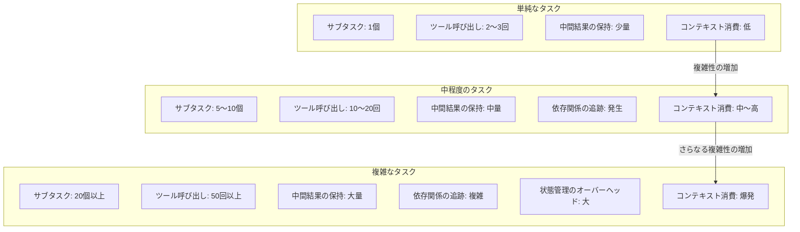
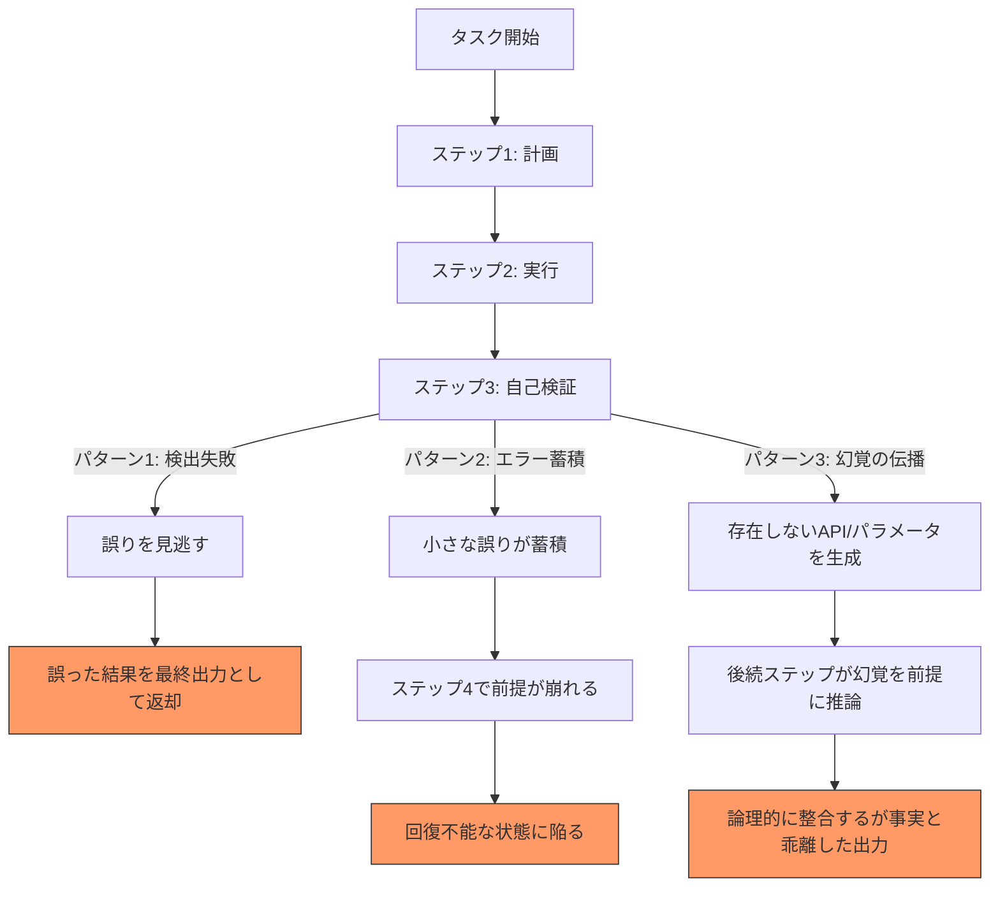

# 第3章 シングルエージェントの限界 ― なぜマルチが必要になるのか

第1章ではエージェントの定義と構成要素を、第2章ではツールとコンテキストの仕組みを整理した。エージェントはLLMを推論エンジンとし、Function CallingやMCPを通じて外部世界と接し、コンテキストウィンドウという有限の「記憶」の中で推論と行動を繰り返す。この仕組みは強力であり、単一のエージェントでも多くのタスクを自律的に遂行できる。

しかし、タスクの規模と複雑性が一定の閾値を超えると、シングルエージェントは構造的な限界に直面する。この限界は、プロンプトの工夫やツールの追加では根本的に解決できない。本章では、シングルエージェントが抱える五つの限界を体系的に分析し、具体例を通じて限界の実態を明らかにする。そして、マルチエージェントという解決策の方向性を示す。

本章は第I部の結論であり、第II部への橋渡しとなる章である。

---

## 3.1 タスクの複雑性とコンテキスト爆発

シングルエージェントの最も根本的な制約は、コンテキストウィンドウの有限性に起因する。第2章で述べたとおり、コンテキストウィンドウにはシステムプロンプト、会話履歴、ツール定義、ツール実行結果といった複数の要素が詰め込まれる。タスクが単純であればこれらの要素は少量で済むが、タスクの複雑性が増すにつれて、コンテキスト消費量は線形ではなく加速度的に増大する。この現象をコンテキスト爆発（Context Explosion）と呼ぶ。

コンテキスト爆発が発生するメカニズムを整理する。タスクが複雑になると、まずサブタスクの数が増える。サブタスク間には依存関係があり、あるサブタスクの結果を別のサブタスクの入力として参照する必要がある。この依存関係の管理そのものがコンテキストを消費する。さらに、各サブタスクの実行にはツール呼び出しが伴い、ツールの定義と実行結果がコンテキストに蓄積される。10回のツール呼び出しを行えば、10組の引数と戻り値がコンテキストに残る。

問題はこれだけではない。タスクが複雑になると、エージェントは「どこまで進んだか」「次に何をすべきか」という実行状態をコンテキスト内で追跡する必要がある。ReActパターンの推論ステップにおいて、この状態追跡のための記述が各ステップで増大する。結果として、コンテキストの消費パターンは図3.1に示すような非線形の関係を描く。

**図3.1: タスクの複雑性とコンテキスト消費の関係図**

2025年時点で、主要なLLMのコンテキストウィンドウは128Kトークンから200Kトークン程度である。一見すると十分な容量に見えるが、実際のエージェント動作では驚くほど速くこの容量が消費される。例えば、20個のツール定義（各500トークン）だけで10,000トークンを消費する。さらに、各ツール呼び出しの結果が平均1,000トークンで、30回呼び出せば30,000トークンに達する。システムプロンプトに5,000トークン、会話履歴の蓄積に20,000トークンを加えると、タスクの半ばで65,000トークン以上を消費していることになる。

第2章で述べたコンテキストエンジニアリングの手法――会話履歴の要約、古い情報の削除、ツール結果の圧縮――はこの問題を緩和する。しかし、圧縮や要約は必ず情報の損失を伴う。途中経過を要約した結果、後続のステップで必要な詳細が失われ、エージェントが誤った判断を下す可能性がある。コンテキストエンジニアリングは対症療法であり、コンテキスト爆発の根本的な解決策にはならない。

コンテキスト爆発は、シングルエージェントの他の四つの限界すべてに影響を及ぼす、最も基盤的な制約である。

---

## 3.2 専門性のジレンマ

一つのエージェントに複数の専門領域を担わせると、どの領域でも中途半端な性能しか発揮できなくなる。この問題を専門性のジレンマ（Specialization Dilemma）と呼ぶ。

エージェントの「専門性」は、主に二つの要素で決まる。一つはシステムプロンプトに記述される役割定義と指示、もう一つは利用可能なツールの構成である。これらがエージェントの振る舞いを規定する。

まず、システムプロンプトの問題を考える。一つのプロンプトに「ネットワーク設計のエキスパート」「Terraformコードの生成者」「セキュリティポリシーの策定者」「Kubernetesクラスタの運用者」という四つの役割を記述した場合、LLMは各役割の優先順位を曖昧に解釈する。ある役割に最適な判断が、別の役割の観点からは不適切になることがある。例えば、ネットワーク設計のセキュリティ最適化とKubernetesの可用性最適化は、トレードオフの関係にある場合がある。一つのプロンプトでこのトレードオフを適切に解決するのは困難である。

次に、ツール数の問題がある。第2章で述べたとおり、ツール数の増加はLLMのツール選択精度を低下させる。2024年にOpenAIが公開した技術レポートでは、利用可能なツールが20を超えるとFunction Callingの精度が顕著に低下することが報告されている。ツール定義はそれぞれ名前、説明文、パラメータスキーマを含み、これらすべてがコンテキストを消費する。ツール数が増えるほど、LLMは「どのツールを使うべきか」の判断に多くのトークンを消費し、誤った選択をする確率が上昇する。

この問題を具体的に考える。インフラ構築エージェントに対して、ネットワーク関連ツール（VCN作成、サブネット作成、セキュリティリスト設定、ルートテーブル設定等）を5個、コンピュート関連ツール（インスタンス作成、ブートボリューム設定等）を5個、Kubernetes関連ツール（クラスタ作成、ノードプール設定、kubectl操作等）を5個、セキュリティ関連ツール（IAMポリシー設定、暗号鍵管理等）を5個、合計20個のツールを与えた場合を想定する。LLMは20個のツール定義を読み解き、タスクの文脈に応じて適切なツールを選択しなければならない。ツールの名前や説明文が似通っている場合（例：`create_subnet` と `create_security_list` はどちらもネットワーク層の操作）、選択の曖昧さが増す。

専門性のジレンマのもう一つの側面は、ドメイン知識の深さに関わる。ネットワーク設計に特化したエージェントであれば、CIDRブロックの設計、サブネット間のルーティング、セキュリティリストとネットワークセキュリティグループの使い分けといった深い知識をシステムプロンプトに記述できる。しかし、汎用エージェントにすべてのドメイン知識を詰め込もうとすると、プロンプトが肥大化し、コンテキスト爆発の問題に回帰する。「何でもできるエージェント」は「何も深くできないエージェント」になるのである。

ソフトウェア工学の観点では、この問題は単一責任の原則（Single Responsibility Principle）の違反に相当する。一つのモジュール（エージェント）が複数の責務を負うと、変更の影響範囲が広がり、品質の維持が困難になる。

---

## 3.3 信頼性の壁

シングルエージェントにおいて、エージェントの出力を検証する独立した仕組みが存在しないことは、深刻な信頼性の問題を引き起こす。この問題を信頼性の壁（Reliability Wall）と呼ぶ。

シングルエージェントでは、タスクの計画、実行、検証のすべてを同一のLLMインスタンスが担う。生成した出力を自分自身で検証する「自己検証」には、構造的なバイアスが存在する。LLMは自分が生成した内容に対して肯定的な評価を下す傾向がある。これは、同一のコンテキスト内で生成と評価を行うため、生成時の推論パスが評価時の判断に影響を与えるためである。人間の認知バイアスにおける確証バイアス（Confirmation Bias）と類似した現象がLLMにも発生する。

シングルエージェントの失敗パターンは、大きく三つに分類できる。図3.2にこれらのパターンを示す。

**図3.2: シングルエージェントの失敗パターン図**

**パターン1：検出失敗**は、エージェントが生成した出力の誤りを自己検証で検出できないケースである。例えば、Terraformコードを生成したエージェントが、そのコードに含まれるリソース間の依存関係の誤りを自身で発見できない場合がある。生成時に「正しい」と判断した根拠がコンテキストに残っているため、検証時にも同じ根拠に基づいて「正しい」と判断してしまう。

**パターン2：エラー蓄積**は、各ステップの小さな誤りが蓄積し、後のステップで回復不能になるケースである。例えば、ネットワーク設計でCIDRブロックの割り当てに微小な誤りがあった場合、その誤りに基づいてサブネットを設計し、さらにそのサブネットに基づいてセキュリティルールを設定する。各ステップでは一つ前のステップの結果を「正しい」前提として扱うため、最終的な出力は初期の誤りが増幅された状態になる。

**パターン3：幻覚の伝播**は、LLMのハルシネーション（Hallucination）が後続の推論に組み込まれるケースである。LLMが存在しないAPIエンドポイントやパラメータ名を生成した場合、後続のステップではそれを事実として扱い、論理的には整合するが現実とは乖離した出力を生成する。自己検証ではこの種の誤りを検出することが極めて困難である。外部の情報源や独立した検証者との照合なしに、幻覚を幻覚として認識することはできない。

これらの失敗パターンに対する部分的な対策として、人間による介入（Human-in-the-Loop）がある。エージェントの出力を人間が確認・承認するフローを組み込む方式である。しかし、この方式はスケールしない。複雑なタスクでは中間ステップが数十に及び、すべてのステップで人間が介入することは現実的ではない。人間の介入は最終的な意思決定や高リスクな操作に限定し、中間ステップの検証は自動化する必要がある。その自動化された検証者こそが、独立した評価者エージェントである。

---

## 3.4 並行処理の不在

シングルエージェントのReActループは、本質的に逐次処理（Sequential Processing）である。「推論 → 行動 → 観察 → 推論 → 行動 → ...」というサイクルは厳密に直列であり、一つのステップが完了するまで次のステップに進めない。この構造は、独立したサブタスクの並行実行を許さない。

具体例で考える。あるインフラ構築タスクにおいて、以下の三つのサブタスクが独立して実行可能だとする。

- サブタスクA：ネットワーク設計書のレビュー
- サブタスクB：セキュリティポリシーの生成
- サブタスクC：コスト見積もりの算出

これらのサブタスクには依存関係がなく、理論上は同時に実行できる。しかし、シングルエージェントのReActループでは、A → B → Cの順に逐次処理するしかない。各サブタスクに5分かかるとすれば、合計15分を要する。並行処理が可能であれば、理論上の所要時間は5分である。

2025年時点のLLM APIは並列Function Calling（Parallel Function Calling）をサポートしている。これは一度の推論で複数のツール呼び出しを同時に発行する機能である。しかし、並列Function Callingが解決するのは「一つの推論ステップ内での複数ツール呼び出し」であり、「複数の推論ステップにまたがるタスクレベルの並行性」は提供しない。サブタスクAが複数のReActステップを必要とする場合、その全ステップはサブタスクBの開始前に完了する必要がある。

逐次処理の問題は実行時間だけではない。LLM APIの利用コストにも影響する。OCI Generative AI Serviceを含む多くのLLMサービスは、入力トークン数と出力トークン数に基づいて課金される。逐次処理では、各ステップで蓄積された会話履歴を入力として送信するため、後半のステップほど入力トークン数が増大する。コンテキストに50,000トークンが蓄積された状態で新たなステップを実行すれば、その50,000トークンすべてが入力コストとして課金される。タスクを分割して独立したコンテキストで実行すれば、各コンテキストの入力トークン数を抑制でき、総コストを削減できる。

さらに、逐次処理はレイテンシの観点でも問題がある。LLM APIの応答時間は入力トークン数に比例して増大する傾向にある。コンテキストが膨らんだ後半のステップでは、各APIコールの応答時間が長くなり、タスク全体の所要時間がさらに延びる。

タスクの規模が大きくなるほど、並行処理の不在によるペナルティは顕著になる。100個の独立したサブタスクがあり、各サブタスクに1分かかる場合、逐次処理では100分、10並列の処理であれば10分で完了する。この差は、実用的なシステムにおいて許容できないレベルに達する。

---

## 3.5 責任分界の曖昧さ

シングルエージェントでは、タスクの計画、実行、検証、報告のすべてが一つのエージェントに集中する。この構造は、ソフトウェアアーキテクチャにおけるモノリシック構造（Monolithic Architecture）に相当する。モノリシック構造の問題点は、ソフトウェア工学の分野で数十年にわたって議論されてきた。エージェントにおいても同様の問題が発生する。

**問題1：障害の原因特定が困難**

シングルエージェントが誤った出力を返した場合、その原因がタスクの分解（計画）にあるのか、ツールの選択（実行）にあるのか、結果の解釈（評価）にあるのかを特定することが困難である。すべての処理が一つのコンテキスト内で混在しているため、ログを追跡しても因果関係の特定が難しい。

例えば、インフラ構築エージェントがセキュリティグループの設定を誤った場合、以下のいずれかが原因である可能性がある。

- 計画段階で必要なセキュリティ要件を見落とした
- 実行段階で誤ったツール（あるいは誤ったパラメータ）を選択した
- 検証段階でセキュリティ上の問題を検出できなかった

一つのコンテキスト内で数十ステップの推論と行動が混在する中から、どのステップで問題が発生したかを追跡するのは、大量のログを人手で精査する作業に他ならない。

**問題2：変更の影響範囲が不明確**

シングルエージェントのシステムプロンプトやツール構成を変更した場合、その変更がエージェントの振る舞いのどの側面に影響するかを予測することが困難である。ネットワーク設計に関するプロンプトの修正が、セキュリティ設定やKubernetes構成に意図しない影響を及ぼす可能性がある。これは、モノリシックアプリケーションにおける「一箇所の修正が全体に波及する」問題と同じ構造である。

**問題3：テストの困難さ**

シングルエージェントのテストは、入力と出力のペアで検証するブラックボックステストに限られる。エージェントの内部的な判断プロセスを個別にテストすることが困難である。「ネットワーク設計は正しいが、セキュリティ設定に問題がある」というフィードバックに基づいて改善する際、ネットワーク設計の品質を維持しつつセキュリティ設定のみを改善する保証がない。

責任が明確に分離されていれば、各責任領域を独立してテスト・改善できる。ネットワーク設計エージェント、セキュリティ設定エージェント、検証エージェントがそれぞれ独立していれば、セキュリティ設定エージェントのプロンプトを修正しても、ネットワーク設計エージェントの振る舞いには影響しない。

ソフトウェア設計における関心の分離（Separation of Concerns）、単一責任の原則、そして疎結合（Loose Coupling）の考え方は、エージェント設計にも適用される。シングルエージェントは、これらの原則に反する構造を持つ。

---

## 3.6 具体例：OKEクラスタ構築を1エージェントでやろうとすると

ここまで分析した五つの限界を、具体的なタスクを通じて実感する。題材は、OCI上でのOKE（Oracle Container Engine for Kubernetes）クラスタの自動構築である。OKEクラスタの構築は、複数の専門領域にまたがる複雑なタスクであり、シングルエージェントの限界が顕著に現れる。なお、このタスクは第12章のケーススタディで、マルチエージェントによる解決策を詳しく扱う。

### OKEクラスタ構築に必要なサブタスク

OKEクラスタを本番環境レベルで構築するには、以下のサブタスクが必要になる。

**ネットワーク設計と構築**
- VCN（Virtual Cloud Network）の設計とCIDRブロックの決定
- パブリックサブネットとプライベートサブネットの設計
- セキュリティリストおよびネットワークセキュリティグループの設定
- インターネットゲートウェイ、NATゲートウェイ、サービスゲートウェイの配置
- ルートテーブルの設定

**Kubernetesクラスタの構成**
- コントロールプレーンのエンドポイント設定（パブリック/プライベート）
- Kubernetesバージョンの選定
- ノードプールの設計（シェイプ、イメージ、ノード数）
- Podネットワーキング方式の選定（VCNネイティブPodネットワーキング/Flannel）

**セキュリティ設定**
- IAMポリシーの設計（クラスタ管理者、ノードプール、ワーカーノード）
- OCI Vault（鍵管理サービス）による暗号化設定
- Kubernetesの RBAC（Role-Based Access Control）設定
- コンテナレジストリ（OCIR）へのアクセス設定

**IaCコード生成**
- Terraform HCLコードの生成（上記すべてのリソース定義）
- 変数定義と出力定義の設計
- モジュール分割の設計
- OCI Resource Managerスタックの設定

**検証**
- Terraform planの実行と結果の確認
- セキュリティベストプラクティスへの準拠チェック
- ネットワーク構成の整合性検証
- コスト試算

### シングルエージェントで構築する場合の問題

このタスクを一つのエージェントに任せた場合、五つの限界がすべて顕在化する。

**コンテキスト爆発**：上記のサブタスクをすべて一つのコンテキスト内で処理すると、ネットワーク設計の結果、Kubernetesの構成パラメータ、IAMポリシーの記述、Terraform HCLコード、検証結果のすべてがコンテキストに蓄積される。Terraformコードだけでも数千トークンに達し、これにネットワーク設計の詳細とセキュリティポリシーの全文を加えると、タスクの中盤でコンテキストウィンドウの大部分を消費する。

**専門性のジレンマ**：このタスクは、OCIネットワーキング、Kubernetes、セキュリティ（IAM/RBAC）、Terraform/HCL、コスト最適化という五つの専門領域にまたがる。各領域に必要なツールを合計すると20を優に超える。LLMのツール選択精度は低下し、例えばセキュリティリストの設定時にネットワークセキュリティグループの設定ツールを誤って選択するといったミスが発生しやすくなる。

**信頼性の壁**：エージェントが生成したTerraformコードを自身で検証しても、生成時の推論バイアスが検証の判断に影響する。特に、セキュリティポリシーの不備やネットワーク構成の矛盾は、ドメイン知識に基づく独立した視点がなければ検出が困難である。CIDRブロックの重複やIAMポリシーの過剰な権限付与は、自己検証で見逃されやすい典型的な誤りである。

**並行処理の不在**：ネットワーク設計とIAMポリシー設計は、大部分が独立して進められるタスクである。セキュリティのベストプラクティス調査とKubernetesバージョンの互換性調査も並行実行が可能である。しかし、シングルエージェントのReActループではこれらを逐次処理するしかなく、タスク全体の所要時間が長くなる。

**責任分界の曖昧さ**：生成されたTerraformコードに問題があった場合、それがネットワーク設計の誤りか、Terraform HCLの構文エラーか、セキュリティポリシーの設計ミスかを特定するのが困難である。すべてのログが一つのコンテキストに混在しているため、デバッグには膨大な時間を要する。

このように、OKEクラスタ構築のような実践的なインフラタスクは、シングルエージェントの五つの限界すべてが同時に顕在化する典型的なケースである。第12章では、このタスクをマルチエージェントでどのように分割・協調させるかを詳しく扱う。

---

## 3.7 マルチエージェントが約束するもの

五つの限界を分析した。ここでは、これらの限界に対してマルチエージェント（Multi-Agent）がどのような解決策を提供するかを概観する。各解決策の詳細は第II部で体系的に扱うが、マルチエージェントへの動機を明確にするために、解決の方向性を示す。

表3.1に、五つの限界とマルチエージェントによる解決策の対応関係を整理する。

| シングルエージェントの限界 | マルチエージェントの解決策 | 主な協調パターン |
|---|---|---|
| コンテキスト爆発 | コンテキストの分割：各エージェントが専門のコンテキストを持ち、必要な情報のみを保持 | 全パターン共通 |
| 専門性のジレンマ | 役割の分離：各エージェントが一つの専門領域に特化し、少数のツールを持つ | 全パターン共通 |
| 信頼性の壁 | 独立した検証：生成エージェントとは別の評価エージェントが出力を検証 | 評価者ループ |
| 並行処理の不在 | タスクの並列実行：独立したサブタスクを複数エージェントで同時処理 | 並列ファンアウト/ファンイン |
| 責任分界の曖昧さ | 責任の明確化：各エージェントの責務が明確に定義され、独立してテスト・改善可能 | 全パターン共通 |

**表3.1: シングルエージェントの限界とマルチエージェントの解決策**

**コンテキスト爆発への解決策：コンテキストの分割**

マルチエージェントでは、各エージェントが独自のコンテキストウィンドウを持つ。ネットワーク設計エージェントのコンテキストにはネットワーク関連の情報のみが含まれ、セキュリティ設定の詳細やTerraformコードの全文は含まれない。各エージェントのコンテキストは、自身の責務に必要な最小限の情報で構成される。これにより、個々のエージェントのコンテキスト消費量は大幅に抑制される。

**専門性のジレンマへの解決策：役割の分離**

各エージェントが一つの専門領域に特化することで、システムプロンプトは明確な役割定義と深いドメイン知識を含められる。ツール数も領域ごとに限定され、LLMのツール選択精度が維持される。ネットワーク設計エージェントはネットワーク関連の5個のツールのみを持ち、セキュリティエージェントはセキュリティ関連の5個のツールのみを持つ。

**信頼性の壁への解決策：独立した検証**

生成と検証を異なるエージェントに分離することで、自己検証のバイアスを排除できる。Terraformコードを生成するエージェントと、そのコードを検証するエージェントは、異なるコンテキスト、異なるプロンプト、場合によっては異なるLLMモデルで動作する。生成者のバイアスが検証者に伝播しないため、構造的に独立した品質チェックが実現する。

**並行処理の不在への解決策：タスクの並列実行**

独立したサブタスクを複数のエージェントに同時に割り当てることで、並行処理が実現する。ネットワーク設計エージェントとIAMポリシー設計エージェントが同時に動作し、両者の結果を統合エージェントがまとめる。これにより、タスク全体の所要時間を大幅に短縮できる。

**責任分界の曖昧さへの解決策：責任の明確化**

各エージェントの入力・出力・責務が明確に定義されるため、問題発生時の原因特定が容易になる。ネットワーク設計エージェントの出力に問題があれば、そのエージェントのプロンプトとツール構成を調査すればよい。他のエージェントへの影響は、インターフェースの変更がない限り発生しない。

### マルチエージェントの代償

マルチエージェントは万能ではない。解決策を得る代わりに、新たな複雑性を導入する。エージェント間の通信設計、状態の共有と同期、エラーハンドリングの連鎖、テストの複雑化といった課題が生じる。これらの課題については、第II部で協調パターン（第4章）、通信プロトコル（第5章）、状態管理（第6章）、設計原則（第7章）として体系的に扱う。

重要なのは、マルチエージェントを「常に正解」とみなさないことである。タスクが十分に単純でシングルエージェントで処理可能であれば、シングルエージェントを選択すべきである。マルチエージェントは、本章で分析した五つの限界が実際にタスクの品質や効率を阻害する場合に、初めて検討する選択肢である。

---

## まとめ

本章では、シングルエージェントが構造的に抱える五つの限界を分析した。

1. **コンテキスト爆発**：タスクの複雑性に対してコンテキストウィンドウの消費が加速度的に増大する
2. **専門性のジレンマ**：複数の専門領域を一つのエージェントに担わせると、各領域の性能が低下する
3. **信頼性の壁**：自己検証にはバイアスがあり、エラーの蓄積と幻覚の伝播を防げない
4. **並行処理の不在**：ReActループの逐次処理が、独立したサブタスクの同時実行を阻む
5. **責任分界の曖昧さ**：モノリシックな構造が、障害の原因特定と改善を困難にする

OKEクラスタ構築の具体例を通じて、これらの限界が実際のインフラ構築タスクでどのように顕在化するかを確認した。そして、マルチエージェントが各限界に対して提供する解決策の方向性を概観した。

シングルエージェントの限界は、LLMの性能向上やコンテキストウィンドウの拡大によって緩和されることはあっても、構造的に解消されることはない。タスクの複雑性が一定以上であれば、複数のエージェントに役割を分離し、協調させるアーキテクチャが必要になる。

第I部では、エージェントの定義（第1章）、ツールとコンテキストの仕組み（第2章）、そしてシングルエージェントの限界（本章）を通じて、エージェントの基礎を構築した。第II部では、これらの限界を克服するマルチエージェントの協調パターンを体系的に学ぶ。第4章では、直列パイプライン、並列ファンアウト/ファンイン、オーケストレーター型、スーパーバイザー型、コレオグラフィ型、評価者ループの六つの協調パターンを解説する。

---

## 理解度チェック

**Q1.** コンテキスト爆発が発生するメカニズムを、コンテキストウィンドウの消費要素（最低三つ）を挙げて説明せよ。

**Q2.** ツール数の増加がエージェントの性能に与える影響を、ツール選択精度とコンテキスト消費の二つの観点から述べよ。

**Q3.** シングルエージェントにおける「自己検証の限界」とは何か。三つの失敗パターンのうち一つを選び、具体例を交えて説明せよ。

**Q4.** OKEクラスタ構築のようなタスクにおいて、シングルエージェントが直面する限界を三つ挙げ、それぞれどのように顕在化するか述べよ。

**Q5.** マルチエージェントが「コンテキスト爆発」と「信頼性の壁」をそれぞれどのように解決するか説明せよ。
