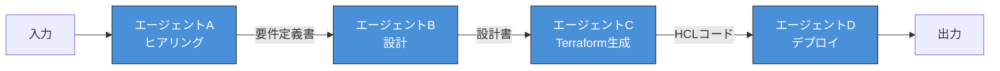
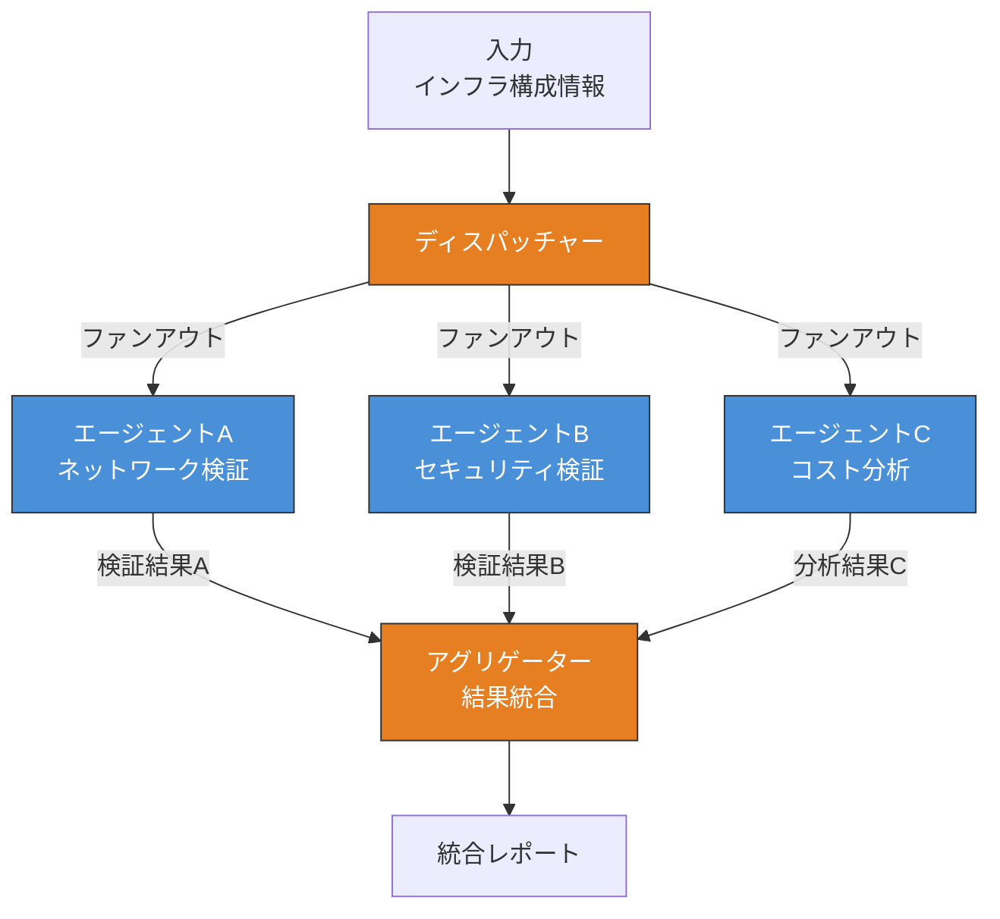
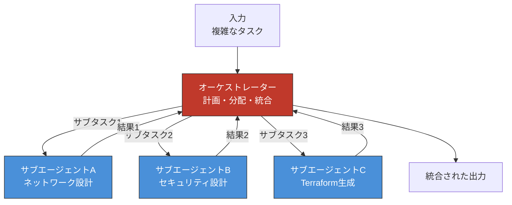
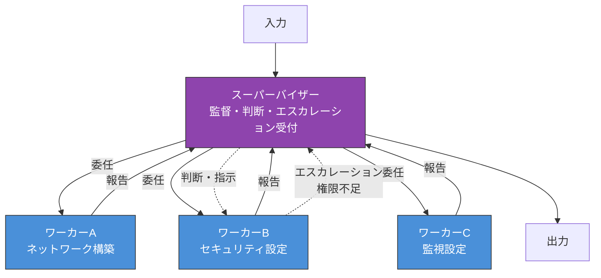
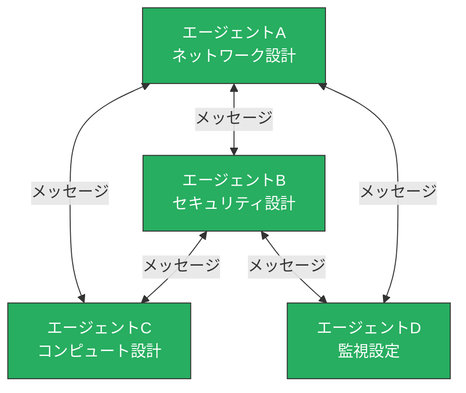
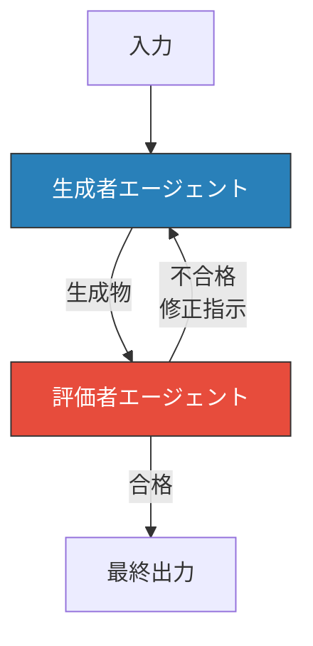
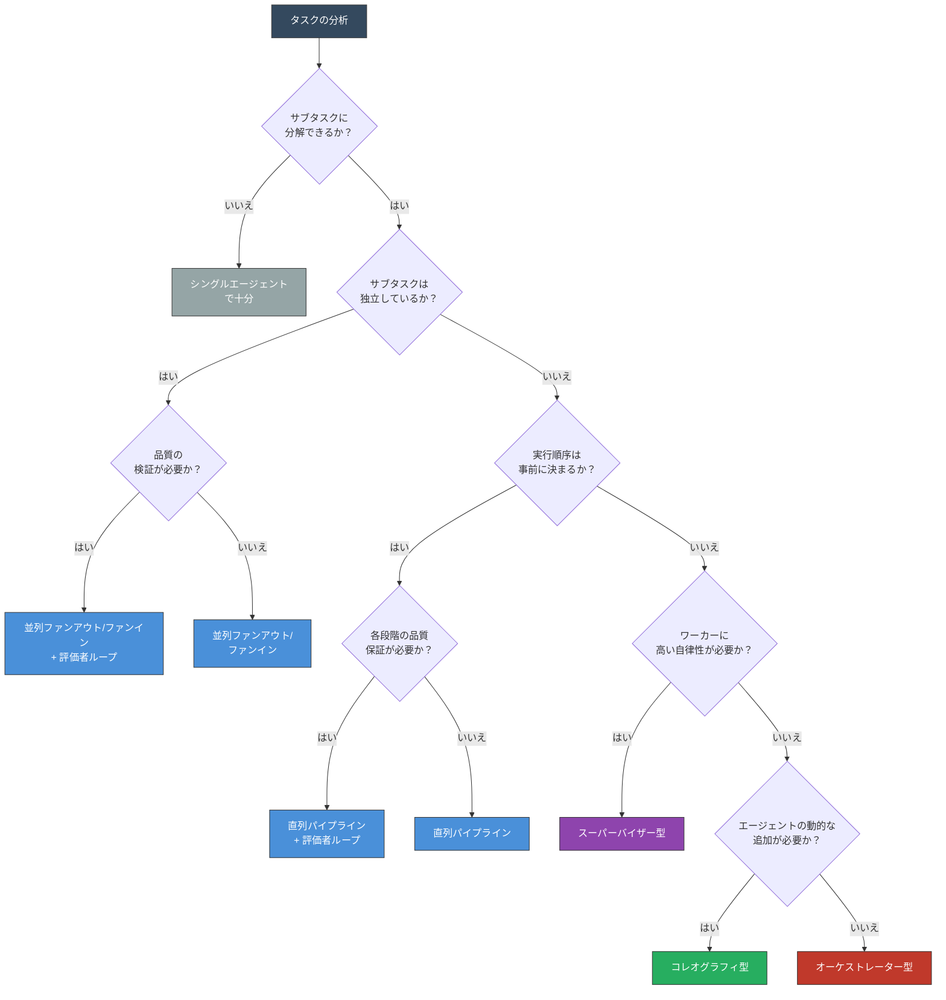

# 第4章 マルチエージェントの協調パターン

第3章では、シングルエージェントが構造的に抱える五つの限界――コンテキスト爆発、専門性のジレンマ、信頼性の壁、並行処理の不在、責任分界の曖昧さ――を分析した。これらの限界は、プロンプトの改善やツールの追加では解消できない構造的な問題である。マルチエージェントは、複数のエージェントに役割を分離し、協調させることでこれらの限界を克服する。

しかし、「複数のエージェントを協調させる」と一口に言っても、その方法は一様ではない。エージェント同士をどのように接続し、誰がタスクの流れを制御し、結果をどう統合するかによって、システムの特性は大きく異なる。本章では、マルチエージェントシステムにおける六つの主要な協調パターン（Coordination Pattern）を体系的に解説する。

本章は第II部「マルチエージェントの理論」の冒頭であり、本書の理論的な核心となる章である。六つの協調パターンを理解することで、ユースケースに応じたアーキテクチャの選定が可能になる。

---

## 4.1 パターン分類の軸

六つの協調パターンを個別に解説する前に、パターンを分類する三つの軸を定義する。各パターンがこれらの軸のどこに位置するかを把握することで、パターン間の違いと関係性を構造的に理解できる。

### 制御方式：集中型と分散型

第一の軸は、タスクの流れを誰が制御するかである。

集中型（Centralized）では、特定のエージェントがタスク全体の流れを管理する。このエージェントがサブタスクの分配、進捗の監視、結果の統合を担う。オーケストレーター型やスーパーバイザー型がこの類型に属する。集中型の利点は、タスク全体の進行状況を一箇所で把握できることである。一方で、中央のエージェントがボトルネックになる可能性がある。

分散型（Decentralized）では、特定の制御者を持たず、各エージェントが自律的に判断して協調する。コレオグラフィ型がこの類型の典型である。分散型の利点はスケーラビリティに優れることであるが、全体の振る舞いを予測・追跡するのが困難になる。

直列パイプラインや並列ファンアウト/ファンインは、制御方式としては集中と分散の中間に位置する。タスクの流れは事前に定義されており、動的な制御判断は発生しない。これらは「事前定義型」とも呼ばれる。

### データフロー：直列、並列、動的

第二の軸は、エージェント間のデータの流れ方である。

直列（Sequential）では、データが一方向に流れる。前のエージェントの出力が次のエージェントの入力となり、パイプラインを形成する。並列（Parallel）では、同一のデータが複数のエージェントに同時に分配され、各エージェントの結果が集約される。動的（Dynamic）では、実行時の状況に応じてデータの流れが変化する。どのエージェントにどのデータを渡すかが、事前に固定されていない。

### エージェント関係：対等と階層

第三の軸は、エージェント同士の関係性である。

対等（Peer）な関係では、すべてのエージェントが同等の立場で協調する。特定のエージェントが他のエージェントに対する命令権を持たない。コレオグラフィ型や、並列ファンアウト/ファンインにおけるワーカーエージェント群がこの関係に該当する。

階層（Hierarchical）的な関係では、上位のエージェントが下位のエージェントにタスクを指示し、結果の報告を受ける。スーパーバイザー型が典型であり、多段の階層構造を形成することもある。

これら三つの軸は独立しているわけではなく、互いに関連する。例えば、集中型の制御方式は階層的なエージェント関係と結びつきやすく、分散型は対等な関係と結びつきやすい。しかし、必ずしも一対一の対応ではない。オーケストレーター型は集中制御で動的データフローだが、サブエージェントを対等に扱う場合もある。

以降の節では、六つの協調パターンをそれぞれ解説し、4.9節でこれら三つの軸に基づく比較と選定ガイドを提示する。

---

## 4.2 直列パイプライン

直列パイプライン（Sequential Pipeline）は、マルチエージェントの協調パターンの中で最もシンプルな構造である。複数のエージェントが直列に接続され、前のエージェントの出力が次のエージェントの入力となる。データは一方向に流れ、各エージェントが段階的に処理を進める。

### アーキテクチャ

図4.1に直列パイプラインのアーキテクチャを示す。

**図4.1: 直列パイプラインのアーキテクチャ**

この構造は、Unix/Linuxのパイプ（`|`）と同じ思想に基づく。各コマンドが標準入力を受け取り、処理結果を標準出力に渡すのと同様に、各エージェントが前段の出力を受け取り、自身の処理結果を次段に渡す。

### 構造と特性

直列パイプラインの特性を整理する。

**データフローの単純性**。データは常に一方向に流れる。エージェントAの出力がエージェントBの入力になるという関係が固定されており、実行時に変更されることはない。この予測可能性が、パイプラインの最大の利点である。タスク全体の進行状況は「今どのエージェントが処理中か」を見れば把握できる。

**コンテキストの分離**。各エージェントは自身の処理に必要な情報のみをコンテキストに保持する。ヒアリングエージェントのコンテキストにはTerraformの知識が含まれず、デプロイエージェントのコンテキストには要件定義の議論が含まれない。第3章で述べたコンテキスト爆発の問題が、パイプラインの構造によって自然に緩和される。

**段階的な変換**。各エージェントは入力を受け取り、特定の変換を行い、出力を生成する。この「入力 → 変換 → 出力」の構造は、各エージェントの責務を明確にし、第3章で述べた責任分界の曖昧さを解消する。ヒアリングエージェントの責務は要件の抽出であり、設計エージェントの責務はアーキテクチャの設計である。責務の境界が明瞭であるため、問題発生時の原因特定が容易になる。

### OCI上での適用例

OCI上でのインフラ構築パイプラインを例に考える。

第一段階のヒアリングエージェントは、ユーザーの要求を自然言語で受け取り、構造化された要件定義書を生成する。「高可用性のWebアプリケーション基盤が欲しい」という曖昧な要求から、リージョン、可用性ドメイン、コンピュートシェイプ、ストレージ要件、ネットワーク要件といった具体的なパラメータを抽出する。

第二段階の設計エージェントは、要件定義書を入力として受け取り、OCIアーキテクチャの設計書を生成する。VCN（Virtual Cloud Network）設計、サブネット構成、セキュリティルール、負荷分散の方式を決定する。このエージェントは、OCI固有のベストプラクティスをシステムプロンプトに含んでおり、専門的な設計判断を行う。

第三段階のTerraform生成エージェントは、設計書を入力としてTerraform HCL（HashiCorp Configuration Language）コードを生成する。設計書に記述されたリソース定義を、OCIプロバイダの構文に変換する。

第四段階のデプロイエージェントは、生成されたHCLコードをOCI Resource Managerに投入し、`terraform plan` の結果を確認し、承認後に `terraform apply` を実行する。

### トレードオフ

直列パイプラインの限界も認識する必要がある。

**柔軟性の欠如**。パイプラインの順序は固定されている。設計の途中でヒアリングに戻りたい場合や、デプロイの結果に基づいて設計を変更したい場合、パイプラインの構造ではこのフィードバックループを表現できない。実際のタスクでは、後段の結果に基づいて前段を修正する反復が必要になることが多い。

**エラー伝播のリスク**。前段のエージェントが誤った出力を生成した場合、その誤りが後続のすべてのエージェントに伝播する。ヒアリングエージェントが要件を誤解した場合、設計、コード生成、デプロイのすべてが誤った前提に基づいて進行する。パイプライン内に検証の仕組みがないため、誤りの検出は最終出力を確認するまで遅延する。

**レイテンシの累積**。各エージェントの処理時間が累積するため、パイプラインが長くなるほどタスク全体の所要時間が長くなる。4段階のパイプラインで各段階に3分かかれば、合計12分を要する。

直列パイプラインは、タスクが明確な段階に分割でき、各段階の入出力が定義でき、フィードバックループが不要な場合に適する。逆に、動的な判断や反復的な改善が必要なタスクには不向きである。

---

## 4.3 並列ファンアウト/ファンイン

並列ファンアウト/ファンイン（Parallel Fan-out/Fan-in）は、タスクを複数のエージェントに同時に分配（ファンアウト）し、各エージェントの結果を集約（ファンイン）するパターンである。第3章で指摘した「並行処理の不在」を直接解決する協調パターンである。

### アーキテクチャ

図4.2に並列ファンアウト/ファンインのアーキテクチャを示す。

**図4.2: 並列ファンアウト/ファンインのアーキテクチャ**

このパターンは、二つのフェーズで構成される。ファンアウトフェーズではタスクが分配され、ファンインフェーズでは結果が集約される。

### ファンアウト：タスクの分配

ファンアウトの設計には、二つの前提条件がある。

第一の条件は、サブタスク間の独立性である。各ワーカーエージェントに割り当てるサブタスクは、互いに依存関係を持たないことが求められる。サブタスクAの結果がサブタスクBの入力として必要な場合、それらは並列に実行できない。独立性の判定が曖昧な場合は、依存関係のあるサブタスク同士を一つのワーカーにまとめるか、直列パイプラインと組み合わせる。

第二の条件は、入力データの分割可能性である。同一の入力を全ワーカーに渡す場合（同一データに対する複数観点からの分析）と、入力を分割して各ワーカーに渡す場合（データパーティショニング）がある。前者は「観点の並列化」、後者は「データの並列化」と呼ばれる。

OCI上での具体例を考える。複数リージョンのヘルスチェックは「データの並列化」の典型である。東京リージョン、大阪リージョン、アッシュバーンリージョンのそれぞれに対して、独立したエージェントが同時にヘルスチェックを実行する。各エージェントの入力は異なるリージョンの情報であり、処理は完全に独立している。

一方、インフラ構成のレビューは「観点の並列化」の典型である。同一のTerraformコードに対して、ネットワーク検証エージェント、セキュリティ検証エージェント、コスト分析エージェントが同時に異なる観点からレビューを行う。入力データは共通だが、評価の観点が異なる。

### ファンイン：結果の統合

ファンインの設計は、ファンアウト以上に慎重さを要する。ワーカーエージェントの結果をどのように統合するかが、システム全体の品質を左右するためである。ファンインの戦略は大きく三つに分類される。

**マージ（Merge）**。すべてのワーカーの結果を連結して一つの出力にまとめる。ヘルスチェックの例では、各リージョンの結果を統合レポートとして一つの文書にまとめる。最も単純な戦略だが、結果間の矛盾や重複を処理する仕組みが別途必要になる場合がある。

**投票（Voting）**。複数のワーカーが同一の判断を行い、多数決で最終結果を決定する。例えば、三つのエージェントがそれぞれ独立にコードレビューを行い、二つ以上が「問題あり」と判断した場合に「問題あり」とする。信頼性の向上に有効だが、ワーカー数の増加によるコスト増が伴う。

**選択（Selection）**。複数のワーカーの結果から最適なものを一つ選択する。例えば、三つのエージェントがそれぞれ異なるアプローチでTerraformコードを生成し、評価基準に基づいて最良のものを採用する。「ベスト・オブ・N」とも呼ばれるこの戦略は、創造的なタスクで特に有効である。

ファンインを行うアグリゲーターは、単純な連結処理で済む場合もあれば、LLMを用いた高度な統合処理が必要な場合もある。ヘルスチェック結果のマージは構造化データの連結で済むが、複数の観点からのレビュー結果を一つの改善提案にまとめるには、LLMによる要約と整理が必要になる。

### トレードオフ

並列ファンアウト/ファンインのトレードオフを整理する。

実行時間はワーカー数に依存せず、最も遅いワーカーの処理時間に収束する。10個のワーカーのうち9個が1分で完了しても、1個が10分かかれば全体の所要時間は10分になる。このため、ワーカー間の処理時間のばらつきを考慮した設計が重要になる。タイムアウトの設定や、一定時間内に完了したワーカーの結果のみで統合を進める「部分結果の許容」も設計上の選択肢である。

LLM APIの呼び出しコストは、ワーカー数に比例して増大する。3個のワーカーで並列処理すれば、逐次処理の3倍のAPI呼び出しコストが発生する。ただし、各ワーカーのコンテキストは小さいため、入力トークン数の観点では逐次処理よりも効率的な場合がある。

サブタスク間の独立性が前提であるため、依存関係のあるタスクには適用できない。サブタスク間に部分的な依存がある場合は、依存部分を事前に処理した上でファンアウトを行うか、他のパターンとの組み合わせが必要になる。

---

## 4.4 オーケストレーター型

オーケストレーター型（Orchestrator）は、中央のオーケストレーターエージェントがタスクを動的に分解・分配し、サブエージェントの結果を統合するパターンである。直列パイプラインや並列ファンアウト/ファンインとは異なり、タスクの実行計画が事前に固定されておらず、実行時の状況に応じて動的に変化する。六つの協調パターンの中で最も柔軟であり、複雑なタスクに対する適応力が高い。

### アーキテクチャ

図4.3にオーケストレーター型のアーキテクチャを示す。

**図4.3: オーケストレーター型のアーキテクチャ**

オーケストレーターは中央に位置し、サブエージェントとの間で双方向の通信を行う。サブエージェントにタスクを指示し、結果を受け取り、その結果に基づいて次のタスクを決定する。この双方向性が、直列パイプラインとの本質的な違いである。

### オーケストレーターの三つの役割

オーケストレーターは、三つの役割を担う。

**計画（Planning）**。入力されたタスクを分析し、どのサブタスクに分解するか、どの順序で実行するかを計画する。この計画は静的なものではなく、サブタスクの結果に応じて修正される。「OKEクラスタを構築する」というタスクを受けた場合、オーケストレーターはまず要件の確認が必要か、既存のネットワーク構成があるか、セキュリティ要件は何かといった判断を行い、最初のサブタスクを決定する。

**分配（Dispatch）**。計画に基づいて、適切なサブエージェントにサブタスクを割り当てる。オーケストレーターは、各サブエージェントの能力（どのツールを持ち、どの領域に特化しているか）を把握しており、サブタスクの性質に応じて最適なサブエージェントを選択する。

**統合（Synthesis）**。サブエージェントから返された結果を統合し、タスク全体の進捗を評価する。結果が不十分であれば、追加のサブタスクを発行する。すべてのサブタスクが完了し、結果が統合できた時点で最終出力を生成する。

### 動的な実行計画

オーケストレーター型の核心的な特徴は、実行計画の動的性である。

直列パイプラインでは「A → B → C → D」という実行順序が事前に固定されている。並列ファンアウト/ファンインでも、「ファンアウト → 並列実行 → ファンイン」という構造が固定されている。これに対してオーケストレーター型では、サブタスク1の結果によってサブタスク2の内容が変わり、場合によってはサブタスク2自体が不要になることもある。

OCI上のインフラ構築を例に考える。オーケストレーターがネットワーク設計エージェントに「VCN設計」を依頼し、その結果として「既存のVCNが利用可能」という情報が返された場合、VCN作成のサブタスクはスキップされ、次のサブタスクは「既存VCNへのサブネット追加」に変更される。このような動的な判断は、事前定義型のパターンでは実現できない。

Claude Codeのサブエージェント機能は、オーケストレーター型の典型的な実装例である。メインのClaudeがオーケストレーターとして動作し、特定のタスク（ファイルの検索、コードの分析等）をサブエージェントに委任する。サブエージェントの結果に基づいて、メインのClaudeが次のアクションを動的に決定する。

### トレードオフ

オーケストレーター型は柔軟だが、その柔軟性にはコストが伴う。

**オーケストレーターのコンテキスト管理**。オーケストレーターは、タスクの全体計画、各サブエージェントの能力情報、過去のサブタスクの結果概要をコンテキストに保持する必要がある。サブタスクの数が増えるにつれて、オーケストレーター自身がコンテキスト爆発に陥る可能性がある。これは「メタレベルのコンテキスト爆発」とも呼ばれ、シングルエージェントの限界をマルチエージェントの上位層で再現してしまう構造的な問題である。対策として、サブタスクの結果を要約してからオーケストレーターに返す、完了済みのサブタスク情報をコンテキストから削除する、といった手法がある。

**予測困難性**。実行計画が動的に変化するため、タスクの完了時間や実行コストを事前に見積もることが困難である。同じ入力に対しても、LLMの推論結果によって異なる実行パスを辿る可能性がある。運用上は、最大サブタスク数やタイムアウトの上限を設定して予測可能性を確保する。

**デバッグの複雑性**。オーケストレーターの判断ログ、各サブエージェントの実行ログ、オーケストレーターとサブエージェント間の通信ログを追跡する必要がある。直列パイプラインでは「どの段階で問題が発生したか」が明確だが、オーケストレーター型では「なぜオーケストレーターがその判断をしたか」まで遡る必要がある。

---

## 4.5 スーパーバイザー型

スーパーバイザー型（Supervisor / Hierarchical）は、階層的な監督構造を持つ協調パターンである。オーケストレーター型と類似した構造を持つが、「監督と委任」という関係性を重視し、エスカレーション（Escalation）の仕組みを備える点で区別される。

### アーキテクチャ

図4.4にスーパーバイザー型のアーキテクチャを示す。

**図4.4: スーパーバイザー型のアーキテクチャ**

スーパーバイザーは上位に位置し、ワーカーエージェントに対してタスクを委任する。ワーカーはタスクを自律的に遂行し、結果をスーパーバイザーに報告する。ワーカーが自身の権限や能力では解決できない問題に遭遇した場合、スーパーバイザーにエスカレーションする。

### オーケストレーターとの違い

オーケストレーター型とスーパーバイザー型は外見上の構造が似ているため、混同されやすい。両者の本質的な違いを整理する。

**制御の粒度**。オーケストレーターはサブタスクの一つひとつを細かく指示し、結果を受け取って次のサブタスクを決定する。タスクの実行主体はオーケストレーター自身であり、サブエージェントはオーケストレーターの手足として機能する。一方、スーパーバイザーはワーカーに対して高レベルの目標を委任し、ワーカーが自律的にタスクを遂行する。スーパーバイザーは結果の報告を受け、品質を判断し、必要に応じて再指示を行う。タスクの実行主体はワーカーであり、スーパーバイザーは監督者として機能する。

**エスカレーション機構**。スーパーバイザー型の最も特徴的な機構がエスカレーションである。ワーカーが処理中に自身の判断では解決できない状況に遭遇した場合、その問題をスーパーバイザーに上げる。例えば、セキュリティ設定ワーカーがIAMポリシーの設計中に要件の矛盾を検出した場合を考える。「全ユーザーにアクセスを許可しつつ、最小権限の原則を遵守する」等の矛盾に対して、自力で判断するのではなくスーパーバイザーにエスカレーションする。スーパーバイザーは問題の内容を分析し、判断を下してワーカーに指示を返す。オーケストレーター型にはこのエスカレーション機構が明示的に組み込まれていない。

**フォールバック（Fallback）機構**。エスカレーションと並んで重要なのがフォールバックである。ワーカーが障害やタイムアウトにより機能不全に陥った場合、スーパーバイザーが代替のワーカーにタスクを再割り当てする仕組みである。例えば、ネットワーク構築ワーカーがAPI呼び出しの連続失敗で処理を完了できない場合、スーパーバイザーは別のワーカー（異なるパラメータや手法を持つ）に同じタスクを委任する。フォールバックにより、個々のワーカーの障害がシステム全体の障害に直結しない耐障害性を実現する。

**ワーカーの自律性**。オーケストレーター型のサブエージェントは、与えられたサブタスクを実行して結果を返すという比較的単純な役割を担う。スーパーバイザー型のワーカーは、委任されたタスクの中で独自に計画を立て、ツールを選択し、複数のステップを経て結果を生成する高い自律性を持つ。ワーカー自身が内部的にReActループを回し、複雑な処理を自律的に遂行する。

### 階層構造の深さ

スーパーバイザー型は、多段の階層を形成できる。上位のスーパーバイザーが中間レベルのスーパーバイザーに委任し、中間レベルのスーパーバイザーがさらにワーカーに委任するという構造である。

OCI上の大規模なインフラ構築を考えた場合、最上位のスーパーバイザーが「ネットワーク」「コンピュート」「セキュリティ」の各領域を中間スーパーバイザーに委任し、ネットワーク領域の中間スーパーバイザーが「VCN設計」「サブネット作成」「ゲートウェイ設定」を個別のワーカーに委任する構造が考えられる。

ただし、階層が深くなるほどコミュニケーションのオーバーヘッドが増大する。エスカレーションが複数の階層を遡上する場合、各階層での判断に時間を要し、レイテンシが増加する。一般的には、2段階（スーパーバイザー → ワーカー）から3段階（上位スーパーバイザー → 中間スーパーバイザー → ワーカー）が実用的な上限である。

### トレードオフ

スーパーバイザー型は組織的なワークフローのモデリングに適しているが、以下のトレードオフがある。

**スーパーバイザーの判断能力依存**。システムの品質はスーパーバイザーの判断能力に強く依存する。ワーカーからのエスカレーションに対して適切な判断を下すには、スーパーバイザーが各専門領域の知識をある程度持っている必要がある。スーパーバイザーのプロンプト設計と能力定義が、システム全体の品質を決定する。

**コミュニケーションオーバーヘッド**。委任と報告のやり取りが発生するため、直列パイプラインに比べてメッセージ数が増加する。各メッセージにLLMの推論が伴うため、API呼び出しコストとレイテンシが増大する。

**エスカレーション設計の難しさ**。ワーカーが「いつエスカレーションすべきか」の判断基準を定義することは容易ではない。基準が厳しすぎればワーカーが不適切な判断を独自に下すリスクがあり、基準が緩すぎればスーパーバイザーへのエスカレーションが頻発して処理効率が低下する。

---

## 4.6 コレオグラフィ型

コレオグラフィ型（Choreography / Peer-to-Peer）は、中央の制御者を持たず、エージェント同士が自律的に通信・協調するパターンである。各エージェントは独立した判断で他のエージェントと通信し、タスクを遂行する。これまでの四つのパターン（直列パイプライン、並列ファンアウト/ファンイン、オーケストレーター型、スーパーバイザー型）がいずれも何らかの中央的な制御構造を持つのに対し、コレオグラフィ型は純粋な分散型のアーキテクチャを採用する。

### アーキテクチャ

図4.5にコレオグラフィ型のアーキテクチャを示す。

**図4.5: コレオグラフィ型のアーキテクチャ**

図4.5に示すように、コレオグラフィ型ではエージェント間にピアツーピア（Peer-to-Peer）の通信経路が形成される。特定のエージェントが他のエージェントの上位に位置することはなく、すべてのエージェントが対等な立場で通信する。

### 自律協調のメカニズム

コレオグラフィ型では、各エージェントが以下の二つの能力を備えている必要がある。

**他のエージェントの発見**。自分が解決できない問題に遭遇した場合、どのエージェントに協力を求めるかを自律的に判断する能力である。各エージェントが他のエージェントの能力を記述したメタデータ（能力記述カード）にアクセスできる仕組みが必要になる。

**メッセージの発信と受信**。他のエージェントに対してリクエストを送信し、レスポンスを受け取る通信能力である。通信は非同期で行われることが多く、リクエストの送信後にレスポンスを待つ間、別のタスクを進めることができる。

2024年にGoogleが公開したA2A（Agent-to-Agent）プロトコルは、コレオグラフィ型の通信基盤として設計されたプロトコルである。A2Aでは、各エージェントがAgent Cardと呼ばれるメタデータを公開し、自身の能力、エンドポイント、認証方式を宣言する。他のエージェントはAgent Cardを参照して、適切な協力相手を発見し、標準化されたメッセージ形式で通信する。A2Aプロトコルの詳細は第5章で扱う。

### マイクロサービスとの類比

コレオグラフィ型の思想は、ソフトウェアアーキテクチャにおけるマイクロサービス（Microservices）の設計思想と共通点が多い。マイクロサービスでは、各サービスが独立してデプロイ可能であり、サービス間はAPIを通じて通信する。中央のオーケストレーターではなく、各サービスが自律的にイベントを発行・購読するイベント駆動アーキテクチャ（Event-Driven Architecture）が採用されることが多い。

エージェントのコレオグラフィ型でも同様に、各エージェントが独立してデプロイ可能であり、エージェント間はメッセージを通じて通信する。新しいエージェントの追加が既存のエージェントに影響を与えない（他のエージェントのコードやプロンプトを変更する必要がない）という特性は、スケーラビリティの観点で大きな利点である。

### トレードオフ

コレオグラフィ型には、分散型アーキテクチャに固有のトレードオフが存在する。

**全体の振る舞いの予測困難性**。各エージェントが自律的に判断するため、システム全体としてどのような振る舞いをするかを事前に予測することが困難である。エージェントAがエージェントBに依頼を送り、エージェントBがさらにエージェントCに依頼を送り、エージェントCがエージェントAに結果を返すという循環が意図せず発生する可能性もある。このような循環依存やデッドロック（Deadlock）を防ぐには、通信プロトコルのレベルで制約を設ける必要がある。

**デバッグの困難さ**。中央の制御ログが存在しないため、問題発生時にシステム全体の状態を把握するには、各エージェントのログを収集・統合する分散トレーシング（Distributed Tracing）の仕組みが不可欠である。集中型のパターンでは、中央のオーケストレーターやスーパーバイザーのログを見ればタスク全体の流れを把握できるが、コレオグラフィ型ではそれができない。

**合意形成の複雑さ**。複数のエージェントが協調してタスクを完了する場合、「タスクが完了した」という合意をどのように形成するかが問題になる。中央の制御者がいれば、制御者がタスクの完了を宣言できる。コレオグラフィ型では、各エージェントが自律的にタスクの完了を判断するため、あるエージェントが「完了」と判断しても、別のエージェントがまだ処理を続けている状況が起こりうる。

これらのトレードオフから、コレオグラフィ型は、エージェント数が多く、各エージェントの独立性が高く、タスクの動的な発見と委任が求められる場面に適する。一方で、タスクの進行を厳密に管理する必要がある場面には不向きである。

---

## 4.7 評価者ループ

評価者ループ（Evaluator Loop / Critic Loop）は、生成と評価を分離し、「生成 → 評価 → 修正」のサイクルを繰り返すパターンである。第3章で分析した「信頼性の壁」――シングルエージェントの自己検証にはバイアスがあり、エラーの蓄積と幻覚の伝播を防げない――を直接解決する協調パターンである。

### アーキテクチャ

図4.6に評価者ループのアーキテクチャを示す。

**図4.6: 評価者ループのアーキテクチャ**

生成者エージェント（Generator）がタスクの成果物を生成し、評価者エージェント（Evaluator / Critic）がその品質を評価する。評価の結果が基準を満たさない場合、評価者は修正指示を生成者にフィードバックし、生成者が修正版を生成する。このサイクルが、基準を満たすまで繰り返される。

### 「信頼性の壁」の解決

第3章で指摘した信頼性の壁は、生成と評価を同一のLLMインスタンスが同一のコンテキスト内で行うことに起因していた。評価者ループでは、この問題を三つのレベルで分離する。

**コンテキストの分離**。生成者と評価者は異なるコンテキストウィンドウで動作する。生成者のコンテキストには生成の過程が記録されているが、評価者のコンテキストにはその過程が含まれない。評価者は、生成物そのものだけを入力として受け取り、独立した視点で評価を行う。第3章で述べた「同一のコンテキスト内で生成と評価を行うため、生成時の推論パスが評価時の判断に影響を与える」という問題が、コンテキストの分離によって構造的に排除される。

**プロンプトの分離**。生成者のシステムプロンプトは「高品質な成果物の生成」に最適化され、評価者のシステムプロンプトは「厳密な品質検証」に最適化される。生成者が創造性を重視するのに対し、評価者は正確性と網羅性を重視する。両者の目的が異なるため、互いのバイアスが打ち消される。

**モデルの分離（任意）**。より強い独立性を確保するため、生成者と評価者で異なるLLMモデルを使用することもできる。OCI Generative AI Serviceでは複数のモデルが利用可能であり、生成にはCohere Command R+を、評価にはMeta Llamaを使用するといった構成が考えられる。異なるモデルは異なる学習データと推論特性を持つため、同一モデルで発生するバイアスの再現が抑制される。

### ループの終了条件

評価者ループの設計において最も重要なのは、ループの終了条件（Exit Criteria）である。終了条件が適切でないと、ループが際限なく繰り返される「無限ループ」に陥るか、品質が不十分なまま終了する「早期終了」が発生する。

終了条件の設計には、二つのアプローチがある。

**品質基準到達による終了**。評価者が定量的または定性的な品質基準を持ち、生成物がその基準を満たした場合にループを終了する。例えば、「Terraformコードが `terraform validate` を通過し、かつセキュリティポリシーの全項目を満たすこと」という基準を設定する。定量的な基準は判定の一貫性が高いが、すべての品質側面を定量化できるわけではない。

**最大反復回数による終了**。ループの上限回数を設定し、上限に達した場合は現時点の最良の結果を出力する。品質基準と組み合わせて使用するのが一般的である。品質基準を満たすか、最大5回の反復に達するか、いずれか早い方で終了する、という設定が典型的である。最大反復回数の設定は、API呼び出しコストとレイテンシの上限を予測可能にするためにも重要である。

### OCI上での適用例

OCI上でのTerraform IaCコード生成を例に考える。

生成者エージェントは、設計書を入力としてTerraform HCLコードを生成する。このエージェントは、OCIプロバイダの構文、リソース間の依存関係、変数とモジュールの設計に特化したプロンプトを持つ。

評価者エージェントは、生成されたTerraformコードを以下の観点から検証する。

- **構文の正確性**：HCLの文法に準拠しているか
- **リソース間の依存関係**：参照先のリソースが定義されているか、循環依存がないか
- **セキュリティのベストプラクティス**：過剰な権限付与がないか、暗号化が適用されているか
- **OCI固有の制約**：リージョン固有の制約、サービス制限に抵触していないか

評価者が「セキュリティリストでポート0-65535のインバウンドが許可されている」と指摘した場合、その修正指示が生成者に返され、生成者はセキュリティリストを修正したコードを再生成する。このサイクルにより、生成物の品質が反復的に向上する。

### トレードオフ

評価者ループのトレードオフを整理する。

**コストとレイテンシの増大**。各反復でLLMの推論が生成者と評価者の両方で発生するため、反復回数に比例してコストとレイテンシが増大する。5回のループでは、最低でも10回のLLM API呼び出しが発生する。品質とコストのバランスを意識した終了条件の設計が重要である。

**評価者の品質依存**。評価者が不適切な評価を行うと、生成者に誤った修正指示が伝わり、品質が逆に低下する可能性がある。評価者のプロンプト設計と評価基準の定義に十分な注意を払う必要がある。また、評価者が過度に厳格であると、生成者が基準を満たせず最大反復回数に到達する頻度が高くなる。

**適用領域の限定**。評価者ループは、生成物の品質を客観的に評価できるタスクに適する。「正しい」と「正しくない」の判断が明確にできるTerraformコードの検証や、セキュリティポリシーの準拠チェックには適している。一方で、「より良い」の判断基準が主観的なタスク（例えば、アーキテクチャの美しさやドキュメントの読みやすさ）では、評価者の判断にばらつきが出やすく、ループが収束しにくい。

---

## 4.8 パターンの組み合わせ

ここまで六つの協調パターンを個別に解説した。実際のシステムでは、これらのパターンを単独で使用することは稀である。多くの場合、複数のパターンを組み合わせたハイブリッド構成（Hybrid Composition）が採用される。

### 典型的な組み合わせ

**オーケストレーター + ファンアウト/ファンイン**。オーケストレーターがタスクを分解する際、独立したサブタスクを識別し、それらを並列に実行する。例えば、OKEクラスタ構築のオーケストレーターが、ネットワーク設計とIAMポリシー設計を独立したサブタスクとして識別した場合、両者をファンアウトで並列に実行し、結果をファンインで統合する。この組み合わせにより、オーケストレーター型の柔軟性と並列処理の効率性を両立できる。

**パイプライン + 評価者ループ**。直列パイプラインの各段階に評価者ループを挿入する。ヒアリング → 設計 → コード生成 → デプロイのパイプラインにおいて、設計段階の出力に対して評価者ループを適用し、設計の品質が基準を満たすまで設計エージェントと設計評価エージェントが反復する。品質が確認された段階で、パイプラインの次の段階（コード生成）に進む。この組み合わせは、直列パイプラインの予測可能性を維持しつつ、各段階の品質を向上させる。

**スーパーバイザー + 評価者ループ**。スーパーバイザーがワーカーの結果を受け取った際、その結果を評価者エージェントに渡して品質を検証する。ワーカーからの報告に対して、スーパーバイザーが自身で品質判断を行うのではなく、専門の評価者に判断を委ねる。これにより、スーパーバイザーの判断負荷を軽減しつつ、品質検証の精度を向上させる。

**オーケストレーター + スーパーバイザー（多段階層）**。最上位のオーケストレーターが大局的なタスク分解を行い、各領域のスーパーバイザーに委任する。スーパーバイザーは自身の領域内でワーカーを管理する。大規模なシステム構築で、ネットワーク領域のスーパーバイザー、セキュリティ領域のスーパーバイザー、アプリケーション領域のスーパーバイザーがそれぞれワーカー群を管理し、最上位のオーケストレーターが領域間の調整を行う構成が考えられる。

### 組み合わせの設計原則

パターンの組み合わせには、以下の原則を意識する。

**必要最小限の複雑性**。パターンを組み合わせるほどシステムの複雑性は増大する。デバッグの難易度、テストの工数、運用の負荷は、パターン数に対して非線形に増加する。「単一のパターンでは要件を満たせない」という確信がある場合にのみ、組み合わせを検討すべきである。

**インターフェースの明確化**。パターン間の接点（インターフェース）を明確に定義する。パイプライン + 評価者ループの場合、「評価者ループの出力形式はパイプラインの次段階が期待する入力形式と一致していること」を保証する。インターフェースが曖昧なまま組み合わせを行うと、パターン間の接続部分で予期しないエラーが発生する。

**段階的な導入**。最初は単一のパターンで構築し、性能や品質の課題が明確になった時点で、必要なパターンを追加する。最初からすべてのパターンを組み合わせた設計は、過剰設計（Over-Engineering）に陥りやすい。

第12章のOKEクラスタ構築ケーススタディでは、オーケストレーター + ファンアウト/ファンイン + 評価者ループを組み合わせた構成を実際に設計・構築する。組み合わせの判断根拠と設計の詳細については、そちらを参照されたい。

---

## 4.9 パターン選定ガイド

六つの協調パターンの特徴を理解したところで、「どのパターンを使うべきか」に対する実践的な判断フレームワークを提示する。

### パターン比較表

表4.1に六つのパターンの特性比較を示す。

| 特性 | 直列パイプライン | 並列ファンアウト/ファンイン | オーケストレーター型 | スーパーバイザー型 | コレオグラフィ型 | 評価者ループ |
|------|:---:|:---:|:---:|:---:|:---:|:---:|
| **制御方式** | 事前定義 | 事前定義 | 集中・動的 | 集中・階層 | 分散 | 事前定義 |
| **柔軟性** | 低 | 低 | 高 | 中 | 高 | 低 |
| **複雑性** | 低 | 中 | 高 | 高 | 高 | 低 |
| **デバッグ容易性** | 高 | 中 | 低 | 中 | 低 | 高 |
| **スケーラビリティ** | 低 | 高 | 中 | 中 | 高 | 低 |
| **レイテンシ** | 累積的 | 最遅ワーカー依存 | 動的 | 動的 | 動的 | 反復回数依存 |
| **コスト予測性** | 高 | 高 | 低 | 中 | 低 | 中 |
| **適するタスク** | 段階的変換 | 独立サブタスク | 複雑・動的タスク | 組織的ワークフロー | 大規模分散 | 品質重視タスク |

**表4.1: 六つの協調パターンの特性比較**

### パターン選定ディシジョンツリー

図4.7にパターン選定のディシジョンツリーを示す。タスクの性質に基づいて、最適なパターンを判定するフローである。

**図4.7: パターン選定ディシジョンツリー**

### 選定の基本原則

ディシジョンツリーは判断の出発点であり、唯一の正解を示すものではない。以下の三つの基本原則を念頭に置いて判断する。

**原則1：最もシンプルなパターンから始める**。直列パイプラインで要件を満たせるのであれば、オーケストレーター型を選ぶ必要はない。複雑なパターンは柔軟性を提供するが、その代償としてデバッグの困難さ、テストの複雑化、運用コストの増大を伴う。シンプルなパターンで限界を感じた時点で、より柔軟なパターンへの移行を検討する。

**原則2：タスクの性質で判断する**。パターンの選定はタスクの性質に基づいて行う。主な判断基準は以下のとおりである。

- **サブタスクの独立性**：独立性が高ければ並列ファンアウト/ファンイン、依存関係があれば直列パイプラインまたはオーケストレーター型
- **タスクの予測可能性**：タスクの流れが事前に予測できれば直列パイプラインまたは並列ファンアウト/ファンイン、動的に変化するならオーケストレーター型
- **品質要求の厳格さ**：高い品質が要求されるなら評価者ループを組み合わせる
- **スケール要件**：大規模なエージェント群を扱うならコレオグラフィ型

**原則3：第3章の限界から逆算する**。第3章で分析した五つの限界のうち、どの限界が最も深刻にタスクの遂行を阻害しているかを分析し、その限界を最も効果的に解決するパターンを選択する。

- コンテキスト爆発が最大の問題であれば → コンテキストを分割する任意のパターン
- 専門性のジレンマが最大の問題であれば → 役割を分離する任意のパターン
- 信頼性の壁が最大の問題であれば → 評価者ループ
- 並行処理の不在が最大の問題であれば → 並列ファンアウト/ファンイン
- 責任分界の曖昧さが最大の問題であれば → スーパーバイザー型または直列パイプライン

パターンの選定は設計の初期段階で行うが、実装しながら調整するのが現実的なアプローチである。最初に選定したパターンが実装を進める中で適切でないと判明した場合、パターンの変更を恐れる必要はない。重要なのは、変更の判断根拠をエージェント間のインターフェース設計で吸収できるよう、疎結合な設計を維持することである。

---

## まとめ

本章では、マルチエージェントシステムにおける六つの協調パターンを体系的に解説した。

1. **直列パイプライン**：前のエージェントの出力が次のエージェントの入力となる、最もシンプルなパターン。段階的な変換に適する
2. **並列ファンアウト/ファンイン**：独立したサブタスクを複数のエージェントで同時に処理し、結果を集約する。並行処理の不在を直接解決する
3. **オーケストレーター型**：中央のオーケストレーターが動的にタスクを分解・分配・統合する。最も柔軟だが、複雑性も最も高い
4. **スーパーバイザー型**：階層的な監督構造により、委任とエスカレーションの仕組みを提供する。組織的なワークフローに適する
5. **コレオグラフィ型**：中央制御なしにエージェント同士が自律的に協調する。スケーラビリティに優れるが、全体の制御が困難
6. **評価者ループ**：生成と評価を分離し、反復的に品質を向上させる。信頼性の壁を直接解決する

これらのパターンは単独で使用することも、組み合わせて使用することもできる。パターンの選定は「最もシンプルなパターンから始める」を原則とし、タスクの性質に基づいて判断する。

本章では、協調パターンの構造と特性を解説した。しかし、エージェント同士が実際にどのように通信するか――メッセージの形式、通信の同期・非同期、プロトコルの標準化――についてはまだ議論していない。次章では、MCP、A2A等の通信プロトコルとメッセージ設計を掘り下げ、本章で示した協調パターンを実現するための通信基盤を解説する。

---

## 理解度チェック

**問題1**: 六つの協調パターンを分類する三つの軸（制御方式、データフロー、エージェント関係）を挙げ、それぞれの軸で各パターンがどこに位置するか述べよ。

**問題2**: オーケストレーター型とスーパーバイザー型の違いを、制御の粒度とエスカレーション機構の二つの観点から説明せよ。

**問題3**: 評価者ループが第3章で指摘した「信頼性の壁」をどのように解決するか、コンテキストの分離とプロンプトの分離の観点から説明せよ。

**問題4**: 以下のユースケースにおいて、最も適切な協調パターンを選択し、その理由を述べよ。
- (a) 複数のセキュリティ観点からインフラ構成を同時に検証する
- (b) 文書を段階的に生成・レビュー・修正するワークフロー

**問題5**: パターンの組み合わせが有効な場面を一つ挙げ、どのパターンをどう組み合わせるか具体的に述べよ。
