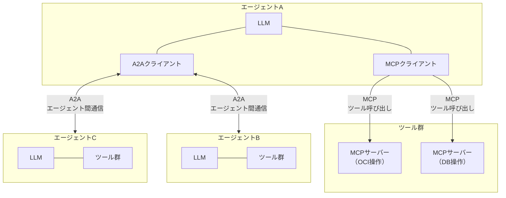
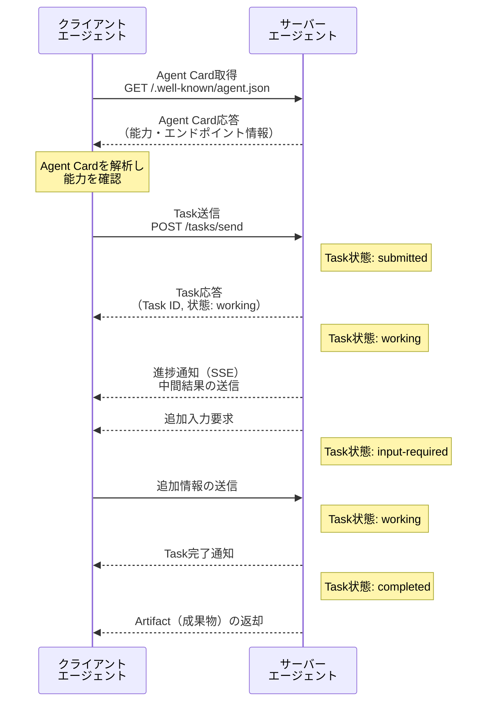

# 第5章 エージェント間の通信 ― MCP, A2A, そしてその先

前章では、マルチエージェントシステムにおける六つの協調パターンを体系的に整理した。直列パイプライン、並列ファンアウト/ファンイン、オーケストレーター型、スーパーバイザー型、コレオグラフィ型、評価者ループ。これらのパターンは「エージェントがどのような構造で協調するか」を定義する。

しかし、構造だけではシステムは動かない。エージェント同士が実際にやり取りするための通信メカニズムが必要である。オーケストレーターがサブエージェントにタスクを委譲する際、何をどのような形式で伝えるのか。コレオグラフィ型でエージェント同士が自律的に協調する際、相手をどのように発見し、どのように対話するのか。

本章では、エージェント間通信の課題を整理した上で、二つの主要プロトコルであるMCPとA2Aの役割と補完関係を明確にする。さらに、メッセージ設計、同期・非同期通信の選択、エラーとタイムアウトの伝播という実践的な設計課題を扱う。第4章が「構造」を定義したのに対し、本章は「その構造を動かすための通信」を定義する。

---

## 5.1 エージェント間通信の課題

マルチエージェントシステムにおいて、エージェント同士が協調するための通信には四つの根本的な課題が存在する。これらの課題は、分散システム設計における古典的な問題と本質的に同じものであるが、エージェント固有の特性が新たな困難を加える。

### 課題1: エージェントの発見

最初の課題は「どのエージェントが存在し、利用可能なのか」を知ることである。分散システムにおけるサービスディスカバリ（Service Discovery）に相当する問題である。

シングルエージェントの構成では、この問題は存在しない。一つのエージェントがすべてを処理するため、通信相手を見つける必要がない。マルチエージェント構成に移行した瞬間、「誰と通信するか」という問いが生じる。

エージェントの発見は静的な場合と動的な場合がある。静的な発見では、通信先のエージェントがあらかじめ設定ファイルやコードに記述されている。オーケストレーター型で利用するサブエージェントが固定されているケースがこれに該当する。動的な発見では、実行時にエージェントのレジストリを検索し、条件に合うエージェントを見つける。コレオグラフィ型で新しいエージェントが動的に参加するケースがこれに該当する。

### 課題2: 能力の記述

エージェントを発見できたとしても、次に「そのエージェントが何をできるのか」を知る必要がある。人間のチームでは、メンバーの専門分野やスキルセットを把握した上でタスクを振り分ける。エージェントにおいても同様に、各エージェントの能力を機械可読な形式で記述し、公開する仕組みが求められる。

能力の記述には複数のレベルがある。粗い粒度では「このエージェントはOCIのネットワーク構成を担当する」と記述する。詳細な粒度では「VCNの作成、サブネットの構成、セキュリティリストの設定が可能」と能力を列挙し、「入力としてCIDRブロックとコンパートメントIDを受け取り、作成されたリソースのOCIDを返す」と入出力を明示する。

能力の記述が不十分であると、オーケストレーターが不適切なエージェントにタスクを委譲する、あるいは適切なエージェントが存在するにもかかわらず発見できない、という事態が生じる。

### 課題3: メッセージの形式

三つ目の課題は、エージェント間で交換するメッセージの形式である。人間同士であれば自然言語で曖昧さを含んだまま会話できるが、エージェント間通信では以下の選択を行う必要がある。

**構造化データか自由テキストか**: JSONやProtocol Buffersのような構造化された形式でメッセージを交換するか、自然言語テキストで交換するか。構造化データは解析が容易で型安全性を担保できるが、表現力に制約がある。自然言語テキストは柔軟であるが、解釈の揺れが生じる。

**スキーマの共有方法**: 構造化データを使う場合、送信側と受信側がメッセージのスキーマ（データ構造の定義）を共有する必要がある。スキーマの不一致はメッセージの解析失敗を引き起こす。

**コンテキストの受け渡し方**: タスクの背景情報、制約条件、過去の処理履歴など、メッセージ本体以外のコンテキスト情報をどのように伝達するか。すべてを含めるとメッセージが肥大化し、省略しすぎると受信側が適切な判断を下せない。

### 課題4: 通信の信頼性

四つ目の課題は通信の信頼性である。ネットワーク障害、エージェントの一時的な停止、処理のタイムアウトなど、通信が失敗するケースは避けられない。

特にエージェント間通信で問題となるのは、一つのエージェントの障害がシステム全体に波及するリスクである。オーケストレーター型でサブエージェントの一つが応答しなくなった場合、タスク全体が停滞する。コレオグラフィ型では、一つのエージェントの障害が連鎖的に他のエージェントに影響を与える可能性がある。

リトライ（再試行）、タイムアウト（時間制限）、フォールバック（代替処理）の設計が不可欠であるが、これらの設計はエージェント間通信のプロトコルと密接に関わる。

以降の節では、これら四つの課題に対する解決策を、具体的なプロトコルと設計パターンを通じて示す。

---

## 5.2 MCPの拡張的活用

第2章で、MCP（Model Context Protocol）をツール提供の標準プロトコルとして解説した。MCPの本来の目的はエージェントが外部ツールやデータソースに接続することである。本節では、このMCPをマルチエージェントの文脈で拡張的に活用するパターンを検討する。

### エージェントをMCPサーバーとして公開する

MCPの拡張的活用の核心は、エージェント自体をMCPサーバーとして公開することである。第2章で示したMCPの3層アーキテクチャ（ホスト・クライアント・サーバー）では、MCPサーバーはTools、Resources、Promptsの三つのプリミティブを公開する。エージェントの能力をToolsとして定義すれば、他のエージェントからMCPクライアント経由で「ツール」として呼び出せる。

たとえば、ネットワーク構成を専門とするエージェントをMCPサーバーとして公開するケースを考える。このエージェントは「VCNを設計する」「サブネット構成を生成する」「セキュリティルールを検証する」といった能力をToolsとして定義する。オーケストレーターエージェントは、MCPクライアントを通じてこれらのToolsを呼び出し、結果を受け取る。オーケストレーターから見ると、ネットワーク構成エージェントは通常のMCPサーバー（ツール提供元）と同じインターフェースである。

### MCPによるエージェント間通信の利点

MCPをエージェント間通信に転用する利点は三つある。

**既存エコシステムの活用**: MCPのクライアントライブラリ、開発ツール、デバッグ環境など、2024年以降に成長したMCPエコシステムをそのまま活用できる。エージェント間通信のために新たなプロトコルスタックを構築する必要がない。

**ツール発見の仕組みの再利用**: MCPには、サーバーに接続した際にツール一覧を動的に取得する機能が備わっている。エージェントの能力をToolsとして定義しておけば、この仕組みがそのまま5.1節で述べた「能力の記述」の課題を解決する。

**段階的な移行**: シングルエージェントで使用していたMCPの構成をそのままマルチエージェントに拡張できる。既存のMCPサーバーに加えて、エージェントをMCPサーバーとして追加するだけでマルチエージェント構成に移行できる。

### MCPの限界

MCPをエージェント間通信に転用する場合の限界も明確に認識する必要がある。

**単方向の通信モデル**: MCPはクライアント（ホスト側）からサーバーへのリクエスト/レスポンス型の通信を前提としている。クライアントがToolsを呼び出し、サーバーが結果を返す。サーバー側からクライアントへの能動的な通知や、双方向の対話は基本的に想定されていない。Server-Sent Events（SSE）による通知の仕組みは存在するが、対等なエージェント間の双方向通信には適さない。

**対等な通信への不向き**: MCPの設計は「ホスト（利用者）がサーバー（提供者）のツールを使う」という非対称な関係を前提としている。コレオグラフィ型のように、対等なエージェント同士がピアツーピアで通信するパターンには構造的に不向きである。エージェントAがエージェントBのツールを呼ぶ際、AがMCPクライアント、BがMCPサーバーという役割が固定される。AとBが双方向に通信するには、互いにクライアントとサーバーの両方の役割を持つ必要があり、構成が複雑になる。

**タスクの状態管理の欠如**: MCPにはタスクのライフサイクル管理の概念がない。ツール呼び出しは単発のリクエスト/レスポンスであり、長時間にわたるタスクの進捗追跡や状態遷移の管理はMCPの範囲外である。

これらの限界は、MCPの設計上の欠陥ではない。MCPはツール提供のプロトコルとして設計されたものであり、エージェント間の対等な通信は本来の目的ではない。この限界を補完するのが、次節で解説するA2Aプロトコルである。

---

## 5.3 A2Aプロトコル

A2A（Agent-to-Agent Protocol）は、Googleが2025年4月に提唱したエージェント間通信のオープンプロトコルである。MCPが「エージェントとツールの接続」を標準化するのに対し、A2Aは「エージェントとエージェントの接続」を標準化する。

### MCPとA2Aの補完関係

MCPとA2Aは競合するプロトコルではなく、異なるレイヤーで補完的に機能する。図5.1にその関係を示す。

図5.1: MCPとA2Aの補完関係（MCPはツール接続、A2Aはエージェント間通信）

MCPの矢印が単方向であるのに対し、A2Aの矢印は双方向である。MCPはエージェントからツールへの呼び出しであり、A2Aはエージェント同士の対等な通信である。エージェントAは、ツールの利用にはMCPを使い、他のエージェントとの協調にはA2Aを使う。両プロトコルを組み合わせることで、マルチエージェントシステムの通信基盤が構成される。

### A2Aの主要概念

A2Aプロトコルは五つの主要概念で構成される。

**Agent Card（エージェントカード）**: エージェントの自己記述メタデータである。エージェントの名前、説明、能力、エンドポイントURL、認証方式を含むJSONドキュメントであり、`/.well-known/agent.json`のパスで公開される。5.1節で述べた「発見」と「能力の記述」の課題を解決する仕組みである。他のエージェントやクライアントはAgent Cardを取得することで、そのエージェントが何をできるかを機械的に判別できる。

**Task（タスク）**: エージェント間のやり取りの単位である。一つのTaskは一連のメッセージ交換を包含し、状態遷移によってライフサイクルが管理される。Taskの状態は六つある。`submitted`（送信済み）、`working`（処理中）、`input-required`（追加入力待ち）、`completed`（完了）、`failed`（失敗）、`canceled`（取り消し）である。MCPのツール呼び出しが単発のリクエスト/レスポンスであるのに対し、A2AのTaskは長時間にわたるやり取りを一つの単位として追跡できる。

**Message（メッセージ）**: Task内でやり取りされる個々のメッセージである。各Messageにはロール（`user`または`agent`）が付与され、誰が発したメッセージかを識別する。一つのTask内で複数のMessageが交換されることで、エージェント間の対話が成立する。

**Artifact（アーティファクト）**: Taskの成果物である。エージェントが処理の結果として生成したデータ、ファイル、構造化された出力を表す。Taskの最終結果だけでなく、処理の途中で生成された中間成果物もArtifactとして管理できる。

**Streaming（SSE）**: SSEを利用したストリーミング通信の仕組みである。長時間実行されるTaskの進捗をリアルタイムで通知する。クライアントはTaskの完了を待つことなく、処理状況の更新を逐次受け取ることができる。

### A2Aの通信フロー

A2Aプロトコルにおける典型的な通信フローを図5.2に示す。

図5.2: A2Aプロトコルのシーケンス（Agent Card取得からTask完了まで）

このシーケンスで注目すべき点が三つある。

**Agent Cardによる事前の能力確認**: 通信に先立ち、クライアントエージェントはサーバーエージェントのAgent Cardを取得する。Agent Cardに記載された能力や入力形式を確認した上でTaskを送信する。これにより、不適切なエージェントへのTask送信を防止できる。

**Taskの状態遷移**: Taskは`submitted`から始まり、`working`、`input-required`、`completed`（または`failed`、`canceled`）へと遷移する。クライアントはTask IDを用いて任意の時点で状態を問い合わせることができる。長時間実行されるタスクの進捗追跡が可能である。

**双方向のやり取り**: サーバーエージェントがクライアントに追加入力を要求する（`input-required`状態への遷移）ケースが存在する。MCPのツール呼び出しでは見られない、エージェント間の対話的なやり取りが実現される。

### MCPとA2Aの使い分け

MCPとA2Aの使い分けを整理する。MCPは「ツールの利用」に適しており、A2Aは「エージェントとの協調」に適している。

MCPが適するケース:
- エージェントが外部API、データベース、ファイルシステム等のツールを利用する
- 呼び出しが単発のリクエスト/レスポンスで完結する
- 呼び出し元と呼び出し先の関係が非対称（利用者と提供者）である

A2Aが適するケース:
- エージェント同士が対等な立場で協調する
- 一つのタスクに対して複数回のメッセージ交換が必要である
- タスクの状態遷移を追跡する必要がある
- 長時間実行されるタスクの進捗通知が必要である

実際のマルチエージェントシステムでは、MCPとA2Aを併用する構成が一般的である。各エージェントはMCP経由でツールを利用しつつ、A2A経由で他のエージェントと協調する。第4章で示したオーケストレーター型であれば、オーケストレーターはA2A経由でサブエージェントにTaskを送信し、各サブエージェントはMCP経由でツールを使ってTaskを遂行する。

---

## 5.4 メッセージ設計

エージェント間で交換するメッセージの設計は、マルチエージェントシステムの品質を左右する。メッセージが不十分であれば受信側のエージェントは的確な判断ができず、冗長であればコンテキストウィンドウを浪費する。本節では、メッセージに含めるべき情報と構造化の方針を整理する。

### メッセージに含めるべき四つの要素

エージェント間のメッセージには、以下の四つの要素を含めることが望ましい。

**「何を」（タスクの指示）**: 受信側のエージェントに実行してほしい作業を明確に記述する。「ネットワークを構成する」のような曖昧な指示ではなく、「10.0.0.0/16のCIDRブロックでVCNを作成し、パブリックサブネットとプライベートサブネットをそれぞれ一つ構成する」のように具体的に記述する。タスクの完了条件も含めると、受信側は作業の終了を自律的に判断できる。

**「なぜ」（背景と目的）**: タスクの背景情報と目的を伝える。「OKEクラスタのホスティング用インフラの一部として、ワーカーノードが配置されるネットワークを構成する」のような情報が該当する。背景を知ることで、受信側のエージェントはより適切な判断を下せる。たとえば、OKEクラスタ用であることを知っていれば、Kubernetesに必要なポートのセキュリティルールを自動的に考慮できる。

**「どのように」（手順や制約）**: 特定の手順や方法の指定がある場合に含める。「Terraformを使用する」「既存のVCNのOCIDはocid1.vcn.oc1...である」のような指定が該当する。ただし、この要素は「何を」の記述と過度に重複しないよう注意する。手順を細かく指定しすぎると、受信側エージェントの自律性を損なう。

**「制約条件」（制限と期待する出力形式）**: タスクの制約条件と、期待する出力の形式を明示する。「コストを最小化するため、Flexシェイプを使用する」「結果はJSON形式で、作成されたリソースのOCIDを含める」のような記述が該当する。出力形式の明示は、後続のエージェントが結果を解析する際の信頼性を高める。

### 構造化出力と自由テキスト

メッセージの形式として、構造化出力（Structured Output）と自由テキストのどちらを採用するかは設計上の重要な判断である。

**構造化出力の利点**: JSON等の構造化された形式でメッセージを交換すると、受信側はプログラム的にメッセージを解析できる。フィールドの有無や型の検証が可能であり、解釈の揺れが生じない。後続の処理で特定のフィールドの値を参照する場合に適している。

**構造化出力の限界**: 構造化出力では、事前にスキーマを定義する必要がある。想定外の情報や、スキーマに含まれない文脈的な判断は表現しにくい。LLMが生成する出力を厳密なスキーマに収めようとすると、情報の欠落や不自然な分類が生じることがある。

**自由テキストの利点**: 自然言語テキストは表現力が高く、LLMの得意領域である。複雑な条件分岐や微妙なニュアンスを含む判断根拠の伝達に適している。

**自由テキストの限界**: 受信側がテキストから必要な情報を抽出する際にLLMの推論が必要となり、解釈の揺れが生じる可能性がある。プログラム的な処理との連携が難しい。

実際のシステムでは、両者を組み合わせるのが有効である。メッセージの「構造」は構造化データで定義し、各フィールドの内容は自由テキストを許容する方式が多い。A2AのMessageがこのアプローチを採用しており、メッセージ全体の構造（ロール、Partの種類）は定義されているが、各Partの内容はテキストやファイルなど柔軟な形式を取ることができる。

### コンテキスト受け渡しの最小化

第2章で述べたコンテキストエンジニアリングの原則は、エージェント間通信のメッセージ設計にも適用される。メッセージに含めるコンテキストは必要最小限に留める。

**過剰なコンテキストの弊害**: 送信側が保持するすべてのコンテキスト（会話履歴、ツール実行結果、中間推論）をそのまま受信側に転送すると、受信側のコンテキストウィンドウが圧迫される。受信側のエージェントは自身のシステムプロンプトやツール定義でコンテキストの一部を既に消費しているため、大量のコンテキストの追加はLLMの判断精度を低下させる。

**最小限のコンテキスト設計**: 送信側は、受信側のタスク遂行に必要な情報だけを選別してメッセージに含める。オーケストレーターがネットワーク構成エージェントにTaskを送る際、過去のすべての会話履歴を含める必要はない。ネットワーク構成に直接関わる情報（CIDRブロック、リージョン、コンパートメントID、関連する既存リソースの情報）だけを渡せばよい。

### スキーマのバージョニング

エージェント間でメッセージのスキーマが変化する場合、後方互換性（Backward Compatibility）の確保が必要である。送信側と受信側のバージョンが一致しない状況では、受信側が未知のフィールドを無視する寛容な設計（Tolerant Readerパターン）が有効である。具体的には、メッセージにバージョン番号を含め、受信側は自身が理解できるフィールドのみを処理する。新しいフィールドの追加は後方互換であるが、既存フィールドの削除や型変更は互換性を破壊するため、慎重な移行計画が必要である。

**コンテキストの階層化**: 大規模なマルチエージェントシステムでは、コンテキストを三層に分離する設計が有効である。「グローバルコンテキスト」は全エージェントが参照する共通情報、「タスクコンテキスト」は特定のタスクに関わるエージェントが共有する情報、「ローカルコンテキスト」は個々のエージェント固有の情報である。メッセージに含めるのはタスクコンテキストの必要部分のみとする。グローバルコンテキストは共有ストレージ等の別のメカニズムで参照する。この状態の階層設計は第6章で詳しく扱う。

---

## 5.5 非同期通信

ここまでの議論では、エージェント間の通信を暗黙的に同期的なものとして扱ってきた。送信側がメッセージを送り、受信側の応答が返るまで待機する方式である。しかし、マルチエージェントシステムでは同期通信が不適切な場面が多く存在する。

### 同期通信の限界

同期通信は、送信側が応答を受け取るまでブロック（待機）する。この方式は以下の場面で問題を引き起こす。

**長時間実行タスク**: インフラの構築、大規模データの処理、外部サービスとの連携など、完了まで数分から数十分を要するタスクでは、同期通信は現実的でない。送信側のエージェントがその間ブロックされると、他のタスクの処理が停滞する。

**依存関係のないタスクの同時実行**: 第4章で述べた並列ファンアウト/ファンインパターンでは、複数のサブタスクを並行して実行する。同期通信ではサブタスクを逐次実行せざるを得ず、並列化の利点が失われる。

**スケーラビリティ**: 同期通信では、送信側が受信側の処理能力に直接依存する。受信側の処理が遅延すると、送信側も遅延する。システム全体のスループットが最も遅いエージェントに律速される。

### 非同期通信の三つのパターン

非同期通信を実現する主要なパターンを三つ整理する。

**ポーリング（Polling）**: 送信側がタスクを送信した後、定期的にタスクの状態を問い合わせる方式である。A2Aプロトコルではこの方式をサポートしており、クライアントはTask IDを用いて`GET /tasks/{id}`でTaskの現在の状態を確認できる。

ポーリングは実装が単純である反面、ポーリング間隔の設計が難しい。間隔が短すぎると不要なリクエストが増加し、受信側に負荷を与える。間隔が長すぎると、タスクの完了を検知するまでの遅延が増大する。タスクの予想実行時間に応じたポーリング間隔の調整（指数バックオフ（Exponential Backoff）等）が求められる。

**コールバック/Webhook**: タスクの完了時に、受信側が送信側に通知する方式である。送信側は通知を受け取るためのエンドポイント（Webhook URL）を事前に指定する。受信側はタスクが完了した時点でWebhook URLにHTTPリクエストを送信し、結果を通知する。

ポーリングと比較して、不要なリクエストが発生しないため効率的である。ただし、送信側がHTTPリクエストを受け付けるためのエンドポイントを公開する必要がある。ネットワーク構成やセキュリティポリシーの制約により、Webhookの設定が困難な場合もある。

**イベント駆動（Event-Driven）**: エージェント間にメッセージブローカー（メッセージキューやイベントバス）を介在させ、イベントの発行と購読によって通信する方式である。送信側はイベントを発行し、受信側はイベントを購読する。両者は直接通信せず、メッセージブローカーが仲介する。

イベント駆動方式は疎結合性に優れる。送信側は受信側のエンドポイントを知る必要がない。受信側が一時的に停止していても、イベントはメッセージブローカーに保持され、受信側の復旧後に処理される。スケーラビリティにも優れるが、システムの複雑性が増し、メッセージの順序保証や冪等性の考慮が必要となる。

### A2AのStreaming（SSE）

A2Aプロトコルは、SSEを利用したストリーミング通信をサポートしている。クライアントが`POST /tasks/sendSubscribe`でTaskを送信すると、SSE接続が確立される。サーバーエージェントは処理の進捗をSSEイベントとして逐次送信する。

このストリーミングは、ポーリングとコールバックの利点を組み合わせたものと位置づけられる。クライアントは単一の接続を維持するだけで、タスクの進捗をリアルタイムに受け取ることができる。ポーリングのような無駄なリクエストが発生せず、Webhookのように送信側がエンドポイントを公開する必要もない。

### OCI環境での非同期通信

OCI上でマルチエージェントシステムを構築する場合、以下のサービスが非同期通信の基盤となる。

**OCI Events Service**: OCIリソースの状態変更をイベントとして検知し、他のサービスにルーティングする。インフラ構築エージェントがリソースを作成した際の完了通知に活用できる。

**OCI Notifications Service**: トピックベースのメッセージ配信サービスである。エージェント間の通知やアラートの配信に利用できる。

**OCI Streaming（Kafka互換）**: 大量のイベントストリームを処理するためのマネージドサービスである。エージェント間のイベント駆動通信の基盤として利用できる。メッセージの順序保証と永続化が提供される。

**OCI Queue**: メッセージキューサービスである。エージェント間の非同期タスク配信に利用できる。メッセージの可視性タイムアウトとデッドレターキューにより、信頼性の高いタスク配信を実現する。

これらのサービスの具体的な活用方法は第11章で詳しく扱う。

---

## 5.6 同期vs非同期の設計判断

同期通信と非同期通信はトレードオフの関係にあり、システムの要件に応じた選択が求められる。本節では、判断のためのフレームワークを提示する。

### 判断の四つの基準

同期と非同期を選択する際に考慮すべき四つの基準を整理する。

**タスクの予想実行時間**: タスクの完了までに要する時間が判断の出発点となる。数秒以内で完了するタスク（データの検索、簡単な判断）には同期通信が適する。数十秒を超えるタスク（インフラの構築、大規模データの処理）には非同期通信が適する。

**結果の即時性要求**: 後続の処理がタスクの結果に依存する場合、結果を即座に必要とする。直列パイプラインでは前段の出力が後段の入力となるため、同期通信が自然である。一方、並列ファンアウトでは各サブタスクの結果は独立しており、すべてのサブタスクが完了した時点で集約すればよいため、非同期通信が適する。

**システムの負荷特性**: 同時に多数のタスクが発生するシステムでは、同期通信は接続リソースを大量に消費する。非同期通信はメッセージキューやイベントバスを介して負荷を平準化できるため、バースト的なワークロードに適している。

**エラー回復の要件**: 通信の信頼性要件が高い場合、非同期通信の方が適している。メッセージキューはメッセージの永続化と再配信を保証する。同期通信では、通信の失敗時にリトライのロジックをアプリケーション側で実装する必要がある。

### 通信パターン選択マトリクス

これらの基準を踏まえ、通信パターンの選択を表5.1にマトリクスとして整理する。

| 通信パターン | 実行時間 | 即時性要求 | スケーラビリティ | 実装の複雑さ | 適するユースケース |
|:---|:---|:---|:---|:---|:---|
| 同期（リクエスト/レスポンス） | 短い（数秒以内） | 高い | 低い | 低い | 直列パイプライン、ツール呼び出し、即座に結果が必要な判断 |
| 非同期（ポーリング） | 中程度（数十秒〜数分） | 中程度 | 中程度 | 低い | インフラ構築の進捗確認、バッチ処理の状態監視 |
| 非同期（コールバック/Webhook） | 長い（数分〜数十分） | 低い | 高い | 中程度 | 長時間実行タスクの完了通知、外部サービスとの連携 |
| 非同期（イベント駆動） | 可変 | 低い | 高い | 高い | 大規模分散システム、コレオグラフィ型パターン、マイクロサービス構成 |
| ハイブリッド（同期＋SSE） | 中〜長い | 中程度 | 中程度 | 中程度 | A2AのTaskパターン、段階的な進捗報告が必要なタスク |

表5.1: 通信パターン選択マトリクス

### ハイブリッドアプローチ

実際のシステムでは、純粋な同期または非同期の二択ではなく、ハイブリッドアプローチを採用することが多い。

A2Aプロトコルの`sendSubscribe`はハイブリッドアプローチの典型例である。初期応答（Task IDの返却と状態の通知）は同期的に行われ、その後の進捗更新はSSEによる非同期ストリームで配信される。クライアントは初期応答で処理が受け付けられたことを確認し、以降はSSEイベントを受信しながら他の処理を進められる。

第4章のオーケストレーター型パターンでも、ハイブリッドアプローチが有効である。オーケストレーターがサブエージェントにタスクを送る際、タスクの受付確認は同期的に行い、タスクの完了通知は非同期で受け取る。オーケストレーターは複数のサブエージェントにタスクを同時に送信し、完了通知が揃った時点で結果を統合する。

---

## 5.7 エラーとタイムアウトの伝播

マルチエージェントシステムでは、一つのエージェントの障害がシステム全体に波及するリスクがある。エラーとタイムアウトの適切な設計は、システムの信頼性を確保する上で不可欠である。

### エラーの分類

エージェント間通信で発生するエラーは、対処方針の観点から二つに分類される。

**一時的エラー（Transient Error）**: ネットワークの瞬断、一時的な過負荷、リソースの一時的な競合など、時間の経過やリトライによって回復する可能性があるエラーである。HTTPステータスコード429（Too Many Requests）や503（Service Unavailable）がこれに該当する。一時的エラーに対してはリトライが有効である。

**恒久的エラー（Permanent Error）**: 入力データの不備、認証の失敗、リソースの不在など、リトライしても回復しないエラーである。HTTPステータスコード400（Bad Request）や404（Not Found）がこれに該当する。恒久的エラーに対してはリトライは無意味であり、フォールバック処理やエラーの上位への報告が必要である。

エラーの分類を誤ると、恒久的エラーに対して無限にリトライを繰り返す（リソースの浪費）、あるいは一時的エラーに対して即座に処理を諦める（不要な失敗）、という事態が生じる。エラーの種類を適切に判別し、それぞれに応じた対処を行う設計が求められる。

### リトライ戦略

一時的エラーに対するリトライの設計には以下の要素を考慮する。

**リトライ回数の上限**: 無限にリトライを繰り返すとリソースを浪費し、システム全体に悪影響を及ぼす。リトライ回数に上限を設定し、上限に達した場合はフォールバック処理に移行する。3回から5回程度が一般的な上限である。

**リトライ間隔**: リトライの間隔を徐々に広げる指数バックオフ（Exponential Backoff）が推奨される。初回のリトライは1秒後、2回目は2秒後、3回目は4秒後、というように間隔を指数的に増加させる。過負荷状態のサーバーに対して立て続けにリクエストを送ることを防ぐ。さらに、ジッター（Jitter）と呼ばれるランダムな揺らぎを加える。これにより、複数のクライアントが同時にリトライして再び過負荷を引き起こす事態（Thundering Herd問題）を緩和できる。

**冪等性の保証**: リトライを安全に行うためには、同じ操作を複数回実行しても結果が変わらない性質、すなわち冪等性（Idempotency）が必要である。「VCNを作成する」という操作がリトライされた場合、同一のVCNが二重に作成されないよう、冪等な実装にする必要がある。冪等性の設計については第7章で詳しく扱う。

### フォールバック

リトライで回復できない場合の代替処理がフォールバック（Fallback）である。

**代替エージェントへの切り替え**: 同じ能力を持つ別のエージェントにタスクを再委譲する。スーパーバイザー型パターンでは、ワーカーエージェントの障害時にスーパーバイザーが別のワーカーを選定してタスクを振り直す仕組みが組み込まれている。

**縮退運用**: 完全な処理は諦め、部分的な結果を返す。たとえば、セキュリティ検証エージェントが障害を起こした場合、ネットワーク構成のみ完了した状態で「セキュリティ検証は未実施」として結果を返し、後から手動で検証を行う運用が考えられる。

**エスカレーション**: 自動処理を断念し、人間の判断を仰ぐ。第7章で扱うHuman-in-the-Loop（HITL）の仕組みに接続する。

### サーキットブレーカー

サーキットブレーカー（Circuit Breaker）は、障害が連鎖的に波及することを防ぐための設計パターンである。電気回路のブレーカーと同様に、障害を検知した時点で通信を遮断し、システム全体への影響を局所化する。

サーキットブレーカーは三つの状態を持つ。

**Closed（閉）**: 通常の通信状態。リクエストがそのまま送信される。障害の発生回数がカウントされる。

**Open（開）**: 障害の発生回数が閾値を超えた場合に遷移する。リクエストは送信されず、即座にエラーが返される。障害が連鎖するのを防ぐとともに、障害を起こしているエージェントに不要なリクエストを送らない。

**Half-Open（半開）**: 一定時間経過後に遷移する。試験的にリクエストを一件送信し、成功すればClosed、失敗すればOpenに戻る。障害が回復したかどうかを自動的に検知する仕組みである。

### タイムアウト階層設計

マルチエージェントシステムでは、タイムアウトを三つの階層で設計する。

**エージェント内タイムアウト**: 個々のエージェントが一つのツール呼び出しやLLM推論に設定するタイムアウトである。LLMのAPI呼び出しは通常30秒から60秒を上限とする。OCI APIの呼び出しは操作の種類に応じて設定する（リソースの一覧取得は短く、リソースの作成は長く）。

**タスクタイムアウト**: A2AのTask単位で設定するタイムアウトである。一つのTaskが完了するまでの上限時間を定める。エージェント内タイムアウトよりも長く設定する必要がある。タスクに複数のツール呼び出しが含まれる場合、個々のツール呼び出しのタイムアウトの合計よりも十分な余裕を持たせる。

**システム全体タイムアウト**: ユーザーから見たシステム全体の応答時間の上限である。オーケストレーターが複数のサブエージェントにTaskを委譲し、すべてのTaskが完了するまでの上限を定める。個々のタスクタイムアウトよりも長く設定する。

階層間の関係は「エージェント内タイムアウト < タスクタイムアウト < システム全体タイムアウト」である。この順序が逆転すると、タイムアウトが意図どおりに機能しない。たとえば、エージェント内タイムアウトがタスクタイムアウトより長い場合、タスクタイムアウトが先に到達しても、エージェント内の処理が継続してリソースを消費し続ける事態が生じる。

### エラー情報の伝播

エラーが発生した際、エラー情報をどのように上位に伝えるかの設計も重要である。A2AプロトコルではTaskが`failed`状態に遷移する際にエラーメッセージを含めることができるが、エラーメッセージの設計はプロトコルの範囲外であり、アプリケーション側の設計事項である。

エラー情報に含めるべき要素を整理する。

- **エラーの種類**: 一時的か恒久的か、分類コードがあればそれを含める
- **エラーの原因**: 具体的に何が失敗したか（「OCI APIのCreateSubnet呼び出しでCIDRブロックの競合が発生」等）
- **回復可能性**: リトライで回復する可能性があるか、人間の介入が必要か
- **部分的な成果**: エラー発生前に完了した処理の結果があれば含める

オーケストレーターはこれらのエラー情報を受け取り、リトライ、フォールバック、エスカレーションのいずれの対処を行うかを判断する。エラー情報が不十分であれば、オーケストレーターは適切な判断ができず、システム全体の信頼性が低下する。

---

## まとめ

本章では、マルチエージェントシステムにおけるエージェント間通信の課題と解決策を体系的に整理した。

エージェント間通信には四つの根本的な課題がある。エージェントの発見（誰と通信するか）、能力の記述（何ができるか）、メッセージの形式（どのように伝えるか）、通信の信頼性（確実に届くか）である。これらの課題に対して、MCPとA2Aの二つのプロトコルが補完的に機能する。

MCPは「エージェントとツールの接続」のプロトコルであり、エージェントをMCPサーバーとして公開することでマルチエージェント構成にも活用できる。既存エコシステムの活用やツール発見の仕組みの再利用が利点である。一方、単方向の通信モデルや対等な通信への不向きという限界がある。

A2Aは「エージェントとエージェントの接続」のプロトコルである。Agent Card、Task、Message、Artifact、Streamingの五つの概念でエージェント間の発見・通信・協調を標準化する。MCPとA2Aは競合ではなく補完の関係にある。MCPがツール提供のレイヤーを、A2Aがエージェント間通信のレイヤーを担う。

メッセージ設計では「何を」「なぜ」「どのように」「制約条件」の四つの要素を含め、コンテキストの受け渡しは最小限に留める。同期通信と非同期通信はタスクの実行時間、即時性要求、スケーラビリティ、エラー回復の要件に基づいて選択する。エラーハンドリングでは、一時的エラーと恒久的エラーを分類し、リトライ、フォールバック、サーキットブレーカーの組み合わせで対処する。タイムアウトはエージェント内、タスク、システム全体の三階層で設計する。

エージェント間の通信メカニズムを理解した。次章では、通信の結果として生じる状態をどのように管理し、エージェント間で共有するかを掘り下げる。

---

## 理解度チェック

**Q1**: エージェント間通信における四つの課題を挙げ、それぞれを簡潔に説明せよ。

**Q2**: MCPをエージェント間通信に拡張的に活用する際の利点と限界を述べよ。

**Q3**: A2Aプロトコルの主要な概念（Agent Card、Task、Message、Artifact）の役割を説明せよ。

**Q4**: 同期通信と非同期通信の選択基準を三つ挙げ、それぞれの判断ポイントを述べよ。

**Q5**: マルチエージェントシステムにおけるエラー伝播を防ぐための設計パターンを二つ挙げ、それぞれの仕組みを説明せよ。
