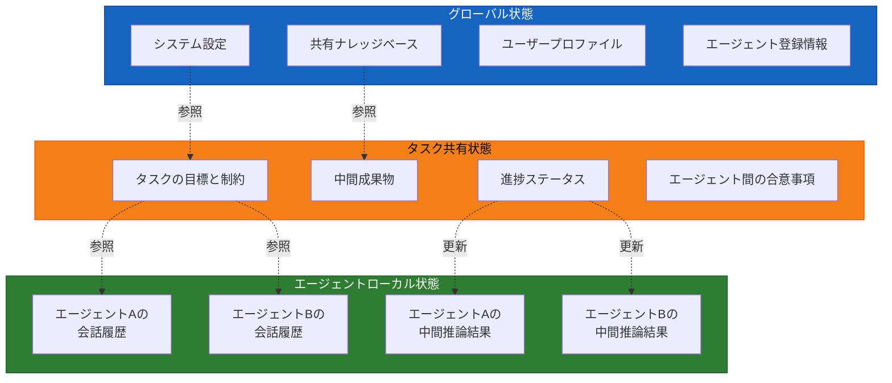
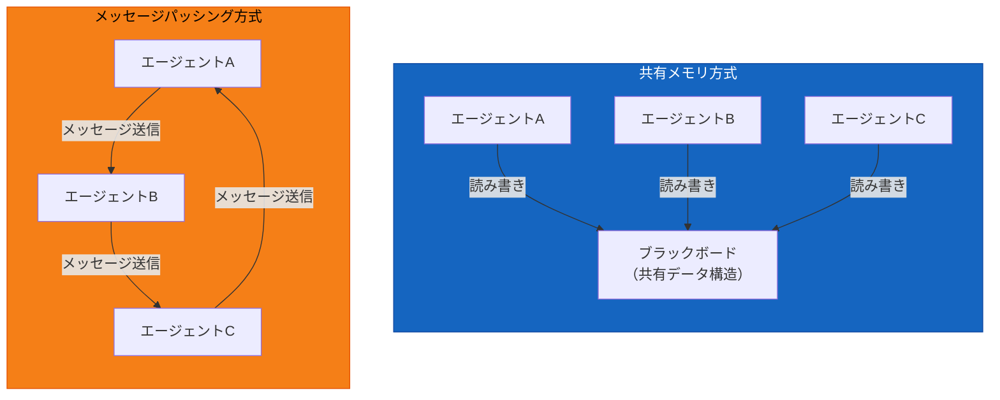
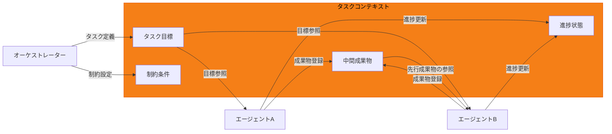
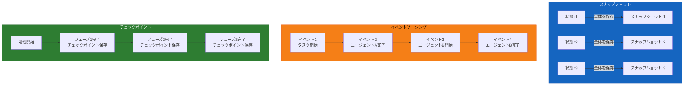
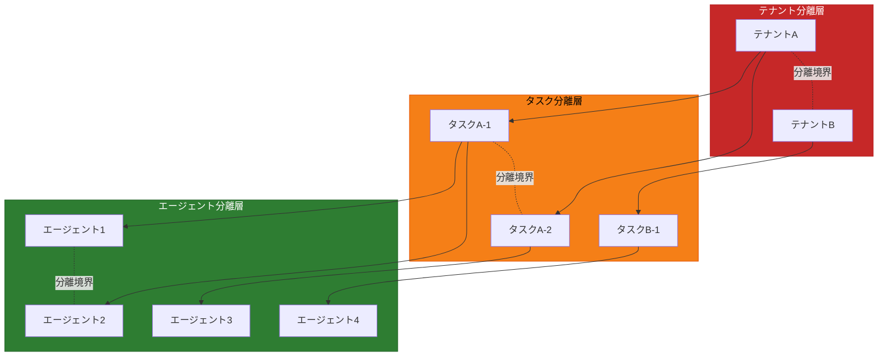

# 第6章 状態管理とメモリアーキテクチャ

第4章ではマルチエージェントの六つの協調パターンを、第5章ではエージェント間の通信プロトコルを整理した。協調パターンは「どのように役割を分担するか」を定め、通信プロトコルは「どのようにメッセージを交換するか」を定める。しかし、パターンと通信だけでは、マルチエージェントシステムは機能しない。エージェントが協調してタスクを遂行するためには、「何を覚え、何を共有し、何を永続化するか」という状態管理の設計が不可欠である。

第2章では、シングルエージェントにおける短期記憶と長期記憶の概念を導入した。シングルエージェントでは、記憶は一つのエージェントの内部で完結していた。マルチエージェントに移行すると、状況は根本的に変わる。複数のエージェントが同一のタスクに取り組む以上、新たな設計判断が求められる。ある情報を「共有すべきか、分離すべきか」「どこに保存し、いつ参照するか」「障害が起きたらどう復旧するか」である。

本章では、マルチエージェントにおける状態の種類、共有メカニズム、短期・長期の記憶設計、永続化戦略、コンテキストの分離と保護、そしてOCI上での実現手段を体系的に整理する。

---

## 6.1 マルチエージェントにおける状態の種類

シングルエージェントの状態管理は比較的単純である。会話履歴、ツール実行結果、中間推論結果がコンテキストウィンドウ内に保持され、必要に応じて長期記憶に退避される。しかしマルチエージェントシステムでは、管理すべき状態が多層化する。

本節では、マルチエージェントシステムの状態を三つの層に分類する。エージェントローカル状態（Agent-Local State）、タスク共有状態（Task-Shared State）、グローバル状態（Global State）の三層である。図6.1にこの三層モデルを示す。

図6.1: 状態の三層モデル（ローカル / タスク共有 / グローバル）

### エージェントローカル状態

エージェントローカル状態は、個々のエージェントが自身の内部でのみ保持する状態である。具体的には、そのエージェントの会話履歴、ReActループにおける中間推論結果、ツール実行結果の詳細などが該当する。

ローカル状態の特徴は、他のエージェントから直接参照されない点にある。ネットワーク設計エージェントがVCNのCIDRブロックを検討する過程で生成した思考ログは、セキュリティ設定エージェントには見えない。これは意図的な設計である。第3章で分析した「コンテキスト爆発」を回避するためには、各エージェントのコンテキストを自身の責務に必要な最小限の情報に限定する必要がある。

ローカル状態の管理は、基本的に第2章で解説したコンテキストエンジニアリングの原則がそのまま適用される。要約、スライディングウィンドウ、選択的取得といった手法で、各エージェントのコンテキストウィンドウを効率的に運用する。

### タスク共有状態

タスク共有状態は、一つのタスクに関わる複数のエージェントが共有する状態である。タスクの目標、各エージェントの進捗状況、中間成果物、エージェント間の合意事項などが含まれる。

OKEクラスタ構築の例で考える。オーケストレーターがタスクを分解し、ネットワーク設計エージェントとセキュリティ設計エージェントに作業を委譲した場合、両エージェントの成果物（ネットワーク構成の定義とIAMポリシーの定義）はタスク共有状態として管理される。セキュリティ設計エージェントはネットワーク構成の結果を参照してセキュリティルールを設計する必要があるためである。

タスク共有状態の設計で重要なのは、「何を共有し、何を共有しないか」の境界設定である。ネットワーク設計エージェントの最終成果物（VCN定義、サブネット構成）はタスク共有状態に含めるべきだが、設計過程の試行錯誤の詳細まで共有する必要はない。共有する情報量が過剰になると、受け取るエージェントのコンテキストを圧迫する。共有する情報が不足すると、エージェント間の連携が破綻する。

### グローバル状態

グローバル状態は、特定のタスクに依存せず、システム全体で参照されるメタデータや設定情報である。エージェントの登録情報（どのエージェントが利用可能で、それぞれ何ができるか）、システム全体の設定パラメータ、共有ナレッジベース、ユーザープロファイルなどが該当する。

グローバル状態は更新頻度が低く、多くの場合は読み取り専用に近い運用となる。ただし、エージェントの登録・削除やシステム設定の変更時には更新が発生するため、整合性の管理が必要である。

### 三層の粒度設計

三層のどこに状態を配置するかは、システム全体のスケーラビリティと一貫性を左右する設計判断である。基本原則は「必要最小限のスコープに状態を配置する」ことである。ローカルで十分な状態をタスク共有に引き上げると、不要な結合が生じる。タスク固有の状態をグローバルに配置すると、テナント間の分離が崩れるリスクがある。逆に、本来共有すべき状態をローカルに閉じ込めると、エージェント間の連携が機能しなくなる。

---

## 6.2 状態共有の方法

複数のエージェント間で情報を共有する方法は、共有する情報の寿命と用途によって大きく二つのカテゴリに分かれる。

一つ目は、タスク実行中の短期的な情報共有である。6.3節で詳述する短期共有コンテキスト、すなわちタスクの進捗や中間成果物のリアルタイムな共有がこれに該当する。この目的には、共有メモリ（Shared Memory）方式とメッセージパッシング（Message Passing）方式が適する。

二つ目は、タスクをまたいで永続化される長期的な情報共有である。6.4節で詳述する長期記憶、すなわちナレッジベースや経験記憶の蓄積と参照がこれに該当する。この目的には、RDB、ベクトルDB、ファイルストアといった永続ストアが適する。

本節では、まず短期的な情報共有に用いる共有メモリ方式とメッセージパッシング方式を比較し、次に両カテゴリの実装コンポーネントを整理する。

### 共有メモリ方式とメッセージパッシング方式

分散システムの設計における古典的な二つのアプローチ、共有メモリとメッセージパッシングは、マルチエージェントの短期的な情報共有においても同じ構造の選択として現れる。図6.2に両方式の概要を示す。

図6.2: 共有メモリとメッセージパッシングの比較図

#### 共有メモリ方式

共有メモリ方式では、すべてのエージェントが同一のデータ構造にアクセスする。この共有データ構造は、AI分野ではブラックボード（Blackboard）と呼ばれる。ブラックボードは1980年代のAI研究で提唱されたパターンであり、マルチエージェントシステムの文脈で再び注目されている。

ブラックボードの動作は次のとおりである。各エージェントはブラックボードから必要な情報を読み取り、自身の処理結果をブラックボードに書き込む。他のエージェントは、ブラックボードを参照することで最新の情報を取得する。

共有メモリ方式の利点は、実装がシンプルである点と、状態の全体像を一箇所で把握できる点にある。オーケストレーターが全体の進捗を確認したい場合、ブラックボードを参照すれば各エージェントの成果物と進捗が一覧できる。

一方、共有メモリ方式には課題もある。複数のエージェントが同時に同じデータを更新しようとする場合、競合（Race Condition）が発生する。排他制御（Locking）を導入すればこの問題は解決するが、ロックの粒度や待機時間の設計が新たな課題となる。エージェント数が増加するにつれて、ブラックボードへのアクセスがボトルネックとなりうる。

#### メッセージパッシング方式

メッセージパッシング方式では、エージェント間で共有データ構造を持たず、情報をメッセージとして明示的に受け渡す。各エージェントは自身のコンテキストを内部に保持し、他のエージェントに必要な情報をメッセージとして送信する。

メッセージパッシング方式の利点は、エージェント間の結合が疎になる点にある。各エージェントは自身の状態を自分で管理し、外部との接点はメッセージのインターフェースのみである。エージェントの追加・変更・削除が、他のエージェントに与える影響を最小限に抑えられる。第5章で解説したA2Aプロトコルは、メッセージパッシング方式の通信基盤として機能する。

メッセージパッシング方式の課題は、状態の全体像を把握しにくい点にある。各エージェントが自身の状態を分散して保持するため、「システム全体として今どのような状態にあるか」を俯瞰するには、全エージェントに問い合わせるか、別途集約する仕組みが必要になる。

#### 協調パターンとの適合

第4章で整理した六つの協調パターンは、それぞれ異なる状態共有方式と親和性を持つ。表6.1にこの対応関係を示す。

| 協調パターン | 推奨される状態共有方式 | 理由 |
|:---|:---|:---|
| 直列パイプライン | メッセージパッシング | 前段の出力が後段の入力となる単方向の流れ。共有メモリは不要 |
| 並列ファンアウト/ファンイン | 共有メモリ（結果集約用） | ファンイン時に全エージェントの結果を集約する必要がある |
| オーケストレーター | 共有メモリ | オーケストレーターが全体の状態を把握し、動的に判断する |
| スーパーバイザー | ハイブリッド | 監督レイヤーは共有メモリ、実行レイヤーはメッセージパッシング |
| コレオグラフィ | メッセージパッシング | 中央制御がないため、エージェント間の直接通信が基本 |
| 評価者ループ | メッセージパッシング | 生成→評価→修正の明示的な受け渡し |

表6.1: 協調パターンと状態共有方式の適合マトリクス

オーケストレーター型は、中央のエージェントが全体の状態を把握して動的に判断を下すため、共有メモリ方式との親和性が高い。一方、コレオグラフィ型は中央制御が存在せず、エージェント同士が自律的に協調するため、メッセージパッシング方式が自然である。

実際のシステムでは、純粋にどちらか一方を採用することは稀であり、ハイブリッドな構成が一般的である。タスク共有状態にはブラックボードを使い、エージェント間の指示伝達にはメッセージパッシングを使う、といった組み合わせである。

### 実装コンポーネントとの対応

概念的な共有方法を、実際のシステムでどのようなコンポーネントで実現するかを整理する。表6.2に、短期的な情報共有と長期的な情報共有それぞれに適するコンポーネントの対応を示す。

| 共有方法 | 主な用途 | 実装コンポーネント例 | 特性 |
|:---|:---|:---|:---|
| 共有メモリ（ブラックボード） | 短期：タスク進捗、中間成果物のリアルタイム共有 | インメモリKVS（Redis等）、共有辞書（インプロセス） | 低レイテンシ、揮発性、高速な読み書き |
| メッセージパッシング | 短期：エージェント間の指示伝達、イベント通知 | メッセージキュー（Kafka等）、HTTP/gRPC通信 | 疎結合、非同期対応、順序保証 |
| 永続ストア（構造化） | 長期：タスク履歴、リソース状態、設定値 | RDB（PostgreSQL等）、ドキュメントDB | トランザクション保証、複雑なクエリ、スキーマ管理 |
| 永続ストア（ベクトル） | 長期：ナレッジベース、類似事例検索 | ベクトルDB、RDBのベクトル拡張 | セマンティック検索、類似度ベースの検索 |
| 永続ストア（ファイル） | 長期：成果物、ログ、大容量データ | オブジェクトストレージ、ファイルシステム | 大容量・低コスト、検索機能は限定的 |

表6.2: 状態共有方法と実装コンポーネントの対応

短期的な情報共有では、速度と即時性が重視される。インメモリKVS（Key-Value Store）はサブミリ秒の読み書きが可能であり、タスク実行中の頻繁なアクセスに適する。メッセージキューは非同期のイベント伝搬に適し、エージェントの追加・削除に対する柔軟性が高い。

長期的な情報共有では、永続性と検索能力が重視される。RDBは構造化されたデータの正確な検索とトランザクションの保証を提供する。ベクトルDBは自然言語での類似検索を実現する。ファイルストアは大容量のデータを低コストで保存する。

6.3節と6.4節では、短期共有コンテキストと長期記憶のそれぞれについて、設計上の考慮事項を詳しく扱う。6.7節では、これらのコンポーネントをOCI上のサービスで実現する方法を整理する。

---

## 6.3 短期共有コンテキスト

本節では、タスク実行中に複数エージェント間で共有される短期的なコンテキストの設計を扱う。短期共有コンテキストは、6.1節で述べた「タスク共有状態」の中核をなす要素であり、タスクコンテキスト（Task Context）と会話コンテキスト（Conversation Context）の二種類に分類される。

### タスクコンテキスト

タスクコンテキストは、現在実行中のタスクに関する構造化された情報の集合である。タスクの目標、制約条件、各サブタスクの進捗状況、中間成果物、依存関係のグラフなどが含まれる。

図6.3にタスクコンテキストの構造と流れを示す。

図6.3: タスクコンテキストの構造と流れ

タスクコンテキストの設計で重要なのは、各エージェントに渡す情報の取捨選択である。第2章で解説したコンテキストエンジニアリングの原則が、マルチエージェントの文脈でも適用される。「何を含め、何を除外するか」の判断は、以下の基準で行う。

**含めるべき情報**: そのエージェントが自身のサブタスクを遂行するために直接必要な情報。タスクの目標、自身に関連する制約条件、先行エージェントの成果物のうち自身の作業に影響する部分である。

**除外すべき情報**: そのエージェントの責務に無関係な情報。他のエージェントの内部的な推論過程、自身のサブタスクに影響しない並行タスクの詳細などである。

たとえばOKEクラスタ構築において、セキュリティ設計エージェントに渡すタスクコンテキストには、ネットワーク設計エージェントが出力したVCN構成とサブネット定義を含める。しかし、ネットワーク設計エージェントがCIDRブロックを検討した際の試行錯誤の履歴は含めない。成果物の「結果」は必要だが、「過程」は不要である。

### 会話コンテキスト

会話コンテキストは、ユーザーとの対話の文脈を保持する状態である。ユーザーの要求、過去の質疑応答、ユーザーが示した優先事項や制約がここに含まれる。

マルチエージェントシステムにおける会話コンテキストの管理は、シングルエージェントよりも複雑になる。ユーザーとの対話窓口となるエージェント（多くの場合オーケストレーター）は完全な会話コンテキストを保持するが、個別のサブエージェントにはユーザーの要求のうち自身に関連する部分だけが渡される。

ユーザーが「セキュリティを最優先にしてOKEクラスタを構築して」と指示した場合、この「セキュリティ最優先」という優先事項は全エージェントに共有される情報である。一方、ユーザーが「先ほどのVCN設計をやり直して」と指示した場合、この指示はネットワーク設計エージェントに限定して伝達すべきである。会話コンテキストの配信先の制御も、状態管理設計の一部である。

### コンテキストウィンドウの制約とマルチエージェント

第2章で述べたコンテキストウィンドウの制約は、マルチエージェントにおいても依然として重要である。各エージェントが個別のコンテキストウィンドウを持つため、シングルエージェントに比べて利用可能な総容量は増大する。しかし、個々のエージェントのコンテキストウィンドウは依然として有限であり、タスク共有状態からどれだけの情報を読み込むかの制御が必要である。

タスクコンテキストに大量の中間成果物が蓄積されている場合、あるエージェントがタスクコンテキスト全体を自身のコンテキストに読み込むと、コンテキスト爆発が再び発生する。タスクコンテキストの中から、そのエージェントが必要とする部分だけを選択的に取得する仕組みが不可欠である。

---

## 6.4 長期記憶

短期共有コンテキストがタスク実行中の一時的な情報を管理するのに対し、長期記憶（Long-term Memory）はタスクの実行をまたいで永続化すべき知識と経験を管理する。第2章ではシングルエージェントの文脈で長期記憶を導入した。マルチエージェントでは「どのエージェントが何を記憶するか」「記憶をどのように共有するか」という設計が加わる。

マルチエージェントにおける長期記憶の用途は、大きく三つに分類できる。

### ナレッジベース

ナレッジベース（Knowledge Base）は、タスクの遂行に必要な参照情報の集合である。OCIのドキュメント、ベストプラクティス集、社内の設計標準、過去の障害対応記録などが該当する。ナレッジベースは通常、システム全体で共有される長期記憶であり、6.1節のグローバル状態に配置される。

### 経験記憶

経験記憶（Episodic Memory）は、過去のタスク実行の結果を蓄積したものである。「前回のOKEクラスタ構築では、ノードプールのシェイプとしてVM.Standard.E4.Flexを使用し、問題なく稼働した」「CIDRブロックを/16で設計したところ、アドレス空間が不足した」といった成功・失敗の記録が該当する。

経験記憶は、同種のタスクを繰り返し実行するマルチエージェントシステムにおいて価値が高い。過去の経験を参照することで、既知の問題を回避し、効率的な判断を下せるようになる。

### エージェント固有の学習データ

各エージェントが自身の専門領域で蓄積する固有の知識である。ネットワーク設計エージェントが過去に設計したVCN構成のパターン、セキュリティ設計エージェントが蓄積したIAMポリシーのテンプレートなどが該当する。

### 長期記憶の実現方式比較

長期記憶の実現方式は、格納するデータの性質と検索要件に応じて選択する。表6.3に主要な方式の比較を示す。

| 方式 | 格納データの性質 | 検索方式 | 強み | 弱み | 適用例 |
|:---|:---|:---|:---|:---|:---|
| ベクトルDB | 非構造化テキスト、ドキュメント | セマンティック検索（類似度ベース） | 自然言語での検索、類似事例の発見 | 検索精度のばらつき、更新コスト | ナレッジベース、類似障害の検索 |
| 構造化DB（RDB） | 構造化データ、関係性 | SQLクエリ | 正確な検索、複雑な条件指定、トランザクション | スキーマ設計が必要、柔軟性の制約 | タスク実行履歴、リソース状態の追跡 |
| ファイルストア | 大容量ファイル、バイナリデータ | パスベース、メタデータ検索 | 大容量対応、低コスト | 検索機能が限定的 | ログファイル、生成された成果物の保存 |

表6.3: 長期記憶の実現方式比較

第2章で解説したRAG（Retrieval-Augmented Generation）は、ベクトルDBを活用した長期記憶の実現方式である。ドキュメントをベクトル化して格納し、クエリとの類似度に基づいて関連情報を検索する。マルチエージェントシステムでは、各エージェントが自身のタスクに関連する知識をベクトルDBから検索し、コンテキストに組み込んで推論に活用する。

構造化DBは、エンティティ間の関係が明確なデータの管理に適している。タスクの実行履歴、リソース間の依存関係、設定値の管理などでは、SQLによる正確な検索とトランザクションの保証が重要となる。

ファイルストアは、生成された成果物（Terraformコード、設計書、レポート等）やログファイルの保存に用いる。検索はファイルパスやメタデータに基づく簡易なものに限られるが、大容量のデータを低コストで保存できる。

実際のマルチエージェントシステムでは、これら三つの方式を組み合わせて使用する。ナレッジベースにはベクトルDB、タスク実行履歴には構造化DB、成果物の保存にはファイルストアというように、用途に応じて適切な方式を選択する。

---

## 6.5 状態の永続化戦略

マルチエージェントシステムのタスクは、数分から数時間、場合によっては数日にわたる長時間実行となることがある。長時間実行のタスクでは、エージェントやインフラの障害に備えて状態を永続化する戦略が不可欠である。本節では、スナップショット（Snapshot）、イベントソーシング（Event Sourcing）、チェックポイント（Checkpoint）の三つのアプローチを比較する。

図6.4にこれら三つのパターンの概要を示す。

図6.4: 状態管理アーキテクチャパターン図

### スナップショット

スナップショット方式は、ある時点の状態全体を丸ごと保存するアプローチである。定期的に（たとえばN秒ごと、またはN回の操作ごとに）現在の状態をシリアライズし、永続ストレージに書き出す。

スナップショット方式の利点は実装のシンプルさにある。状態を復元する際は、最新のスナップショットを読み込むだけでよい。複雑なイベントの再生処理は不要である。

一方、スナップショット方式の欠点は、状態変更の経緯が失われる点にある。「なぜ現在の状態に至ったか」というプロセスの情報は保存されない。デバッグや監査の観点では、この情報の欠如が問題となる場合がある。スナップショットの取得間隔によっては、障害発生時に直前のスナップショット以降の処理が失われるリスクもある。

### イベントソーシング

イベントソーシング方式は、状態の変更を「イベント」として記録し、イベントの再生によって任意の時点の状態を復元するアプローチである。現在の状態を直接保存するのではなく、「何が起きたか」の履歴を蓄積する。

マルチエージェントシステムにおけるイベントの例を挙げる。

- 「タスクXが開始された」
- 「エージェントAがサブタスクY1を受託した」
- 「エージェントAがサブタスクY1の成果物を登録した」
- 「エージェントBがサブタスクY2の実行中にエラーを検出した」
- 「オーケストレーターがエージェントBにリトライを指示した」

これらのイベントを順番に再生すれば、任意の時点のシステム状態を再現できる。

イベントソーシングの利点は、状態変更の完全な履歴が残る点にある。いつ、どのエージェントが、何をしたかのすべてが記録されるため、デバッグと監査に強い。障害発生時には、障害直前のイベントを分析することで原因を特定しやすくなる。「時間を巻き戻す」操作も、特定の時点までのイベントだけを再生すれば実現できる。

イベントソーシングの欠点は、実装の複雑さとイベントストアの肥大化である。長時間実行のタスクでは大量のイベントが蓄積され、状態の復元に時間がかかる。この問題を緩和するために、定期的にスナップショットを作成し、スナップショット以降のイベントのみを再生する「スナップショット+イベントソーシング」のハイブリッド方式が用いられることが多い。

### チェックポイント

チェックポイント方式は、処理の進捗ポイントを保存し、障害時にそのポイントから再開するアプローチである。スナップショットが「定期的な状態保存」であるのに対し、チェックポイントは「意味のある区切りでの保存」である。

マルチエージェントシステムにおけるチェックポイントの例は以下のとおりである。

- サブタスク単位のチェックポイント: 各サブタスクの完了時に保存する。障害発生時は、最後に完了したサブタスクの次から再開する
- フェーズ単位のチェックポイント: ネットワーク設計フェーズ完了、セキュリティ設計フェーズ完了、などフェーズの区切りで保存する
- Human-in-the-Loop承認ポイント: 人間が承認を行ったポイントで保存する。承認済みの作業はやり直しが不要であるため、再開の起点として適している

チェックポイント方式の利点は、再開時の効率が高い点にある。完了済みの処理をやり直す必要がないため、障害からの復旧時間を最小化できる。特に、外部APIの呼び出しを伴うサブタスク（OCIリソースの作成など）では、冪等でない操作の重複実行を防ぐ意味でもチェックポイントが重要である。冪等性の設計については第7章で詳しく扱う。

### 戦略の選択基準

三つの戦略は排他的ではなく、組み合わせて使用するのが実務的である。基本方針としては、チェックポイントをサブタスクの区切りで設定し、デバッグや監査が必要な場合はイベントソーシングを併用する。スナップショットは、定期的なバックアップとして補助的に用いる。

---

## 6.6 コンテキストの分離と漏洩防止

マルチエージェントシステムにおいて、あるエージェントの情報が意図せず別のエージェントに伝わるリスクをコンテキスト漏洩（Context Leakage）と呼ぶ。コンテキスト漏洩は、セキュリティ上の脅威であると同時に、エージェントの判断精度を低下させる品質上の問題でもある。

### コンテキスト漏洩のシナリオ

コンテキスト漏洩が発生する典型的なシナリオを三つ挙げる。

**シナリオ1: タスクコンテキストへの不適切な書き込み**。エージェントAが自身の内部推論の詳細をタスク共有状態に書き込んでしまい、エージェントBがその情報を意図せず参照するケースである。エージェントBのコンテキストに無関係な情報が混入し、判断の質が低下する。

**シナリオ2: テナント間の情報混入**。マルチテナント環境で、ユーザーAのタスクに関する情報がユーザーBのタスクを処理するエージェントのコンテキストに混入するケースである。これはセキュリティ上の深刻な問題となる。

**シナリオ3: 長期記憶からの不適切な検索結果**。ベクトルDBによるセマンティック検索で、アクセス権限を考慮せずに検索した結果、そのエージェントが参照すべきでない情報がコンテキストに組み込まれるケースである。

### 分離の設計パターン

図6.5にコンテキスト分離の設計パターンを示す。

図6.5: コンテキスト分離の設計パターン

### 情報スコープの制御

情報スコープ（Information Scope）とは、各エージェントが参照可能な状態の範囲を明示的に定義したものである。スコープの設計は三つのレベルで行う。

**テナントレベル**: 異なるテナント（ユーザーや組織）の情報は完全に分離する。テナントAのエージェントがテナントBの状態にアクセスすることは許可しない。長期記憶の検索においても、テナントIDによるフィルタリングを必ず適用する。

**タスクレベル**: 同一テナント内であっても、異なるタスクの状態は分離する。タスクAの中間成果物がタスクBのエージェントのコンテキストに混入することを防ぐ。

**エージェントレベル**: 同一タスク内であっても、各エージェントが参照可能な状態の範囲を制限する。6.1節で述べたエージェントローカル状態は、他のエージェントから参照できない。タスク共有状態についても、エージェントの役割に応じて参照範囲を制限する場合がある。

### 最小権限の原則

ソフトウェアセキュリティにおける最小権限の原則（Principle of Least Privilege）を、エージェントの状態アクセスに適用する。各エージェントには、自身のタスク遂行に必要な最小限の状態へのアクセス権限のみを付与する。

具体的な実装としては、以下のアプローチがある。

**読み取り制限**: エージェントが参照できるタスクコンテキストの範囲を、そのエージェントの役割に基づいて制限する。ネットワーク設計エージェントはネットワーク関連の成果物のみを読み取れるようにし、セキュリティ設計の詳細には直接アクセスさせない。

**書き込み制限**: エージェントが更新できる状態の範囲を制限する。各エージェントは自身の担当領域の成果物のみを書き込めるようにし、他のエージェントの成果物を上書きすることを禁止する。

**時間的制限**: タスクが完了した後、そのタスクのコンテキストへのアクセスを無効化する。長期記憶に保存すべき情報は明示的に抽出・保存し、タスクコンテキスト自体は一定期間後に削除する。

コンテキストの分離と漏洩防止は、マルチエージェントシステムの信頼性を確保する基盤である。分離が不十分であれば、エージェントの判断精度が低下するだけでなく、セキュリティ上の深刻な問題を引き起こす可能性がある。

---

## 6.7 OCI上の選択肢

本章で扱った状態管理の各パターンを、OCI上のサービスでどのように実現するかを整理する。OCIは状態管理に活用できる複数のマネージドサービスを提供しており、用途に応じて適切なサービスを選択することが重要である。

表6.4にOCI上の主要な状態管理オプションを比較する。

| OCIサービス | 主な用途 | 対応する状態管理パターン | 特性 |
|:---|:---|:---|:---|
| Autonomous Database | 構造化状態の永続化、ベクトル検索による長期記憶 | 構造化DB、ベクトルDB（AI Vector Search） | SQL + ベクトル検索の統合、自動チューニング、高可用性 |
| OCI Object Storage | 成果物・ログの保存、スナップショットの格納 | ファイルストア、スナップショット | 大容量・低コスト、高耐久性、バージョニング対応 |
| OCI Streaming | イベントソーシングの基盤、エージェント間の非同期メッセージング | イベントソーシング、メッセージパッシング | Apache Kafka互換API、パーティション分割、メッセージの永続化 |
| OCI Cache with Redis | 短期共有コンテキストの高速アクセス、セッション管理 | タスク共有状態、会話コンテキスト | 低レイテンシ（サブミリ秒）、TTL（有効期限）設定、データ構造の豊富さ |

表6.4: OCI上の状態管理オプション比較表

### Autonomous Database

Autonomous Databaseは、OCI上のセルフマネージドデータベースサービスである。マルチエージェントの状態管理においては、二つの役割を担う。

一つ目は、構造化された状態の永続化である。タスクの実行履歴、エージェントの登録情報、チェックポイントデータなど、関係性のあるデータをSQLで管理する。トランザクションの保証があるため、複数エージェントからの同時書き込みにおいても整合性が維持される。

二つ目は、AI Vector Search機能を活用した長期記憶の実現である。ドキュメントをベクトル化して格納し、セマンティック検索で関連情報を取得する。構造化データとベクトルデータを同一のデータベース内で管理できるため、「SQLクエリで対象を絞り込み、ベクトル検索で類似事例を探す」といったハイブリッドな検索が可能である。

### OCI Object Storage

OCI Object Storageは、大容量のオブジェクト（ファイル）を保存するサービスである。マルチエージェントの状態管理では、中間成果物、最終成果物、ログファイル、スナップショットデータの保存に活用する。

Object Storageの耐久性は99.999999999%（イレブンナイン）であり、保存したデータが失われるリスクは極めて低い。バージョニング機能を有効にすれば、オブジェクトの更新履歴を保持でき、過去の状態への復元も可能である。

タスクの成果物管理では、バケット内のプレフィックス（フォルダ構造）をテナントID/タスクID/エージェントIDの階層で構成することで、コンテキスト分離を実現する。

### OCI Streaming

OCI Streamingは、Apache Kafka互換のマネージドストリーミングサービスである。マルチエージェントの状態管理では、イベントソーシングの基盤とエージェント間の非同期メッセージングに活用する。

イベントソーシングでは、各エージェントの状態変更イベントをストリームに書き込む。コンシューマー（読み取り側）は、ストリームからイベントを時系列順に取得し、状態を再構築できる。パーティション分割により、タスク単位やエージェント単位でイベントストリームを分離することも可能である。

メッセージの保持期間は最大7日間であり、その間のイベントは再読み取りが可能である。保持期間を超えて保存が必要な場合は、OCI Object StorageやAutonomous Databaseにアーカイブする設計が必要となる。

### OCI Cache with Redis

OCI Cache with Redisは、インメモリデータストアのマネージドサービスである。マルチエージェントの状態管理では、短期共有コンテキストの高速な読み書きに活用する。

タスクコンテキストの中で頻繁にアクセスされるデータ（タスクの進捗状態、エージェント間の合意事項など）をRedisに格納することで、サブミリ秒のレイテンシで読み書きが可能になる。TTL（Time To Live）を設定すれば、一定時間後にデータが自動的に削除されるため、短期的な状態管理に適している。

Redisのデータ構造（Hash、List、Set、Sorted Set等）を活用すれば、タスクコンテキストの構造を表現しやすい。たとえば、タスクの進捗状態はHashで管理し、中間成果物のキューはListで管理する、といった設計が可能である。

### サービスの組み合わせ

実際のマルチエージェントシステムでは、これらのサービスを組み合わせて使用する。典型的な構成は次のとおりである。

- **短期共有コンテキスト**: OCI Cache with Redisで高速にアクセス
- **イベントログ**: OCI Streamingでリアルタイムに記録
- **チェックポイント・成果物**: OCI Object Storageに永続化
- **構造化データ・ベクトル検索**: Autonomous Databaseで管理

この構成により、低レイテンシのリアルタイムアクセスから、大容量の長期保存まで、状態管理の要件を包括的にカバーできる。

---

## まとめ

本章では、マルチエージェントシステムにおける状態管理とメモリアーキテクチャを体系的に整理した。

マルチエージェントの状態は三層に分類される。エージェントローカル状態、タスク共有状態、グローバル状態である。各層の境界設計が、システムのスケーラビリティと一貫性を左右する。

情報の共有方法は、共有する情報の寿命によって異なる。短期的な情報共有には共有メモリ（ブラックボード）方式とメッセージパッシング方式が適し、長期的な情報共有にはRDB、ベクトルDB、ファイルストアといった永続ストアが適する。短期共有において、オーケストレーター型は共有メモリとの親和性が高く、コレオグラフィ型はメッセージパッシングとの親和性が高い。

短期共有コンテキストは、タスクコンテキストと会話コンテキストで構成される。各エージェントに渡す情報の取捨選択が、コンテキスト爆発の回避と連携の品質を両立させる鍵である。

長期記憶は、ベクトルDB、構造化DB、ファイルストアの三つの方式を用途に応じて組み合わせて実現する。マルチエージェントでは「どのエージェントが何を記憶するか」の設計が加わる。

状態の永続化には、スナップショット、イベントソーシング、チェックポイントの三つの戦略がある。長時間実行のタスクでは、チェックポイントによる中断・再開が障害耐性の基盤となる。

コンテキストの分離と漏洩防止は、テナント・タスク・エージェントの三つのレベルで情報スコープを制御し、最小権限の原則を適用することで実現する。

OCI上では、Autonomous Database、Object Storage、Streaming、Cache with Redisを組み合わせることで、状態管理の要件を包括的にカバーできる。

状態管理とメモリアーキテクチャの設計を理解した。次章では、これまで学んだ協調パターン、通信、状態管理を踏まえ、マルチエージェントシステム全体の設計原則を整理する。

---

## 理解度チェック

**Q1.** マルチエージェントシステムにおける状態の三層（ローカル / タスク共有 / グローバル）を、それぞれ具体例を挙げて説明せよ。

**Q2.** 共有メモリ方式とメッセージパッシング方式のトレードオフを整理し、オーケストレーター型とコレオグラフィ型でそれぞれどちらが適するかを理由とともに述べよ。

**Q3.** イベントソーシングとスナップショットの違いを説明し、どのような場面でイベントソーシングが有利かを述べよ。

**Q4.** コンテキスト漏洩が発生するシナリオを一つ挙げ、その防止策を説明せよ。

**Q5.** OCI上で短期共有コンテキストと長期記憶をそれぞれ実現する場合、どのサービスを選択するか。理由とともに述べよ。
