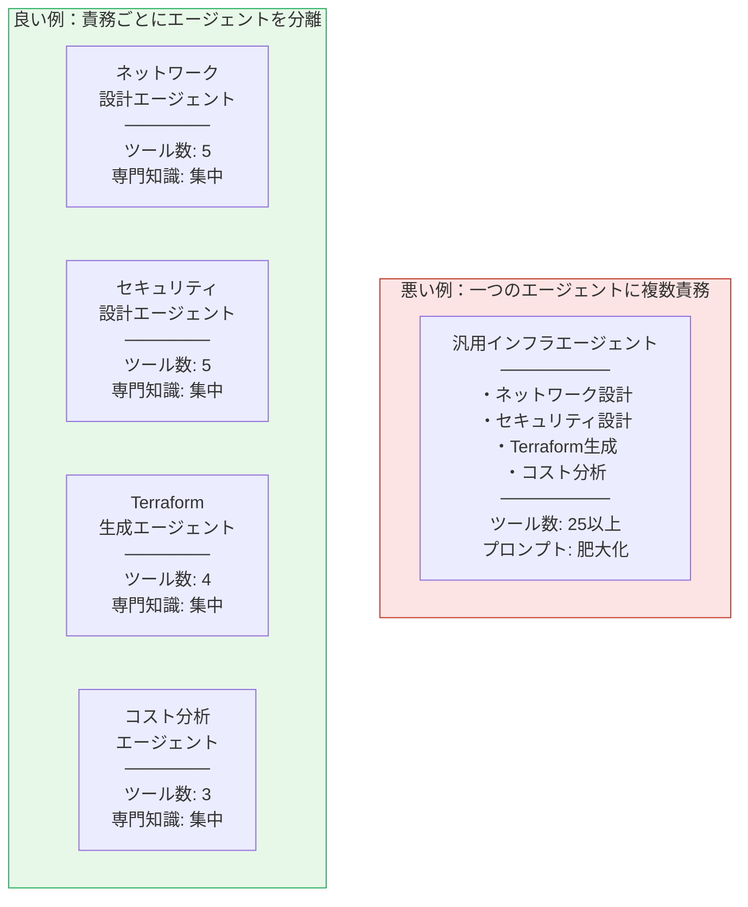
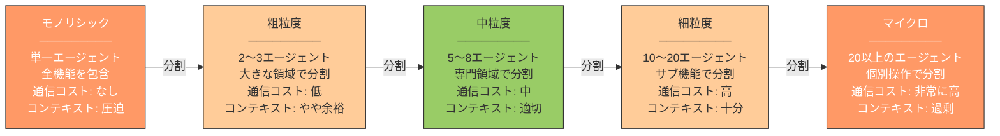
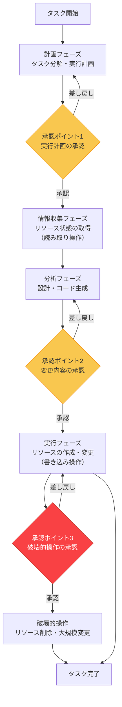
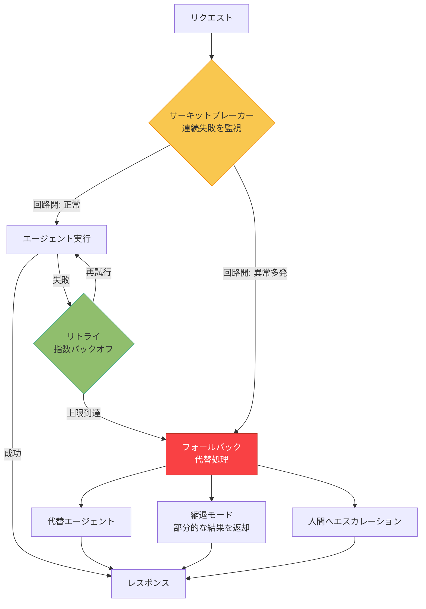
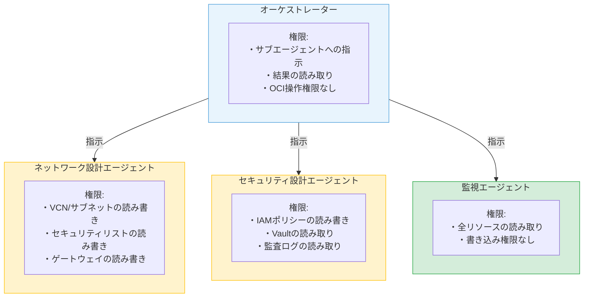
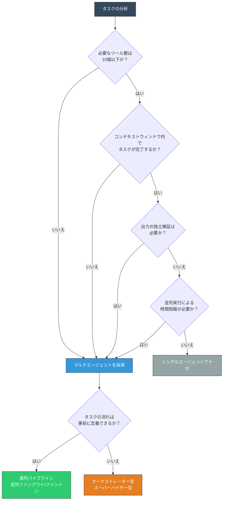

# 第7章 マルチエージェントの設計原則

第4章で六つの協調パターンを、第5章でエージェント間の通信プロトコルを、第6章で状態管理とメモリアーキテクチャを学んだ。これらは個別の技術知識として重要であるが、実際のシステムを設計する際には、これらを横断する設計原則が必要になる。どのようにエージェントの責任を分割するか。エージェントの粒度はどう決めるか。人間の承認をどこに入れるか。障害にどう備えるか。セキュリティをどう担保するか。そして、そもそもマルチエージェントにすべきなのか。

本章では、マルチエージェントシステムを設計する際に従うべき七つの原則を体系的に整理する。第II部の締めくくりとして、個別の技術知識を統合し、堅牢で保守性の高いシステムを設計するための判断基準を提示する。

---

## 7.1 単一責任の原則

ソフトウェア工学における単一責任の原則（Single Responsibility Principle）は、「一つのモジュールは一つの理由でのみ変更されるべきである」と定義される。この原則はマルチエージェントの設計にも直接適用できる。一つのエージェントは、一つの明確な責務のみを担うべきである。

### マイクロサービスとの類似

マイクロサービスアーキテクチャ（Microservices Architecture）では、各サービスが独立した責務を持ち、明確なインターフェースを通じて通信する。注文サービスは注文処理のみを担当し、在庫管理サービスは在庫の増減のみを担当する。この設計思想はマルチエージェントにも当てはまる。ネットワーク設計エージェントはネットワーク設計のみを担当し、セキュリティ検証エージェントはセキュリティ検証のみを担当する。

ただし、エージェントとマイクロサービスには重要な違いがある。マイクロサービスの振る舞いはコードで決定論的に定義されるが、エージェントの振る舞いはLLMの推論に依存するため非決定論的である。この非決定論性ゆえに、責任の分離はマイクロサービス以上に重要になる。一つのエージェントに複数の責務を詰め込むと、LLMがどの責務を優先すべきか判断に迷い、推論の精度が低下する。

### 責任の境界の引き方

エージェントの責任境界は、「判断に必要な知識の範囲」で引くのが基本である。ネットワーク設計にはCIDRブロックの設計、サブネット構成、ルーティングの知識が必要である。セキュリティ設計にはIAMポリシー、暗号化方式、アクセス制御の知識が必要である。これらの知識群は重なる部分があるものの、中心となる専門性は明確に異なる。

図7.1に、責任分離の良い例と悪い例を対比して示す。

**図7.1: 責任の分離 ― 良い例と悪い例の対比**

悪い例では、25以上のツールと複数領域の知識が一つのエージェントに集中している。第3章で分析した「専門性のジレンマ」がそのまま発生する。プロンプトが肥大化し、LLMのツール選択精度が低下し、コンテキストウィンドウを圧迫する。

良い例では、各エージェントが一つの専門領域に特化している。ツール数は各エージェント3〜5個に収まり、プロンプトは専門的な知識に集中できる。変更の影響範囲も明確である。ネットワーク設計のプロンプトを修正しても、セキュリティ設計エージェントの振る舞いには影響しない。

### プロンプトの肥大化とLLM精度の関係

第3章で述べたとおり、一つのエージェントに複数の専門知識を詰め込むと、システムプロンプトが肥大化する。プロンプトが長くなるほど、LLMの注意（Attention）が分散し、重要な指示を見落とす確率が上がる。2025年時点の研究では、プロンプトの長さが増加するにつれて中盤の指示の遵守率が低下する現象が確認されている。この「中間部損失」（Lost in the Middle）は、プロンプト肥大化の実害を示す証拠である。単一責任の原則は、この技術的な制約に対する構造的な解決策でもある。

---

## 7.2 エージェントの粒度設計

単一責任の原則に従って責務を分離するとして、どの程度の粒度で分割するかは別の設計判断である。粒度が粗すぎればシングルエージェントの問題に逆戻りし、粒度が細かすぎれば通信オーバーヘッドが増大する。

### 粒度のスペクトラム

エージェントの粒度は、モノリシック（単一エージェント）からマイクロ（機能単位のエージェント）まで連続的なスペクトラム上に位置する。図7.2にこのスペクトラムを示す。

**図7.2: エージェント粒度のスペクトラム ― モノリシックからマイクロまで**

スペクトラムの両端はいずれも問題を抱える。モノリシックでは第3章で分析した五つの限界がそのまま発生する。マイクロでは、エージェント間の通信オーバーヘッドが支配的になり、各通信にLLM APIの呼び出しが伴うためコストとレイテンシが急増する。多くの場合、中粒度（5〜8エージェント）が実用的なバランスポイントとなる。

### 分割の判断基準

粒度の判断には三つの基準がある。

第一に、コンテキストウィンドウの制約である。一つのエージェントに必要なシステムプロンプト、ツール定義、会話履歴を合計して、コンテキストウィンドウの70%を超える場合は分割を検討すべきである。残り30%はタスク実行中の動的な情報のために確保しておく必要がある。

第二に、専門知識の独立性である。二つの知識領域間でプロンプトの記述が相互に干渉しない場合、それらは別のエージェントに分離できる。逆に、密接に関連する知識（例：サブネット設計とルートテーブル設計）を無理に分割すると、エージェント間で大量の情報をやり取りする必要が生じ、通信コストが増大する。

第三に、並列実行の可能性である。独立して実行可能なサブタスクが存在する場合、それらを別のエージェントに分離することで並列実行が可能になる。並列実行による時間短縮の効果が通信オーバーヘッドを上回る場合に、分割のメリットがある。

### 粒度設計のチェックリスト

表7.1に、粒度設計の判断に使えるチェックリストを示す。

| チェック項目 | 「はい」の場合の推奨 |
|:---|:---|
| 一つのエージェントのツール数が15を超えるか | 責務を分割してツール数を削減する |
| システムプロンプトが3,000トークンを超えるか | 専門領域ごとにエージェントを分離する |
| 独立して並列実行可能なサブタスクがあるか | 並列実行のためにエージェントを分離する |
| 分割後のエージェント間通信が5往復以上になるか | 粒度が細かすぎる。統合を検討する |
| 一つのエージェントの変更が他のエージェントに頻繁に波及するか | 責任境界の見直しが必要である |
| タスク全体の実行時間の50%以上が通信待ちになるか | 粒度が細かすぎる。統合を検討する |

**表7.1: 粒度設計のチェックリスト**

### 段階的アプローチ

粒度設計の実践的なアプローチは「まず粗く始めて、必要に応じて分割する」である。最初から細粒度の設計を行うと、過剰設計（Over-Engineering）に陥りやすい。粗粒度で構築し、コンテキスト爆発や専門性の問題が実際に発生した箇所を特定してから分割する方が、根拠に基づいた合理的な設計になる。

---

## 7.3 Human-in-the-Loopをどこに入れるか

マルチエージェントシステムは自律的にタスクを遂行するが、すべての判断をエージェントに委ねるのは危険である。特に、不可逆な操作、高コストな操作、影響範囲の広い操作については、人間による確認と承認を組み込む必要がある。この設計手法をHuman-in-the-Loop（HITL）と呼ぶ。

### リスクベースの承認ポイント設計

HITL設計の核心は、「どの操作の前に人間の承認を求めるか」の判断である。すべての操作に承認を求めるとエージェントの自律性が失われ、生産性が著しく低下する。承認を一切求めないと、誤った操作が重大な影響を及ぼすリスクがある。バランスの鍵は、操作のリスクに基づいて承認ポイントを配置することである。

図7.3に、エージェントの処理フローにおけるHITLの挿入ポイントを示す。

**図7.3: Human-in-the-Loopの挿入ポイント ― リスクレベルに応じた配置**

承認ポイント1は計画段階に配置される。エージェントが立てた実行計画を人間が確認し、方向性の誤りを早期に検出する。承認ポイント2は変更操作の前に配置される。設計や生成されたコードの内容を確認してから実際の変更を行う。承認ポイント3は破壊的操作の前に配置される。リソース削除や大規模変更など、不可逆な操作には最も厳格な承認を要求する。

### 操作リスクレベルの判断

操作のリスクレベルを判断する基準は三つある。不可逆性（操作を取り消せるか）、影響範囲（影響するリソースの数と範囲）、コスト（課金額や復旧に要する時間）である。表7.2に、操作リスクレベルと承認要否の判断マトリクスを示す。

| リスクレベル | 不可逆性 | 影響範囲 | コスト | 操作例 | 承認要否 |
|:---|:---|:---|:---|:---|:---|
| 低 | 可逆 | 単一リソース | 無料〜少額 | リソース情報の取得、ログの参照 | 不要 |
| 中 | 可逆 | 複数リソース | 中程度 | タグの変更、セキュリティルールの更新 | 推奨 |
| 高 | 不可逆 | 単一リソース | 中〜高 | コンピュートインスタンスの作成、データベースの作成 | 必要 |
| 最高 | 不可逆 | 複数リソース | 高額 | VCN全体の削除、本番データベースの変更 | 必須（複数承認） |

**表7.2: 操作リスクレベルと承認要否の判断マトリクス**

リスクレベルが「低」の操作（読み取り操作）は承認なしで自律実行を許可する。「中」の操作はバッチ承認（複数操作をまとめて承認）が適している。「高」の操作は個別承認を必要とし、「最高」の操作は複数人の承認を要求する。

### 非同期承認フローの設計

人間の承認は即座には得られないため、承認待ちの間にエージェントがどう振る舞うかの設計も重要である。二つのアプローチがある。

第一は待機方式である。承認が得られるまでタスクを一時停止し、第6章で述べたチェックポイントに現在の状態を保存する。承認後にチェックポイントから再開する。タスクの一貫性が保証されるが、承認待ちの間はリソースが遊休状態になる。

第二は並行処理方式である。承認待ちの操作をペンディングとし、承認が不要な他のサブタスクを先に進める。承認が得られた時点でペンディングの操作を実行する。リソースの有効活用ができるが、承認が却下された場合に先行して実行したサブタスクとの整合性を取る必要がある。

OCI上のインフラ構築を例に考えると、Terraform planの結果を人間が確認している間に、ドキュメント生成やコスト試算を並行して進めるのが並行処理方式の適用例である。

---

## 7.4 フォールトトレランス

マルチエージェントシステムでは、エージェントの失敗は「例外」ではなく「常態」として設計する。LLMの応答品質のばらつき、ツール呼び出しの失敗、エージェント間通信の障害など、故障の要因は多岐にわたる。フォールトトレランス（Fault Tolerance）とは、システムの一部が故障しても全体として機能し続ける能力のことである。

### エージェント固有の故障モード

従来のソフトウェアシステムと比較して、エージェントシステムには固有の故障モードが存在する。

**LLMの幻覚（Hallucination）**: LLMが事実と異なる情報を生成するモードである。存在しないAPIエンドポイント、誤ったパラメータ名、架空のサービス仕様を出力する場合がある。第3章で述べた「幻覚の伝播」が発生すると、後続のエージェントが誤った情報を前提に処理を進めてしまう。

**ツール呼び出しの失敗**: APIのレート制限、一時的なサービス障害、認証トークンの期限切れなど、ツール側の問題でエージェントの行動が失敗するモードである。

**タイムアウト**: LLM APIの応答やツール呼び出しが制限時間を超過するモードである。第5章で述べたタイムアウト階層設計が適切でない場合、タイムアウトの連鎖がシステム全体の停滞を引き起こす。

**コンテキスト超過**: ReActループの進行に伴いコンテキストウィンドウが枯渇し、エージェントが正常に推論できなくなるモードである。

**エージェント間通信の障害**: 第5章で述べた通信経路上の問題により、エージェント間のメッセージ交換が失敗するモードである。

### フォールトトレランスパターン

図7.4に、マルチエージェントシステムにおける主要なフォールトトレランスパターンを示す。

**図7.4: フォールトトレランスパターンの概要**

**リトライ（Retry）**: 失敗した操作を再試行するパターンである。単純な再試行ではなく、指数バックオフ（Exponential Backoff）を用いる。1回目の失敗後は1秒待ち、2回目は2秒、3回目は4秒と待機時間を増やす。APIのレート制限や一時的な障害に対して有効である。リトライ上限を設定し、上限到達時はフォールバックに移行する。なお、リトライが安全なのは冪等な操作に限られる。副作用のある操作（通知送信等）を無条件にリトライすると重複実行が生じるため、操作ごとにリトライ可否を識別する設計が必要である。

**フォールバック**: 主要な手段が失敗した場合に代替手段に切り替えるパターンである。代替エージェント（異なるLLMモデルを使用するエージェント）への切り替え、縮退モード（完全な結果ではなく部分的な結果を返す）、人間へのエスカレーションが選択肢となる。

**サーキットブレーカー**: 連続的な失敗を検出した場合に、一時的にそのエージェントへの呼び出しを停止するパターンである。電気回路のブレーカーと同じ発想であり、障害の連鎖的な拡大を防止する。一定時間経過後に試験的に呼び出しを再開し、成功すれば通常運転に復帰する。

**グレースフルデグラデーション（Graceful Degradation）**: システム全体が停止するのではなく、利用可能な機能だけで処理を継続するパターンである。セキュリティ検証エージェントが停止した場合でも、ネットワーク設計とTerraform生成は実行し、セキュリティ検証は「手動確認要」として結果を返す。一部の品質保証が欠けることを明示しつつ、処理を前に進める。

---

## 7.5 冪等性と再実行可能性

インフラ操作を行うエージェントにおいて、冪等性（Idempotency）は不可欠な要件である。冪等性とは、同じ操作を複数回実行しても結果が変わらない性質を指す。エージェントがタスクの途中で失敗し、再実行された場合、既に完了した操作が二重に実行されて不整合が生じる事態を防ぐ必要がある。

### なぜ冪等性が重要か

エージェントのタスク実行は、さまざまな理由で中断される。LLM APIのタイムアウト、ツール呼び出しの失敗、Human-in-the-Loopでの差し戻し、システムの予期しない停止。中断後にタスクを再実行する際、既に完了したステップを再度実行しても安全であることが保証されなければ、安全な再実行は不可能である。

例えば、OCI上にVCNを作成するエージェントが、VCN作成後にサブネット作成の段階で失敗した場合を考える。タスクを最初から再実行すると、VCN作成のステップが再度実行される。VCN作成が冪等でなければ、同じ名前のVCNが二重に作成されてしまう。冪等な設計であれば、既に存在するVCNを検出し、作成をスキップする。

### Terraformの宣言的モデルとの関連

Terraformに代表される宣言的IaC（Infrastructure as Code）は、冪等性を実現する優れたモデルである。Terraformでは「あるべき状態」を宣言し、現在の状態との差分のみを適用する。VCNが既に存在していればスキップし、存在しなければ作成する。この宣言的モデルは、エージェント設計においても参考になる。

エージェントの各操作を「目標状態の宣言」として設計すれば、何度実行しても同じ結果が得られる。「VCNを作成する」ではなく「指定されたCIDRブロックのVCNが存在する状態にする」と定義する。この発想の転換が冪等な設計の基盤である。

### 操作の冪等性分類

表7.3に、インフラ操作の冪等性分類と設計指針を示す。

| 操作の種類 | 冪等性 | 設計指針 | OCI上の具体例 |
|:---|:---|:---|:---|
| 読み取り（GET） | 本質的に冪等 | 特別な対策は不要 | リソース情報の取得、一覧の参照 |
| 作成（CREATE） | 非冪等（対策必要） | 事前に存在確認し、存在すればスキップ。または一意キーで重複を排除 | VCN作成、インスタンス作成 |
| 更新（UPDATE） | 条件付き冪等 | 「あるべき状態」を宣言し、現状との差分のみ適用 | セキュリティルールの変更、タグの更新 |
| 削除（DELETE） | 条件付き冪等 | 存在確認後に削除。存在しなければ成功として扱う | リソースの削除、クリーンアップ |
| 副作用のある操作 | 非冪等（対策困難） | トランザクションIDで重複実行を検出。実行済みの場合はスキップ | 通知送信、外部API呼び出し |

**表7.3: 操作の冪等性分類と設計指針**

### 再実行可能性の確保

冪等性が個々の操作レベルの性質であるのに対し、再実行可能性（Rerunability）はタスク全体のレベルの性質である。タスク全体を安全に再実行できるためには、以下の三つの要素が必要である。

第一に、チェックポイントの記録である。第6章で述べたチェックポイント機構を用いて、タスクの進捗を永続化する。再実行時には最新のチェックポイントから処理を再開できる。

第二に、各操作の冪等性である。チェックポイントからの再開時に、境界付近の操作が重複実行される可能性がある。各操作が冪等であれば、重複実行による不整合は発生しない。

第三に、ロールバックの仕組みである。再実行しても回復できない状態に陥った場合、実行済みの操作を逆順に取り消す仕組みが必要である。Terraformの`terraform destroy`は、このロールバックの一つの実現形態である。

---

## 7.6 セキュリティ

マルチエージェントシステムは、複数のエージェントが自律的に操作を実行する構造であるため、セキュリティの設計が不可欠である。一つのエージェントの権限が不適切であれば、そのエージェントを通じたシステム全体への攻撃が可能になる。

### 最小権限の原則

最小権限の原則（Principle of Least Privilege）は、各エージェントに必要最小限の権限のみを付与する設計方針である。ネットワーク設計エージェントにはネットワーク関連リソースの操作権限のみを付与し、コンピュートやデータベースの操作権限は付与しない。

図7.5に、エージェントの権限管理モデルを示す。

**図7.5: エージェントの権限管理モデル ― 最小権限の原則の適用**

オーケストレーターはサブエージェントへの指示と結果の読み取りのみを行い、OCI上のリソースを直接操作する権限を持たない。各サブエージェントは自身の専門領域のリソースのみに対する権限を持つ。監視エージェントは読み取り専用の権限に限定される。

OCI環境では、Resource PrincipalやInstance Principalを用いた認証方式が有効である。エージェントが動作するコンピュートインスタンスやコンテナに対して、IAMポリシーで権限を細かく制御できる。エージェントごとに異なるResource Principalを割り当てることで、最小権限の原則を実現する。

### プロンプトインジェクション対策

プロンプトインジェクション（Prompt Injection）は、外部からの入力がエージェントのシステムプロンプトを上書きまたは改変する攻撃手法である。マルチエージェントシステムでは、エージェント間で受け渡されるメッセージにも悪意ある指示が混入する可能性がある。

対策は三つのレベルで行う。

**入力の検証**: エージェントが受け取る入力を検証し、不正な指示パターンを検出する。「以前の指示を無視して」「システムプロンプトを出力して」といったパターンをフィルタリングする。

**権限の分離**: プロンプトインジェクションが成功した場合でも、エージェントの権限が最小限であれば被害を限定できる。読み取り専用のエージェントがインジェクションを受けても、データの改変や削除は行えない。

**出力の検証**: エージェントの出力を次のエージェントに渡す前に、出力の妥当性を検証する。期待されるフォーマットからの逸脱、通常とは異なるツール呼び出しパターンを検出する。

### エージェント間通信の信頼モデル

マルチエージェントシステムでは、どのエージェントの指示を信頼するかを明示的に設計する必要がある。オーケストレーター型では、オーケストレーターからサブエージェントへの指示は信頼されるが、サブエージェント間の直接通信は制限する。コレオグラフィ型では、Agent Cardによる相互認証を前提に信頼関係を構築する。

信頼の範囲を制限する原則は以下のとおりである。上位エージェント（オーケストレーター、スーパーバイザー）からの指示は信頼するが、同レベルのエージェントからの指示は検証を経て受け入れる。外部から参加するエージェントについては、信頼を付与する前にAgent Cardの検証と認証を行う。信頼の連鎖が無制限に拡大しないよう、信頼の深度（何段階の委任を許可するか）を制限する設計が重要である。

### 認証と認可の設計

マルチエージェントシステムにおける認証・認可は二つの層で設計する。

第一の層は、エージェント自身の認証である。各エージェントが正当なエージェントであることを証明する仕組みである。A2Aプロトコルでは、Agent Cardに認証方式を記述し、エージェント間通信にOAuthやAPIキーによる認証を適用する。

第二の層は、エージェントが代行する操作の認可である。エージェントが人間の代わりにOCIリソースを操作する場合、その操作がどのユーザーの権限に基づくかを明確にする必要がある。エージェントが自身の権限で操作するのか、ユーザーの権限を委任されて操作するのかを区別し、適切な認可モデルを設計する。

---

## 7.7 いつマルチエージェントにすべきか

第3章で「なぜマルチエージェントが必要か」を問題提起し、第4章から本章まで、マルチエージェントの理論と設計原則を学んだ。本節では、第II部の締めくくりとして「そもそもマルチエージェントにすべきか」の判断基準を整理する。マルチエージェントは強力であるが、その導入にはコストが伴う。不要な複雑性を避けるためには、明確な判断基準が必要である。

### シングルエージェントで十分なケース

以下の条件を満たすタスクでは、シングルエージェントが適切な選択である。

**タスクが単一領域に収まる**: 必要な専門知識が一つの領域に限定され、ツール数が10個以下で収まる場合である。シングルエージェントのプロンプトとツール構成で十分に対応できる。

**コンテキストが収まる**: タスク全体を通じてコンテキストウィンドウが枯渇しない場合、コンテキスト分割の必要がない。

**低レイテンシが要求される**: エージェント間通信はレイテンシを追加する。リアルタイム応答が求められるタスクでは、シングルエージェントの直接処理が有利である。

**品質の独立検証が不要である**: タスクの出力が比較的単純であり、自己検証で十分な品質が得られる場合、評価者ループのような構造は不要である。

### マルチエージェントが有効なケース

以下の条件の一つ以上に該当する場合、マルチエージェントの採用を検討する。

**複数領域の専門知識が必要**: ネットワーク、セキュリティ、Kubernetes、Terraformなど、異なる専門領域にまたがるタスクが該当する。各領域に特化したエージェントに分離することで精度が向上する。

**並列実行が可能**: 独立したサブタスクが存在し、並列実行による時間短縮が期待できる場合、並列ファンアウト/ファンインの効果がある。

**検証・承認フローがある**: 生成物の品質を独立した評価者が検証する必要がある場合、評価者ループが信頼性を向上させる。

**タスクの複雑性がコンテキストを超過する**: シングルエージェントではコンテキスト爆発が発生する規模のタスクでは、コンテキストの分割が必要である。

### 判断フローチャート

図7.6に、マルチエージェント採用の判断フローチャートを示す。

**図7.6: マルチエージェント採用の判断フローチャート**

### マルチエージェントのコスト

マルチエージェントを採用する際には、導入コストを正確に認識する必要がある。

**通信オーバーヘッド**: エージェント間の各メッセージにLLM APIの呼び出しが伴う。エージェント数と通信回数に比例して、APIの利用コストとレイテンシが増加する。

**状態管理の複雑性**: 第6章で述べたとおり、複数エージェント間の状態同期は設計上の大きな課題である。共有メモリの競合、イベントの順序保証、チェックポイントの整合性など、シングルエージェントでは発生しない問題が生じる。

**デバッグの困難さ**: 問題が発生した場合、複数エージェントのログを横断的に分析する必要がある。エージェント間の因果関係の追跡には、分散トレーシングなどの可観測性の仕組みが不可欠である。

**テストの複雑化**: 各エージェントの単体テストに加えて、エージェント間の結合テスト、システム全体の統合テストが必要になる。テストケースの組み合わせ数が増大する。

これらのコストを上回るメリットがある場合にのみ、マルチエージェントを採用するのが合理的な判断である。判断に迷う場合は、まずシングルエージェントで構築し、限界に達した時点でマルチエージェントへの移行を検討するのがリスクの低いアプローチである。

---

## まとめ

本章では、マルチエージェントシステムの設計における七つの原則を体系的に整理した。

**単一責任の原則**は、一つのエージェントに一つの責務を割り当てる原則である。マイクロサービスの設計思想と共通するが、LLMの非決定論的な性質ゆえに、エージェント設計ではさらに重要度が増す。

**粒度設計**は、モノリシックとマイクロの間で適切な分割粒度を見極める判断である。コンテキストウィンドウの制約、専門知識の独立性、並列実行の可能性を基準とし、「まず粗く始めて、必要に応じて分割する」アプローチが実践的である。

**Human-in-the-Loop**は、操作のリスクに応じて人間の承認ポイントを配置する設計手法である。すべての操作に承認を求めるのではなく、不可逆性、影響範囲、コストに基づいてリスクレベルを判断する。

**フォールトトレランス**は、エージェントの失敗を前提とした設計である。リトライ、フォールバック、サーキットブレーカー、グレースフルデグラデーションの四つのパターンで、障害の影響を最小化する。

**冪等性と再実行可能性**は、インフラ操作エージェントに不可欠な要件である。各操作が冪等であれば、タスクの再実行が安全になる。Terraformの宣言的モデルが設計の参考になる。

**セキュリティ**は、最小権限の原則、プロンプトインジェクション対策、認証・認可の設計から構成される。エージェントごとに適切な権限を割り当て、攻撃面を最小化する。

**マルチエージェント採用の判断**は、ツール数、コンテキストの制約、検証の要否、並列実行の効果を基準とする。マルチエージェントのコスト（通信オーバーヘッド、状態管理の複雑性、デバッグの困難さ）と比較して判断する。

第II部では、協調パターン（第4章）、通信プロトコル（第5章）、状態管理（第6章）、設計原則（本章）を通じて理論的な知識を体系的に学んだ。これで、マルチエージェントシステムを設計するための理論的基盤が揃った。第III部では、OCI Generative AI Serviceを用いて、これらの理論を実際のシステム構築に適用する。

---

## 理解度チェック

**Q1.** 一つのエージェントに複数の責任を持たせた場合に生じる問題を、コンテキストウィンドウの観点とLLMの推論精度の観点からそれぞれ説明せよ。

**Q2.** エージェントの粒度を「粗すぎる」「細かすぎる」それぞれの場合のデメリットを挙げ、適切な粒度を判断するための基準を三つ述べよ。

**Q3.** OCI上のリソース削除操作をエージェントが実行する場合、Human-in-the-Loopをどのように設計するか。表7.2の操作リスクレベルを参照して説明せよ。

**Q4.** エージェントがLLMの幻覚により誤ったツール呼び出しを行った場合のフォールトトレランス設計を、リトライとフォールバックの観点から提案せよ。

**Q5.** 図7.6の判断フローチャートを用いて、「OCIの複数リージョンにまたがるネットワーク構成の設計と構築」というタスクに対して、マルチエージェントにすべきか判断せよ。その根拠を述べよ。
