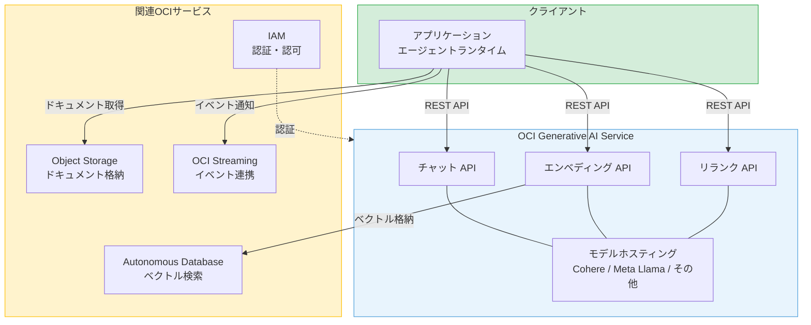
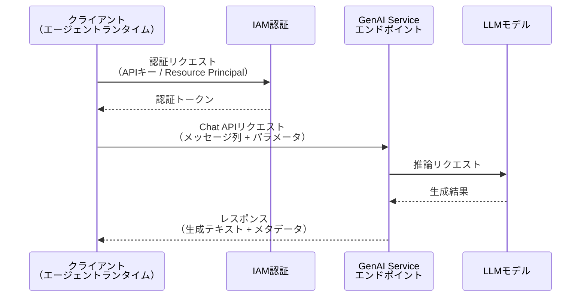
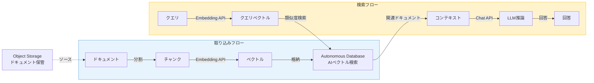

# 第8章 OCI Generative AI Service入門

第II部では、協調パターン、通信プロトコル、状態管理、設計原則という四つの柱を通じて、マルチエージェントシステムの理論的基盤を学んだ。理論は「何を」「なぜ」を教えてくれるが、「どうやって」は実装の文脈で初めて意味を持つ。

第III部では、理論を実践に移す。その出発点として、本章ではOCI Generative AI Service（以下、GenAI Service）の全体像と利用方法を整理する。GenAI Serviceは、エージェント構築における推論エンジンの役割を担うサービスである。第2章で学んだFunction Callingやコンテキスト管理の概念が、OCI上でどのようなAPIとサービスで実現されるかを具体的に対応づける。

---

## 8.1 OCI GenAI Serviceの全体像

OCI Generative AI Serviceは、Oracle Cloud Infrastructure上で提供される生成AIのマネージドサービスである。複数のLLMをAPI経由で利用でき、エージェントの推論エンジンとして機能する。

### サービスの位置づけ

OCIのAI/MLサービス群の中で、GenAI Serviceは「基盤モデルの推論」を担当する。OCIには文書理解（Document Understanding）、音声認識（Speech）、視覚AI（Vision）等の特化型AIサービスも存在する。GenAI Serviceはこれらと異なり、汎用的なテキスト生成・理解を提供する基盤モデルサービスである。

図8.1にGenAI Serviceのアーキテクチャと他OCIサービスとの関係を示す。



**図8.1: OCI Generative AI Serviceのアーキテクチャと関連サービス**

### 主要機能

GenAI Serviceは三つの主要機能を提供する。

**チャット（Chat）**: 会話形式のテキスト生成である。メッセージ列を入力とし、次のアシスタントメッセージを生成する。テキスト生成や要約もChat APIで実現可能であり、エージェントのReActループにおける「推論」ステップの中核を担う。

**エンベディング（Embedding）**: テキストをベクトル（数値の配列）に変換する。第2章で学んだRAGの実現において、ドキュメントのベクトル化とクエリのベクトル化に使用する。Autonomous DatabaseのAI Vector Search機能と組み合わせて長期記憶を実現する。

**リランク（Rerank）**: 検索結果の関連度を再評価し、並べ替える。RAGにおいて、ベクトル検索で取得した候補ドキュメントの精度を向上させるために使用する。

### エージェント構築における役割

エージェント構築の観点から、GenAI Serviceの最も重要な機能はチャットAPIである。第1章で学んだReActパターンは、LLMへのチャットリクエストを繰り返すことで実現される。各ステップでシステムプロンプト、会話履歴、ツール実行結果をチャットAPIに送信し、次のアクションを決定する。

エンベディングAPIは、第6章で学んだ長期記憶（ナレッジベース）の構築に不可欠である。要約APIは、コンテキストウィンドウの管理に補助的に活用できる。

### リージョン可用性

GenAI Serviceは、OCIの全リージョンで利用可能ではなく、特定のリージョンで提供されている。利用可能なリージョンはサービスの更新に伴い拡大する。エージェントシステムの設計では、GenAI Serviceが利用可能なリージョンにランタイムを配置する方式が基本となる。それが困難な場合は、クロスリージョンでのAPI呼び出しも選択肢となる。

---

## 8.2 利用可能なモデル

GenAI Serviceでは、複数のプロバイダーのLLMが利用可能である。モデルの選択はエージェントの性能に直結するため、タスクの要件に応じた適切なモデル選択が重要である。

表8.1に、主要なモデルの比較を示す。なお、利用可能なモデルはサービスの更新に伴い拡大しているため、最新の情報はOCI公式ドキュメントで確認できる。

| モデル | プロバイダー | コンテキスト長 | 特性 | 推奨用途 |
|:---|:---|:---|:---|:---|
| Cohere Command A | Cohere | 256K | 最新の推論モデル、Function Calling対応、多言語対応 | エージェントの推論エンジン |
| Cohere Command R+ | Cohere | 128K | RAG最適化、ツール使用対応、多言語対応 | RAG、エージェントの推論エンジン |
| Cohere Command R | Cohere | 128K | Command R+の軽量版、高速応答 | 高速応答が求められるエージェント |
| Meta Llama 3.3 (70B) | Meta | 128K | オープンソース、高い推論能力、Function Calling対応 | 汎用的なテキスト生成、推論タスク |
| Cohere Embed 4 | Cohere | - | マルチモーダル対応のエンベディングモデル | RAGのためのドキュメントベクトル化 |

**表8.1: OCI GenAI Serviceで利用可能な主要モデルの比較**

### モデル選択の判断基準

エージェント用途のモデル選択では、以下の四つの基準を考慮する。

**コンテキスト長**: エージェントはシステムプロンプト、会話履歴、ツール定義、ツール実行結果を一度に送信する。これらの合計トークン数がモデルのコンテキスト長を超えないことが必要条件である。ツール数が多いエージェントほど、ツール定義だけで大量のトークンを消費する。128Kトークンのコンテキスト長は、多くのエージェントユースケースに十分である。

**Function Calling対応**: ツール呼び出しにはFunction Calling（Tool Use）対応のモデルが必要である。非対応モデルではプロンプトエンジニアリングによる擬似的な実現が必要となり、精度と信頼性が低下する。詳細は8.6節で扱う。

**推論能力**: 複雑なタスクの分解、計画の立案、条件分岐の判断など、エージェントに求められる推論能力はモデルの規模に概ね比例する。大規模モデル（70B以上）は推論能力に優れるが、応答速度とコストのトレードオフがある。

**コスト**: モデルの利用コストは、入力トークン数と出力トークン数に基づく。エージェントはReActループの各ステップでAPIを呼び出すため、ループの回数に比例してコストが増大する。マルチエージェントでは、エージェント数とループ回数の積に比例する。

### エージェント用途の推奨

エージェント構築においては、Function Calling対応と推論能力を優先してモデルを選択する。本番運用ではCohere Command AまたはCohere Command R+が推奨される。コストを重視する検証フェーズではMeta Llama 3.3（70B）が選択肢となる。エンベディング用途にはCohere Embed 4を使用する。

---

## 8.3 APIの基本

GenAI ServiceのAPIは、REST APIとして提供される。本節では、エージェント構築で最も頻繁に使用するChat APIの構造を整理する。

### Chat APIの構造

Chat APIは、メッセージのリストを入力として受け取り、アシスタントの応答を生成する。リクエストの主要な要素は以下のとおりである。

**メッセージ形式**: 各メッセージはロール（`SYSTEM`、`USER`、`CHATBOT`、`TOOL`）とコンテンツを持つ。`SYSTEM`ロールはシステムプロンプトに使用する。`USER`ロールはユーザーの入力に使用する。`CHATBOT`ロールは過去のアシスタントの応答に使用する。`TOOL`ロールはツール実行結果の返却に使用する。

**パラメータ**: 生成を制御するパラメータとして、`temperature`（ランダム性）と`maxTokens`（最大出力トークン数）がある。さらに`topP`（サンプリング範囲）と`topK`（候補トークン数）も指定可能である。エージェント用途では、`temperature`を低め（0.0〜0.3）に設定して出力の一貫性を重視する。

図8.2にAPI呼び出しのフローを示す。



**図8.2: API呼び出しのフロー（認証→リクエスト→推論→レスポンス）**

### 認証方式

GenAI ServiceのAPIにアクセスするための認証方式は三つある。

**APIキー**: ユーザーのOCIアカウントに紐づくAPIキーペアを使用する。開発環境やローカルでの検証に適する。キーファイルの管理が必要であり、本番環境には推奨されない。

**Resource Principal**: OCI上のリソース（Functions、Container Instances等）に割り当てられる認証方式である。Dynamic Groupと IAMポリシーにより、リソースに対して権限を付与する。APIキーの管理が不要であり、本番環境に推奨される。

**Instance Principal**: Computeインスタンスに割り当てられる認証方式である。Resource Principalと同様にキーレスであり、Computeインスタンス上でエージェントを実行する場合に使用する。

第7章で学んだ最小権限の原則に基づき、エージェントに付与する権限は必要最小限に限定する。GenAI Serviceの推論APIのみを呼び出す権限と、必要なOCIサービスの操作権限を分離して設計する。

### レスポンスの構造

Chat APIのレスポンスには、生成テキスト、終了理由、トークン使用量が含まれる。終了理由（finish reason）は、生成が正常完了したか、トークン上限に到達したか、ツール呼び出しが発生したかを示す。エージェントランタイムは終了理由を参照して次の処理を決定する。

エラー時にはHTTPステータスコードとエラーメッセージが返される。主なステータスコードは以下のとおりである。400（不正なリクエスト）、401（認証エラー）、404（リソース不存在）、429（レート制限超過）、500（サーバー内部エラー）である。このうち429と500は一時的エラーとしてリトライ対象となる。

### レート制限とスロットリング

GenAI ServiceにはAPIのレート制限が設定されている。一定期間内のリクエスト数が上限に達すると、HTTPステータスコード429（Too Many Requests）が返される。

エージェントは、レート制限に対して第5章で学んだリトライ戦略を適用する。指数バックオフとジッターを組み合わせたリトライにより、一時的なレート制限からの回復を図る。マルチエージェントシステムでは、複数のエージェントが同時にAPIを呼び出すため、レート制限に到達しやすい。エージェント間でリクエストのタイミングを調整するか、Dedicated AI Cluster（8.5節）により専用のリソースを確保する設計が必要になる。

---

## 8.4 OCI Python SDKでのLLM呼び出し

本節では、OCI SDK for Pythonを使ったGenAI Serviceの呼び出しパターンを示す。本書のコード例は構造理解のためのものであり、実際の実装はClaude Code等のAIコーディングアシスタントで行う前提である。

### 基本的なチャットリクエスト

コード8.1に、GenAI Serviceへの基本的なチャットリクエストのパターンを示す。

```python
# コード8.1: OCI GenAI Serviceへの基本的なチャットリクエスト
import oci

# クライアントの初期化（APIキー認証の場合）
config = oci.config.from_file()
client = oci.generative_ai_inference.GenerativeAiInferenceClient(
    config=config,
    service_endpoint="https://inference.generativeai.{region}.oci.oraclecloud.com"
)

# チャットリクエストの構築
chat_request = oci.generative_ai_inference.models.CohereChatRequest(
    message="OCI上にVCNを作成する手順を教えてください",
    chat_history=[],           # 過去の会話履歴
    preamble_override="あなたはOCIのインフラ設計の専門家です。",
    temperature=0.1,
    max_tokens=2048
)

# リクエストの送信
response = client.chat(
    chat_details=oci.generative_ai_inference.models.ChatDetails(
        compartment_id="ocid1.compartment.oc1...",
        serving_mode=oci.generative_ai_inference.models.OnDemandServingMode(
            model_id="cohere.command-r-plus-08-2024"
        ),
        chat_request=chat_request
    )
)

# レスポンスの取得
result = response.data.chat_response
print(result.text)
```

コードの構造を整理する。`GenerativeAiInferenceClient`はGenAI Serviceの推論APIにアクセスするためのクライアントである。`CohereChatRequest`はCohereモデル向けのチャットリクエストを構築する。`ChatDetails`はリクエストのメタ情報（コンパートメント、サービングモード、モデル）を指定する。

### ストリーミングレスポンス

長い応答の場合、ストリーミングレスポンスを使用すると、応答を逐次受け取ることができる。ユーザーの体感レイテンシの改善に有効である。

```python
# コード8.2: ストリーミングレスポンスの処理パターン
chat_request = oci.generative_ai_inference.models.CohereChatRequest(
    message="OCIのセキュリティベストプラクティスを詳しく説明してください",
    is_stream=True,
    temperature=0.1,
    max_tokens=4096
)

# ストリーミングリクエストの送信
response = client.chat(
    chat_details=oci.generative_ai_inference.models.ChatDetails(
        compartment_id="ocid1.compartment.oc1...",
        serving_mode=oci.generative_ai_inference.models.OnDemandServingMode(
            model_id="cohere.command-r-plus-08-2024"
        ),
        chat_request=chat_request
    )
)

# ストリーミングイベントの処理
for event in response.data.events():
    if event.data:
        # 各チャンクのテキストを順次処理
        print(event.data.text, end="", flush=True)
```

ストリーミングの処理では、レスポンスをイベントストリームとして受信し、各チャンクを逐次処理する。ストリーミングはユーザーへの進捗表示に有用である。ただし、ツール呼び出しの判断にはレスポンス全体が必要であるため、エージェントランタイム内部ではノンストリーミングを使用する場合が多い。

---

## 8.5 Dedicated AI Cluster vs On-Demand

GenAI Serviceには二つの利用形態がある。Dedicated AI Cluster（専用AIクラスタ）とOn-Demand（オンデマンド）である。エージェントシステムの運用形態に応じて適切な形態を選択する。

表8.2に両者の比較を示す。

| 項目 | Dedicated AI Cluster | On-Demand |
|:---|:---|:---|
| リソース | 専用GPUリソースを確保 | 共有リソースを利用 |
| 課金 | 時間課金（ユニット単位） | トークン従量課金 |
| 性能 | 一定のスループットを保証 | 利用状況により変動 |
| レート制限 | 専用リソースのため緩い | 共有リソースのため厳しい |
| カスタムモデル | ファインチューニングモデルのホスティング可能 | 提供モデルのみ |
| 最低利用期間 | あり（ユニット契約） | なし |
| 適用場面 | 本番運用、安定した性能が必要 | 検証、小規模利用、コスト重視 |

**表8.2: Dedicated AI Cluster vs On-Demand 比較表**

### Dedicated AI Cluster

Dedicated AI Clusterは、専用のGPUリソースを確保する形態である。他のユーザーとリソースを共有しないため、安定したスループットとレイテンシが得られる。マルチエージェントシステムでは複数のエージェントが同時にLLM APIを呼び出すため、性能の安定性は重要な要件となる。

Dedicated AI Clusterでは、ファインチューニング（モデルの追加学習）を行ったカスタムモデルをホスティングすることも可能である。特定のドメインに特化した知識や出力形式をモデルに組み込みたい場合に有用である。

### On-Demand

On-Demandは、共有リソースを従量課金で利用する形態である。初期投資が不要であり、利用量に応じた課金のため、検証フェーズや小規模な利用に適している。

### エージェントシステムにおける選択基準

開発と検証のフェーズではOn-Demandで開始し、本番運用への移行時にDedicated AI Clusterを検討するのが実践的なアプローチである。リクエスト量が一定の水準を超えると、トークン従量課金よりDedicated AI Clusterの時間課金の方がコスト効率に優れる。判断の分岐点は以下のとおりである。

**On-Demandが適する場合**: エージェントの設計・検証フェーズ。リクエスト量が少なく予測困難な段階。コストを最小化したい場合。

**Dedicated AI Clusterが適する場合**: 本番運用で安定した応答性能が必要な場合。マルチエージェントシステムで同時リクエストが多い場合。ファインチューニングモデルを使用する場合。レート制限の制約を緩和したい場合。

---

## 8.6 Function Calling対応状況

エージェント構築において、Function Calling（Tool Use）はLLMがツールを選択・呼び出すための不可欠な機能である。第2章で学んだFunction Callingの概念が、GenAI Service上でどのように実現されるかを整理する。

表8.3に、モデル別のFunction Calling対応状況を示す。

| モデル | Function Calling | 備考 |
|:---|:---|:---|
| Cohere Command A | 対応 | 最新のFunction Calling対応、精度が高い |
| Cohere Command R+ | 対応 | Tool定義をリクエストに含めることで利用可能 |
| Cohere Command R | 対応 | Command R+と同様のインターフェース |
| Meta Llama 3.3 (70B) | 対応 | GenAI ServiceのAPI経由でツールサポートを利用可能 |

**表8.3: モデル別Function Calling対応状況**

### Cohereモデルでのツール使用

Cohereモデル（Command A、Command R+、Command R）は、APIリクエストにツール定義を含めることでFunction Callingを実現する。ツール定義には、ツール名、説明、パラメータのスキーマを記述する。

LLMがツール呼び出しを判断した場合、レスポンスにはツール名と引数が構造化された形式で返される。エージェントランタイムは、このレスポンスを解析してツールを実行し、結果を次のリクエストに含めてLLMに返す。このサイクルが、第1章で学んだReActパターンの実装基盤となる。

### ツール定義の設計

ツール定義の品質は、LLMのツール選択精度に直結する。以下のポイントを押さえる。

**ツール名**: 機能を端的に表す名前を付ける。`create_vcn`、`list_subnets`のように、操作対象と動作を含める。

**説明文**: LLMがツールを選択する判断材料となるため、十分な情報を記述する。「OCI上にVCNを作成する。CIDRブロック、コンパートメントID、表示名を指定する」のように、何をするか、何が必要かを明記する。

**パラメータスキーマ**: 各パラメータの名前、型、説明、必須/任意を明確に定義する。型が正確でないとLLMが誤った引数を生成するリスクがある。

### 非対応モデルでの回避策

Function Callingに対応していないモデルでも、プロンプトエンジニアリングにより擬似的にツール使用を実現できる。システムプロンプトに利用可能なツールの一覧と呼び出し形式を記述し、LLMの出力をパースしてツール呼び出しを検出する方式である。

ただし、この方式はFunction Calling対応モデルと比較して以下の課題がある。出力形式の安定性が低く、JSONパースに失敗する場合がある。ツール選択の精度がモデルの推論能力に強く依存する。複数ツールの同時呼び出しの制御が困難である。

エージェント構築においては、可能な限りFunction Calling対応モデルを使用し、非対応モデルの利用は限定的な場面に留めることを推奨する。

---

## 8.7 RAGのためのEmbeddingモデル

第2章で学んだRAG（Retrieval-Augmented Generation）は、エージェントの長期記憶を実現する重要な手法である。第6章ではマルチエージェントにおける長期記憶のアーキテクチャを整理した。本節では、RAGの実現に必要なEmbeddingモデルのOCI上での利用方法を整理する。

### Embeddingモデル

GenAI Serviceでは、テキストをベクトルに変換するためのEmbeddingモデルが提供されている。Cohere Embed 4はマルチモーダル対応のエンベディングモデルであり、テキストだけでなく画像のベクトル化にも対応する。多言語に対応しており、日本語テキストのベクトル化にも利用できる。

Embeddingモデルの利用フローは以下のとおりである。テキスト（ドキュメントの断片やクエリ）をEmbedding APIに送信し、高次元のベクトル（数値配列）を取得する。このベクトルをベクトルストアに格納し、類似度検索に使用する。

### RAGアーキテクチャとOCIサービスの対応

図8.3に、RAGアーキテクチャをOCIサービスに対応づけた図を示す。



**図8.3: RAGアーキテクチャとOCIサービスの対応図**

### Autonomous Database AI Vector Search

Autonomous Databaseは、AI Vector Search機能を備えたOCIのマネージドデータベースサービスである。第6章で述べたとおり、構造化データとベクトルデータを同一のデータベース内で管理できる点が特長である。

RAGの実装では、Embeddingモデルで生成したベクトルをAutonomous Databaseに格納する。検索時には、クエリのベクトルとの類似度に基づいて関連ドキュメントを取得する。取得した関連ドキュメントをChat APIのコンテキストに含めてLLMに渡す。SQLクエリとベクトル検索を組み合わせたハイブリッド検索も可能である。たとえば、特定カテゴリのドキュメントに絞って類似検索を行う条件付き検索を実現できる。

### Object Storageとの連携

RAGのソースとなるドキュメント（PDF、テキストファイル、設計書等）はObject Storageに格納する。Object Storageはイレブンナインの耐久性を提供し、大容量のドキュメントを低コストで保存できる。

取り込みフローでは、Object Storageからドキュメントを取得する。テキスト抽出、チャンク分割、ベクトル化のパイプラインを通してAutonomous Databaseに格納する。このパイプライン自体を、第4章で学んだ直列パイプラインパターンで構成することも可能である。

---

## まとめ

本章では、OCI Generative AI Serviceの全体像と利用方法を整理した。

GenAI Serviceは、チャット、エンベディング、リランクの三つの主要機能を提供するマネージドサービスである。エージェント構築においては、チャットAPIが推論エンジン、エンベディングAPIが長期記憶の基盤として機能する。

モデルの選択は、コンテキスト長、Function Calling対応、推論能力、コストの四つの基準で判断する。エージェント用途ではFunction Calling対応モデル（Cohere Command AやCommand R+等）が推奨される。

APIの呼び出しは、OCI Python SDKを通じて行う。認証にはAPIキー（開発環境）とResource Principal（本番環境）を使い分ける。レート制限に対しては指数バックオフによるリトライ戦略を適用する。

利用形態の選択は開発フェーズではOn-Demandが適する。本番運用ではDedicated AI Clusterが基本方針である。

Function Calling対応モデルの利用がエージェント構築の前提となる。非対応モデルではプロンプトエンジニアリングによる回避策が存在するが、精度と安定性で劣る。

RAGの実現には、Cohere Embed 4とAutonomous Database AI Vector Searchの組み合わせが有効である。Object Storageと連携したドキュメント取り込みパイプラインにより、エージェントの長期記憶を構築する。

GenAI Serviceの利用方法を理解した。次章では、この知識を基盤として、OCI上で実際にシングルエージェントを設計・構築する。

---

## 理解度チェック

**Q1.** OCI Generative AI Serviceが提供する主要機能を列挙し、エージェント構築においてそれぞれがどのように活用されるかを説明せよ。

**Q2.** エージェント用途のモデル選択において、コンテキスト長とFunction Calling対応が重要な理由を説明せよ。

**Q3.** Dedicated AI ClusterとOn-Demandの使い分けを、エージェントシステムの開発フェーズ（検証/本番）に応じて説明せよ。

**Q4.** Function Callingに対応していないモデルをエージェントに利用する場合、どのような回避策が考えられるか述べよ。
