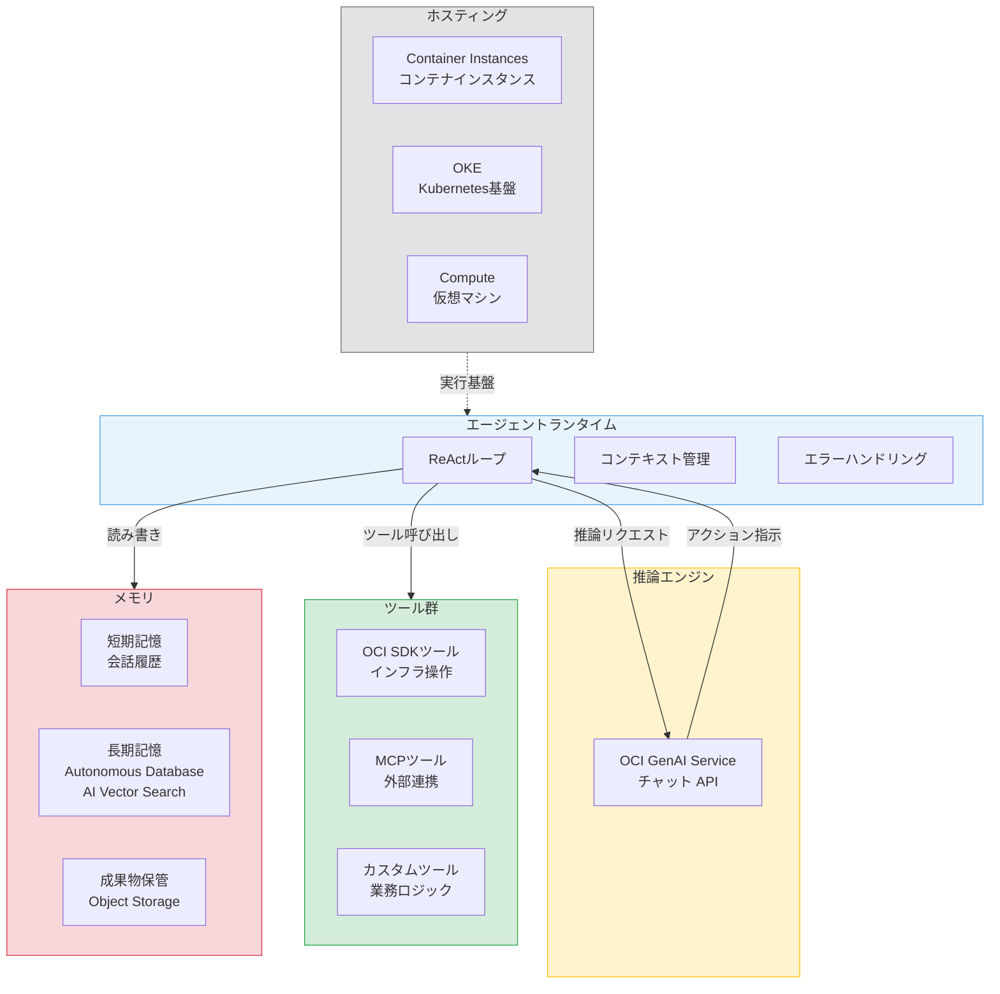
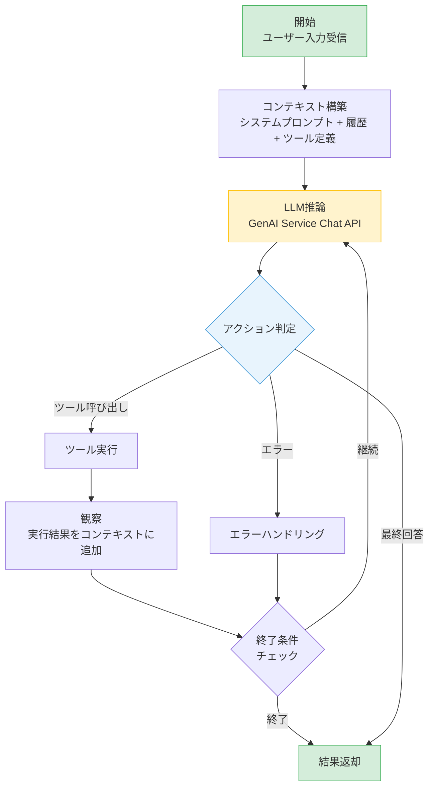
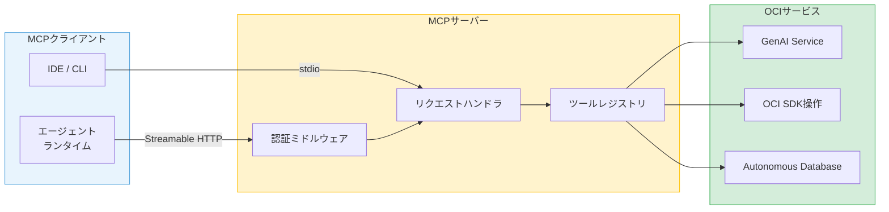
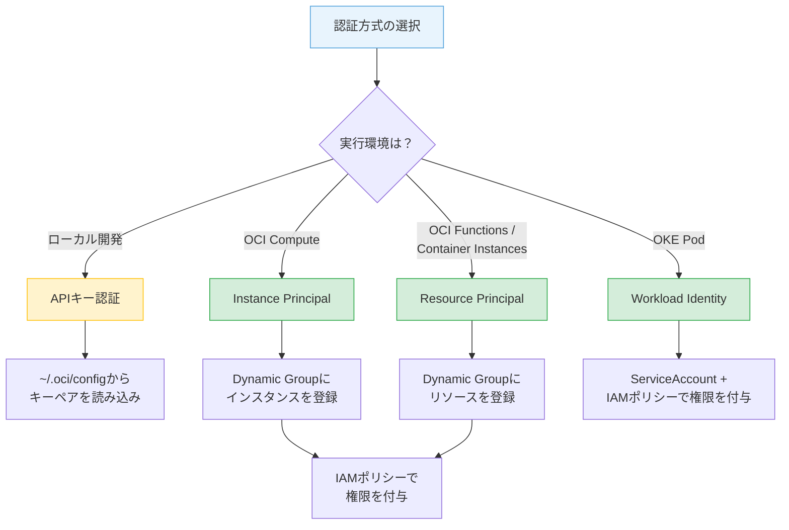
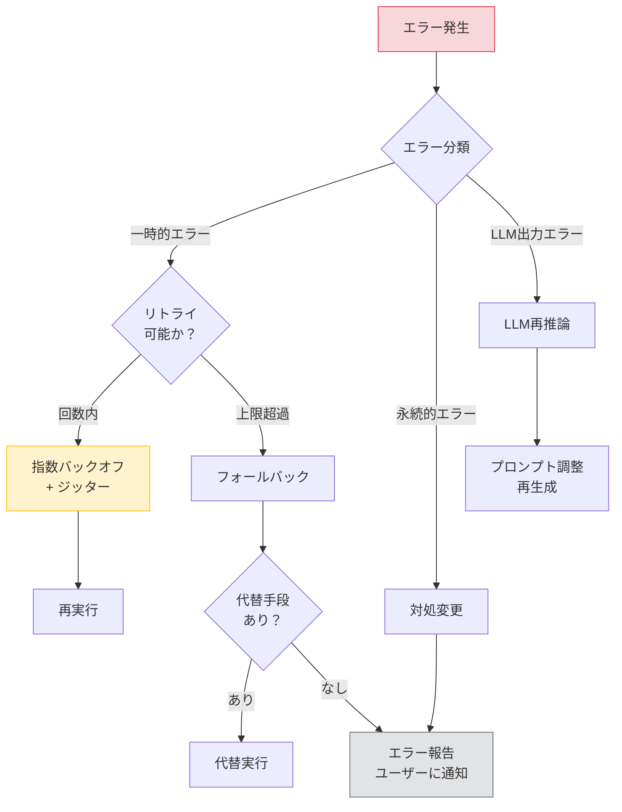
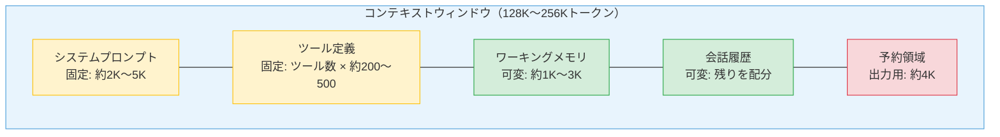

# 第9章 OCI上でシングルエージェントを構築する

前章ではOCI Generative AI Serviceの全体像とAPI呼び出しの基本を学んだ。本章では、第I部・第II部で培った理論的基盤とGenAI Serviceの知識を統合し、OCI上で動作するシングルエージェントを設計・構築する。

シングルエージェントの構築は、第10章のマルチエージェントシステムへの拡張の出発点である。本章で構築するエージェントは、MCPサーバーとして公開することで、マルチエージェントの構成要素となる。単一エージェントの設計品質が、マルチエージェントシステム全体の品質を左右する。

---

## 9.1 アーキテクチャ設計

第1章で学んだエージェントの構成要素（LLM、ツール、メモリ、エージェントランタイム）を、OCI上の具体的なサービスに対応づける。

### OCIサービスへのマッピング

図9.1にシングルエージェントのアーキテクチャと各構成要素のOCIサービスへのマッピングを示す。



**図9.1: シングルエージェントのアーキテクチャ図（OCIサービスへのマッピング）**

各構成要素の対応関係を整理する。

**推論エンジン**: OCI GenAI ServiceのChat APIが担う。第8章で学んだCohere Command AやCommand R+がFunction Calling対応のモデルとして推奨される。

**ツール群**: OCI SDK for Pythonを通じたOCIサービスの操作、MCPサーバー経由の外部連携、業務ロジックを実装したカスタムツールの三つのカテゴリに分類される。

**メモリ**: 短期記憶はエージェントランタイム内の会話履歴として保持する。長期記憶はAutonomous DatabaseのAI Vector Search機能を使い、RAGで実現する。成果物の永続保管にはObject Storageを使用する。

**エージェントランタイム**: ReActループ、コンテキスト管理、エラーハンドリングを統括する制御レイヤーである。ホスティング先としてContainer Instances、OKE（Oracle Container Engine for Kubernetes）、Computeインスタンスのいずれかを選択する。

### 設計判断の記録

エージェントのアーキテクチャ設計では、選択肢ごとのトレードオフが存在する。設計判断をADR（Architecture Decision Record）として記録することで、後から「なぜこの構成にしたか」を追跡できる。

たとえば、ホスティング先の選択は以下の観点で判断する。Container Instancesはシンプルな構成で運用負荷が低い。OKEはスケーラビリティに優れるが運用の複雑さが増す。Computeインスタンスは柔軟性が高いがマネージド性に欠ける。検証フェーズではContainer Instances、本番運用ではOKEが一般的な選択となる。

---

## 9.2 ReActループの実装

エージェントの中核であるReActループは、第1章で学んだ推論（Reasoning）→アクション（Action）→観察（Observation）の繰り返しである。本節では、このループの実装構造を整理する。

### ループのフロー

図9.2にReActループのフローを示す。



**図9.2: ReActループのフロー図**

### 終了条件の設計

ReActループには明確な終了条件が必要である。終了条件を設けないと、ループが無限に継続してコストとリソースを浪費する。

**目標達成**: LLMが「これ以上のアクションは不要」と判断し、最終回答を生成した場合にループを終了する。

**最大ステップ数**: ループの反復回数に上限を設ける。一般的には5〜20ステップが目安である。タスクの複雑さに応じて調整する。

**タイムアウト**: ループ全体の実行時間に上限を設ける。LLM APIの応答遅延やツール実行の長期化に対する安全装置である。

### 基本構造

コード9.1にReActループの基本構造を疑似コードで示す。

```python
# コード9.1: ReActループの基本構造（Python疑似コード）
class SingleAgent:
    def __init__(self, llm_client, tools, max_steps=10, timeout=300):
        self.llm_client = llm_client      # GenAI Serviceクライアント
        self.tools = tools                  # 利用可能なツール群
        self.max_steps = max_steps          # 最大ステップ数
        self.timeout = timeout              # タイムアウト（秒）
        self.context = []                   # 会話コンテキスト

    def run(self, user_input: str) -> str:
        self.context.append({"role": "USER", "content": user_input})
        start_time = time.time()

        for step in range(self.max_steps):
            # タイムアウトチェック
            if time.time() - start_time > self.timeout:
                return "タイムアウトにより処理を中断しました"

            # LLM推論
            response = self.llm_client.chat(
                messages=self.context,
                tools=self.tool_definitions()
            )

            # アクション判定
            if response.has_tool_calls():
                # ツール実行と結果の観察
                for tool_call in response.tool_calls:
                    result = self.execute_tool(tool_call)
                    self.context.append({
                        "role": "TOOL_RESULT",
                        "content": result,
                        "tool_call_id": tool_call.id
                    })
            else:
                # 最終回答
                return response.text

        return "最大ステップ数に到達しました"
```

コードの構造を解説する。`run`メソッドがReActループの本体である。各ステップでLLM推論を行い、ツール呼び出しがあればツールを実行して結果をコンテキストに追加する。ツール呼び出しがなければ最終回答として返却する。タイムアウトと最大ステップ数の二重の安全装置を設けている。

### エラー時のループ内対処

ツール実行が失敗した場合、エラー情報をコンテキストに含めてLLMに返す。LLMはエラー内容を理解し、リトライ、代替手段の選択、ユーザーへの報告のいずれかを判断する。エラーをLLMの推論に委ねることで、エージェントの自律的な問題解決が実現する。

---

## 9.3 ツールの実装

エージェントが外部環境に作用するためのツール（関数）の設計と実装パターンを整理する。

### ツールカテゴリ

表9.1にツールのカテゴリと実装パターンを示す。

| カテゴリ | 説明 | 実装方式 | 例 |
|:---|:---|:---|:---|
| OCI操作 | OCIサービスのCRUD操作 | OCI SDK for Python | VCN作成、インスタンス起動 |
| 外部API | サードパーティAPIの呼び出し | HTTPクライアント | GitHub API、Slack通知 |
| データ検索 | ナレッジベースからの情報取得 | RAG（Embedding + Vector Search） | ドキュメント検索、FAQ検索 |
| ファイル操作 | ファイルの読み書き | Object Storage SDK | 設計書の読み込み、レポート出力 |
| 計算・変換 | データの変換・集計処理 | Pythonロジック | CIDR計算、JSON変換 |

**表9.1: ツールカテゴリと実装パターン**

### ツール定義の設計

ツール定義の品質はLLMのツール選択精度を左右する。第8章で述べたとおり、ツール名、説明文、パラメータスキーマの三つの要素を明確に記述する必要がある。

**ツール名**: 動詞＋対象の命名規則を用いる。`create_vcn`、`list_instances`、`get_subnet_details`のように、操作と対象を明確にする。

**説明文**: LLMが「このツールをいつ使うべきか」を判断するための情報を含める。単に機能を述べるだけでなく、使用すべき文脈を記述する。

**パラメータスキーマ**: 各パラメータの名前、型、説明、必須/任意を定義する。列挙型のパラメータには取りうる値を明示する。

### OCI SDKツールの基本構造

コード9.2にOCI SDKを使ったツールの基本構造を示す。

```python
# コード9.2: OCI SDKを使ったツールの基本構造（Python疑似コード）

# ツール定義（LLMに渡すスキーマ）
CREATE_VCN_TOOL = {
    "name": "create_vcn",
    "description": (
        "OCI上に新しいVCNを作成する。"
        "ネットワーク構成を新規に作成する場合に使用する。"
        "CIDRブロックは必須。表示名は任意。"
    ),
    "parameters": {
        "type": "object",
        "properties": {
            "compartment_id": {
                "type": "string",
                "description": "VCNを作成するコンパートメントのOCID"
            },
            "cidr_block": {
                "type": "string",
                "description": "VCNのCIDRブロック（例: 10.0.0.0/16）"
            },
            "display_name": {
                "type": "string",
                "description": "VCNの表示名（省略可）"
            }
        },
        "required": ["compartment_id", "cidr_block"]
    }
}

# ツール実装
def create_vcn(compartment_id: str, cidr_block: str,
               display_name: str = None) -> dict:
    """VCNを作成し、結果を返す"""
    vcn_client = oci.core.VirtualNetworkClient(config)
    details = oci.core.models.CreateVcnDetails(
        compartment_id=compartment_id,
        cidr_blocks=[cidr_block],
        display_name=display_name or f"vcn-{cidr_block}"
    )
    response = vcn_client.create_vcn(details)
    return {
        "vcn_id": response.data.id,
        "display_name": response.data.display_name,
        "cidr_blocks": response.data.cidr_blocks,
        "lifecycle_state": response.data.lifecycle_state
    }
```

ツール実装における重要なポイントは三つある。入力の検証を行い、不正な引数を早期に拒否すること。戻り値をLLMが解釈しやすい構造化データで返すこと。エラー情報も構造化して返し、LLMの次の判断に活用可能にすることである。

### 冪等性の考慮

第7章で学んだ冪等性は、ツール実装において特に重要である。同じパラメータでツールを複数回実行しても、結果が一貫していなければならない。

作成系のツールでは、既存リソースの存在チェックを行い、既に存在する場合は既存のリソース情報を返す。更新系のツールでは、現在の状態と目標の状態を比較し、差分がある場合のみ更新を実行する。削除系のツールでは、リソースが既に存在しない場合にエラーとせず、正常終了とする。

---

## 9.4 MCPサーバーとしての公開

第2章で学んだMCPの概念を実装に落とし込み、構築したエージェントのツール群をMCPサーバーとして公開する。MCPサーバーとして公開することで、他のエージェントやクライアントからツールを利用可能にする。

### MCPサーバーのアーキテクチャ

図9.3にMCPサーバーのアーキテクチャと公開フローを示す。



**図9.3: MCPサーバーのアーキテクチャと公開フロー**

### トランスポートの選択

MCPの現行仕様（2025-03-26版）では、stdioとStreamable HTTPの二つが標準トランスポートとして定義されている。旧仕様で使用されていたSSEは非推奨（deprecated）となったが、既存実装では依然として広く使われている。

**stdio**: 標準入出力を使った通信である。ローカル環境での開発やIDEとの連携に適する。プロセス間通信であるため、ネットワーク設定が不要で最もシンプルである。

**Streamable HTTP**: MCPの現行標準トランスポートである。HTTPリクエスト/レスポンスとサーバーサイドイベントを組み合わせ、双方向の通信を実現する。旧仕様のSSE（Server-Sent Events）トランスポートを置き換えるものであり、OCI上でMCPサーバーを公開する場合はこの方式を使用する。

### OCI上での配置

MCPサーバーをOCI上にデプロイする場合、Container InstancesまたはOKE上のコンテナとしてホスティングする。Streamable HTTPトランスポートを使用することで、VCN内の他のエージェントやインターネット経由のクライアントからアクセス可能になる。

第10章でマルチエージェントシステムを構築する際、各エージェントのツール群がMCPサーバーとして公開されていることで、オーケストレーターからサブエージェントへのツール呼び出しがMCPプロトコルで標準化される。

---

## 9.5 認証の設計

OCI上でエージェントがAPIを呼び出す際の認証設計は、セキュリティの要である。第7章で学んだ最小権限の原則を具体的に適用する。

### 認証方式の選択

図9.4に認証方式の使い分けフローを示す。



**図9.4: 認証フロー図（実行環境に応じた認証方式の選択）**

表9.2に各認証方式の比較を示す。

| 認証方式 | キー管理 | 適用場面 | セキュリティ | 推奨度 |
|:---|:---|:---|:---|:---|
| APIキー | ファイルベースのキー管理が必要 | ローカル開発・検証 | キー漏洩リスクあり | 開発環境のみ |
| Instance Principal | 不要（インスタンスに紐づく） | Compute上のエージェント | キーレスで安全 | 本番環境推奨 |
| Resource Principal | 不要（リソースに紐づく） | Functions / Container Instances | キーレスで安全 | 本番環境推奨 |
| Workload Identity | 不要（ServiceAccountに紐づく） | OKE上のエージェント | キーレスで安全 | OKE環境推奨 |

**表9.2: 認証方式の比較と推奨用途**

### Dynamic GroupとIAMポリシー

キーレス認証を利用するには、認証方式に応じた設定が必要である。Instance PrincipalとResource Principalでは、Dynamic GroupとIAMポリシーを使用する。Workload IdentityではDynamic Groupは不要であり、KubernetesクラスタのServiceAccountをIAMポリシーで直接参照する。

Dynamic Groupは、OCI上のリソースを条件に基づいてグループ化する仕組みである。たとえば、特定のコンパートメント内のContainer Instancesをグループ化する。

IAMポリシーは、Dynamic Groupに対して特定のOCIサービスへのアクセス権限を付与する。エージェントが必要とするサービス（GenAI Service、VCN操作、Object Storage等）に対して、最小限の権限を個別に付与する。

### 権限の分離設計

エージェントの権限設計では、以下の分離原則を適用する。

**推論権限とインフラ権限の分離**: GenAI Serviceへの推論リクエスト権限と、VCNやComputeなどのインフラ操作権限を別のポリシーステートメントとして定義する。

**読み取りと書き込みの分離**: 情報取得のみを行うツールと、リソースの作成・変更を行うツールで、必要な権限レベルを区別する。読み取り専用のツールには`inspect`や`read`レベルの権限のみを付与する。

---

## 9.6 エラーハンドリングとリトライ

エージェント運用では多様なエラーが発生する。第7章で学んだフォールトトレランスの原則を、OCI上の具体的なエラーパターンに適用する。

### エラーの分類

図9.5にエラーハンドリングのフロー図を示す。



**図9.5: エラーハンドリングのフロー図**

表9.3にエラーパターンと対処戦略を示す。

| エラーパターン | 分類 | HTTPステータス | 対処戦略 |
|:---|:---|:---|:---|
| レート制限 | 一時的 | 429 | 指数バックオフでリトライ |
| サービス一時障害 | 一時的 | 500, 503 | 短い間隔でリトライ |
| 認証エラー | 永続的 | 401 | トークン更新、設定確認 |
| 権限不足 | 永続的 | 403 | IAMポリシーの見直し |
| リソース不存在 | 永続的 | 404 | パラメータ確認、LLMに報告 |
| コンテキスト長超過 | LLM固有 | 400 | コンテキスト圧縮後に再試行 |
| 不正な出力形式 | LLM固有 | - | プロンプト調整後に再生成 |

**表9.3: エラーパターンと対処戦略**

### リトライ戦略

一時的エラーに対するリトライは、第5章で学んだ指数バックオフとジッターの組み合わせで実装する。

**リトライ間隔の計算**: 基本間隔を2のN乗（Nはリトライ回数）で増加させる。1秒、2秒、4秒、8秒と間隔を広げることで、サーバーへの負荷集中を回避する。

**ジッターの追加**: リトライ間隔にランダムな揺らぎを加える。複数のエージェントが同時にリトライする場合のThundering Herd問題を防ぐ。

**最大リトライ回数**: リトライの上限を設定する。一般的には3〜5回が適切である。上限を超えた場合はフォールバックまたはエラー報告に移行する。

### LLM固有のエラー対処

LLM APIにはLLM固有のエラーパターンが存在する。

**コンテキスト長超過**: 入力トークン数がモデルの上限を超えた場合に発生する。古い会話履歴の要約、ツール結果のトリミングにより入力を圧縮して再試行する。

**不正な出力形式**: LLMがFunction Callingの形式に従わない出力を返す場合がある。プロンプトにツール呼び出しの形式を再度明示して再生成を試みる。出力形式の安定性は、Function Calling対応モデルを使用することで大幅に向上する。

---

## 9.7 コンテキスト管理の実装

エージェントのコンテキスト（会話履歴、ツール結果、システムプロンプト）の管理は、性能と品質に直結する。第2章で学んだコンテキストエンジニアリングの原則を実装レベルに落とし込む。

### コンテキストの構成要素

エージェントのコンテキストは、以下の四つの要素で構成される。

**システムプロンプト**: エージェントの役割、振る舞い、制約条件を定義する。ReActループの全ステップで固定的に含まれる。

**ツール定義**: 利用可能なツールの名前、説明、パラメータスキーマである。ツール数が多いほどトークンを消費する。

**会話履歴**: ユーザーの入力、LLMの応答、ツール呼び出しと結果の時系列記録である。ステップが進むにつれて増大する。

**ワーキングメモリ**: 現在のタスクに関する中間情報である。タスクの計画、進捗状況、収集した事実をまとめたメモとして機能する。

### コンテキスト予算の管理

図9.6にコンテキスト予算の配分戦略を示す。



**図9.6: コンテキスト管理の戦略図（優先度付きの予算配分）**

予算配分の優先順位は以下のとおりである。

1. **システムプロンプト**（最優先）: エージェントのアイデンティティを定義するため、削除不可
2. **ツール定義**（高優先）: 利用可能なツールの情報。削減が必要な場合はツール数を絞る
3. **出力予約領域**（高優先）: LLMの応答生成に必要な領域を確保する
4. **ワーキングメモリ**（中優先）: 現在のタスクの進捗情報
5. **会話履歴**（低優先）: 古い履歴から順に要約・圧縮の対象とする

### 会話履歴の圧縮戦略

会話履歴がコンテキスト予算を圧迫した場合、以下の戦略で圧縮する。

**スライディングウィンドウ**: 直近N件のメッセージのみを保持し、それ以前のメッセージを削除する。最もシンプルだが、過去の重要な文脈を失うリスクがある。

**要約置換**: 古い会話履歴をLLMで要約し、要約テキストで置き換える。文脈の本質を保ちつつトークン数を削減できる。ただし、要約のためのLLM呼び出しが追加で発生する。

**重要度ベースの選択**: 各メッセージに重要度スコアを付与し、低重要度のメッセージから削除する。ツール実行結果のうち成功した中間結果は低重要度、エラー結果や最終成果物は高重要度とする。

### ツール結果のトリミング

ツールの実行結果が大きい場合（たとえばリソース一覧の取得で多数の結果が返る場合）、結果をトリミングしてコンテキストに含める。全件を含めるとコンテキストを圧迫するため、以下の方針で対処する。結果の件数上限を設け、超過分は省略する。各結果の詳細フィールドのうち、タスクに関連するフィールドのみを含める。省略が発生した場合は「他にN件の結果があります」と付記し、LLMが追加取得を判断できるようにする。

---

## まとめ

本章では、OCI上でシングルエージェントを設計・構築するための七つの要素を整理した。

アーキテクチャ設計では、エージェントの構成要素をOCIサービスにマッピングした。推論エンジンはGenAI Service、ツールはOCI SDK、メモリはAutonomous DatabaseとObject Storageが担う。

ReActループは、LLM推論→アクション判定→ツール実行→観察の繰り返しで構成される。終了条件として目標達成、最大ステップ数、タイムアウトの三つを設ける。

ツールの実装では、明確なツール定義、冪等性の確保、構造化された戻り値が重要である。MCPサーバーとして公開することで、他のエージェントからの利用が可能になる。

認証設計では、開発環境にはAPIキー、本番環境にはResource PrincipalやInstance Principalを使い分ける。最小権限の原則に基づき、推論権限とインフラ操作権限を分離する。

エラーハンドリングでは、一時的エラーには指数バックオフによるリトライ、永続的エラーには対処変更、LLM固有エラーにはプロンプト調整を適用する。

コンテキスト管理では、システムプロンプト、ツール定義、会話履歴、ワーキングメモリに優先度を付けて予算配分する。会話履歴の圧縮にはスライディングウィンドウ、要約置換、重要度ベースの選択がある。

シングルエージェントの設計品質は、マルチエージェントシステムの品質を左右する。次章では、本章で構築したシングルエージェントを構成要素として、マルチエージェントシステムを構築する。

---

## 理解度チェック

**Q1.** シングルエージェントの構成要素（LLM、ツール、メモリ、ランタイム）をOCI上のサービスにマッピングし、それぞれの選定理由を述べよ。

**Q2.** ReActループにおける終了条件として、どのような条件を設けるべきか。それぞれの条件が必要な理由とともに説明せよ。

**Q3.** Resource PrincipalとAPIキーの使い分けを、開発フェーズと本番フェーズの観点から説明せよ。

**Q4.** OCI GenAI Serviceの429エラー（レート制限）に対して、エージェントはどのように対処すべきか。リトライ戦略を含めて説明せよ。

**Q5.** コンテキストウィンドウの予算管理において、システムプロンプト・会話履歴・ツール結果にどのようにトークンを配分するか。優先順位の根拠とともに述べよ。
