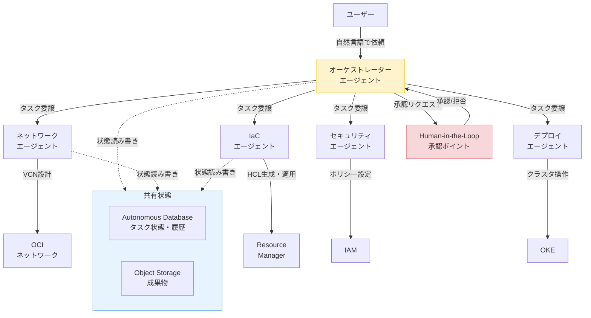
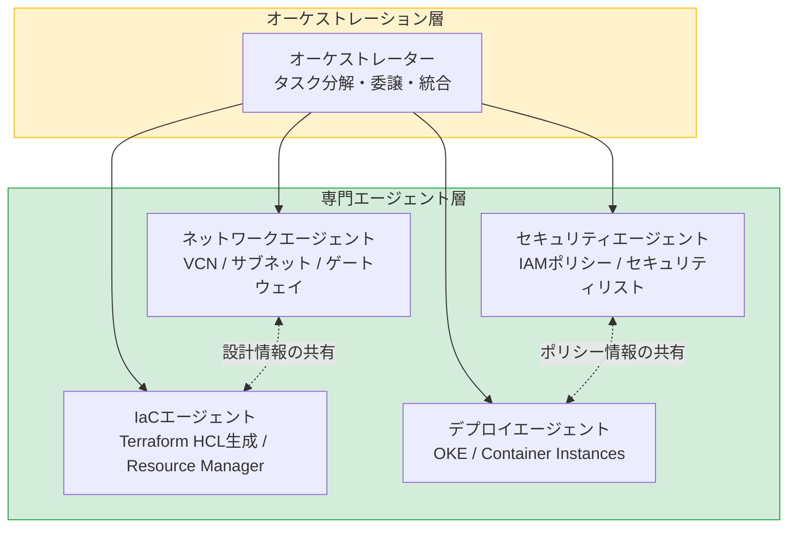
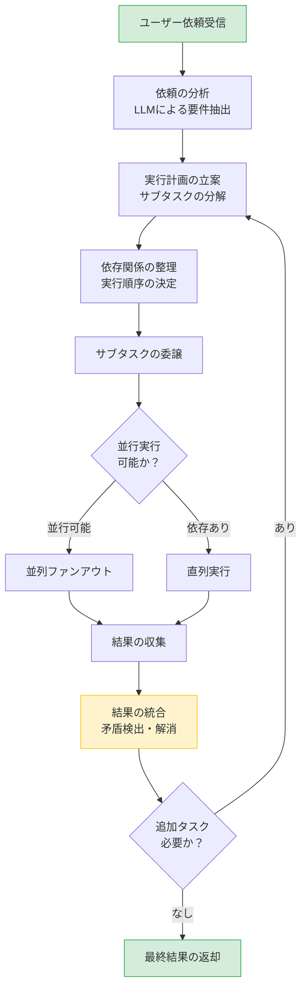
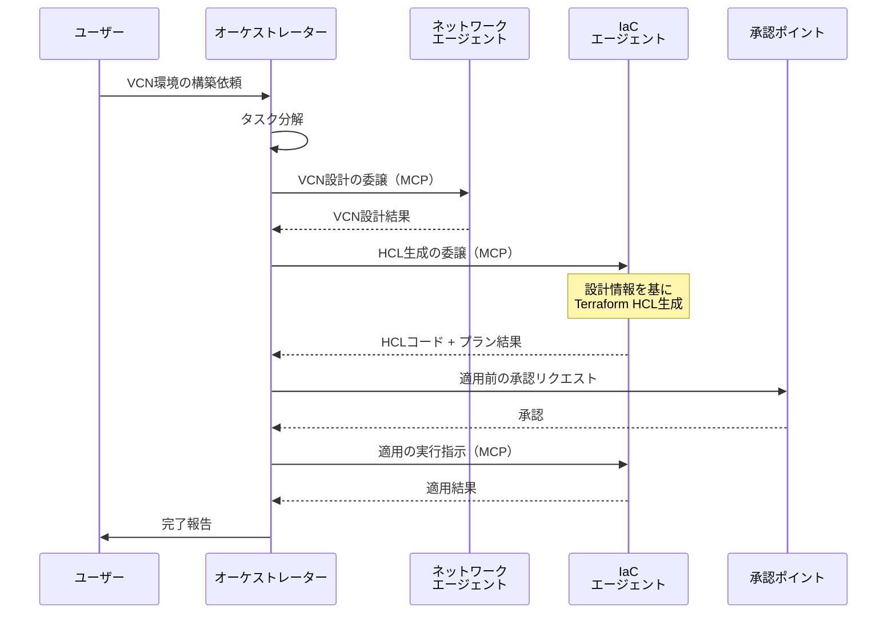
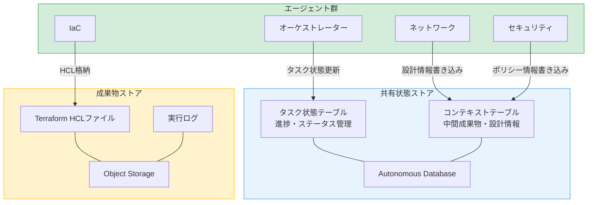
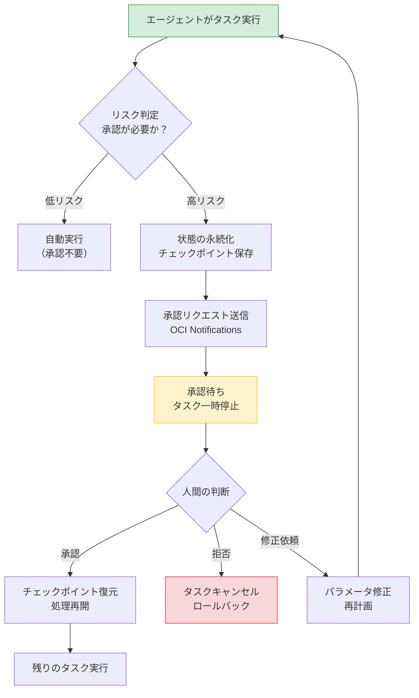
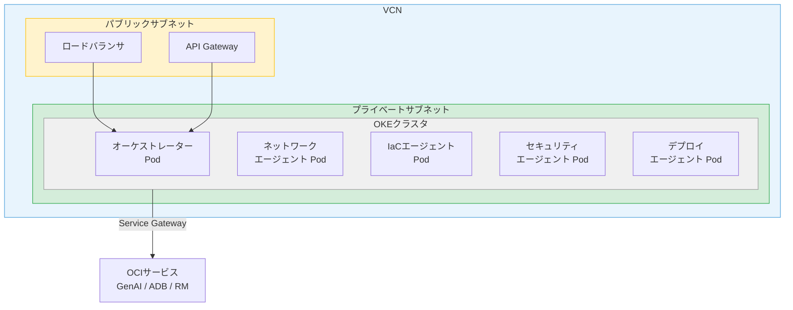
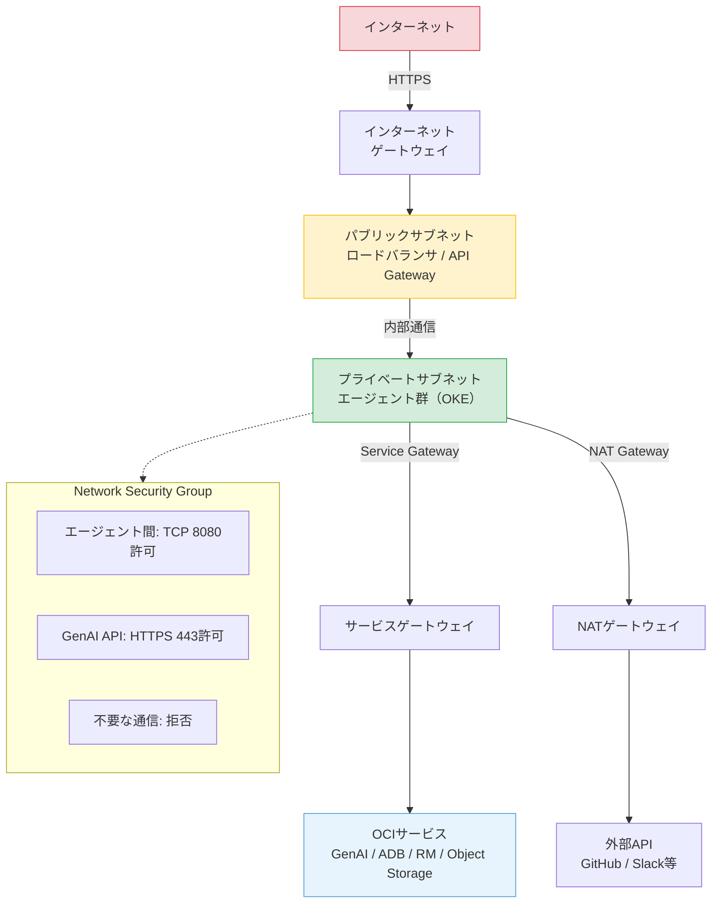

# 第10章 マルチエージェントシステムの構築

前章では、OCI上でシングルエージェントを設計・構築し、MCPサーバーとして公開する方法を学んだ。本章では、第II部で培った理論と第9章のシングルエージェント構築の知識を統合し、OCI上で動作するマルチエージェントシステムを設計・構築する。

本章は本書の核心である。読者がマルチエージェントシステムを自力で構築できるようになることを目指す。題材として、OCI上のインフラ構築・管理を複数のエージェントで分担するシステムを設計する。

---

## 10.1 構築するシステムの全体像

### ユースケース

本章で構築するマルチエージェントシステムのユースケースは、OCI上のインフラ構築・管理の自動化である。ユーザーが「OKEクラスタを含むVCN環境を構築してほしい」と依頼する。すると複数のエージェントが協調して、ネットワーク設計からデプロイ実行までを分担する。

このユースケースを選定した理由は三つある。

- OCIサービスの操作が多岐にわたり、単一エージェントでは責務が肥大化すること
- インフラ構築には複数のドメイン知識（ネットワーク、コンピュート、セキュリティ）が必要であること
- Human-in-the-Loopの必然性があること（インフラ変更は本番環境に影響する）

### 全体アーキテクチャ

図10.1にマルチエージェントシステムの全体アーキテクチャを示す。

**図10.1: マルチエージェントシステム全体アーキテクチャ図**

システムは第4章で学んだオーケストレーター型パターンを採用する。中央のオーケストレーターエージェントがユーザーの依頼を受け取り、タスクを分解して専門エージェントに委譲する。各専門エージェントは第9章で学んだシングルエージェントとして構築され、MCPサーバーとして公開されている。

第12章のケーススタディでは、このアーキテクチャを使ってOKEクラスタの自動構築を実践する。

---

## 10.2 エージェントの分割設計

第7章で学んだ単一責任の原則と粒度設計を適用し、エージェントの構成を設計する。

### 分割の判断過程

エージェントの分割は「一つのエージェントに一つのドメイン知識」を原則とする。この原則に基づき、OCI上のインフラ管理を以下の四つの専門領域に分割する。

図10.2にエージェントの分割設計を示す。

**図10.2: エージェント分割設計図**

### エージェント一覧

表10.1に各エージェントの詳細を示す。

| エージェント名 | 役割 | 入力 | 出力 | 主要ツール |
|:---|:---|:---|:---|:---|
| オーケストレーター | タスク分解・委譲・結果統合 | ユーザーの自然言語指示 | 統合された実行結果 | サブエージェント呼び出し |
| ネットワーク | VCN・サブネット・ゲートウェイの設計 | ネットワーク要件 | VCN設計（CIDR、サブネット構成） | OCI SDK（VCN操作） |
| IaC | Terraform HCL生成とResource Manager操作 | インフラ設計情報 | Terraform HCLコード、プラン結果 | Resource Manager API |
| セキュリティ | IAMポリシー・セキュリティリスト設計 | セキュリティ要件 | IAMポリシー、NSG設定 | OCI SDK（IAM操作） |
| デプロイ | OKE・Container Instancesの操作 | デプロイ指示 | デプロイ結果、クラスタ情報 | OCI SDK（OKE操作） |

**表10.1: エージェント一覧**

### 分割粒度の検討

この分割粒度が適切である根拠を整理する。

**粒度が細かすぎる場合**: たとえばサブネット作成とゲートウェイ作成を別エージェントにすると、エージェント間の通信コストが増大する。ネットワーク設計は相互に依存するため、一つのエージェントにまとめる方が効率的である。

**粒度が粗すぎる場合**: ネットワークとセキュリティを一つのエージェントにまとめると、そのエージェントのツール数とシステムプロンプトが肥大化する。第7章で述べた「コンテキスト汚染」が発生するリスクがある。

---

## 10.3 オーケストレーターの実装

オーケストレーターはマルチエージェントシステムの中核である。第4章で学んだオーケストレーター型パターンの三つの責務を実装する。推論エンジンには、第8章で学んだOCI GenAI Serviceを使用する。

### タスク分解

オーケストレーターは、ユーザーの依頼を分析し、専門エージェントに委譲可能なサブタスクに分解する。

図10.3にタスク分解・委譲のフローを示す。

**図10.3: オーケストレーターのタスク分解・委譲フロー**

### タスク分解の方式

タスク分解には二つの方式がある。

**LLMによる動的分解**: オーケストレーターのLLMがユーザーの依頼を分析し、サブタスクを動的に生成する。柔軟性が高いが、分解の一貫性と予測可能性が低い。

**事前定義ワークフロー**: 典型的なタスクパターンに対して実行手順を事前に定義する。一貫性が高く予測可能だが、未知のパターンに対応できない。

実践的には、両者のハイブリッドが有効である。典型的なパターンは事前定義のワークフローを適用し、それに該当しない依頼はLLMによる動的分解に委ねる。

### サブエージェントの選択

オーケストレーターは、各サブタスクに対して適切な専門エージェントを選択する。MCP経由の通信ではツール発見メカニズム（list_tools）で各エージェントの能力を把握する。A2A経由の通信では第5章で学んだAgent Cardから能力と入出力の形式を取得する。オーケストレーターはこれらの情報を参照して最適なエージェントを選択する。

### 結果統合時の矛盾検出

複数のサブエージェントの結果を統合する際、矛盾が発生する場合がある。たとえば、ネットワークエージェントが設計したCIDRブロックと、セキュリティエージェントが設定したセキュリティリストの対象アドレスが不整合な場合である。オーケストレーターは統合時に矛盾を検出し、関連するエージェントに修正を依頼する。

---

## 10.4 エージェント間通信の実装

エージェント間のメッセージ交換を実装する。第5章で学んだ通信理論を、OCI上の実装に落とし込む。

### 通信アーキテクチャ

図10.4にオーケストレーターとサブエージェント間のシーケンス図を示す。

**図10.4: エージェント間シーケンス図**

### 通信パターンの選択基準

表10.2に通信パターンの選択基準を示す。

| パターン | 方式 | 適用場面 | OCI上の実装 |
|:---|:---|:---|:---|
| 同期・MCP | MCPプロトコルによるツール呼び出し | 即時応答が必要なタスク（数秒〜数十秒） | Streamable HTTP |
| 同期/非同期・A2A | A2AプロトコルのTask送信 | エージェント間の標準化された通信 | HTTP（JSON-RPC + SSE） |
| 非同期・キュー | メッセージキューによるタスク分配 | 長時間タスク（数分〜数時間） | OCI Queue |
| 非同期・ストリーム | イベントストリームによるブロードキャスト | 複数エージェントへの通知 | OCI Streaming |

**表10.2: 通信パターンの選択基準**

### MCP経由のエージェント間通信

本章のマルチエージェントシステムでは、オーケストレーターからサブエージェントへの通信にMCPプロトコルを使用する。各サブエージェントは第9章で構築したMCPサーバーとして公開されている。オーケストレーターはMCPクライアントとして各サブエージェントのツールを呼び出す。

この構成の利点は、オーケストレーターのLLMにとってサブエージェントへの委譲が「ツール呼び出し」と同じインターフェースになることである。新しいサブエージェントの追加は、MCPサーバーの接続先を追加するだけで実現できる。

### 非同期通信の活用

インフラ構築のように長時間を要するタスクでは、非同期通信が適する。第5章で学んだA2AプロトコルのTaskステータス管理により、オーケストレーターはサブエージェントのタスク進捗を非同期にポーリングする。

OCI上ではOCI QueueまたはOCI Streamingを非同期メッセージングの基盤として活用する。詳細は第11章で扱う。

### メッセージフォーマットの設計

エージェント間で交換するメッセージは、構造化されたフォーマットで定義する。各エージェントの入力スキーマと出力スキーマをJSON Schemaで明示し、インターフェースを標準化する。

メッセージには、タスクID、送信元エージェント名、メッセージ種別（リクエスト/レスポンス/通知）、ペイロードを含める。この構造化により、エージェントの追加・入れ替えが容易になる。

---

## 10.5 共有状態の実装

複数エージェント間で共有する状態の管理を実装する。第6章で学んだ状態管理のパターンをOCI上で具体化する。

### 共有状態のアーキテクチャ

図10.5に共有状態の実装アーキテクチャを示す。

**図10.5: 共有状態の実装アーキテクチャ図**

### タスク状態管理

オーケストレーターは各サブタスクの状態をAutonomous Databaseで一元管理する。タスクの状態遷移は「未着手→実行中→完了/失敗」である。各エージェントはタスクの開始時と完了時に状態を更新する。

状態テーブルには、タスクID、担当エージェント、ステータス、開始時刻、完了時刻、結果の要約を格納する。オーケストレーターはこの状態テーブルを参照して、全体の進捗を把握し、次のアクションを決定する。

### 中間成果物の共有

あるエージェントの出力が別のエージェントの入力となる場合、中間成果物の共有が必要である。たとえば、ネットワークエージェントが設計したVCN構成情報を、IaCエージェントがTerraform HCLの入力として使用する。

中間成果物は構造化データとしてAutonomous Databaseに格納する。大きなファイル（Terraform HCLコード、実行ログ等）はObject Storageに格納する。メタデータ（格納先のURL、バージョン）はAutonomous Databaseで管理する。

### コンテキスト分離

第6章で学んだコンテキスト分離の原則を実装する。各エージェントは自身のタスクに関連する情報のみを参照する。ネットワークエージェントがセキュリティポリシーの詳細にアクセスする必要はなく、IaCエージェントがネットワーク設計の内部詳細を知る必要はない。

コンテキスト分離は、共有状態テーブルのアクセス制御と、エージェントに渡す情報のフィルタリングで実現する。オーケストレーターが各エージェントに委譲する際、そのエージェントに必要な情報のみを選択して渡す。

### 一時状態のキャッシュ

頻繁にアクセスされる一時的な状態（セッション情報、処理中のタスクコンテキスト等）にはOCI Cache with Redisを活用する。Autonomous Databaseへの問い合わせ頻度を下げ、応答速度を向上させる。

---

## 10.6 Human-in-the-Loopの実装

マルチエージェントシステムに人間の承認ポイントを組み込む。第7章で学んだHuman-in-the-Loopの設計原則を具体的に実装する。

### 承認フロー

図10.6にHuman-in-the-Loopの実装フローを示す。

**図10.6: Human-in-the-Loopの実装フロー**

### 承認が必要な操作の判定

承認が必要な操作は以下の基準で判定する。

**リソース作成・変更**: VCN作成、セキュリティリスト変更、OKEクラスタ作成など、OCIリソースを作成・変更する操作は原則として承認を要求する。

**コスト影響**: 高額なリソース（Dedicated AI Cluster、大規模Computeインスタンス等）の作成は承認を要求する。

**セキュリティ影響**: IAMポリシーの変更、パブリックアクセスの設定変更は承認を要求する。

**読み取り専用操作**: リソースの情報取得やステータス確認は、承認なしで自動実行する。

### 承認待ちの状態管理

承認待ちの間、タスクの状態はAutonomous Databaseに永続化する。エージェントのプロセスが再起動しても、承認待ちの状態から再開できるようにチェックポイントを保存する。

チェックポイントには以下の情報を含める。タスクの実行コンテキスト（どこまで完了したか）。承認対象の操作内容（何を承認するか）。ロールバック情報（拒否された場合に戻す先）。

### 通知と応答

承認リクエストはOCI Notifications Serviceを通じて通知する。メール、Slack Webhook、カスタムHTTPエンドポイントなど、複数の通知チャネルを設定可能である。承認応答はAPIエンドポイント経由で受け付け、オーケストレーターに伝達する。

---

## 10.7 OCI上のホスティング

マルチエージェントシステムの各コンポーネントをOCI上でホスティングする構成を設計する。

### インフラ構成

図10.7にOCIインフラ構成図を示す。

**図10.7: OCIインフラ構成図**

### ホスティングオプション

表10.3に各ホスティングオプションの比較を示す。

| 項目 | Container Instances | OKE | Functions |
|:---|:---|:---|:---|
| 適用場面 | 小規模、シンプル構成 | 本番運用、スケーラブル | イベント駆動、短時間処理 |
| スケーリング | 手動 | HPA / VPAによる自動スケーリング | 自動（コールド起動あり） |
| 運用負荷 | 低い | 中程度（Kubernetes運用知識が必要） | 低い |
| エージェント間通信 | HTTP直接通信 | Kubernetes Service | HTTP（コールド起動に注意） |
| 長時間実行 | 対応 | 対応 | 制限あり（同期: 最大5分、非同期: 最大1時間） |
| コスト | リソース時間課金 | ノード + 管理費用 | 呼び出し回数 + 実行時間課金 |

**表10.3: ホスティングオプション比較**

### エージェントのコンテナ化

各エージェントをDockerコンテナとしてパッケージングする。コンテナイメージには、エージェントランタイム、MCPサーバー、ツール実装を含める。コンテナ化により、エージェントの配置先を柔軟に変更できる。

### スケーリング戦略

OKE上のマルチエージェントシステムでは、Horizontal Pod Autoscaler（HPA）を活用する。リクエスト量に応じてエージェントのPod数を自動調整する。オーケストレーターは常時1レプリカ以上を維持し、サブエージェントは負荷に応じてスケールアウトする。

---

## 10.8 ネットワーク設計

マルチエージェントシステムのネットワーク設計を整理する。第7章で学んだセキュリティ設計原則をネットワークレベルで適用する。

### ネットワーク構成

図10.8にネットワーク設計図を示す。

**図10.8: ネットワーク設計図**

### サブネットの分離

**パブリックサブネット**: ユーザーからのアクセスを受け付けるロードバランサとAPI Gatewayを配置する。直接のインターネットアクセスが必要なコンポーネントのみを配置する。

**プライベートサブネット**: エージェント群（OKEクラスタ）を配置する。インターネットからの直接アクセスを遮断し、セキュリティを確保する。

### セキュリティルール

Network Security Group（NSG）により、エージェント間の通信を必要最小限に制限する。

**エージェント間通信**: 同一VCN内のプライベートサブネット間でTCP 8080（MCP Streamable HTTP）を許可する。

**OCIサービスアクセス**: Service Gateway経由でGenAI Service、Autonomous Database、Resource Manager等へのHTTPS通信を許可する。

**外部アクセス**: NAT Gateway経由で外部API（GitHub、Slack等）へのHTTPS通信を許可する。不要な外部通信は拒否する。

### 最小権限のネットワーク適用

第7章で学んだ最小権限の原則をネットワーク設計に適用する。各エージェントが必要とする通信先のみを許可し、それ以外の通信を拒否する。たとえば、ネットワークエージェントはOCI VCN APIへのアクセスのみを必要とし、OKE APIへのアクセスは不要である。

---

## まとめ

本章では、OCI上でマルチエージェントシステムを構築するための八つの要素を整理した。

システムの全体像として、OCI上のインフラ管理を題材にオーケストレーター型パターンを採用した。ユーザーの依頼を受けたオーケストレーターが、専門エージェントにタスクを分解・委譲する構成である。

エージェントの分割設計では、単一責任の原則に基づき、ネットワーク、IaC、セキュリティ、デプロイの四つの専門エージェントに分割した。分割粒度は、通信コストとコンテキスト汚染のバランスで決定する。

オーケストレーターは、タスク分解、委譲、結果統合の三つの責務を持つ。タスク分解にはLLMによる動的分解と事前定義ワークフローのハイブリッドが有効である。

エージェント間通信は、MCPプロトコルによる同期通信を基本とする。長時間タスクにはA2AプロトコルやOCI Queue/Streamingによる非同期通信を適用する。

共有状態はAutonomous Database（タスク状態・コンテキスト）とObject Storage（成果物）で管理する。コンテキスト分離により、各エージェントは必要な情報のみを参照する。

Human-in-the-Loopは、リスクの高い操作（リソース作成、セキュリティ変更）の前に承認ポイントを設置する。承認待ちの状態はチェックポイントとして永続化する。

ホスティングはOKEクラスタ上のコンテナとして配置する。ネットワークはパブリック/プライベートサブネットの分離とNSGによる通信制御で設計する。

なお、本章で構築したシステムのテスト手法は第13章で扱う。MCPプロトコルによる通信の標準化は、テスト時のスタブ化を容易にする。

次章では、OCI固有のサービス群（Resource Manager、OKE、Autonomous Database等）をエージェントのツールとして活用する具体的な設計パターンを整理する。

---

## 理解度チェック

**Q1.** マルチエージェントシステムのエージェント分割設計において、分割の粒度を決める際の判断基準を三つ挙げ、それぞれを説明せよ。

**Q2.** オーケストレーターがタスクを分解する方式として「LLMによる動的分解」と「事前定義ワークフロー」があるが、それぞれの利点・欠点を比較せよ。

**Q3.** エージェント間通信で同期通信と非同期通信を使い分ける基準を、具体的なシナリオを挙げて説明せよ。

**Q4.** マルチエージェントシステムにおいてHuman-in-the-Loopを実装する際、承認待ちの状態管理をどのように設計するか。障害耐性を考慮して述べよ。

**Q5.** OCI上でマルチエージェントシステムをホスティングする場合、Container InstancesとOKEのどちらが適しているか。システムの規模・要件に応じて判断基準を述べよ。
