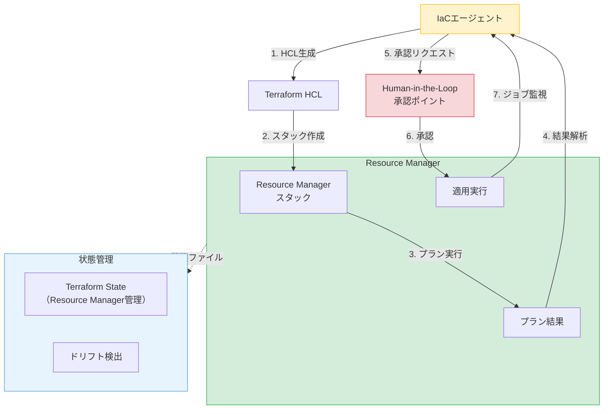
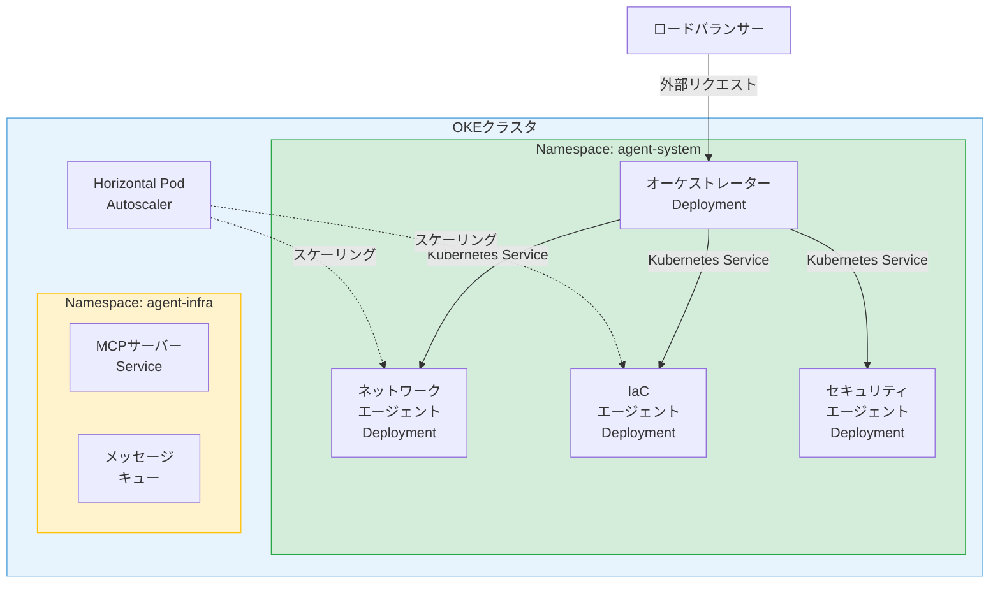
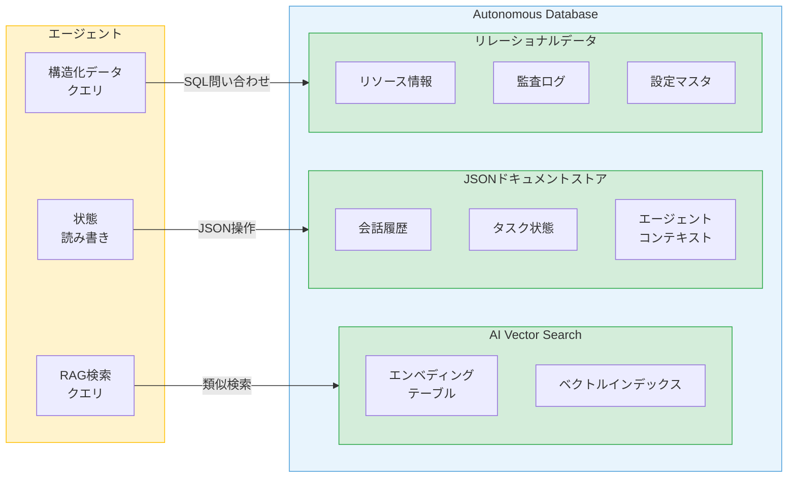
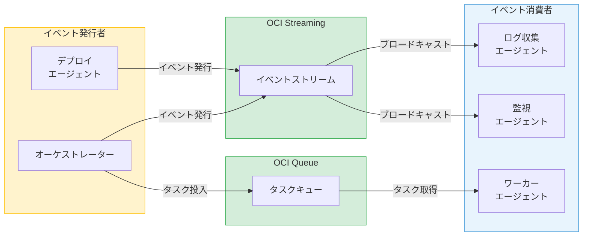
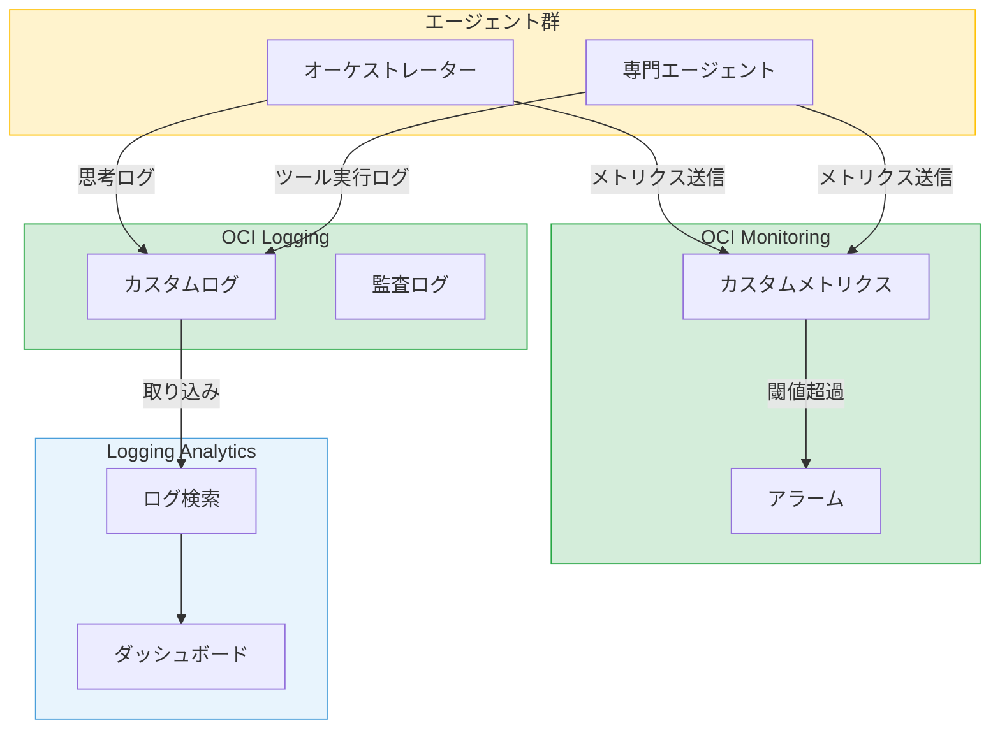

# 第11章 OCI固有のサービスを活用するエージェント設計

第9章・第10章では、OCI上でシングルエージェントとマルチエージェントシステムを構築する基本アーキテクチャを整理した。本章では、GenAI Service以外のOCIサービス群をエージェントのツール・基盤として活用する設計パターンを体系的に整理する。

OCIには、エージェントの能力を拡張するサービスが豊富に揃っている。

- インフラ構築を自動化する**OCI Resource Manager**
- コンテナ実行基盤の**OKE**
- 知識ベースとなる**Autonomous Database**
- 非同期通信基盤の**Streaming / Queue**
- 可観測性基盤の**Logging / Monitoring**
- シークレット管理の**Vault**
- 外部公開の**API Gateway**

これらを適切に組み合わせることで、エージェントは「OCIネイティブ」に動作する。

---

## 11.1 Resource Manager ― IaCエージェントの基盤

Resource Managerは、OCI上のTerraform実行マネージドサービスである。エージェントがTerraform HCLを生成し、Resource Manager経由でインフラを構築・管理するパターンは、IaCエージェントの基本形となる。

### 連携アーキテクチャ

図11.1にResource Managerとエージェントの連携アーキテクチャを示す。

**図11.1: Resource Managerとエージェントの連携アーキテクチャ**

### スタック操作の3段階

エージェントがResource Managerを操作する際は、スタック作成、プラン実行、適用の3段階をツールとして設計する。

**スタック作成**: エージェントが生成したTerraform HCLをResource Managerのスタックとして登録する。HCLファイルはObject Storageに格納し、バケット名・ネームスペース・リージョンをスタック作成APIに指定する。変数（variables）はスタック作成時にパラメータとして指定する。

**プラン実行**: スタックに対してプランジョブを実行する。プランジョブは非同期で実行されるため、エージェントはジョブのステータスをポーリングして完了を待つ。プラン結果には、作成・変更・削除されるリソースの一覧が含まれる。

**適用実行**: プラン結果の確認後、適用ジョブを実行する。適用前にはHuman-in-the-Loopによる承認を挟む。これが最も重要な制御ポイントである。

### プラン結果のパース

エージェントにとって、プラン結果の解釈は重要な能力である。プラン結果から「何が作成されるか」「何が変更されるか」「何が削除されるか」を抽出し、人間に分かりやすい形で提示する。

エージェントはプラン結果を要約し、リスクの高い変更（リソースの削除、セキュリティリストの変更等）を強調して承認リクエストに含める。

### 状態ファイルとドリフト検出

Resource Managerが管理するTerraform状態ファイルは、エージェントが直接操作する必要がない。Resource Managerが自動的に管理する。

ドリフト検出は、実際のインフラ状態とTerraform状態ファイルの差分を検出する機能である。エージェントはドリフト検出をトリガーし、差分がある場合に是正措置を提案できる。

---

## 11.2 OKE ― コンテナ化されたエージェントの実行基盤

OKEは、OCI上のマネージドKubernetesサービスである。マルチエージェントシステムのホスティング基盤として、エージェントのコンテナ化、スケーリング、通信制御を担う。

### デプロイメント構成

図11.2にOKE上のマルチエージェントデプロイメント構成を示す。

**図11.2: OKE上のマルチエージェントデプロイメント構成図**

### エージェントのコンテナ化

各エージェントを独立したコンテナイメージとしてパッケージングする。コンテナイメージには、エージェントのランタイム、ツール定義、依存ライブラリ（OCI SDK等）を含める。

Deploymentリソースとして配置することで、Kubernetesが可用性を管理する。エージェントのPodが異常終了した場合、自動的に再起動される。

### Pod設計

エージェントのPod設計では、以下の点を考慮する。

**リソース制限**: CPU・メモリのrequestsとlimitsを設定する。LLM API呼び出しは待ち時間が中心のため、CPUは少量で十分だが、コンテキスト処理にメモリを確保する。

**ヘルスチェック**: livenessProbeでプロセスの生存確認、readinessProbeでリクエスト受付可能状態を確認する。エージェントの初期化（モデル設定の読み込み等）が完了するまでreadyにしない。

**環境変数とConfigMap**: GenAI Serviceのエンドポイント、モデルID、コンパートメントID等の設定をConfigMapで管理する。環境ごとの切り替えが容易になる。

### スケーリング戦略

Horizontal Pod Autoscaler（HPA）により、エージェントの負荷に応じてPod数を自動調整する。スケーリングのメトリクスとしては、リクエストキューの長さやLLM API呼び出しの待ち行列数が適切である。

オーケストレーターは単一インスタンスで動作させ、ステートレスな専門エージェントのみをスケーリング対象とする。状態を持つエージェントのスケーリングは、共有状態ストア（Autonomous Database）との整合性を確保する設計が必要である。

### エージェント間通信

OKE内でのエージェント間通信は、Kubernetes Serviceを使用する。各エージェントのDeploymentに対してClusterIP Serviceを定義し、Service名でアクセスする。

Streamable HTTPトランスポートでMCPサーバーを公開する場合、Service経由でクラスタ内の他のエージェントからアクセスできる。外部からのアクセスにはIngressまたはLoad Balancerを使用する。

---

## 11.3 Autonomous Database ― エージェントの知識基盤

Autonomous Database（ADB）は、エージェントの知識ベースと状態管理の中核を担うサービスである。AI Vector Search、JSONドキュメントストア、SQLの三つの機能を、エージェントの異なる用途に活用する。

### 3つの活用パターン

図11.3にAutonomous Databaseの3つの活用パターンを示す。

**図11.3: Autonomous Databaseの3つの活用パターン（Vector Search / JSON / SQL）**

### パターン1: AI Vector Searchによる長期記憶

AI Vector Searchは、エージェントの長期記憶をRAGで実現する基盤である。ドキュメント（設計書、マニュアル、過去の事例等）をチャンク分割し、エンベディングベクトルとしてADBに格納する。

エージェントがタスクを実行する際、関連する知識をVector Searchで検索し、コンテキストに含める。第2章で学んだRAGの仕組みを、ADB単体で完結させることができる。

エンベディングの生成にはOCI GenAI ServiceのEmbedding APIを使用する。Cohere Embed 4はテキストだけでなく画像にも対応したマルチモーダルモデルであり、構成図等の視覚的な情報もベクトル化できる。

### パターン2: JSONドキュメントストアによる状態管理

ADBのJSONドキュメントストア機能を使い、エージェントの状態や会話履歴を柔軟に永続化する。JSONドキュメントはスキーマレスであるため、エージェントの状態構造が変化しても対応しやすい。

第6章で学んだ共有メモリパターン（ブラックボード）の実装先として適切である。各エージェントがJSONドキュメントの読み書きを通じて情報を共有する。

主な用途は三つある。会話履歴の永続化、タスク状態の管理、エージェント間のコンテキスト共有である。

### パターン3: SQLによる構造化データアクセス

OCIリソースの情報（インスタンス一覧、ネットワーク構成等）を構造化データとしてADBに格納し、エージェントがSQLで問い合わせるパターンである。

エージェントがSQL問い合わせをツールとして公開することで、自然言語の質問を構造化クエリに変換してデータにアクセスする。「本番環境のCompute一覧を教えて」という質問を適切なSELECT文に変換し、結果を返す。

監査ログの蓄積にもSQLテーブルが適する。エージェントの全アクション（ツール呼び出し、判断結果、エラー）を時系列で記録し、後からトレース可能にする。

---

## 11.4 Streaming / Queue ― 非同期エージェント間通信

第5章で学んだエージェント間の非同期通信を、OCI StreamingとOCI Queue Serviceで具体化する。同期通信だけでは対応できないユースケースに、これらのサービスが解決策を提供する。

### イベント駆動型アーキテクチャ

図11.4にStreamingとQueueを使ったイベント駆動型エージェント間通信を示す。

**図11.4: StreamingとQueueを使ったイベント駆動型エージェント間通信**

### OCI Streaming（Kafka互換）

OCI Streamingは、Apache Kafka互換のマネージドストリーミングサービスである。イベントをストリームにパブリッシュし、複数のコンシューマーがサブスクライブする。

エージェントのユースケースでは、システム全体のイベント（タスク開始、完了、エラー等）をストリームに発行し、複数のコンシューマーエージェント（ログ収集、監視、通知等）がそれぞれ独立に消費する。ファンアウト型の通信に適する。

パーティションキーを使い分けることで、関連するイベントの順序を保証できる。たとえば、タスクIDをパーティションキーに設定すれば、同一タスクに関するイベントは発行順に処理される。

### OCI Queue

OCI Queueは、メッセージキューイングサービスである。メッセージを1つのキューに投入し、複数のコンシューマーのうち1つが取得して処理する（Competing Consumersパターン）。

エージェントのユースケースでは、タスク分配に適する。オーケストレーターがタスクをキューに投入し、複数のワーカーエージェントが空いている順にタスクを取得する。各タスクは1つのワーカーのみが処理するため、重複実行が防がれる。

可視性タイムアウト機能により、処理中のメッセージは他のコンシューマーから見えなくなる。処理が完了すればメッセージを削除し、タイムアウトした場合は再度キューに戻る。

### 使い分け基準

StreamingとQueueの使い分けは、通信パターンで判断する。

1対多のブロードキャスト型にはStreamingを使う。イベント通知、ログ配信、状態変更の伝搬が該当する。1対1のタスク分配型にはQueueを使う。ワークロード分散、ジョブ管理、リトライ制御が該当する。

---

## 11.5 Logging / Monitoring ― エージェントの可観測性基盤

エージェントの動作を「見える化」する可観測性は、運用の要である。OCI Logging ServiceとMonitoring Serviceを組み合わせ、エージェントの思考過程・行動・パフォーマンスを記録・可視化する。第14章で扱う可観測性の理論的基盤を、本節でOCIサービスに具体化する。

### 可観測性の構成

図11.5にOCI Logging/Monitoringを使ったエージェント可観測性の構成を示す。

**図11.5: OCI Logging/Monitoringを使ったエージェント可観測性の構成図**

### 構造化ログの設計

エージェントの動作をカスタムログとして記録する際、構造化されたJSON形式で出力する。記録すべき情報は以下のとおりである。

**思考過程ログ**: LLMの推論結果、選択したアクション、判断の根拠を記録する。デバッグ時にエージェントの「なぜその行動を選んだか」を追跡するために不可欠である。

**ツール呼び出しログ**: 呼び出したツール名、入力パラメータ、実行結果、所要時間を記録する。ツール実行の成功/失敗の傾向分析に使用する。

**エラーログ**: エラーの種別、発生箇所、対処結果を記録する。リトライの回数や最終的な結果も含める。

### カスタムメトリクスの設計

Monitoring Serviceのカスタムメトリクスで、エージェントのパフォーマンスを定量的に可視化する。

主要なメトリクスは四つである。

- **タスク完了率**: 成功/失敗/タイムアウトの割合
- **LLM API応答時間**: P50、P95、P99
- **ツール呼び出し成功率**: ツール別の成功/失敗比率
- **エージェント処理時間**: タスク受付から完了までの所要時間

### アラームの設定

メトリクスに閾値を設定し、異常を自動検知する。エラー率が一定値を超えた場合、LLM APIの応答時間が閾値を超えた場合、エージェントのタスク処理が長時間滞留した場合にアラームを発報する。

アラームの通知先にはOCI Notifications Serviceを使用し、メール、Slack、PagerDuty等に連携できる。

---

## 11.6 Vault ― シークレット管理とエージェントの認証

エージェントが外部サービスにアクセスする際の認証情報を、OCI Vaultで一元管理する。コード内にシークレットを埋め込まない設計は、セキュリティの基本原則である。

### Vaultの活用パターン

エージェントがアクセスする外部サービスの認証情報（APIキー、トークン、パスワード等）をVaultのシークレットとして格納する。エージェントはResource Principal経由でVault APIにアクセスし、必要なシークレットを取得する。

この方式の利点は三つある。認証情報がコードやコンテナイメージに含まれないこと。IAMポリシーでエージェントごとにアクセスできるシークレットを制御できること。シークレットのローテーションがアプリケーションの再デプロイなしに可能であること。

### シークレットのローテーション

シークレットのローテーションは、Vaultのバージョン管理機能を使用する。新しいバージョンのシークレットを作成し、エージェントは常に最新バージョンを取得する設計とする。

ローテーション時にエージェントが旧シークレットを使ってエラーになる場合は、リトライ時にシークレットを再取得する戦略で対処する。第9章で学んだリトライ戦略の応用である。

### アクセス制御

マルチエージェント環境では、エージェントごとに異なるシークレットへのアクセス権限を設定する。IAMポリシーで、Dynamic Group（またはWorkload Identity）に対して特定のVaultシークレットへのアクセスのみを許可する。

たとえば、IaCエージェントにはGitHub APIトークンへのアクセスを許可し、ネットワークエージェントにはその権限を付与しない。最小権限の原則をシークレット管理にも適用する。

---

## 11.7 API Gateway ― エージェントの外部公開と保護

OCI API Gatewayは、エージェントを外部に安全に公開するためのエンドポイント管理サービスである。認証・認可、レート制限、リクエスト変換の機能を提供する。

### 外部公開の設計

API Gatewayの主な用途は二つある。

**A2Aプロトコルのエンドポイント公開**: 第5章で学んだA2Aプロトコルのエンドポイントをインターネットに公開する際、API Gatewayを前段に配置する。Agent Cardの公開URL、タスク受付エンドポイント、ステータス確認エンドポイントをAPI Gatewayで一元管理する。

**MCPサーバーの外部公開**: MCPサーバーのStreamable HTTPエンドポイントを外部に公開する際にもAPI Gatewayが有効である。内部のOKEクラスタへのルーティングをAPI Gatewayが担う。

### セキュリティ機能

API Gatewayのセキュリティ機能は三つの層で構成される。

**認証・認可**: OAuth 2.0 / JWTトークンによるリクエストの認証を行う。OCI Identity Domainsとの統合により、エージェントへのアクセスを許可されたクライアントのみに制限する。

**レート制限**: クライアントごとのリクエスト数を制限する。エージェントのバックエンドであるLLM API呼び出しにはコストが発生するため、過剰なリクエストを制御する。

**リクエスト変換**: ヘッダーの追加・削除、パスの書き換え等を行う。バックエンドのエージェントに渡す前にリクエストを正規化する。

API Gatewayのアクセスログは11.5節で述べたOCI Loggingに統合できる。リクエストの可観測性をLogging Analyticsのダッシュボードで一元管理する。

### OCIサービス×エージェント機能のマッピング

表11.1にOCIサービスとエージェント機能のマッピングを示す。

| OCIサービス | エージェント機能 | 活用パターン | 関連章 |
|:---|:---|:---|:---|
| GenAI Service | 推論エンジン | Chat API / Embedding API / Rerank API | 第8章 |
| Resource Manager | インフラ操作 | スタック作成・プラン・適用 | 11.1 |
| OKE | ホスティング | コンテナ化・スケーリング・通信 | 11.2 |
| Autonomous Database | 知識基盤・状態管理 | Vector Search / JSON / SQL | 11.3 |
| Streaming | 非同期通信（ブロードキャスト） | イベント通知・ログ配信 | 11.4 |
| Queue | 非同期通信（タスク分配） | ワークロード分散・ジョブ管理 | 11.4 |
| Logging | 可観測性（ログ） | 思考ログ・ツール実行ログ | 11.5 |
| Monitoring | 可観測性（メトリクス） | パフォーマンス計測・アラーム | 11.5 |
| Vault | シークレット管理 | APIキー・トークンの一元管理 | 11.6 |
| API Gateway | 外部公開・保護 | A2A/MCPエンドポイント管理 | 11.7 |
| Object Storage | 成果物保管 | HCLファイル・レポート・設計書 | 第10章 |

**表11.1: OCIサービス×エージェント機能のマッピング表**

---

## まとめ

本章では、OCI固有のサービス群をエージェントのツール・基盤として活用する設計パターンを七つの領域で整理した。

Resource Managerは、IaCエージェントの実行基盤である。スタック作成→プラン→適用の3段階をツールとして設計し、適用前にHuman-in-the-Loopを挟む。

OKEは、マルチエージェントシステムのホスティング基盤である。各エージェントをDeploymentとして配置し、Kubernetes Serviceで通信する。HPAによるスケーリングで負荷に対応する。

Autonomous Databaseは、知識基盤と状態管理の中核である。AI Vector SearchによるRAG、JSONドキュメントストアによる状態管理、SQLによる構造化データアクセスの三つのパターンで活用する。

Streaming/Queueは、非同期エージェント間通信の基盤である。Streamingは1対多のブロードキャスト型、Queueは1対1のタスク分配型に使い分ける。

Logging/Monitoringは、可観測性の基盤である。構造化ログとカスタムメトリクスでエージェントの動作を記録・可視化し、アラームで異常を検知する。

Vaultはシークレット管理の基盤であり、API Gatewayは外部公開の基盤である。

個別のOCIサービスとエージェントの連携パターンを学んだ。次章では、これらを統合し、OKEクラスタの自動構築という実践的なケーススタディに取り組む。

---

## 理解度チェック

**Q1.** Resource Managerをエージェントのツールとして活用する場合、スタック作成→プラン→適用の3段階のうち、Human-in-the-Loopを組み込むべきポイントはどこか。その理由と合わせて説明せよ。

**Q2.** Autonomous DatabaseのVector Search機能とJSONドキュメントストア機能を、エージェントのどのような用途にそれぞれ使い分けるか述べよ。

**Q3.** OCI StreamingとOCI Queueの特性の違いを踏まえ、マルチエージェントシステムにおけるそれぞれの適用場面を説明せよ。

**Q4.** エージェントのシークレット管理にOCI Vaultを使う利点を、Resource Principalとの組み合わせの観点から説明せよ。

**Q5.** OCI API Gatewayをエージェントの外部公開に使う場合、セキュリティ面で考慮すべき設定を3つ挙げよ。
