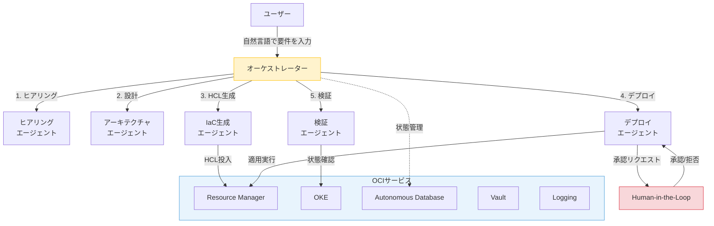
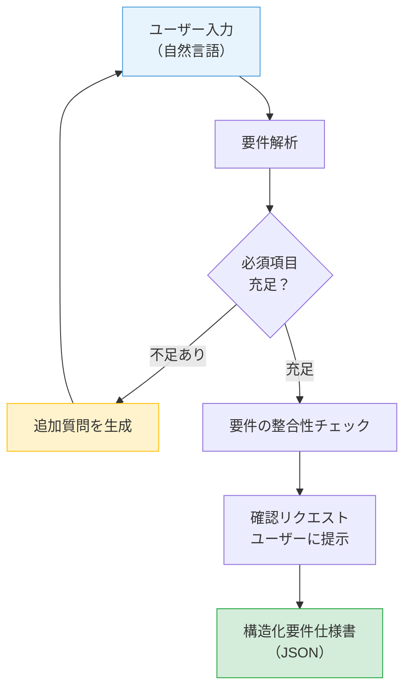
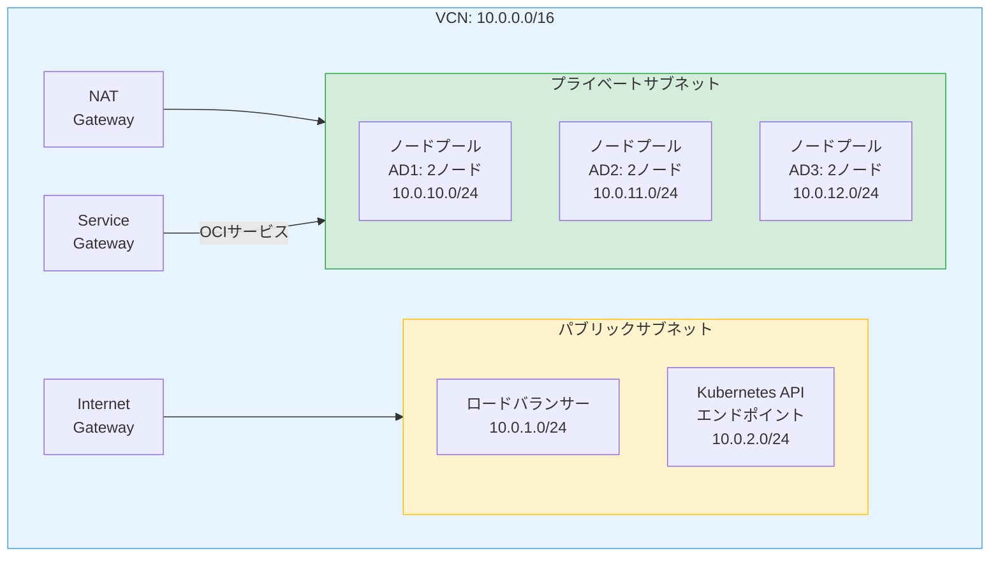
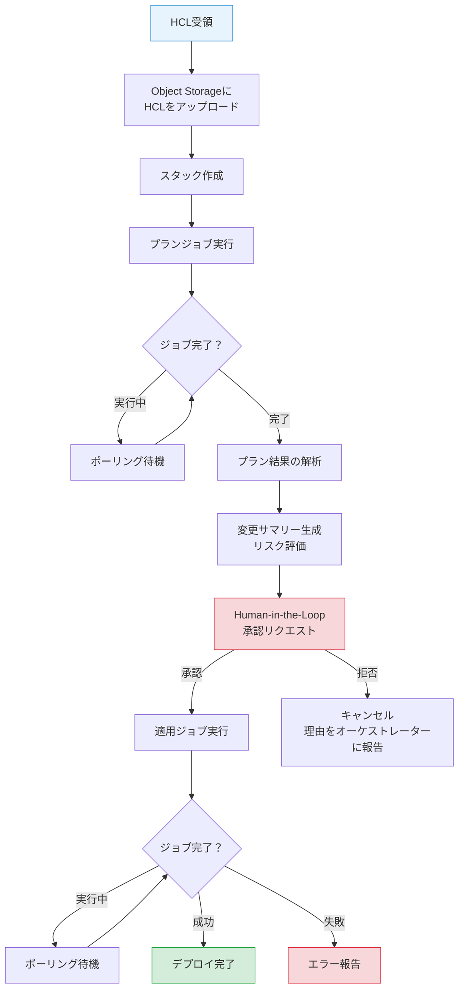
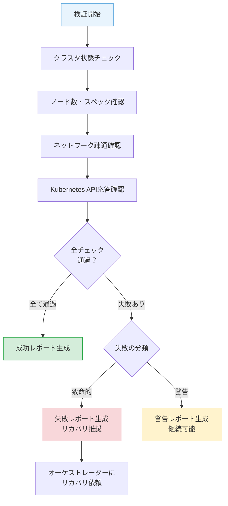
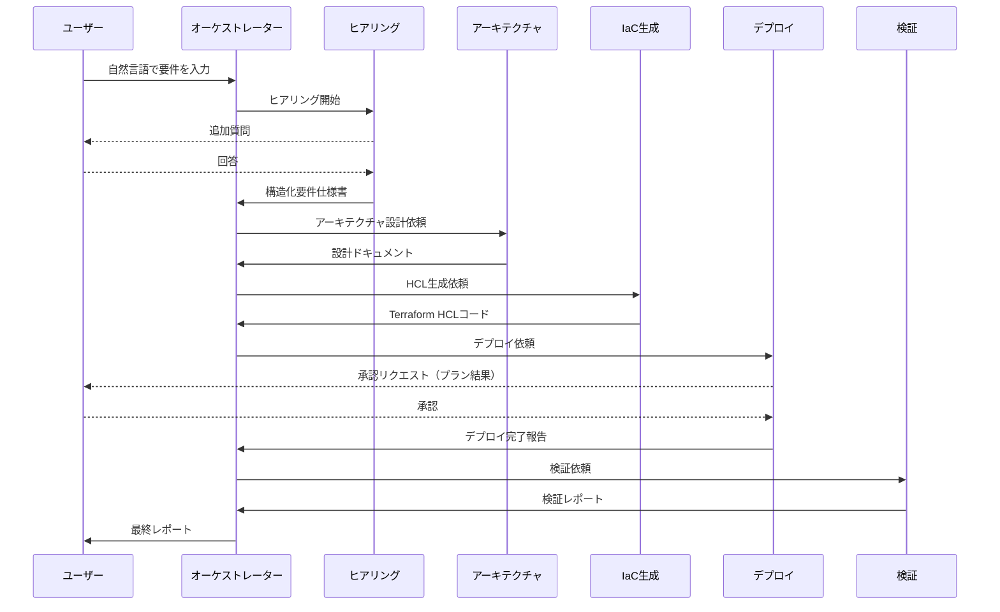
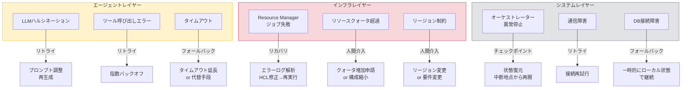

# 第12章 ケーススタディ ― OKEクラスタの自動構築システム

前章までに、エージェントの理論（第I部・第II部）とOCI上での実装基盤（第III部前半）を学んだ。本章では、これらの知識を総動員し、OKEクラスタの自動構築をテーマとしたマルチエージェントシステムのケーススタディに取り組む。

ケーススタディを通じて、協調パターンの選定、エージェント分割、状態管理、エラーリカバリ、設計判断のプロセスを追体験する。読者が自身のプロジェクトでマルチエージェントシステムを設計する際の参考となることを目指す。

---

## 12.1 要件と全体設計

### ユースケース

本ケーススタディのユースケースは、「ユーザーが自然言語で要件を伝えると、マルチエージェントシステムがOKEクラスタを自動構築する」というシナリオである。

**ユーザーの入力例**:

> 「本番環境用のOKEクラスタを構築してほしい。3つの可用性ドメインに分散配置し、ノードプールはVM.Standard.E4.Flexの2OCPU/16GBで各ADに2ノードずつ。フロントエンド用とバックエンド用のサブネットを分離し、バックエンドはプライベートサブネットに配置。」

**期待されるアウトプット**:
- VCN、サブネット、ゲートウェイの設計と構築
- OKEクラスタとノードプールの構築
- セキュリティリスト/NSGの設定
- 構築結果のレポート

### 非機能要件

システムの非機能要件を以下のように定義する。

- **冪等性**: 同じ要件で再実行しても、既存のリソースと整合する結果が得られること
- **リカバリ可能性**: 途中で障害が発生しても、チェックポイントから再開できること
- **監査証跡**: 全てのエージェントの判断と操作がログとして記録されること
- **Human-in-the-Loop**: インフラ変更の適用前に人間の承認を得ること

### 全体アーキテクチャ

図12.1にOKEクラスタ自動構築システムの全体アーキテクチャを示す。

**図12.1: OKEクラスタ自動構築システムの全体アーキテクチャ図**

### パターン選定の理由

第4章のパターン選定ガイドに基づき、オーケストレーター型パターンを採用する。その理由は二つある。

第一に、タスクの動的な分解が必要である。ユーザーの要件は多様であり、事前に全てのパターンを定義することは困難である。オーケストレーターのLLMがユーザーの要件を分析し、必要なサブタスクを動的に決定する。

第二に、段階的な判断が求められる。ヒアリング→設計→HCL生成→デプロイ→検証の各段階で、前段の結果に基づいて次の判断を行う。直列パイプラインでも実現可能だが、途中でのエラーハンドリングや再計画の柔軟性が必要である。

---

## 12.2 ヒアリングエージェント

ヒアリングエージェントは、ユーザーの自然言語の要件を構造化された仕様書に変換する。

### 入出力設計

図12.2にヒアリングエージェントの入出力と対話フローを示す。

**図12.2: ヒアリングエージェントの入出力と対話フロー**

### 必須項目と出力スキーマ

ヒアリングエージェントが収集する必須項目は以下のとおりである。

- **環境種別**: 本番 / 開発 / 検証
- **ノード構成**: シェイプ、OCPU数、メモリ、ノード数
- **可用性設計**: 可用性ドメイン分散の要否、ノードプール数
- **ネットワーク要件**: パブリック/プライベートの分離、CIDRブロック
- **セキュリティ要件**: NSGルール、通信許可範囲

### ヒアリング戦略

ユーザーの入力が不完全な場合、不足情報を段階的に収集する。全ての項目を一度に質問するのではなく、文脈に応じて優先度の高い項目から順に質問する。

デフォルト値の推論も重要な機能である。環境種別が「開発」であれば、可用性ドメイン分散は不要、ノード数は最小構成を提案する。推論したデフォルト値はユーザーに明示し、確認を求める。

### ヒアリング完了判定

ヒアリングの完了は、必須項目の充足チェックで判定する。全ての必須項目が埋まり、かつユーザーの確認が得られた時点でヒアリングを完了とする。矛盾する要件（たとえば「最小構成で高可用性」）が検出された場合は、トレードオフを説明して選択を求める。

---

## 12.3 アーキテクチャエージェント

アーキテクチャエージェントは、構造化された要件仕様書を受け取り、OKEクラスタのアーキテクチャ設計を行う。

### 設計の変換ロジック

要件仕様書からアーキテクチャ設計への変換は、以下の手順で行う。

1. **VCN設計**: CIDRブロックの決定、サブネット分割
2. **サブネット構成**: パブリック/プライベートの分離、各サブネットのCIDR割り当て
3. **ノードプール設計**: シェイプ選択、AD分散配置、数量決定
4. **ネットワークポリシー**: NSGルール、セキュリティリストの設計
5. **ゲートウェイ設計**: Internet Gateway、NAT Gateway、Service Gatewayの配置

### アーキテクチャ設計の出力例

図12.3にアーキテクチャエージェントが生成するOKEクラスタ構成の例を示す。

**図12.3: アーキテクチャエージェントが生成するOKEクラスタ構成の例**

### ベストプラクティスの組み込み

アーキテクチャエージェントは、OCI固有のベストプラクティスを設計に反映する。システムプロンプトにベストプラクティスを含め、LLMの推論で設計に適用する。

主なベストプラクティスは以下のとおりである。

- **AD分散**: 本番環境では3つの可用性ドメインにノードを分散配置する
- **サブネット分離**: Kubernetes APIエンドポイントとノードプールを別サブネットに配置する
- **NSGの使用**: セキュリティリストよりもNSGを優先する（細粒度の制御が可能）
- **Service Gateway**: OCIサービスへのアクセスはService Gateway経由とする

### 設計の説明可能性

アーキテクチャエージェントは、設計の根拠を出力に含める。「なぜ3つのADに分散するのか」「なぜこのCIDRブロックを選んだのか」を明示する。設計判断の透明性は、Human-in-the-Loopでの承認判断を支援する。

---

## 12.4 IaC生成エージェント

IaC生成エージェントは、アーキテクチャ設計をTerraform HCLコードに変換する。

### ハイブリッドアプローチ

HCL生成には、テンプレートベースの生成とLLMによる動的生成のハイブリッドを採用する。

**テンプレートベース**: VCN、サブネット、ゲートウェイなどの基本リソースは、事前定義のテンプレートを使用する。テンプレートはOCI Terraform Providerの正式な構文に準拠しており、構文エラーのリスクが低い。パラメータ（CIDR、リソース名等）のみをLLMが埋める。

**LLM動的生成**: セキュリティルール、IAMポリシーなど、要件に応じて構造が変化する部分はLLMが動的に生成する。テンプレートでは対応しきれないカスタマイズが必要な場合にLLMの柔軟性を活用する。

この組み合わせにより、基本構造の信頼性とカスタマイズの柔軟性を両立する。

### モジュール構造

生成するTerraform HCLは、以下のモジュールに分割する。

- **networkモジュール**: VCN、サブネット、ゲートウェイ、NSG
- **clusterモジュール**: OKEクラスタ本体の設定
- **nodepoolモジュール**: ノードプールの設定（AD分散含む）
- **iamモジュール**: Dynamic Group、IAMポリシー

モジュール分割により、各モジュールの独立したテストと再利用が可能になる。

### 自己検証

IaC生成エージェントは、生成したHCLの自己検証を行う。構文チェック（terraform validate相当のロジック）を実行し、必須リソースの存在確認、リソース間の参照整合性を検証する。検証に失敗した場合は、エラー情報をもとにLLMが修正を試みる。

---

## 12.5 デプロイエージェント

デプロイエージェントは、IaC生成エージェントが出力したTerraform HCLをOCI Resource Managerに投入し、インフラをデプロイする。

### ワークフロー

図12.4にデプロイエージェントのワークフローとHuman-in-the-Loopポイントを示す。

**図12.4: デプロイエージェントのワークフローとHuman-in-the-Loopポイント**

### プラン結果の要約

プラン結果の要約は、人間の承認判断を支援する重要な機能である。以下の情報を含める。

- **作成されるリソース**: リソースタイプ、名前、主要属性
- **変更されるリソース**: 変更前後の差分
- **削除されるリソース**: 削除対象のリソース名
- **リスク評価**: 高リスク操作（削除、セキュリティ変更等）の強調

### 非同期ジョブの監視

Resource Managerのジョブは非同期で実行される。デプロイエージェントはジョブのステータスをポーリングして完了を待つ。ポーリング間隔は指数バックオフで調整し、初回10秒、最大60秒とする。タイムアウトは30分に設定し、超過した場合はエラーとして報告する。

---

## 12.6 検証エージェント

検証エージェントは、デプロイ完了後のOKEクラスタが要件を満たしているかを検証する。

### チェック項目

図12.5に検証エージェントのチェック項目とリカバリ判断フローを示す。

**図12.5: 検証エージェントのチェック項目とリカバリ判断フロー**

### 検証の設計

検証は宣言的な期待状態との比較で行う。ヒアリングエージェントの出力（構造化要件仕様書）を期待状態とし、実際のOKEクラスタの状態と照合する。

具体的なチェック項目は以下のとおりである。

- **クラスタ状態**: lifecycle_stateがACTIVEであること
- **ノード数**: 要件で指定したノード数が起動していること
- **ノードスペック**: 指定したシェイプ・OCPU・メモリで構成されていること
- **AD分散**: 指定した可用性ドメインにノードが分散していること
- **ネットワーク**: VCN、サブネット、ゲートウェイが設計どおりに構成されていること
- **Kubernetes API**: APIサーバーがリクエストに応答すること

### 失敗の分類

検証失敗は「致命的エラー」と「警告」に分類する。

致命的エラーは、システムが正常に機能しない状態である。クラスタのlifecycle_stateがACTIVE以外、ノードが1台も起動していない、Kubernetes APIが応答しないなどが該当する。

警告は、機能上の問題はないが要件との乖離がある状態である。ノード数が要件より少ない（一部のノードが起動遅延中）、一部のNSGルールが未適用などが該当する。

---

## 12.7 オーケストレーターの設計

オーケストレーターは、上記五つの専門エージェントを統括し、全体のワークフローを制御する。

### 全体シーケンス

図12.6にオーケストレーターと各エージェント間の全体シーケンスを示す。

**図12.6: オーケストレーターと各エージェント間の全体シーケンス図**

### オーケストレーターの責務

オーケストレーターの責務は四つに限定する。

**タスク分解**: ユーザーの要件を分析し、実行すべきサブタスクの順序を決定する。

**委任**: 各サブタスクを適切な専門エージェントに委任する。前段のエージェントの出力を後段のエージェントの入力として渡す。

**結果統合**: 各エージェントの出力を統合し、最終レポートとしてユーザーに提示する。

**エラー判断**: エージェントからのエラー報告を受けて、リトライ、代替手段、中断のいずれかを判断する。

### 状態遷移管理

オーケストレーターは、全体のワークフローがどのフェーズにあるかを管理する。状態はAutonomous Databaseに永続化し、障害からの復旧時にチェックポイントから再開できるようにする。

状態遷移は「ヒアリング中→設計中→HCL生成中→デプロイ中→検証中→完了」である。各遷移時に状態をDBに書き込む。

### プロンプト設計

オーケストレーターのシステムプロンプトには、以下の情報を含める。

- 各専門エージェントの能力と受付可能なタスク
- ワークフローの全体像と各フェーズの目的
- エラー発生時の判断基準（リトライ回数、エスカレーション条件）
- Human-in-the-Loopのトリガー条件

---

## 12.8 失敗時のリカバリ

マルチエージェントシステムでは、複数のレイヤーで失敗が発生しうる。各レイヤーに適切なリカバリ戦略を設計する。

### 失敗レイヤーの分類

図12.7に失敗レイヤーごとのリカバリ戦略マッピングを示す。

**図12.7: 失敗レイヤーごとのリカバリ戦略マッピング**

### エージェントレイヤーの失敗

**LLMハルシネーション**: IaC生成エージェントが不正なHCLを生成した場合、自己検証で検出する。エラー情報をプロンプトに含め、LLMに修正を依頼する。最大3回のリトライで改善しない場合は、テンプレートベースの生成にフォールバックする。

**ツール呼び出しエラー**: OCI APIの一時的なエラー（429、500、503）は、第9章で学んだ指数バックオフでリトライする。永続的エラー（401、403）は認証・権限の問題としてオーケストレーターに報告する。

### インフラレイヤーの失敗

**Resource Managerジョブ失敗**: プランジョブや適用ジョブが失敗した場合、ジョブのログを解析してエラー原因を特定する。HCLの修正で対処可能な場合はIaC生成エージェントに修正を依頼する。

**リソースクォータ超過**: 利用可能なクォータを超えた場合は、人間の介入が必要である。クォータ増加申請を推奨するか、構成の縮小を提案する。

### システムレイヤーの失敗

**オーケストレーター異常停止**: チェックポイントからの復旧で対処する。Autonomous Databaseに永続化された状態から、中断時点のフェーズを特定し、そこから処理を再開する。

### クリーンアップ

デプロイが途中で失敗し、部分的にリソースが作成された場合、terraform destroyによるクリーンアップを実行する。terraform destroyは冪等であるため、何度実行しても安全である。クリーンアップもHuman-in-the-Loopの対象とし、誤ったリソース削除を防ぐ。

---

## 12.9 設計判断の振り返り

本ケーススタディで行った設計判断を振り返り、トレードオフを明示する。

### トレードオフ一覧

表12.1に本ケーススタディの設計判断のトレードオフを示す。

| 設計判断 | 採用した選択肢 | 代替案 | トレードオフ |
|:---|:---|:---|:---|
| 協調パターン | オーケストレーター型 | 直列パイプライン | 柔軟性 vs シンプルさ |
| エージェント数 | 5つの専門エージェント | 3つ（統合型） or 8つ（細分化） | 専門性 vs 通信コスト |
| HCL生成方式 | テンプレート＋LLMハイブリッド | 完全LLM生成 | 信頼性 vs 柔軟性 |
| 状態管理 | Autonomous Database | ファイルベース | スケーラビリティ vs シンプルさ |
| 承認方式 | プラン結果ベースの承認 | 全操作の逐次承認 | 効率性 vs 安全性 |

**表12.1: 設計判断のトレードオフ一覧**

### パターン選定の振り返り

オーケストレーター型を採用したが、要件が固定的であれば直列パイプラインでも実現可能である。直列パイプラインは実装がシンプルで予測しやすいが、エラー時の柔軟なリカバリが困難になる。

異なるユースケース（たとえば定型的なインフラ構築の反復実行）では、直列パイプラインの方が適切な場合もある。パターン選定は、要件の変動性とエラー対処の複雑さで判断する。

### エージェント粒度の振り返り

5つのエージェントに分割したが、IaC生成エージェントとデプロイエージェントの統合も検討に値する。統合すればエージェント間の通信が減るが、HCL生成とResource Manager操作という異なるドメインの責務が混在する。

一方、ネットワーク設計とセキュリティ設計を別エージェントにさらに分割する選択肢もある。しかし、両者は密接に関連するため、通信コストの増加に見合うメリットが得られない。

### エージェントに任せるべき範囲

「ここはエージェントに任せるべきか、決定的なコードで書くべきか」は重要な設計判断である。

エージェント（LLM推論）に任せるべき処理は、自然言語の解釈、設計判断、エラー時の柔軟な対処である。決定的なコードで書くべき処理は、テンプレートの適用、APIの呼び出し、状態の読み書きである。

判断基準は「入力の多様性」にある。入力のパターンが限定的であれば決定的なコード、入力が多様であればLLM推論が適する。

---

## まとめ

本章では、OKEクラスタの自動構築をテーマとしたケーススタディを通じて、マルチエージェントシステムの設計プロセスを追体験した。

システムは五つの専門エージェント（ヒアリング、アーキテクチャ、IaC生成、デプロイ、検証）とオーケストレーターで構成される。オーケストレーター型パターンにより、ユーザー要件の動的な分解と段階的な判断を実現した。

各エージェントの設計では、入出力の明確な定義、ドメイン知識の集中、エラー時のフォールバックを重視した。特にIaC生成のハイブリッドアプローチ（テンプレート＋LLM）は、信頼性と柔軟性の両立の好例である。

失敗時のリカバリは、エージェント・インフラ・システムの三つのレイヤーに分類し、それぞれに適切な戦略（リトライ、人間介入、チェックポイント復旧）を設計した。

設計判断の振り返りでは、各判断のトレードオフを明示した。パターン選定、エージェント粒度、LLMの活用範囲は、ユースケースに応じて異なる最適解がある。

ケーススタディを通じてマルチエージェントシステムの設計と構築を一通り体験した。次章では、こうしたシステムをどのようにテスト・デバッグするかを体系的に学ぶ。

---

## 理解度チェック

**Q1.** 本ケーススタディでオーケストレーター型パターンを採用した理由を、直列パイプラインと比較して説明せよ。

**Q2.** ヒアリングエージェントが「ヒアリング完了」と判断する基準として、どのような設計が考えられるか述べよ。

**Q3.** IaC生成エージェントがテンプレートベースの生成とLLM生成を組み合わせるハイブリッドアプローチを採用する理由を説明せよ。

**Q4.** デプロイエージェントにおけるHuman-in-the-Loopの設計で、何をどのタイミングで人間に提示すべきか説明せよ。

**Q5.** 失敗時のリカバリにおいて、「一時的エラー」と「永続的エラー」の区別が重要な理由を述べよ。
