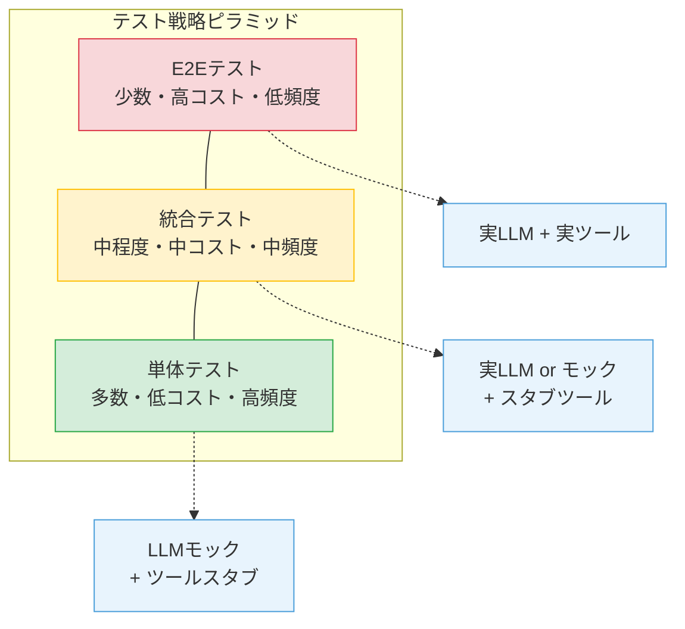
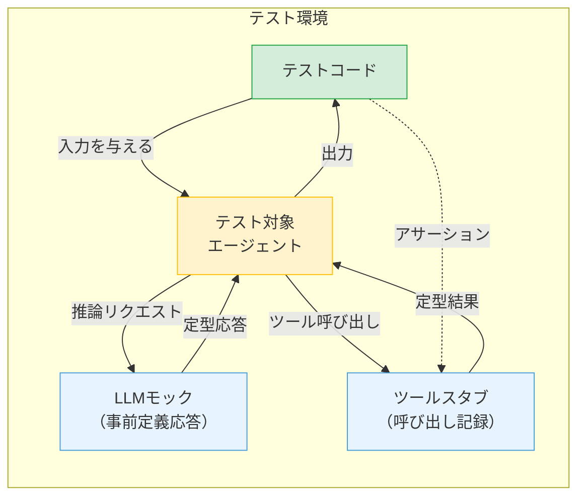
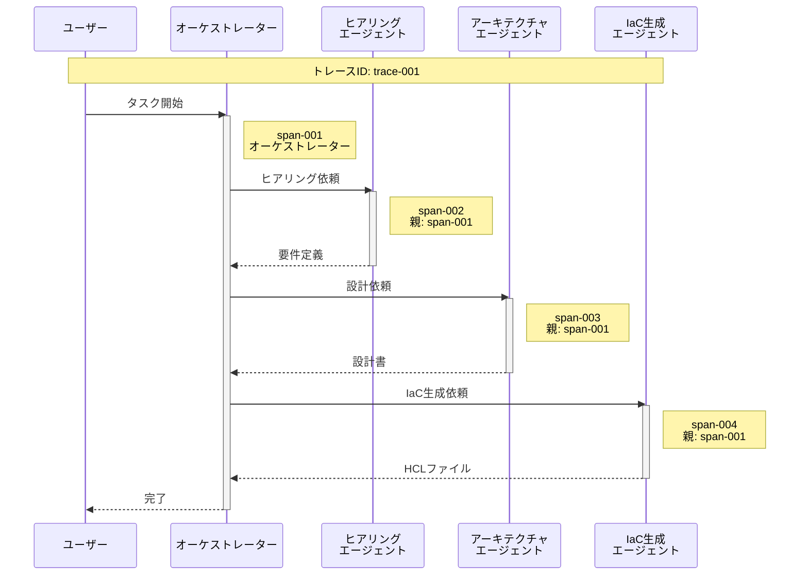

# 第13章 マルチエージェントのテストとデバッグ

前章までに、マルチエージェントシステムの設計・構築・ケーススタディを一通り体験した。本章では、こうしたシステムをどのように検証し、問題を発見・修正するかを体系的に扱う。

マルチエージェントシステムのテストには、従来のソフトウェアテストにはない固有の課題がある。LLMの非決定性、エージェント間の創発的な振る舞い、長い実行チェーンの再現困難性である。本章では、これらの課題に対する実践的なテスト戦略とデバッグ手法を提供する。

---

## 13.1 何をテストするのか ― マルチエージェントのテスト課題

### 従来のテストとの違い

マルチエージェントシステムのテストが従来のソフトウェアテストと異なる点は、大きく四つある。

**非決定性**: 従来のソフトウェアは同じ入力に対して同じ出力を返す。マルチエージェントシステムでは、LLMの出力が毎回異なるため、テスト結果も変動する。「正解」が一意に定まらない。

**入力空間の広さ**: 従来のAPIテストでは入力のパターンが限定的である。エージェントは自然言語の入力を受け取るため、入力空間が事実上無限である。全パターンのテストは不可能であり、代表的なシナリオに絞る戦略が必要になる。

**創発的な振る舞い**: 個々のエージェントが正常に動作していても、組み合わせた結果として予期しない振る舞いが生じる。エージェントAの出力の微妙な変動がエージェントBの判断を大きく変えるケースがある。

**テストコスト**: LLM APIの呼び出しには費用と時間がかかる。テストを実行するたびにAPIコストが発生するため、テスト頻度と網羅性のバランスが従来以上に重要になる。

### テスト戦略ピラミッド

マルチエージェントシステムにも、テストピラミッドの概念を適用する（図13.1）。下層ほどテスト数が多く、上層ほど少ない構成である。

**図13.1: マルチエージェントのテスト戦略ピラミッド**

### テスト優先度の原則

何を保証すべきかの優先順位は、安全性、正確性、効率性の順である。

**安全性**: エージェントが許可されていない操作を実行しないこと。Human-in-the-Loopが正しく機能すること。これが最優先事項である。

**正確性**: エージェントが期待する結果を返すこと。ツールが正しい引数で呼ばれること。エージェント間のデータフローが正常であること。

**効率性**: エージェントが不要なステップを踏まないこと。トークン消費が妥当な範囲であること。これは優先度が最も低いが、運用コストに直結するため無視はできない。

---

## 13.2 エージェント単体テスト

個々のエージェントを分離してテストする手法を解説する。図13.1のテスト戦略ピラミッドの最下層に位置し、最も数が多く、最も低コストで実行できる。図13.2にエージェント単体テストの構成を示す。

### LLMモックによる決定的テスト

エージェントの単体テストでは、LLMを事前定義された応答を返すモック（スタブ）に置き換える。これにより、テストの決定性を確保し、APIコストをゼロにする。

**図13.2: エージェント単体テストの構成（LLMモックとツールスタブ）**

LLMモックは、テストシナリオに応じた応答を順次返す。たとえば、1回目の呼び出しでツール選択の応答を返し、2回目の呼び出しで最終回答を返すように設定する。

### ツール呼び出しの検証

ツールスタブは、呼び出し履歴を記録する。テストでは以下を検証する。

- 正しいツールが選択されたか
- ツールに渡された引数が期待どおりか
- ツールの呼び出し順序が正しいか
- 不要なツール呼び出しがないか

ツールスタブは定型の結果を返すため、ツール側のエラーに影響されずにエージェントのロジックのみをテストできる。

### プロンプトテスト

プロンプトの品質を検証するテストも単体テストに含まれる。以下の観点で検証する。

- 出力が期待するJSON Schemaに準拠しているか
- 必須フィールドが全て含まれているか
- 出力の形式が後続のエージェントの入力要件を満たしているか

プロンプトテストでは実際のLLMを使用する場合もある。その場合は13.5節で述べる非決定性への対処が必要になる。

### コントラクトテスト

コントラクトテスト（Contract Test）は、エージェントの入出力インターフェースの契約遵守を検証する。エージェントが「このスキーマの入力を受け取り、このスキーマの出力を返す」という契約を定義し、その契約が守られているかをテストする。

第12章のケーススタディで見たように、各エージェントの入出力を明確に定義していれば、コントラクトテストの設計は容易である。

---

## 13.3 統合テスト

統合テストでは、複数のエージェントを組み合わせた振る舞いを検証する。図13.2の構成を拡張し、テスト対象のエージェントは実LLMで動作させ、周辺のエージェントをモックに置き換える構成を取る。個々のエージェントが正常でも、組み合わせで問題が生じるケースを検出する。

### インターフェース整合性テスト

最も基本的な統合テストは、エージェント間のインターフェース整合性の検証である。エージェントAの出力スキーマとエージェントBの入力スキーマが一致するかを確認する。

たとえば、第12章のヒアリングエージェントの出力（要件定義）がアーキテクチャエージェントの入力として正しく処理されるかを検証する。出力のフィールド名、型、値の範囲が期待どおりであることを確認する。

### データフローテスト

エージェントAの出力がエージェントBの処理を経て、期待する変換結果になるかを検証する。中間データの形式と内容が正しいことを確認する。

データフローテストでは、一方のエージェントを実LLMで動作させ、他方をモックに置き換える手法が有効である。こうすることで、テスト対象を限定しつつ、実際の出力を使ったテストが可能になる。

### エラー伝播テスト

子エージェントの失敗がオーケストレーターに正しく報告されるかを検証する。以下のシナリオをテストする。

- 子エージェントがタイムアウトした場合のオーケストレーターの挙動
- 子エージェントが不正な出力を返した場合のエラーハンドリング
- 複数の子エージェントが同時に失敗した場合のリカバリ

第7章で設計したフォールトトレランスの仕組みが、実際に機能することを確認する。

### 協調パターンごとのテスト戦略

第4章で学んだ協調パターンごとに、重点的にテストすべき観点が異なる。

直列パイプラインでは、ステップ間のデータ変換の正確性と、途中ステップの失敗時のリカバリを重点的にテストする。

並列ファンアウト/ファンインでは、並行実行の結果集約の正確性と、一部の並列タスクが失敗した場合の挙動を検証する。

オーケストレーター型では、タスク分解の妥当性と、動的なサブタスク割り当ての正当性をテストする。

---

## 13.4 End-to-Endテスト

E2Eテストは、システム全体を本番に近い構成で動作させ、ユーザーの操作から最終結果までの一連のフローを検証する。図13.1のテスト戦略ピラミッドの最上位に位置し、数は少ないが、システム全体の品質保証に不可欠である。

### テストシナリオの設計

E2Eテストのシナリオは、三つのカテゴリに分類する。

**ゴールデンパス**: 最も一般的なユースケースの正常系。第12章のケーススタディであれば、「標準的なOKEクラスタの構築要件を入力し、正常にデプロイが完了する」シナリオが該当する。

**エッジケース**: 境界条件や特殊な入力パターン。「要件が曖昧で追加のヒアリングが必要になる」「リージョン固有の制約がある」等のシナリオである。

**失敗シナリオ**: 意図的にエラーを発生させ、リカバリが正しく機能することを確認する。「APIタイムアウトの発生」「プラン適用の失敗」等のシナリオである。

### 合格判定基準

E2Eテストの合格判定は、厳密一致ではなく品質基準ベースで設計する。LLMの非決定性により、出力の細部は毎回異なる。判定基準は以下のように設計する。

- 最終的な成果物が要件を満たしているか（構造的な検証）
- 必須のステップが全て実行されたか（プロセスの検証）
- Human-in-the-Loopの承認ポイントが正しくトリガーされたか（安全性の検証）
- 実行時間が許容範囲内か（性能の検証）

### CI/CDパイプラインとの統合

E2Eテストはコストが高いため、実行頻度を最適化する。

**毎コミット**: 単体テストのみ（LLMモック使用、コストゼロ）
**毎日**: 統合テストの主要シナリオ（部分的にLLMモック使用）
**毎週/リリース前**: 全E2Eテスト（実LLM使用、高コスト）

テスト環境には、本番と同一のOCIコンパートメントを使用するが、リソースの作成は最小構成に制限する。テスト完了後にはリソースを確実にクリーンアップする。

---

## 13.5 LLMの非決定性への対処

LLMの出力が毎回異なるという根本的な課題に対して、「抑制」と「許容」の二つのアプローチがある（図13.3）。

### 非決定性の対処戦略

| | 抑制（出力の揺れを小さくする） | 許容（揺れを前提にテストする） |
|---|---|---|
| **パラメータ制御** | temperature=0に設定 | N回実行して成功率で判定 |
| **出力形式** | JSON Schemaで構造化出力を強制 | 形式の検証と内容の検証を分離 |
| **プロンプト** | Few-shotで出力例を明示 | 意味的一致のアサーション |
| **再現性** | シード値の固定（対応モデルの場合） | 統計的なテスト（信頼区間） |

**図13.3: 非決定性の対処戦略マトリクス（抑制策 × 許容策）**

### 抑制アプローチ

**temperature制御**: temperature=0に設定することで、出力の揺れを最小化する。ただし、temperature=0でも完全な決定性は保証されない。

**構造化出力**: JSON Schemaを使って出力形式を強制する。OCI GenAI Serviceの構造化出力機能を利用すれば、フィールド名や型は固定され、テストが容易になる。

**Few-shotプロンプト**: 期待する出力の例をプロンプトに含めることで、出力の形式と内容の揺れを抑制する。

### 許容アプローチ

**N回実行テスト**: 同一の入力でN回テストを実行し、成功率が閾値を超えることを検証する。「10回中8回以上成功すること」のような基準を設定する。

**意味的一致のアサーション**: 出力の文字列が完全一致することを求めず、意味的に同等であることを検証する。たとえば、「VCNを作成する」と「Virtual Cloud Networkを構築する」は意味的に同等である。

**形式と内容の分離**: 出力の形式（JSON構造、フィールドの存在）と内容（値の妥当性）を分離してテストする。形式のテストは決定的に検証し、内容のテストは許容範囲を設けて検証する。

### 実践的な組み合わせ

実際のプロジェクトでは、抑制と許容を組み合わせて使用する。単体テストでは抑制アプローチを優先し（LLMモック + 構造化出力）、E2Eテストでは許容アプローチを適用する（N回実行 + 品質基準判定）。

---

## 13.6 トレーシングとデバッグ

マルチエージェントシステムのデバッグでは、分散トレーシング（Distributed Tracing）の概念を応用する。複数のエージェントにまたがる処理の流れを追跡し、問題の原因を特定する。

### 分散トレーシングの適用

分散トレーシングでは、トレースID、スパン、親子関係の三つの概念を使用する。

**トレースID**: ユーザーリクエストから最終結果までの一連の処理に割り当てる一意の識別子。マルチエージェントでは、1つのタスク実行全体が1つのトレースに対応する。

**スパン**: 1つのエージェントの1回の実行を表す単位。スパンには開始時刻、終了時刻、エージェントID、入力、出力、ステータスが記録される。

**親子関係**: オーケストレーターのスパンを親、子エージェントのスパンを子として、呼び出し関係を記録する。

**図13.4: マルチエージェントのトレーシング可視化例**

### 構造化ログの設計

トレーシングの基盤となるのが構造化ログである。各エージェントが以下のフィールドを含むJSON形式のログを出力する。

- **trace_id**: トレース識別子
- **span_id**: スパン識別子
- **parent_span_id**: 親スパンの識別子
- **agent_id**: エージェントの識別子
- **step**: 実行ステップ番号（ReActループの何回目か）
- **event_type**: イベントの種類（llm_request, llm_response, tool_call, tool_result, error）
- **timestamp**: タイムスタンプ
- **payload**: イベント固有のデータ（プロンプト要約、ツール名と引数、出力要約等）

第11章で学んだOCI Logging Serviceに構造化ログを送信し、Logging Analyticsで検索・分析する。

### デバッグのワークフロー

マルチエージェントシステムのデバッグは、以下の4ステップで進める。

**1. 問題の再現**: トレースIDを指定してテストを再実行する。LLMモックに過去の応答を設定することで、再現性を高める。

**2. トレースの収集**: 問題が発生したトレースのスパンを時系列に並べ、処理の流れを可視化する。どのエージェントのどのステップで問題が発生したかを特定する。

**3. 原因の特定**: 問題のスパンを詳細に調査する。LLMへの入力（プロンプト）、LLMの出力（推論結果）、ツール呼び出し（引数と結果）を確認し、原因を特定する。

**4. 修正と検証**: 原因に応じてプロンプト、ツール実装、協調ロジックを修正し、回帰テストで修正を検証する。

### ボトルネックの特定

トレースのスパンから、各エージェントの処理時間を可視化する。処理時間が長いスパンがボトルネックの候補である。

特にLLM APIの呼び出し回数が多いエージェントは、プロンプトの改善やコンテキストの最適化で改善できる可能性がある。第2章で学んだコンテキストエンジニアリングの技法を、デバッグの結果に基づいて適用する。

---

## 13.7 回帰テストとテスト資産の管理

マルチエージェントシステムでは、プロンプトの変更やモデルの更新が頻繁に発生する。図13.1のテスト戦略ピラミッドに沿って、影響範囲に応じたレベルの回帰テストを実行し、変更が既存の品質を損なっていないことを保証する。

### プロンプト変更時の回帰テスト

プロンプトの変更は、従来のコード変更以上に広範な影響を及ぼす可能性がある。プロンプトを変更した場合、以下の回帰テストを実行する。

- そのエージェントの全単体テスト
- そのエージェントが関与する統合テスト
- 影響を受ける可能性のあるE2Eテストのゴールデンパス

### モデル更新時の品質検証

LLMのモデルバージョンが変更された場合（バージョンアップ、モデルの切り替え等）、全エージェントの品質を再検証する。モデル更新は全てのエージェントに影響するため、包括的なテストが必要である。

モデル更新時のテスト手順は以下のとおりである。

1. ゴールデンデータセット（後述）を使って全エージェントの出力を取得する
2. 旧モデルの出力と比較し、品質の変化を評価する
3. 品質が低下したエージェントについて、プロンプトの調整を検討する

### ゴールデンデータセット

ゴールデンデータセット（Golden Dataset）は、入力と期待出力のペアの集合である。テストの基準として使用する。

ゴールデンデータセットの設計指針は以下のとおりである。

- **代表性**: 主要なユースケースをカバーする
- **多様性**: エッジケースや異常系を含む
- **保守性**: データの追加・更新が容易な形式で管理する
- **バージョン管理**: Gitで管理し、変更履歴を追跡する

### テスト資産の鮮度維持

テスト資産（テストケース、モック応答、ゴールデンデータセット）は時間の経過とともに陳腐化する。システムの仕様変更やモデルの更新に伴い、テスト資産も更新する必要がある。

定期的なレビューサイクルを設け、使われていないテストケースの削除、古くなったモック応答の更新、ゴールデンデータセットへの新規ケースの追加を行う。

---

## まとめ

本章では、マルチエージェントシステムのテストとデバッグの手法を体系的に学んだ。

テスト戦略はピラミッド型で設計する。下層の単体テスト（LLMモック使用）で数を稼ぎ、中層の統合テストでエージェント間の整合性を検証し、上層のE2Eテストでシステム全体の品質を保証する。

LLMの非決定性には、抑制（temperature制御、構造化出力）と許容（N回実行、意味的一致）の二つのアプローチで対処する。テストレベルに応じて両者を組み合わせるのが実践的である。

トレーシングは、分散トレーシングの概念をマルチエージェントに適用する。トレースID、スパン、親子関係を使って処理の流れを可視化し、問題の原因を特定する。

回帰テストは、プロンプト変更やモデル更新の影響を検証する。ゴールデンデータセットを基準として品質を維持する。

テストとデバッグの手法を学んだ。次章では、本番環境で継続的にシステムの健全性を維持するための可観測性とガバナンスの設計に進む。

---

## 理解度チェック

**Q1.** マルチエージェントシステムのテストが従来のソフトウェアテストと異なる点を三つ挙げ、それぞれ説明せよ。

**Q2.** エージェント単体テストにおいて、LLMをモックに置き換える利点と限界を述べよ。

**Q3.** 統合テストでエージェント間のインターフェース整合性を検証する方法を説明せよ。

**Q4.** LLMの非決定性に対処するために、「抑制」と「許容」の二つのアプローチがある。それぞれ具体的な手法を二つずつ挙げよ。

**Q5.** 分散トレーシングの概念をマルチエージェントシステムに適用する場合、トレースID・スパンはそれぞれ何に対応するか説明せよ。
