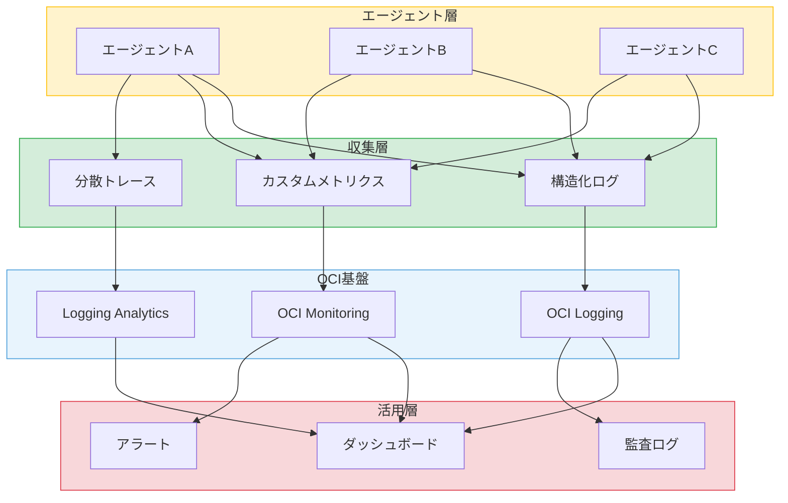
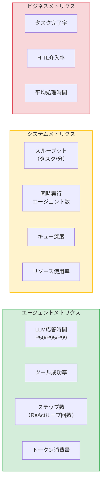
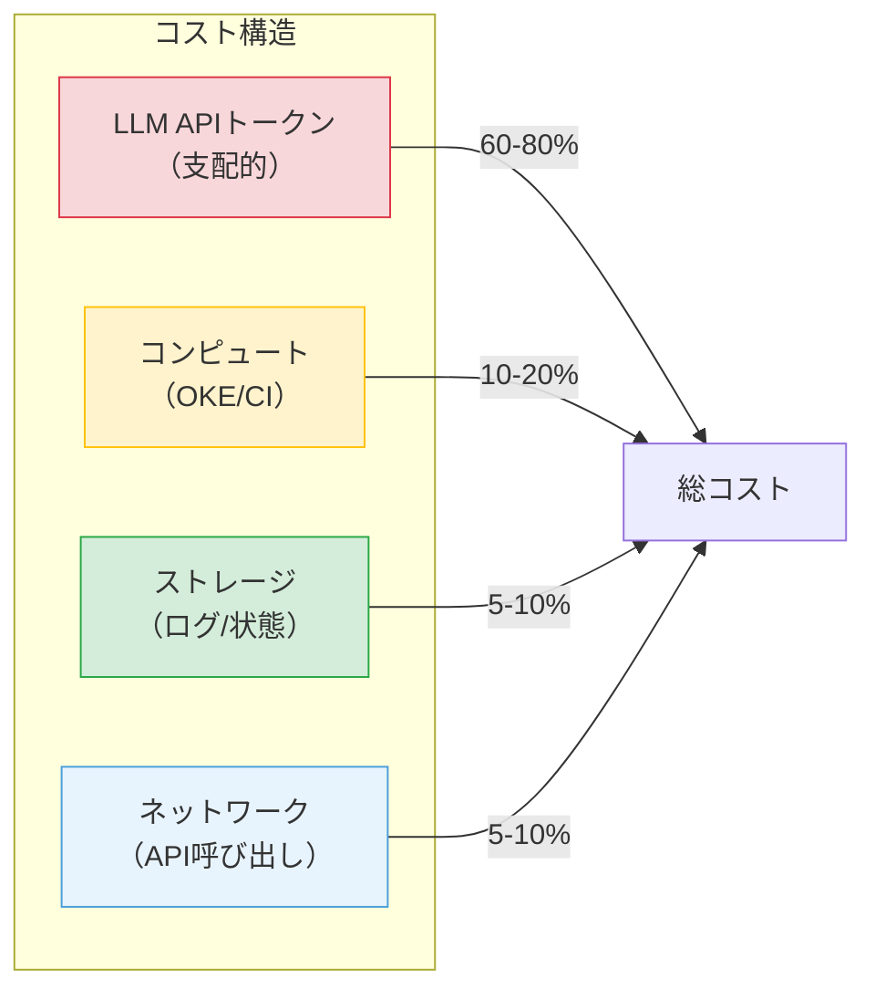

# 第14章 可観測性とガバナンス

前章では、マルチエージェントシステムのテストとデバッグの手法を学んだ。テスト時の問題発見と修正は開発フェーズの話である。本番環境に投入した後は、継続的にシステムの健全性を監視し続ける必要がある。

本章では、本番運用時の可観測性（Observability）とガバナンスの設計を扱う。

---

## 14.1 エージェントの可観測性 ― なぜ特別な設計が必要か

### マイクロサービスとの共通点と差異

マルチエージェントシステムの可観測性は、マイクロサービスの可観測性と共通する部分が多い。複数のコンポーネントが連携して動作する構造は同じである。ログ・メトリクス・トレースの3本柱も共通して適用できる。

しかし、エージェント固有の課題が三つある。

**判断の不透明性**: マイクロサービスは決定的なロジックで動作するため、入力と出力を見れば内部の処理を推測できる。エージェントはLLMの推論に基づいて判断するため、同じ入力でも異なる判断を下す可能性がある。「なぜその判断をしたか」を可視化する仕組みが必要である。

**動的な実行パス**: マイクロサービスの呼び出しグラフは、コードから静的に把握できる。エージェントの実行パスはLLMの判断によって動的に変化する。どのツールを何回呼び出すか、どの子エージェントにタスクを委任するかが実行時に決まる。

**コストの直結性**: マイクロサービスの運用コストは主にコンピュートリソースに比例する。エージェントではLLM APIのトークン消費が支配的なコスト要因であり、エージェントの「思考量」がコストに直結する。

### 可観測性の全体設計

**図14.1: マルチエージェント可観測性の全体設計図**

図14.1に可観測性の全体設計を示す。エージェント層での情報生成、収集層での標準化、OCI基盤での蓄積・分析、活用層での可視化・アラートの4層で構成する。

---

## 14.2 ログ設計 ― エージェントの行動記録

### 構造化ログの設計

エージェントのログは、JSON形式の構造化ログとして設計する。第13章で設計したトレーシング用のフィールドに加え、運用に必要な情報を含める。

主要なフィールドは以下のとおりである。

- **trace_id**: タスク実行全体を一意に識別する
- **span_id / parent_span_id**: エージェント間の呼び出し関係を追跡する
- **agent_id**: どのエージェントが出力したログかを識別する
- **step**: ReActループの何回目かを記録する
- **event_type**: イベントの種類を分類する（llm_request, llm_response, tool_call, tool_result, decision, error）
- **duration_ms**: 処理時間をミリ秒で記録する
- **token_count**: LLM呼び出し時の入力・出力トークン数を記録する

### ログレベルの設計

ログレベルは、運用時の情報量とストレージコストのバランスで設計する。

**ERROR**: エージェントの失敗、ツール呼び出しの失敗、タイムアウト。即座にアラートの対象となる。

**WARN**: リトライの発生、Human-in-the-Loopの拒否、想定外の出力形式。調査の対象となるが即座の対応は不要な場合が多い。

**INFO**: ツール呼び出しの開始・完了、エージェント間のメッセージ送受信、タスクの状態遷移。日常的な運用監視に使用する。

**DEBUG**: LLMへの入出力全文、プロンプトの全内容、中間結果の詳細。トラブルシューティング時にのみ有効化する。

本番環境ではINFOレベル以上を常時記録し、DEBUGレベルは必要時にのみ有効化する。DEBUGレベルのログはトークン数が大きくなるため、ストレージコストに注意する。

### 機密情報のマスキング

エージェントのログには、ユーザーの入力やLLMへのプロンプトが含まれる。個人情報（PII）やAPIキーがログに記録されないよう、マスキング戦略を設計する。

マスキングの対象は以下のとおりである。

- ユーザーが入力した個人情報（氏名、メールアドレス、電話番号等）
- APIキー、トークン、パスワード等の認証情報
- Vaultから取得したシークレットの値

マスキングはログの出力時（アプリケーション側）で実施する。OCI Loggingに送信する前にマスキングを完了させ、ストレージにはマスキング済みのログのみを保存する。

### OCI Logging Serviceへの送信

OCI Logging Serviceに構造化ログを送信する設計は、第11章で学んだパターンを適用する。カスタムログとしてJSON形式のログを送信し、Logging Analyticsで検索・分析する。

ログのパーティショニングは、エージェントIDとトレースIDの組み合わせで設計する。特定のエージェントのログを効率的に検索でき、かつ1つのタスク実行全体のログを横断的に検索できる。

---

## 14.3 メトリクス ― 何を計測すべきか

### 3階層のメトリクス設計

メトリクスは、エージェントレベル、システムレベル、ビジネスレベルの3階層で設計する（図14.2）。

**図14.2: 可観測性ダッシュボードの設計例（3階層メトリクス）**

### エージェントメトリクス

個々のエージェントの振る舞いを計測するメトリクスである。

**LLM応答時間**: LLM APIの応答時間をP50、P95、P99で計測する。応答時間の悪化はユーザー体験に直結する。

**ツール成功率**: ツール呼び出しの成功/失敗の比率をツール別に計測する。特定のツールの失敗率が急上昇した場合、外部サービスの障害を示唆する。

**ステップ数**: 1つのタスクを完了するまでのReActループの回数を計測する。ステップ数の増加は、プロンプトの品質低下やタスクの複雑化を示唆する。

**トークン消費量**: LLM APIの入力・出力トークン数をエージェント別・タスク別に計測する。コスト管理の基礎データとなる。

### システムメトリクス

システム全体の健全性を計測するメトリクスである。

**スループット**: 単位時間あたりに完了するタスク数。システムの処理能力を示す。

**同時実行エージェント数**: 同時に稼働しているエージェントの数。リソースの使用状況を把握する。

**キュー深度**: 第11章で設計したOCI QueueやStreamingのメッセージ滞留数。キューの深度が増加し続ける場合、処理能力の不足を示す。

**リソース使用率**: OKEノードのCPU・メモリ使用率。オートスケーリングの判断基準となる。

### ビジネスメトリクス

ビジネス上の目標に対する達成度を計測するメトリクスである。

**タスク完了率**: 受け付けたタスクのうち、正常に完了した割合。サービスの信頼性を示す。

**Human-in-the-Loop介入率**: タスクの処理中にHuman-in-the-Loopが発動した割合。介入率が高すぎる場合、エージェントの自律性が不十分であることを示す。

**平均処理時間**: タスクの受付から完了までの平均時間。ユーザーの期待する応答時間と比較する。

### OCI Monitoring Serviceでの実装

メトリクスはOCI Monitoring Serviceのカスタムメトリクスとして実装する。カスタムメトリクスのネームスペースをエージェントシステム専用に定義し、ディメンション（agent_id、task_type等）で分類する。

---

## 14.4 アラートと異常検知

### 静的閾値アラート

基本的なアラートは、メトリクスに対する静的閾値で設定する。

- エラー率が5%を超えた場合（P1: サービス品質の劣化）
- LLM応答時間のP99が30秒を超えた場合（P2: 性能劣化）
- タスク完了率が95%を下回った場合（P1: サービス障害の疑い）
- キュー深度が閾値を超えた場合（P2: 処理能力の不足）

### エージェント暴走検知

エージェント固有のアラートとして、「暴走」の検知が重要である。暴走とは、エージェントが無限ループに陥ったり、過剰なAPI呼び出しを行ったりする状態である。

**ステップ数上限**: 1タスクあたりのReActループ回数に上限を設定する。上限を超えた場合、エージェントを強制停止し、アラートを発報する。

**トークン消費量上限**: 1タスクあたりのトークン消費量に上限を設定する。異常なトークン消費はコストの暴走につながる。

**同一ツールの連続呼び出し検知**: 同じツールを短期間に繰り返し呼び出している場合、ループに陥っている可能性がある。

### アラートの優先度設計

アラート疲れを避けるため、優先度を明確に設計する。

**P1（即座の対応が必要）**: サービス停止、データ損失のリスク、セキュリティインシデント。オンコール担当者に即座に通知する。

**P2（営業時間内に対応）**: 性能劣化、エラー率の上昇、キューの滞留。翌営業日までに調査・対応する。

**P3（次のスプリントで対応）**: 軽微な警告、コストの増加傾向。定期的なレビューで対応する。

### エスカレーションフロー

アラート発報時のエスカレーションフローは、自動リカバリ、アラート通知、人間介入の3段階で設計する。

第一段階として、自動リカバリを試みる。エージェントの再起動、タスクの再実行（冪等性が保証されている場合）を自動で実行する。第二段階として、自動リカバリが失敗した場合にOCI Notifications Serviceでアラートを通知する。第三段階として、通知を受けた運用チームが調査・対応する。

---

## 14.5 コスト管理 ― LLM API呼び出しのコスト最適化

### コスト構造の可視化

マルチエージェントシステムのコスト構造は、従来のシステムとは大きく異なる（図14.3）。

**図14.3: マルチエージェントシステムのコスト構造内訳図**

LLM APIのトークンコストが全体の60〜80%を占める傾向にある。コスト最適化の最優先事項は、トークン消費量の削減である。

### LLM APIコストの最適化

トークン消費量を削減するための戦略は三つある。

**プロンプト最適化**: 不要なコンテキストを削減し、プロンプトを簡潔にする。第2章で学んだコンテキストエンジニアリングの技法を適用する。システムプロンプトの圧縮、会話履歴の要約、不要なツール定義の除外が効果的である。

**キャッシュ戦略**: 同一または類似のリクエストに対するLLMの応答をキャッシュする。第10章で設計したCache with Redisのパターンを活用する。完全一致のキャッシュだけでなく、セマンティックキャッシュ（意味的に類似したクエリに対して過去の応答を再利用する）も検討する。

**モデル選択の最適化**: タスクの複雑さに応じてモデルを使い分ける。単純な分類やルーティングには軽量モデルを使用し、複雑な推論や生成には高性能モデルを使用する。第8章で学んだOCI GenAI Serviceのモデル選択を、コスト効率の観点で最適化する。

### コスト予算とアラート

月次のコスト予算を設定し、予算超過のリスクを早期に検知する。日次のコスト推移を監視し、月末の予測コストが予算を超える場合にアラートを発報する。

異常なコスト増加（前日比150%超等）は、エージェントの暴走やプロンプトの不具合を示唆する。コストアラートとエージェント暴走検知を組み合わせて、迅速に原因を特定する。

---

## 14.6 ガバナンス ― アクセス制御・監査・コンプライアンス

### エージェントの権限管理

マルチエージェント環境では、エージェントごとに最小限の権限を付与する。第9章で学んだDynamic GroupとIAMポリシーの仕組みを活用する。第11章で学んだWorkload Identityも有効である。表14.1にガバナンスの全体像をまとめる。

権限設計の原則は以下のとおりである。

- 各エージェントには、そのタスクに必要な最小限のリソースアクセスのみを許可する
- 読み取り権限と書き込み権限を分離し、書き込み権限は必要なエージェントにのみ付与する
- インフラの変更（Resource Manager操作等）を行うエージェントには、Human-in-the-Loopを必須とする

### 監査ログの設計

エージェントの全操作を監査ログとして記録する。OCI Audit Serviceを活用し、以下の情報を改ざん不可能な形で保存する。

- エージェントが実行した全OCI API呼び出し（Audit Serviceが自動記録）
- Human-in-the-Loopの承認/拒否の記録（カスタムログとして記録）
- エージェントの判断の根拠（LLMの推論結果の要約）

監査ログは、インシデント発生時の事後調査やコンプライアンス監査の証跡として使用する。

### データプライバシー

LLMに送信するデータの管理は、ガバナンスの重要な要素である。

**データ分類**: LLMに送信するデータを、公開可能、内部利用のみ、機密の3レベルに分類する。機密データはLLMに送信しない。

**PII検出とマスキング**: ユーザー入力に含まれる個人情報を自動検出し、LLMに送信する前にマスキングする。14.2節で設計したマスキング戦略と連携する。

**リージョン制約**: OCI GenAI Serviceのリージョンとデータの所在地を一致させ、データ主権の要件を満たす。

### ガバナンスチェックリスト

| カテゴリ | 対策 | OCI実装手段 |
|---------|------|------------|
| アクセス制御 | エージェントごとの最小権限 | Dynamic Group + IAM Policy |
| アクセス制御 | Human-in-the-Loop | カスタム承認フロー |
| 監査 | API操作の記録 | OCI Audit Service |
| 監査 | 承認フローの証跡 | OCI Logging（カスタムログ） |
| データプライバシー | PII検出・マスキング | アプリケーション層で実装 |
| データプライバシー | データ分類と送信制御 | アプリケーション層で実装 |
| コンプライアンス | ログの保持期間管理 | OCI Logging（保持ポリシー） |
| コンプライアンス | リージョン制約の遵守 | OCI GenAI Serviceのリージョン選択 |
| コスト管理 | 予算設定とアラート | OCI Budgets + Monitoring |
| コスト管理 | トークン消費量の監視 | カスタムメトリクス |

**表14.1: ガバナンスチェックリスト**

---

## まとめ

本章では、マルチエージェントシステムの可観測性とガバナンスの設計を学んだ。

可観測性は、ログ・メトリクス・トレースの3本柱で設計する。エージェント固有の課題（判断の不透明性、動的な実行パス、コストの直結性）に対応するため、構造化ログ、3階層メトリクス、分散トレーシングを組み合わせる。

アラートは、静的閾値に加えてエージェント暴走検知を設計する。ステップ数上限、トークン消費量上限、同一ツール連続呼び出し検知が、エージェント固有の異常を検出する。

コスト管理は、LLM APIトークンコストの最適化が最優先事項である。プロンプト最適化、キャッシュ戦略、モデル選択の最適化で対応する。

ガバナンスは、アクセス制御、監査ログ、データプライバシー、コンプライアンスの4領域で設計する。OCI IAM、Audit Service、Loggingを組み合わせて実装する。

マルチエージェントシステムの運用に必要な可観測性とガバナンスの設計を学んだ。最終章では、マルチエージェントの現在の課題を整理し、今後のエコシステムの発展を展望する。

---

## 理解度チェック

**Q1.** マルチエージェントシステムの可観測性が、従来のマイクロサービスの可観測性と異なる点を二つ挙げよ。

**Q2.** エージェントの構造化ログに含めるべきフィールドを五つ挙げ、それぞれの目的を説明せよ。

**Q3.** マルチエージェントシステムのメトリクスを「エージェントレベル」「システムレベル」「ビジネスレベル」の3階層に分類し、各階層の代表的なメトリクスを一つずつ挙げよ。

**Q4.** エージェントの「暴走」を検知するためのアラート設計について、三つの検知手法を述べよ。

**Q5.** マルチエージェントシステムのコスト構造において、最も大きな割合を占める傾向にあるコスト要因は何か。そのコストを最適化する手法を二つ述べよ。

**Q6.** エージェントに対して「最小権限の原則」を適用する際、OCI上でどのように実装するか説明せよ。
