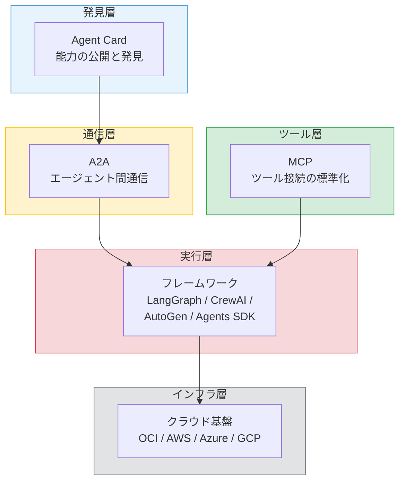
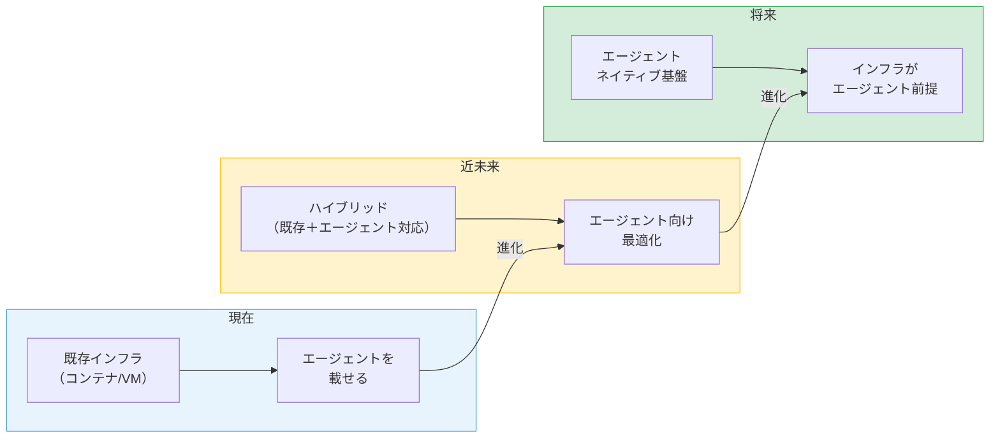

# 第15章 マルチエージェントの未来とエコシステム

本書を通じて、シングルエージェントの理解からマルチエージェントシステムの設計・構築・運用までを学んできた。最終章では、マルチエージェントシステムの現在の課題を整理し、標準化の動向、フレームワークの進化、OCIの方向性、そしてエージェントネイティブなインフラの将来像を展望する。

---

## 15.1 現在の課題の整理

本書を通じて明らかになった課題を、技術的課題、設計的課題、運用的課題の3カテゴリに整理する。

### 技術的課題

**LLMの非決定性**: 第13章で詳しく扱ったとおり、LLMの出力が毎回異なることは、テスト・デバッグ・品質保証の全てに影響する。temperature制御や構造化出力で抑制可能だが、根本的な解決には至っていない。モデルの進化に伴い、推論の安定性は向上する方向にある。

**推論コスト**: 第14章で分析したとおり、LLM APIのトークンコストがシステムの運用コストの60〜80%を占める。マルチエージェントでは複数のエージェントがそれぞれLLMを呼び出すため、コストが乗算的に増加する。

**レイテンシ**: LLMの推論には数秒〜数十秒を要する。マルチエージェントでは、直列に複数のエージェントが実行されるケースで、ユーザーの待ち時間が長くなる。並列実行やストリーミング応答で緩和できるが、リアルタイム性が求められるユースケースには制約がある。

**コンテキストウィンドウの制約**: 第2章で学んだコンテキストウィンドウの制約は、マルチエージェントにおいてもボトルネックとなる。エージェント間で共有すべき情報が増えると、各エージェントのコンテキストが圧迫される。

### 設計的課題

**エージェント粒度の決定**: 第12章のケーススタディで議論したように、エージェントをどの粒度で分割するかは明確な正解がない。粒度が粗すぎれば1つのエージェントの責務が過大になり、細かすぎれば通信オーバーヘッドが増加する。

**プロンプトの脆弱性**: エージェントの振る舞いはプロンプトに大きく依存する。プロンプトの微妙な変更が予期しない振る舞いの変化を引き起こす可能性がある。プロンプトのバージョン管理と回帰テストが重要である。

**テスト戦略の未確立**: 第13章で体系化を試みたが、マルチエージェントシステムのテストは依然として発展途上の領域である。業界標準のテストフレームワークやベストプラクティスが確立されていない。

### 運用的課題

**可観測性ツールの不足**: 第14章で設計した可観測性は、汎用的なログ・メトリクス・トレースの仕組みを応用している。エージェント専用の可観測性ツール（思考過程の可視化、判断の追跡等）は、今後の発展が期待される領域である。

**ガバナンスの標準不在**: エージェントの権限管理や監査の標準的なフレームワークは存在しない。各組織が独自に設計する必要があり、ベストプラクティスの共有が求められる。

**コスト予測の難しさ**: エージェントの実行パスが動的に変化するため、タスクあたりのコストを事前に正確に予測することが困難である。

### 課題マトリクス

| カテゴリ | 課題 | 深刻度 | 解決見通し |
|---------|------|--------|-----------|
| 技術 | LLMの非決定性 | 高 | モデル進化で段階的に改善 |
| 技術 | 推論コスト | 高 | モデルの効率化と価格低下で改善 |
| 技術 | レイテンシ | 中 | 推論の高速化と並列実行で緩和 |
| 技術 | コンテキストウィンドウ | 中 | ウィンドウサイズの拡大で緩和 |
| 設計 | エージェント粒度 | 中 | 設計パターンの蓄積で改善 |
| 設計 | プロンプトの脆弱性 | 高 | テストツールの成熟で改善 |
| 設計 | テスト戦略 | 高 | フレームワークの標準化で改善 |
| 運用 | 可観測性ツール | 中 | 専用ツールの登場で改善 |
| 運用 | ガバナンス標準 | 中 | 業界標準の策定で改善 |
| 運用 | コスト予測 | 低 | 運用データの蓄積で改善 |

**表15.1: マルチエージェントの課題マトリクス**

---

## 15.2 標準化の動向 ― MCP、A2Aの進化と新たなプロトコル

### MCPの進化

第2章で学んだMCP（Model Context Protocol）は、LLMアプリケーションが外部ツールやデータソースに接続するための標準プロトコルとして急速に普及している。

MCPの今後の進化の方向性は、ツール提供の標準化から、より広範なエージェント間協調への拡張である。MCPサーバーの認証・認可の標準化、リモートMCPサーバーの発見と接続、エージェント間でのMCPサーバーの共有が検討されている。

### A2Aの発展

第5章で学んだA2A（Agent-to-Agent Protocol）は、エージェント間の通信を標準化するプロトコルである。

A2Aの発展の方向性は以下のとおりである。

**Agent Cardの普及**: エージェントの能力を機械可読な形式で公開するAgent Cardが普及すれば、エージェント同士が自律的に相手を発見し、協調できる「エージェントのマーケットプレイス」が現実味を帯びる。

**タスク管理の標準化**: A2Aのタスク管理機能が成熟すれば、異なるフレームワークで実装されたエージェント同士が、共通のタスク管理プロトコルで協調できる。

**セキュリティモデルの成熟**: エージェント間の認証・認可の標準化は、企業環境でのA2A採用の前提条件である。

### エコシステムの標準化マップ

**図15.1: エージェントエコシステムの標準化マップ**

### 相互運用性の課題

現状では、異なるフレームワークで実装されたエージェント同士の接続が容易ではない。A2Aプロトコルがこの課題の解決を目指しているが、フレームワークごとの内部実装の違いを完全に吸収するには時間がかかる。

標準化が進むことで、「エージェントのマーケットプレイス」が実現する可能性がある。企業や開発者が特定の能力を持つエージェントを公開し、他のシステムがAgent Cardを通じてそのエージェントを発見・利用する世界である。

---

## 15.3 フレームワークの進化

### フレームワークの収斂と分化

第1章で概観したエージェントフレームワーク（LangGraph、CrewAI、AutoGen、OpenAI Agents SDK等）は、二つの方向に進化している。

**収斂**: 共通の抽象化層（エージェントの定義、ツールの接続、状態管理等）が形成されつつある。どのフレームワークでもReActループ、ツール呼び出し、マルチエージェント協調といった基本概念は共通している。

**分化**: 特定のユースケースに特化したフレームワークが発展している。コード生成特化、データ分析特化、カスタマーサポート特化等の専門フレームワークが登場している。

### 宣言的なエージェント定義

フレームワークの進化の重要な方向性の一つが、宣言的なエージェント定義である。現在は手続き的にエージェントの振る舞いを実装する必要があるが、将来は「何をしたいか」を宣言するだけで、協調パターンの選定やエージェント分割が自動化される可能性がある。

第4章で学んだ協調パターン（直列パイプライン、並列ファンアウト/ファンイン、オーケストレーター等）の選定が、タスクの特性に応じて自動的に行われる世界である。

### ローコード化・ノーコード化

エージェント開発のローコード化・ノーコード化も進行している。GUIベースでエージェントの協調フローを設計し、プロンプトをテンプレートから選択し、ツール接続をドラッグ＆ドロップで行う開発環境が登場している。

ただし、本書で学んだ設計原則（疎結合、冪等性、フォールトトレランス、Human-in-the-Loop）の理解は、ローコードツールを使う場合でも不可欠である。ツールが生成する設計の品質を評価し、改善するための基礎知識として機能する。

### フレームワーク選択とロックイン

フレームワークの選択が「ロックイン」にならないための設計指針は、本書を通じて既に学んでいる。

第7章の疎結合の原則、第5章のMCP/A2Aプロトコルによる標準化、第10章のエージェント間通信の抽象化。これらの設計原則を守ることで、フレームワークの変更に伴う影響を最小化できる。

---

## 15.4 OCIのロードマップ ― エージェント開発プラットフォームとしての進化

### OCI Generative AI Serviceの拡張方向

第8章で学んだOCI Generative AI Serviceは、エージェント開発プラットフォームとしての機能拡張が期待される。

**モデルの拡充**: 利用可能なモデルの種類と性能は継続的に向上する。Function Callingの対応強化、構造化出力の精度向上、コンテキストウィンドウの拡大が進む。

**Agent Service**: エージェントの定義・実行・管理をマネージドサービスとして提供するAgent Serviceの登場が期待される。エージェントのデプロイ、スケーリング、モニタリングがOCIの管理コンソールから一元的に操作できる世界である。

**ツールエコシステム**: OCI上の各サービス（Database、Object Storage、Functions等）へのMCPサーバーが標準提供されれば、エージェントからOCIサービスへの接続が大幅に容易になる。

### エンタープライズ要件への対応

OCIの強みは、エンタープライズ要件への対応力にある。

**セキュリティ**: 第9章で学んだResource Principal、第11章で学んだVaultとWorkload Identityは、エンタープライズグレードのセキュリティ基盤を提供する。

**コンプライアンス**: 第14章で設計したガバナンスフレームワークは、OCI Audit ServiceやIAMとの緊密な統合により、規制要件への適合を支援する。

**データ主権**: リージョン内でのデータ処理を保証するOCIのアーキテクチャは、データ主権の要件が厳格な業界（金融、医療、公共等）でのエージェント活用を可能にする。

### 本書の知識の活用

本書で学んだ知識は、OCIの進化に伴って以下のように活かされる。

第III部（OCI基盤）で学んだサービスの活用パターンは、新しいサービスが追加されても基本的なアプローチは変わらない。第II部（設計原則）で学んだ協調パターンやエラー処理戦略は、フレームワークやインフラが変わっても普遍的に適用できる。

---

## 15.5 エージェントネイティブなインフラの姿

### エージェントネイティブとは

エージェントネイティブなインフラとは、エージェントの実行を第一級市民（First-class Citizen）として扱うインフラのことである。

現在のインフラは、コンテナやサーバーレスファンクションの実行を前提に設計されている。エージェントは、これらの既存の実行基盤の上に「載せる」形で動作する。本書の第9章〜第11章で行ったのは、まさにこのアプローチである。

エージェントネイティブなインフラでは、エージェントの実行ライフサイクル（起動、推論、ツール呼び出し、協調、終了）がインフラの基本プリミティブとなる。

### 現在から将来への転換

**図15.2: エージェントネイティブインフラの将来像タイムライン**

**現在**: エージェントはコンテナとして既存のKubernetesクラスタにデプロイされる。LLM APIは外部サービスとして呼び出す。本書で学んだアプローチである。

**近未来**: インフラがエージェント向けに最適化される。LLM推論の専用ハードウェア、エージェント間通信の専用ネットワーク、エージェントの状態管理の専用ストレージが提供される。

**将来**: インフラ自体がエージェントの実行を前提に設計される。エージェントの起動・スケーリング・協調・監視がインフラのプリミティブとして組み込まれる。

### エージェント間の信頼とアイデンティティ

エージェントネイティブなインフラでは、エージェントの認証・認可の仕組みも進化する。

現在は、第9章で学んだResource PrincipalやWorkload Identityで、エージェントに「インフラレベルの」アイデンティティを付与している。将来は、エージェント自身が「エージェントレベルの」アイデンティティを持ち、他のエージェントとの信頼関係を自律的に構築する仕組みが必要になる。

A2AプロトコルのAgent Cardは、エージェントの自己記述の標準化である。これが発展し、エージェントの認証（このエージェントは本物か）、権限（このエージェントは何をしてよいか）、信頼（このエージェントの出力は信頼できるか）の仕組みが標準化されれば、組織を超えたエージェント間の協調が可能になる。

### 設計原則の普遍性

本書で学んだ設計原則は、インフラがどのように進化しても有効である。

- **疎結合**（第7章）: エージェント間の依存を最小化する原則は、エージェントの数やインフラの形態が変わっても変わらない
- **冪等性**（第7章）: 操作の安全な再実行を保証する原則は、どの実行基盤でも必要である
- **可観測性**（第14章）: エージェントの振る舞いを可視化する原則は、システムが大規模化するほど重要になる
- **Human-in-the-Loop**（第7章）: リスクの高い判断に人間が関与する原則は、エージェントの自律性が向上しても必要である

---

## まとめ

本書を通じて、シングルエージェントの理解からマルチエージェントの設計・構築・運用までを学んだ。

第I部では、エージェントの基本概念（ReActパターン、ツール呼び出し、コンテキストエンジニアリング）を理解した。第II部では、マルチエージェントの協調パターン、通信プロトコル、状態管理、設計原則を学んだ。第III部では、OCI上でのエージェント実装とインフラ構築を実践した。第IV部では、テスト、可観測性、ガバナンスの運用ノウハウを身につけた。

マルチエージェント技術は急速に進化している。本書で身につけた設計原則 ― 疎結合、冪等性、可観測性、Human-in-the-Loop ― は変わらず有効である。この基盤の上に、読者自身のマルチエージェントシステムを構築していただきたい。

---

## 理解度チェック

**Q1.** マルチエージェントシステムの現在の課題を「技術的」「設計的」「運用的」の3カテゴリから一つずつ挙げ、それぞれの解決の方向性を述べよ。

**Q2.** MCPとA2Aが今後どのように進化し、エージェントのエコシステムにどのような影響を与えるか、自分の考えを述べよ。

**Q3.** 「エージェントネイティブなインフラ」とは何か。現在のインフラとの違いを説明せよ。
